# 泊松方程-三维四面体插值基函数有限元实现-高斯积分

> 原文地址: [https://mp.weixin.qq.com/s/lZZxt1FyY9Gv1f1zghBngg](https://mp.weixin.qq.com/s/lZZxt1FyY9Gv1f1zghBngg)

**简述**

在之前实现过三维四面体网格的一阶、二阶插值基函数的泊松方程、霍姆霍兹方程有限元方法，其中单元系数矩阵都是直接推导得到，对于一阶4\*4的系数矩阵简单，但是对于二阶10\*10的系数矩阵就比较繁琐，进行了大篇幅的推导过程。

本文再次使用高斯积分原理，避开直接推导单元系数矩阵，最终实现一阶、二阶的插值型基函数的有限元算法。

本次将实现泊松方程与霍姆霍兹方程两种边值问题，用来对比采取高斯积分方法的结果与之前文章的结果，因此对于边值问题推导有限元问题不再赘述，详细请参考以下文章：

[a.泊松方程三维二阶插值有限元实现-四面体](http://mp.weixin.qq.com/s?__biz=MzkwNzUxOTM2NA==&mid=2247484461&idx=1&sn=4b73fc6550e363ede16cfe85971213c1&token=1031592096&lang=zh_CN&scene=21#wechat_redirect)

b.[三维非结构化有限元实现-possion方程](http://mp.weixin.qq.com/s?__biz=MzkwNzUxOTM2NA==&mid=2247484341&idx=1&sn=8f2dfbcd864b11b1a9209e65701b1307&token=1031592096&lang=zh_CN&scene=21#wechat_redirect)

c.[三维高阶叠层与插值有限元细节对比-霍姆霍兹方程](http://mp.weixin.qq.com/s?__biz=MzkwNzUxOTM2NA==&mid=2247484625&idx=1&sn=39e0ccf8427523d5b300e2ba2fb3cfce&token=1031592096&lang=zh_CN&scene=21#wechat_redirect)

**1.边值问题**

这里给出两种边值问题的表达式，泊松方程：

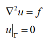

霍姆霍兹方程，模拟电场在损耗电介质中的衰减规律：

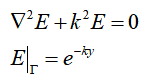

**2.基函数表达式** 

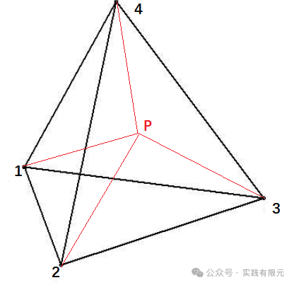

根据四面体面积坐标原理，获得线性基函数，简写可以表示为：

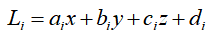

其中，对应方向的梯度有：

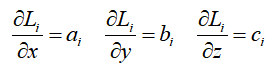

因此，对应的一阶型函数及其梯度为：

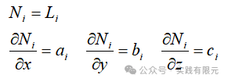

对应的二阶插值基函数为：

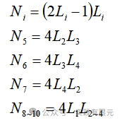

其对应的梯度为：

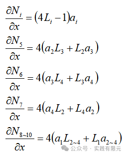

    可见，二阶10个基函数，单元系数矩阵为10\*10，其推导过程就会非常的繁琐并且容易出错。

**3.使用高斯积分获得系数矩阵**

对于以上两种边值问题，其有限元方程，均可以写成：

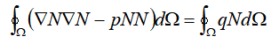

将上述积分问题，写成高斯积分形式：

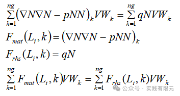

其中，Fmat，Frhs可以通过高斯积分点获得，V是四面体的体积。对于一阶、二阶四面体网格的高斯积分点位置对应的面积坐标权重值与积分权重值如下：

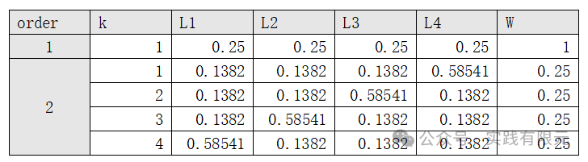

在求解单元系数过程中，首先使用高斯积分的面积坐标权重值Li得到Fmat与Frhs,然后乘以对应的积分权重值W，即可得到一个单元的单元系数矩阵，整个过程不需要再推导求解单元系数矩阵的具体表达式。  

**4.系数矩阵组装与边界条件加载**

在得到每个单元的系数矩阵后，组装方式与以前介绍的方式一致，只需要将每个单元系数矩阵按照其局部节点到全局节点的映射关系，一一累加到全局系数矩阵中。

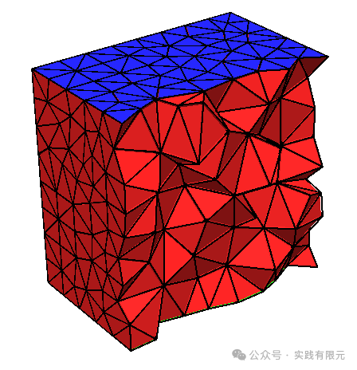

唯一需要注意的是二阶有限元，需要获取得到四面体每个棱边的局部与全局映射关系，与节点一样，其映射关系也必须是一一对应的。

边界条件的加载与以前文章介绍的方法一致，这里不再赘述。这些详细的实现方法均可以在简介中的文章中查看。

**5.结果展示**

**a.泊松方程一阶**    

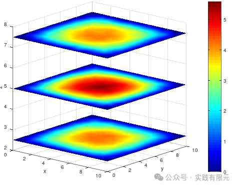

**b.泊松方程二阶**

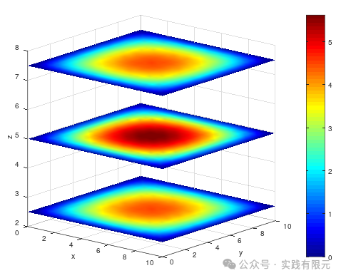

**c.霍姆霍兹方程一阶**

与理论解析解对比，精度验证：    

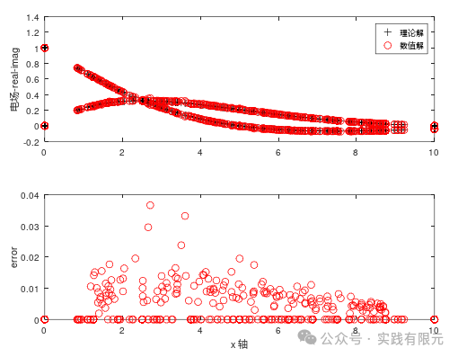

可视化求解结果的实部和虚部：

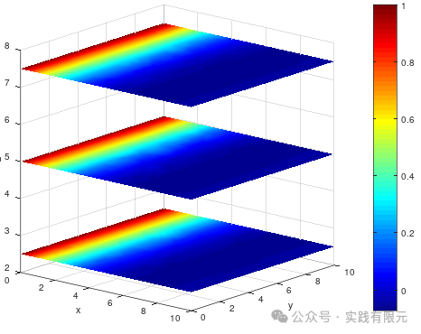

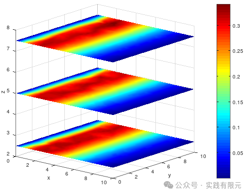

**d.霍姆霍兹方程模拟电场衰减过程：二阶**

与理论解析解对比，精度验证：

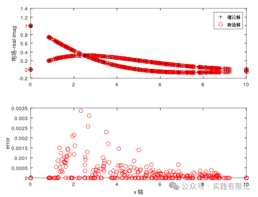

可视化求解结果的实部和虚部：

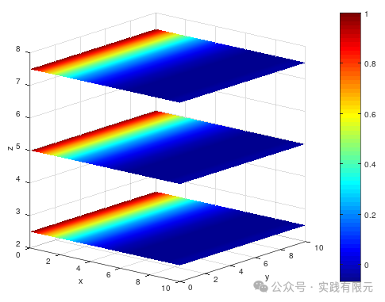

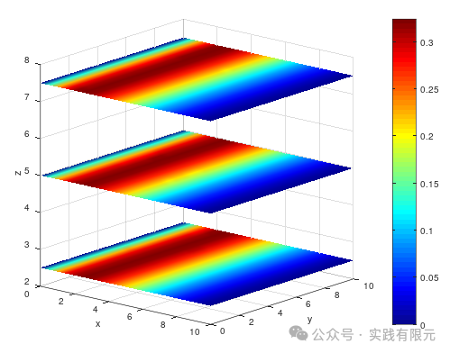

观察上述两种边值问题，粗略看结果基本上是正确的，一阶与二阶的精度对比，二阶的确也提高了至少10倍的计算精度。

再与之前的文章对比，一阶和二阶的结果在精度上完全一致，说明了使用高斯积分这种方式能得到完全一致的结果。    

**最后**

本次走通了基于高斯积分方法的三维有限元流程，避免了直接推导系数矩阵，相对于低阶优势不明显，但是如果是二阶10\*10系数矩阵、三阶20\*20的系数矩阵，这种方式就具备更好的实现优势。并且两种方式的结果精度是一致。