# 泊松方程三维二阶叠层有限元实现-四面体

> 原文地址: [https://mp.weixin.qq.com/s/4P9bDzjigc5yllhIIDIT1w](https://mp.weixin.qq.com/s/4P9bDzjigc5yllhIIDIT1w)

**简述**

在高阶有限元中，有两种高阶基函数形式：一种是插值基函数，一种是叠层基函数。高阶插值基函数即使在上篇文章中介绍，它是依据线性基函数组装而成，形成的每个基函数在单元上都有具体的点一一对应，并且每个基函数均满足插值基本原则，细节参考：[泊松方程三维二阶插值有限元实现-四面体](http://mp.weixin.qq.com/s?__biz=MzkwNzUxOTM2NA==&amp;mid=2247484461&amp;idx=1&amp;sn=4b73fc6550e363ede16cfe85971213c1&amp;chksm=c0d6b0c6f7a139d0ba1067397f409782c3db61ecfc928cf74a9a6ac6c84bc0bf1cfec7621491&scene=21#wechat_redirect)

本文继续介绍二阶叠层基函数，它也是由线性基函数组装而成，特点是高阶基函数具有叠层的规律，即高阶基函数包含低阶基函数，并且其高阶部分的基函数在单元上并没有与之对应的点。这是与高阶插值基函数本质的差别。也正是由于叠层基函数的高阶包含低阶的规律，这使得高阶叠层基函数能够实现混合阶数有限元，而插值基函数则不能。

本文通过泊松方程的边值问题为例，实现三维的高阶叠层基函数有限元。泊松方程的有限元理论推导不再赘述，参考：[泊松方程三维结构化有限元实现初探](http://mp.weixin.qq.com/s?__biz=MzkwNzUxOTM2NA==&amp;mid=2247484317&amp;idx=1&amp;sn=0994f0defe3d8e191eda70a4a355c67a&amp;chksm=c0d6b776f7a13e60dab1dec71969db6c551352966abf83f78d979173a6cc69029b732b1a609f&scene=21#wechat_redirect)。

**1.四面体二阶叠层基函数**

已知线性基函数表达式（推导可参考：[泊松方程三维结构化有限元实现初探](http://mp.weixin.qq.com/s?__biz=MzkwNzUxOTM2NA==&amp;mid=2247484317&amp;idx=1&amp;sn=0994f0defe3d8e191eda70a4a355c67a&amp;chksm=c0d6b776f7a13e60dab1dec71969db6c551352966abf83f78d979173a6cc69029b732b1a609f&token=2011771411&lang=zh_CN&scene=21#wechat_redirect)）：

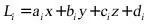

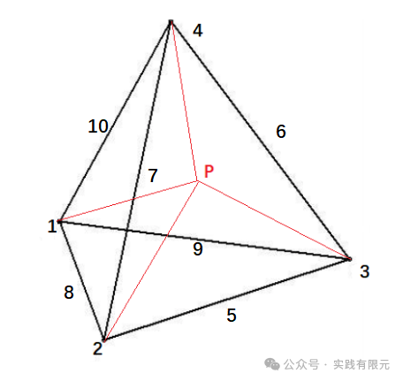

根据四面体示意图可以发现，5~10号位置也是使用棱边表示，但仅仅如此，并不意味着如插值基函数一样，在棱边上有具体的点。同样，棱边编号的顺序如下；    

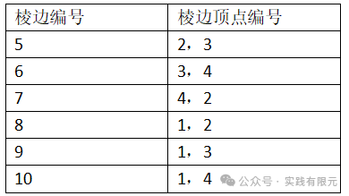

由此给出二阶叠层基函数的表达式：

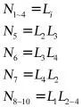

可以发现，二阶叠层基函数的N1~N4与一阶基函数是一样的，5~10阶的则是由对应棱边的两个节点基函数乘积而得。这可以理解为高阶项仅仅表示线性基函数组合的高阶，就好比泰勒级数展开的高阶项。

此时，四面体内任意一点p的插值公式同样为：

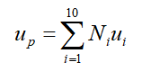

对应的基函数梯度项可以表示为：    

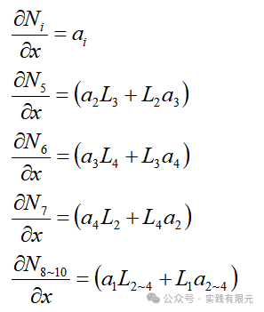

**2.单元系数矩阵推导**

观察二阶叠层基函数，仔细对比二阶插值基函数，我们发现有很多相似的地方：

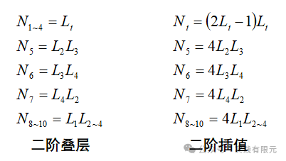

除了低阶项完全不一样之外，N5~N10的形函数方式组装一样，仅仅相差了四倍而已，因此在系数推导的过程中，我们可以直接利用二阶插值基函数相同的结果。因此同样把10\*10的单元系数矩阵分成9个亚矩阵：

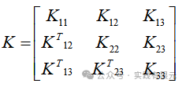

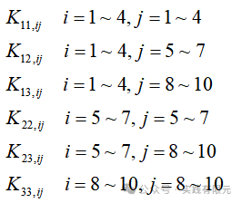

K11的推导非常简单，同时可以发现，K11与一阶基函数的系数矩阵是一样的，这正是由于二阶叠层基函数包含了一阶基函数的原因。    

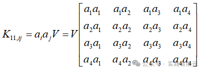

K22,K23,K33系数矩阵与二阶插值基函数中的一致，仅仅相差16倍，因此可以直接获得（详细参考：[泊松方程三维二阶插值有限元实现-四面体](http://mp.weixin.qq.com/s?__biz=MzkwNzUxOTM2NA==&amp;mid=2247484461&amp;idx=1&amp;sn=4b73fc6550e363ede16cfe85971213c1&amp;chksm=c0d6b0c6f7a139d0ba1067397f409782c3db61ecfc928cf74a9a6ac6c84bc0bf1cfec7621491&token=2011771411&lang=zh_CN&scene=21#wechat_redirect)）：

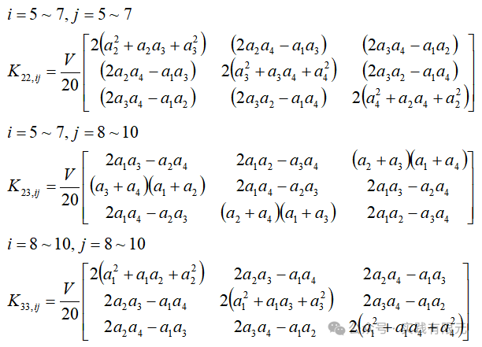

剩下的仅有K12,K13两个块矩阵需要推导，首先推导K12：

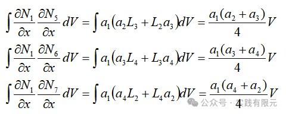

根据上述结果，很容易发现，由于N1~N4的偏导数等于常系数a,因此积分就非常容易获得，根据规律很容易得到K12以及K13项的结果：    

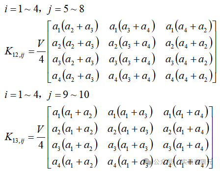

将所有亚矩阵整理，得到对x方向偏导数的10\*10系数矩阵，对y、z方向的系数矩阵只需要将系数a改成b、c即可获得，如下：

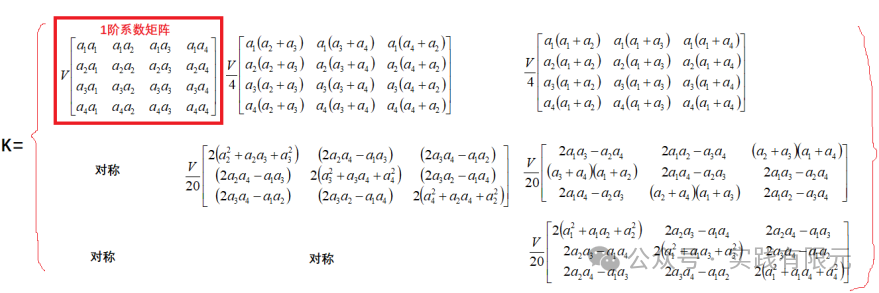

  

右端项的推导相对也是很容易：

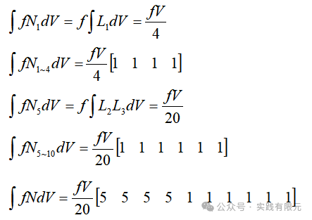

**3.系数矩阵组装**

使用的网格同样是tetgen剖分得到二阶网格，其中的注意细节参考：[泊松方程三维二阶插值有限元实现-四面体](http://mp.weixin.qq.com/s?__biz=MzkwNzUxOTM2NA==&amp;mid=2247484461&amp;idx=1&amp;sn=4b73fc6550e363ede16cfe85971213c1&amp;chksm=c0d6b0c6f7a139d0ba1067397f409782c3db61ecfc928cf74a9a6ac6c84bc0bf1cfec7621491&token=2011771411&lang=zh_CN&scene=21#wechat_redirect)。此外还需要注意，虽然生成的节点文件node包含棱边中点信息，实际这是不需要的，需要的仅是elem文件中对棱边顺序的排序。

边界条件加载与插值基函数也存在差异，因为叠层基函数的高阶项不表示网格上具体位置的物理数值，因此在加载第一类边界条件的时候，低阶项会强加第一类边界，高阶项强加为零。    

例如，假设第一类边界条件如下，则高阶叠层基函数的第一类边界的加载方法：

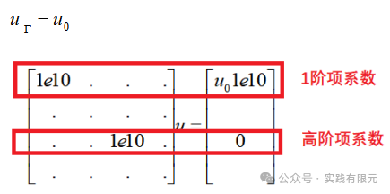

完成组装系数矩阵和添加完边界条件后，最终组合成完整的系数矩阵方程可以表示如下，求解线性方程组即可获得数值结果。

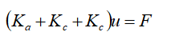

**4.结果展示**

网格量2234，四面体顶点数目：593，顶点数+棱边中点数=3847。使用相同的网格求解的二阶叠层有限元泊松方程与上篇文章的二阶插值有限元对比如下：

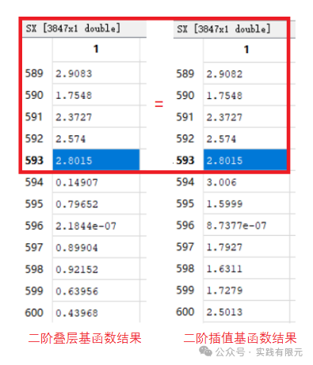

上图中对比结果显示，一阶部分（红色区域）二者的结果是一致的，而高阶部分完全不相同。再次说明了二者虽然均是二阶能提高计算精度，但是由于基函数不同，求解的数值在高阶部分也不同。

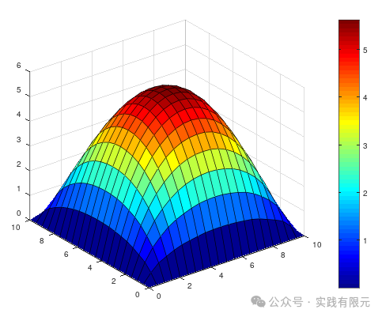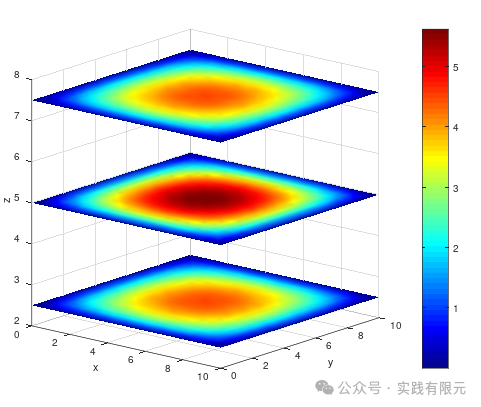          

从图中可以发现，使用同等网格，二阶叠层有限元的结果与二阶插值基函数的结果可以比拟，从三维显示图的光滑程度上看也同样优于一阶基函数。

**5.总结**  

1.使用高阶叠层基函数实现的泊松方程的结果与高阶插值有限元结果具有同等的精度。

2.实现高阶叠层基函数需要注意的点：i 高阶部分仅使用棱边编号表示，并不代表某个点的物理数值；ii 第一类边界条件的加载也需要注意高阶项强加为零。