# 泊松方程三维二阶插值有限元实现-四面体

> 原文地址: [https://mp.weixin.qq.com/s/rv4\_CcJ-80HsVPEWIqe-yQ](https://mp.weixin.qq.com/s/rv4_CcJ-80HsVPEWIqe-yQ)

**简述**  

相比于线性基函数，高阶基函数的优势在于能使用较少的网格数量实现精度更高的计算求解，因此对于高阶有限元的实现是数值模拟中不可避免的重点话题。

本文还是以简单的泊松方程边值问题入手，介绍四面体的二阶插值基函数有限元的实现过程。其中，实现的关键还是在于基函数的确定与系数矩阵的推导。本文将重点介绍系数矩阵的推导，对于泊松方程的描述与有限元方程的推导不再赘述，可参考：[泊松方程三维结构化有限元实现初探](http://mp.weixin.qq.com/s?__biz=MzkwNzUxOTM2NA==&amp;mid=2247484317&amp;idx=1&amp;sn=0994f0defe3d8e191eda70a4a355c67a&amp;chksm=c0d6b776f7a13e60dab1dec71969db6c551352966abf83f78d979173a6cc69029b732b1a609f&scene=21#wechat_redirect)。

**1.四面体二阶插值基函数**

对于四面体的二阶插值基函数，与二维三角形高阶基函数一样是由线性基函数组合而来，已知线性基函数表达式（推导可参考：[三维非结构化有限元实现-possion方程](http://mp.weixin.qq.com/s?__biz=MzkwNzUxOTM2NA==&amp;mid=2247484341&amp;idx=1&amp;sn=8f2dfbcd864b11b1a9209e65701b1307&amp;chksm=c0d6b75ef7a13e480ba93f26fb40f5e443eb8e0c0dbad1518ac4606f8f60f46520818e2eaa23&token=1470334254&lang=zh_CN&scene=21#wechat_redirect)）：

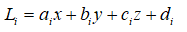

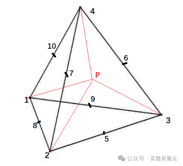

根据上述四面体示意图可知，二阶基函数基函数由4个顶点和6条边的中点组成，共计10个节点。其中六个中点编号与顶点关系的顺序如下：

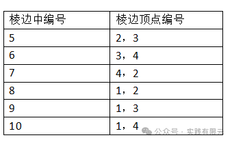

因此可以得到四面体的二阶插值基函数：

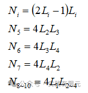

此时，四面体内任意一点p的插值公式可以表示为：

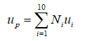

进一步理解插值基函数，通过p点的移动，根据面积坐标原理，可以分析得到，当p点落在1号点时，L1=1,L2~4=0,带入二阶基函数中，得到N1=1,N2~10=0;编号2~4同样可以推导得到相同的结果；当p点落在5号点时:

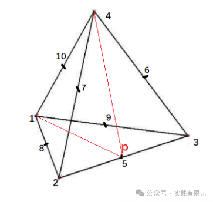

如上图显示，根据基函数面积坐标原理，可以得到：

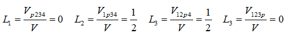

带入二阶基函数，得到：

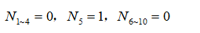

同理6~10号中点能推导得到相同的结果。由此可知上述组合二阶基函数满足基本的插值基函数原理，即p点落在任意插值节点的时候，对应节点的形函数为1，其他形函数为0.

对应二阶基函数的在x方向的偏导数如下，根据线性基函数L表达式，y或者z方向的偏导数将系数a变成b或者c即可得到。

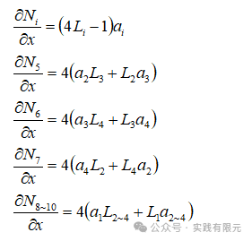

**2.单元系数矩阵推导**  

已知三维泊松方程的有限元公式，包括左端的偏导数项与右端项激励项。当f=0时，退化为拉普拉斯方程。

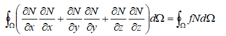

左端项对各个方向的偏导，从四面体二阶基函数不难发现，各方向的偏导数在形式上一致的，区别在于偏导得到的线性基函数系数（a,b,c）不同，因此仅需要推导一个方向的系数矩阵，其他方向改变系数即可得到。

以x方向的偏导为例，根据二阶基函数规律，将10\*10的系数矩阵分成9块亚系数矩阵：

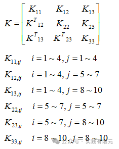

可见，由于系数矩阵的对称性，仅需要推导对角线三个加上三角三个共计六个亚系数矩阵求解即可，如此更容易根据规律推导，

**a.首先推导K11系数矩阵**

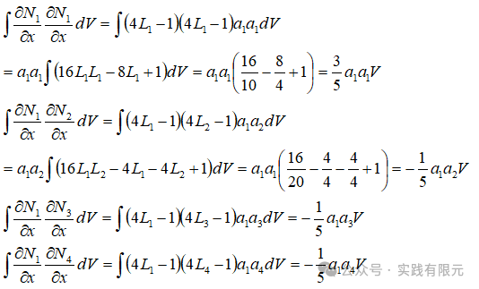

根据其中推导的规律性，得出其他部分的系数项：

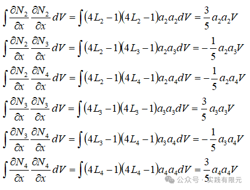

因此，K11系数矩阵为：

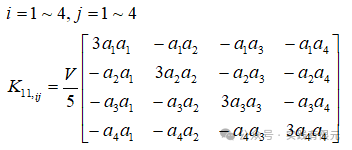

**b.推导K12系数矩阵**

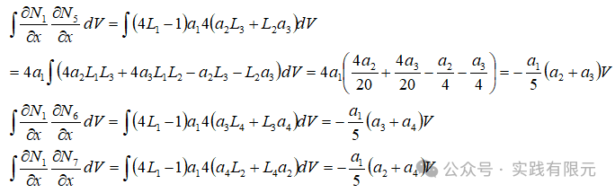

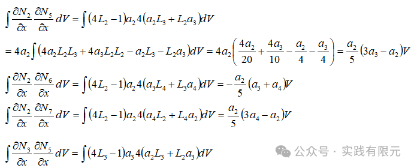

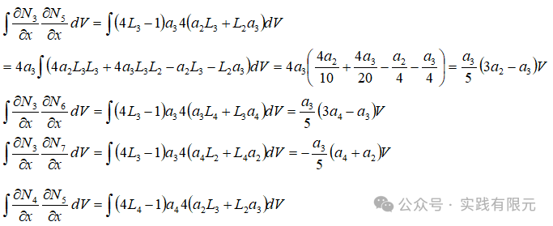

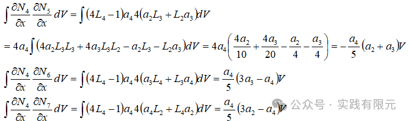

总汇得到K12系数矩阵：

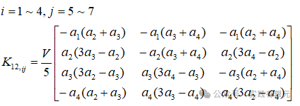

**c.推导K13的系数矩阵**

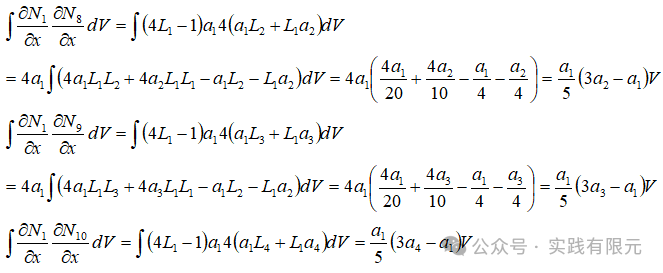

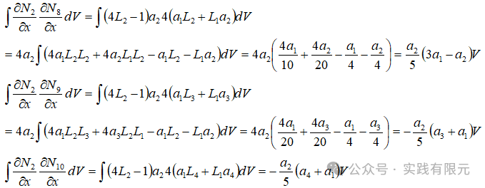

N3N8~10与N4N8~10可以通过规律类比得出：  

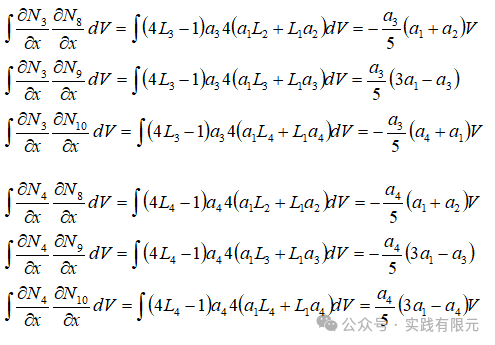

最终得出K13的系数矩阵：

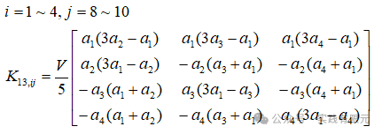

**d.推导K22的系数矩阵**

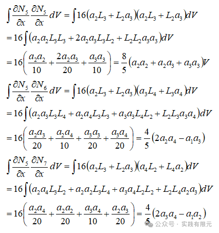

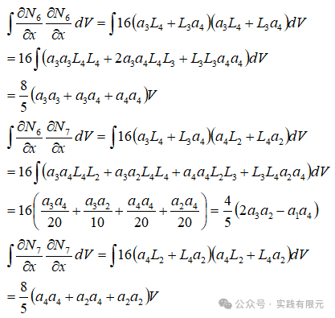

总汇得出K22系数矩阵：  

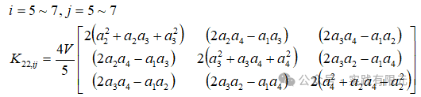

**e.推导K23的系数矩阵**

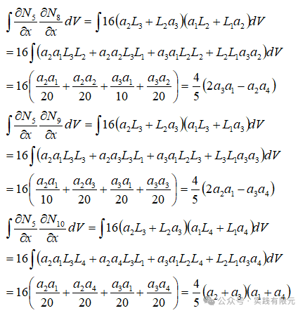

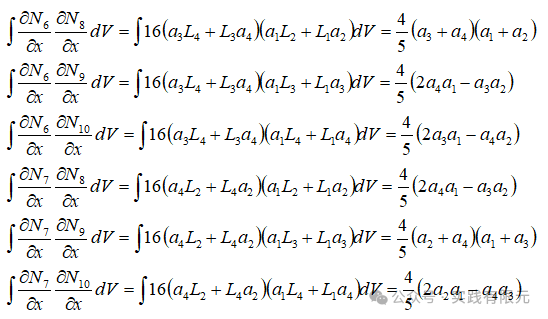

汇总得出K23系数矩阵：  

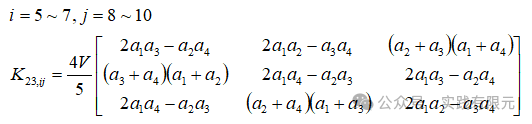

**f.推导K33的系数矩阵**

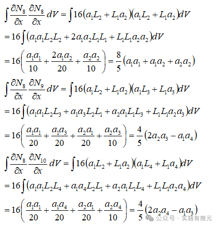

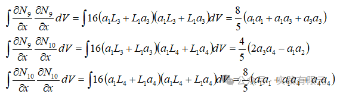

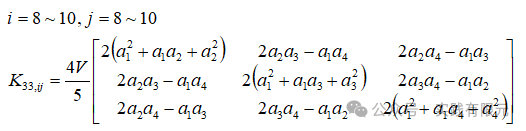

由此，对x方向的偏导数的系数矩阵推导结束，将上述亚系数矩阵组合起来，即可得到10\*10的完整的系数矩阵，如下：

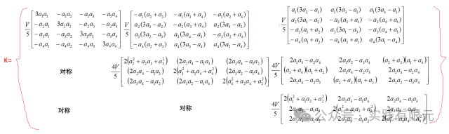

右端项的向量推导相对而言要简单很多：

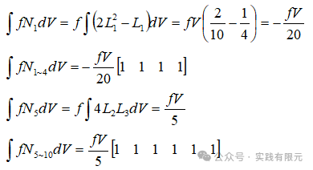

因此，右端项的向量为：

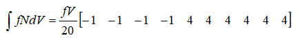

**3.全局系数矩阵组装**  

组装全局系数矩阵的前提，必须得知道每个二阶单元与节点的映射关系。这里使用tetgen网格剖分中的-o2命令生成二阶四面体网格，如此生成的ele文件中每个单元包含10个节点的映射关系。在node文件中包含四面体4个顶点与6个边中点的所有信息。

需要注意的是，本文中使用的单元10个节点的顺序为下图中“自定义节点位置顺序”，而tetgen的节点顺序是左图“tetgen节点位置顺序”，因此需要将生成的单元映射关系转化为“自定义节点位置顺序”，如此才能使得单元系数矩阵顺序与实际单元节点顺序是一致的。否则组装结果错误。

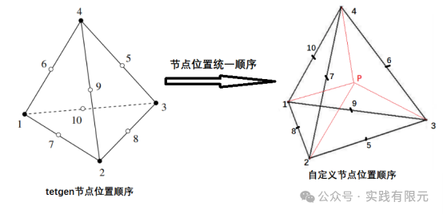

例如，tetgen生成的网格单元映射关系：

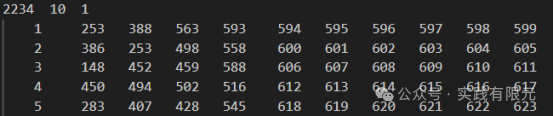

转化后的单元映射关系：

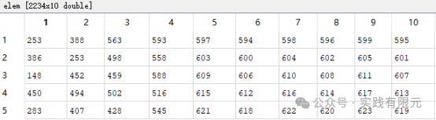

统一映射关系后，再根据正确单元映射关系，将单元系数矩阵组装成全局系数矩阵，过程与以前介绍的组装方式基本一致（参考：[最简单的一维有限元问题：求解cos函数分布](http://mp.weixin.qq.com/s?__biz=MzkwNzUxOTM2NA==&amp;mid=2247483689&amp;idx=1&amp;sn=238051a214893aec197bde3511363463&amp;chksm=c0d6b5c2f7a13cd49795a90d7a3509ff6e6a5fbd744fe1f1721af17a4cb8e93827383ddc9d60&token=1470334254&lang=zh_CN&scene=21#wechat_redirect)）。

对于第一类边界条件的加载也和以前介绍的方法一致，使用乘以大数的方法加载。需要注意的是二阶四面体对应的边界面也是二阶三角形，因此加载第一类边界的时候不仅考虑三角形顶点，同时也要考虑三角形棱边中点的加载。

**4.结果展示**

在组装好系数矩阵与右端项后，使用matlab自带求解器，求解结果。本次网格信息：四面体单元：2234，总节点个数：3847。

**a.首先当不考虑右端项，处理成拉普拉斯方程，边界条件在Z=0处放置0，Z=10处放置1，其他边界不进行处理。**

数值模拟的结果与理论解对比：

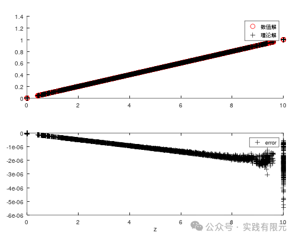

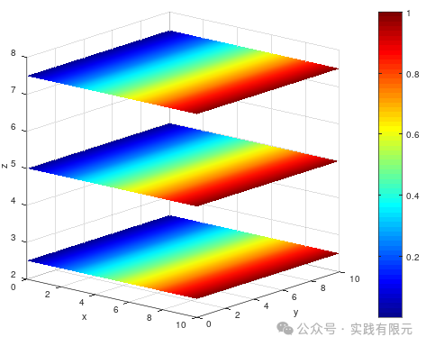

  

可见，从节点数据对比与三维插值结果显示，二阶基函数有限元的整个流程与系数矩阵均是正确的。

**b.加入右端项，将边界条件全部以乘以大数的方法置零，求解泊松方程。**

下图为2阶基函数有限元的泊松方程结果，网格量2234，节点3847：

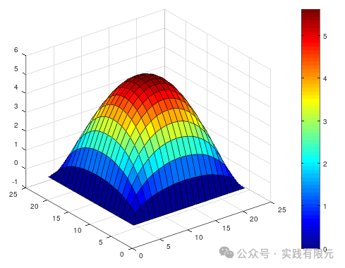

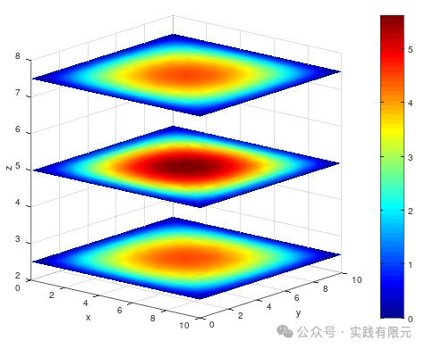

下图为1阶基函数有限元的泊松方程结果，网格单元2234，节点593，参考：[三维非结构化有限元实现-possion方程](http://mp.weixin.qq.com/s?__biz=MzkwNzUxOTM2NA==&amp;mid=2247484341&amp;idx=1&amp;sn=8f2dfbcd864b11b1a9209e65701b1307&amp;chksm=c0d6b75ef7a13e480ba93f26fb40f5e443eb8e0c0dbad1518ac4606f8f60f46520818e2eaa23&scene=21#wechat_redirect)。

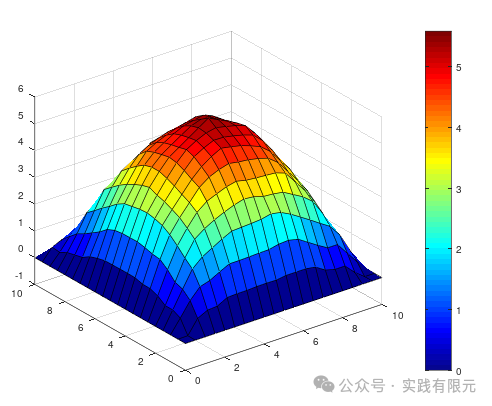

可见，同等网格单元量，使用2阶四面体网格，得到的结果明显要比1阶的精度更高，结果更加光滑。耗时也仅仅花费了4.6s时间。

**5.总结**

    1.二阶插值基函数有限元的关键在于基函数与单元系数矩阵，在这过程中一定要保证四面体单元的节点顺序与基函数定义的顺序一致。如此才能保证组装的过程是正确的。  

    2.系数矩阵的推导看似繁琐众多，实际其中有规律可循，在检查最终的系数矩阵的时候，也可以通过隐藏在其间的规律查找问题。