# 泊松方程三维结构化有限元实现初探

> 原文地址: [https://mp.weixin.qq.com/s/H8lRRSQk6XekCYYXPWBybA](https://mp.weixin.qq.com/s/H8lRRSQk6XekCYYXPWBybA)

**简述**  

众所周知，所有的实际问题都是三维的，所以对实际的三维模型数值模拟是尤为重要的，他能更大程度的反应实际物理规律。

    本文初步尝试使用三维结构化有限元实现泊松方程。

**1.边值问题**

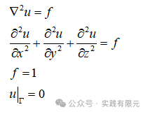

不难发现，相比于二维问题，三维问题就多了一个Z轴，在方程中体现为对Z方向的二次偏导。

**2.有限元问题**  

# 从边值问题到有限元问题的推导并不复杂，详细推导可以参考：[最简单的二维结构化有限元问题：求解拉普拉斯方程](http://mp.weixin.qq.com/s?__biz=MzkwNzUxOTM2NA==&amp;mid=2247483928&amp;idx=1&amp;sn=05e3ce02b78d231fd8da3f06e2ddc0e1&amp;chksm=c0d6b6f3f7a13fe5e27ef7e246c1fe6c9dabeaeeca1605f4dd38678a4e6473c3388057c899e7&scene=21#wechat_redirect)

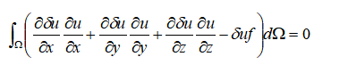

将未知数离散到网格节点上，有：

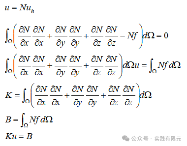

**3.六面体基函数**

  

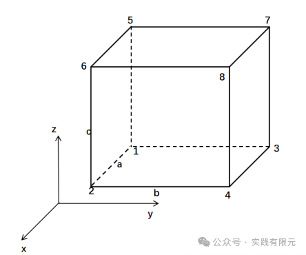

三维六面体是由一维组成，根据一维的插值基函数：

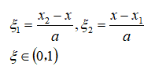

可以衍生出三维的每个方向上的插值函数：

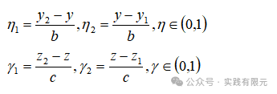

对应的导数关系为：  

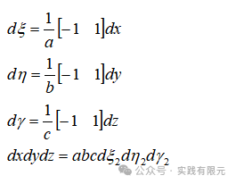

由此构造三维六面体8个点的基函数：

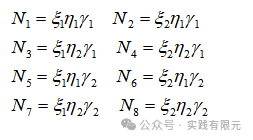

最终就可以通过基函数与8个节点的数值表示六面体内任意一点：

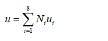

不难得出，当点落在对于节点的时候，对应的基函数等于1，其他基函数等于0。

**4.单元系数矩阵求解**

从有限元方程可以看出，单元系数矩阵的求解关键在于第一项中基函数在三个方向上的倒数的乘积，这里逐一详细对每一项求解。首先是推导基函数在x方向的倒数乘积：

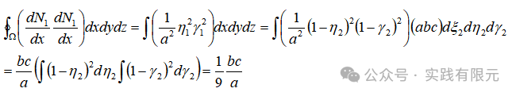

其中可以发现y方向的积分和z方向的积分是完全独立的，因此可以处理成积分的乘积，由此将三维问题拆分成一维积分的乘积问题，而一维积分则可以通过参考：[最简单的一维有限元问题：求解cos函数分布](http://mp.weixin.qq.com/s?__biz=MzkwNzUxOTM2NA==&amp;mid=2247483689&amp;idx=1&amp;sn=238051a214893aec197bde3511363463&amp;chksm=c0d6b5c2f7a13cd49795a90d7a3509ff6e6a5fbd744fe1f1721af17a4cb8e93827383ddc9d60&scene=21#wechat_redirect) 中的积分表直接获得。

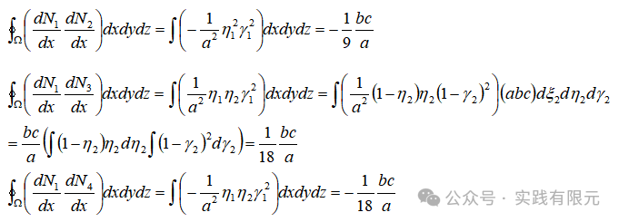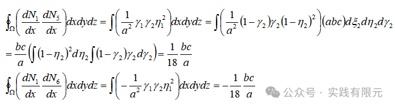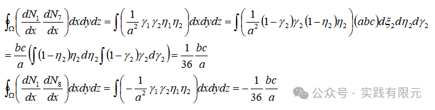

由此得出N1对Ni的全部倒数积分项。由于矩阵的对称性原理，后续积分不需要积分对称位置的数据。

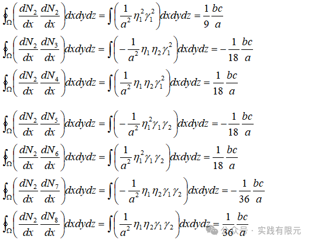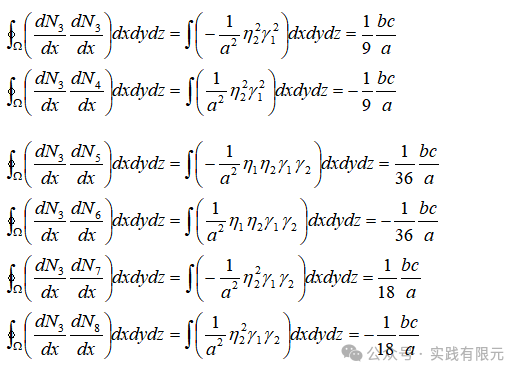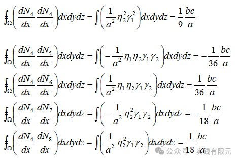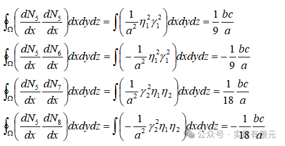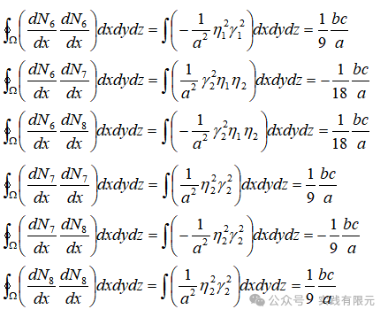

整理后得到：

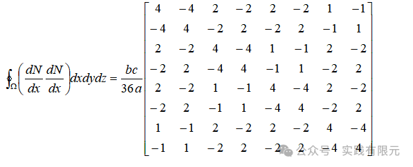

仔细观察，其实每个数据之间是存在一定联系的，尤其在积分的过程中，可以不再每一项都老实的积分，简单观察就可以得到积分结果，这会大大提高积分效率。

再积分在y方向的倒数：

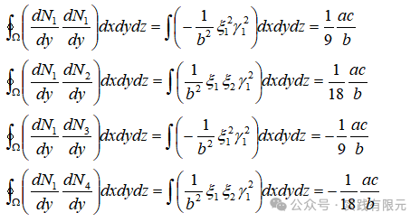

5~8位置仅z方向基函数不同，因此可以直接得出：

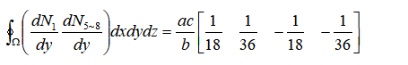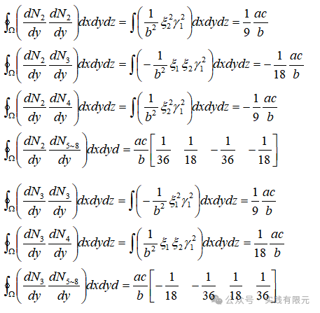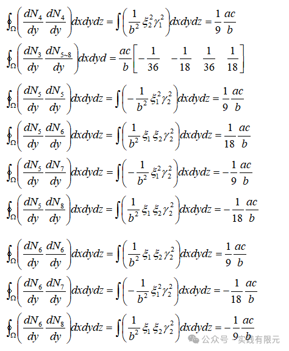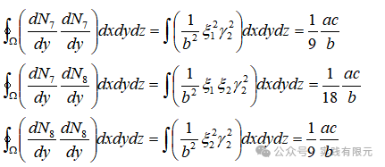  

整理得到：

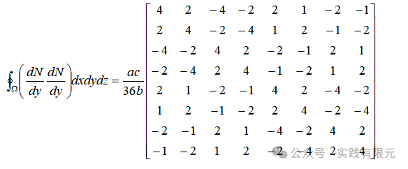

Z方向的推导过程不再一一演示，直接得出结果：

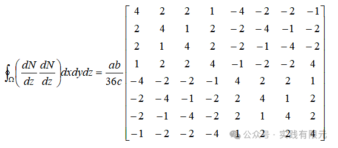

右端项的积分可以写成：

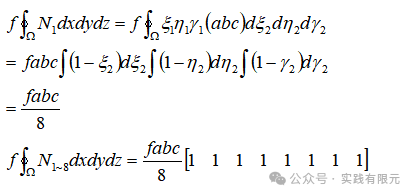

**5.系数矩阵组装**  

    在得到了单元系数矩阵后，只需要将每个单元叠加起来，就可以获得全局的刚度矩阵。

需要注意的是每个单元节点的全局顺序必须按照基本单元的顺序排列，如此才能保证每个单元的节点顺序与基函数的定义是一致的，这里示例X-Y-Z=1-1-2共计2个网格的节点坐标信息与单元的节点编号。

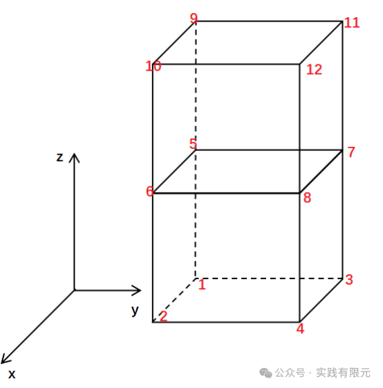

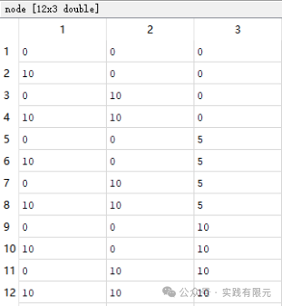

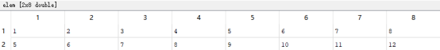

由于矩阵维度较大，这里不再展示具体的系数矩阵。

**6.求解结果**  

在组装好系数矩阵与右端项后，使用matlab自带求解器，求解结果。

为了验证结果正确性，我们首先求解拉普拉斯方程，也就是把右端项置零，然后在X=0处放置1，X=end处放置0，其他边界不进行处理。注意第一类边界条件的加载还是采用乘以大数的方法。采用X-Y-Z=10-10-20共计2000个六面体网格，得到结果：

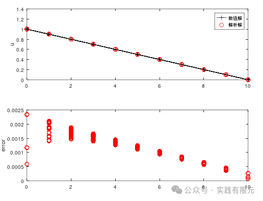

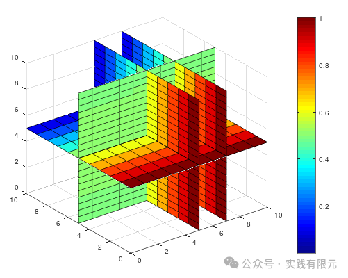

结果是正确的，说明推导的系数矩阵以及整个有限元流程是没有问题的。  

进而我们再加入右端项：对每个单元加载负载到右端项，并且将所有边界处理成第一类边界条件，由此得到：

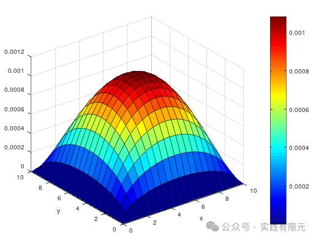

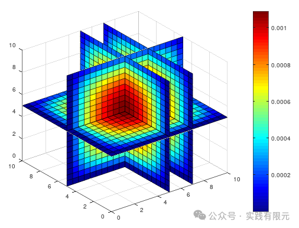

**7.总结**  

1.三维结构化有限元的实现流程同一维、二维基本上没有太大差别，本质都是寻找基函数离散研究区域，然后组装系数矩阵求解的思路。  

2.与一维、二维最大的区别在于基函数的不同，六面体三维作为基函数，三个维度相互作用，导致推导单元系数矩阵相对繁琐，但是推导过程中同样发现存在一定规律。