# 泊松方程的三维六面体任意高阶有限元实现

> 原文地址: [https://mp.weixin.qq.com/s/259YRyaWaQJsKH7ge9\_86Q](https://mp.weixin.qq.com/s/259YRyaWaQJsKH7ge9_86Q)

**简述**

本文继续介绍三维六面体的高阶有限元实现过程，承接之前一维、二维结果，三维仅在二维基础上多了一个维度，实现起来也比较容易。

一维、二维的内容这里不再介绍，依旧采用泊松方程作为示例，一维、二维任意阶有限元具体流程参考以下三篇文章：

[二维四面体任意高阶通式有限元实现-泊松方程](http://mp.weixin.qq.com/s?__biz=MzkwNzUxOTM2NA==&amp;mid=2247485328&amp;idx=1&amp;sn=a5f5eb9176d99d7caf3a8a961ce9b6c5&amp;chksm=c0d6b37bf7a13a6d45e2591a4d924831bf6b30d8c3f0b7c0bda994d8ac9cdd007c91c8dd813b&scene=21#wechat_redirect)

[任意高阶通式有限元玩法-泊松方程](http://mp.weixin.qq.com/s?__biz=MzkwNzUxOTM2NA==&amp;mid=2247485281&amp;idx=1&amp;sn=655c6f441e4ba5be98c33334f7959982&amp;chksm=c0d6b38af7a13a9c59e5605ec16258fdf528fb21a68785298c984caf9d24d0a1916523699dac&scene=21#wechat_redirect)

[初探高斯积分在一维有限元中运用：泊松方程](http://mp.weixin.qq.com/s?__biz=MzkwNzUxOTM2NA==&amp;mid=2247485234&amp;idx=1&amp;sn=a8484e8315eb423273733ac8e4bc1a66&amp;chksm=c0d6b3d9f7a13acf0c22cf6e364a99e91bcd13769377863a5f02073b17d0b02910f652f2f4c3&scene=21#wechat_redirect)

**1.六面体基函数**

对于1阶而言，其表达式为：

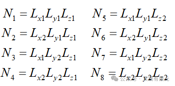

其中，将各方向的线性基函数落在\[-1,1\]上，得到如下转化关系：

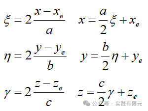

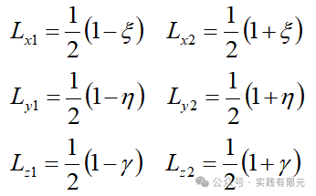

不难想到，其通式可以表示为：

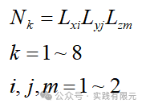

由此，其梯度可以表示为：    

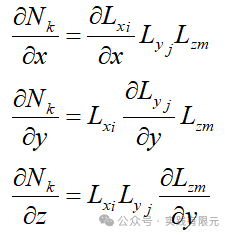

**2.系数矩阵推导**

推导与二维四边形推导一致，这里直接给出三个方向的推导。x方向偏导数：

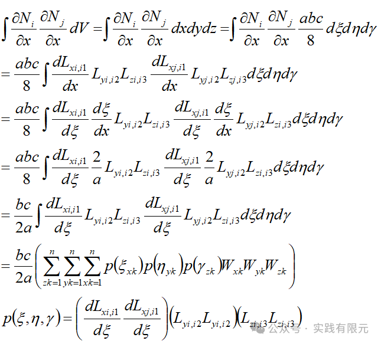

Y、Z方向的偏导数同样可以获得：

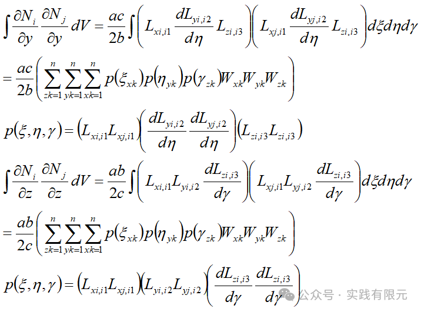

右端项推导：

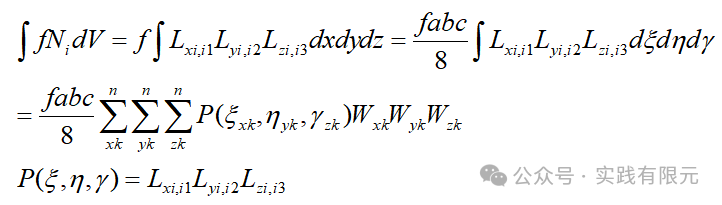

推导完成，剩下的交给高斯积分来求解具体单元系数矩阵！

**3.系数矩阵组装**

这里与二维四边形网格存在的难点一致，首先需要确定六面体节点的局部节点顺序，然后再实现全局节点到局部节点的映射关系。

具体实现根据六面体本身的拓扑关系获得，类似四边形，只是过程繁琐而已。

**4.结果展示**

模型大小10\*10\*10，剖分为numx\*numy\*numz=4\*4\*4=64个网格。

_Eg1:1阶情况，共计125个未知数_

其非零元素的稀疏矩阵分布如下：

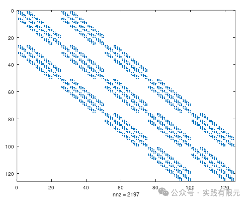    

三维可视化结果，将节点值显示如下：  

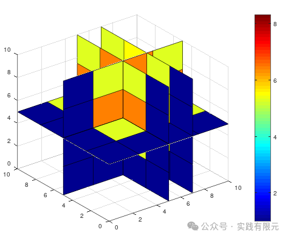

从稀疏矩阵规律看出，结构化网格的确很符合有限元逻辑，矩阵呈现稀疏化，并且非零元素集中成带状，这种形态也便于线性求解器求解。

对于4\*4\*4网格而言，1阶的结果看起来还是太粗糙。

_Eg2：对于2阶，共计729个未知数_

其非零元素的稀疏矩阵分布如下：

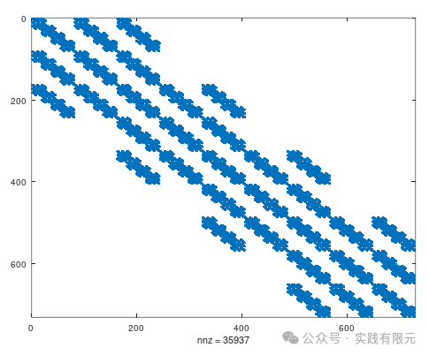

三维可视化结果，将节点值显示如下：

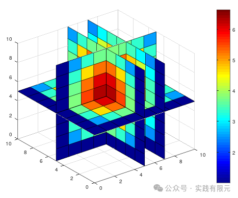

_Eg3：针对4阶，未知数大量增加，共计4913个_ 

同样，对应非零元素的稀疏矩阵分布如下：

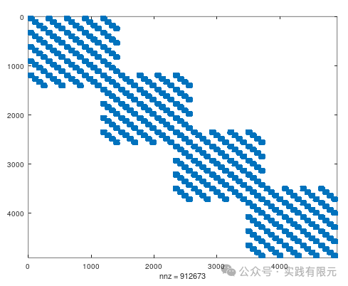

三维可视化结果，将节点值显示如下：

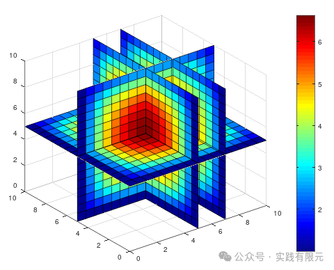

从2阶、4阶的结果，随着阶数增加，未知数也成倍增加，结果也更加精致。并且从高阶的非零元素分布，可以清晰看出网格个数是由四个组成，并且同侧非对角线的带状条数也代表了具体阶数。    

**最后**

1.对于插值型基函数的一、二、三维度的任意阶有限元的实现到此就全部打通，其核心技术两点：a.高阶插值形函数通式；b.高斯积分的使用；一个难点：高阶形函数所需要的网格节点生成。

2.三维的高阶有限元，如果自己推导高阶单元系数矩阵也是一个庞大的工程，二阶单元系数矩阵为27\*27的维度，4阶125\*125的系数矩阵，难以想象，这时才真正体现高斯积分的强大，大量避免了繁琐的计算，将这些计算交给计算机执行。