# 浅谈数值分析研究的对象和内容

> 原文地址: [https://mp.weixin.qq.com/s/YkppkhCw8OVVmb\_hEEbvqw](https://mp.weixin.qq.com/s/YkppkhCw8OVVmb_hEEbvqw)

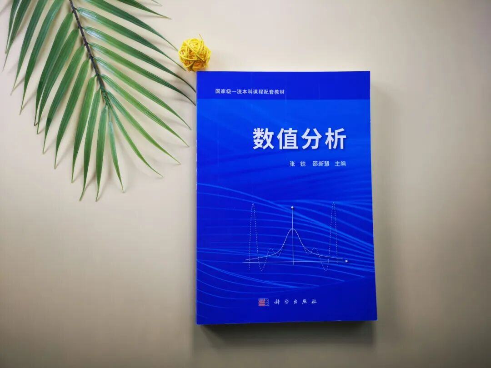

  

数值分析主要研究科学计算中各种数学问题求解的数值计算方法. 众所周知, 传统的科学研究方法有两种：理论分析和科学实验. 今天, 伴随着计算机技术的飞速发展和计算数学理论的日益成熟, 科学计算已经成为第三种科学研究的方法和手段. 用电子计算机进行科学计算, 解决实际问题, 其基本过程如下：

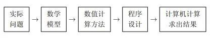

根据数学模型提出的问题, 建立求解问题的数值计算方法并进行方法的理论分析, 直到编制出算法程序上机计算得到数值结果, 以及对结果进行分析, 这一过 程就是数值分析研究的对象和内容. 

  

数值分析是计算数学的基础, 它不像纯数学那样只研究数学本身的理论, 而是把理论与计算紧密结合, 着重研究面向计算机的、能够解决实际问题的数值计算方法及其理论. 

  

具体地说, 数值分析首先要构造可求解各种数学模型的数值计算方法; 其次分析方法的可靠性, 即按此方法计算得到的解是否可靠, 与精确解之差是否很小, 以确保数值解的有效性; 再次, 要分析方法的效率, 分析比较求解同一问题的各种数值方法的计算量和存贮量, 以便使用者根据分析结果采用高效率的方法, 节省人力、物力和时间, 这样的分析是数值分析的一个重要部分. 

  

应当指出, 数值计算方法的构造和分析是密切相关不可分割的. 对于给定的数学问题, 常常可以提出各种各样的数值计算方法. 如何评价这些方法的优劣呢?

  

一般说来, 一个好的方法应具有如下特点： 

  

(1) 结构简单, 易于计算机实现;

(2) 有可靠的理论分析, 理论上可保证方法的收敛性和数值稳定性; 

(3) 计算效率高, 时间效率高是指计算速度快, 节省时间; 空间效率高是指节 省存贮量; 

(4) 经过数值实验检验, 即一个算法除了理论上要满足上述三点外, 还要通过 数值实验来证明它是行之有效的.

  

在学习数值分析时, 我们要注意掌握数值方法的基本原理和思想, 要注意方法处理的技巧及其与计算机的结合, 要重视误差分析、收敛性和稳定性的基本理 论. 此外, 还要通过编程计算来提高使用各种数值方法解决实际问题的能力. 

  

目前数值计算方法与计算机技术相结合已融入到计算物理、计算力学、计算化学、计算生物学、计算经济学等各个领域, 计算机上使用的数值计算方法已浩如烟海. 

  

常见的大学数值分析课程只限于介绍科学计算中最基本的数值计算方法. 主要内容有：线性代数方程组的数值解法, 非线性方程求根, 矩阵特征值和特征向量的计算, 函数的插值与逼近, 数值积分, 常微分方程和偏微分方程的有限差分方法等. 目的是使读者获得数值计算方法的基本概念和思想, 掌握适用于电子计算机的常用算法, 具有基本的理论分析和实际计算能力.

  

**相关好书推荐**

****

  

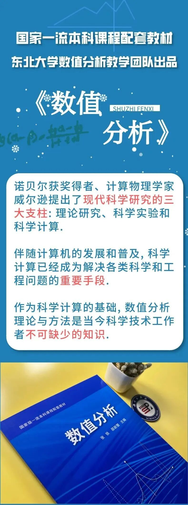

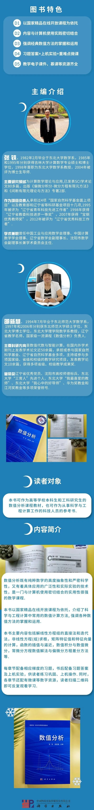

**0****1**

  

**本书目录**

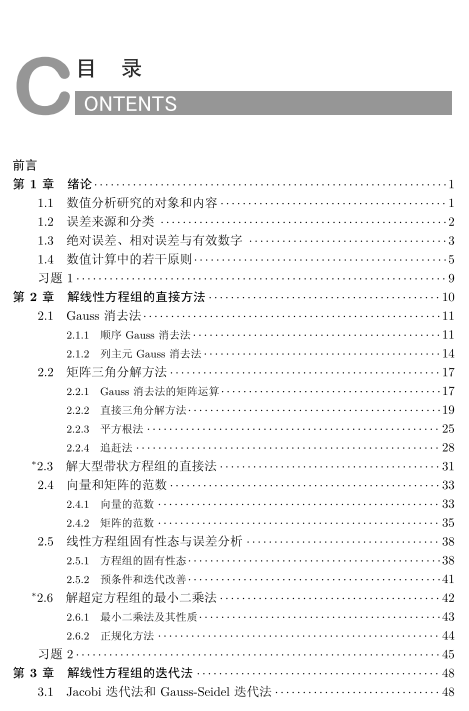

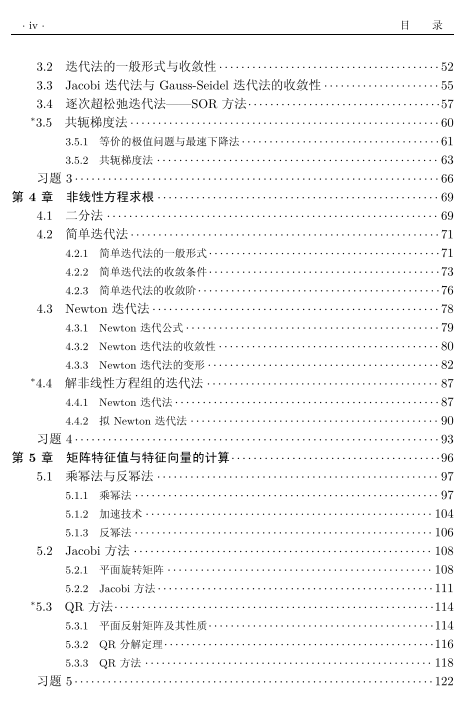

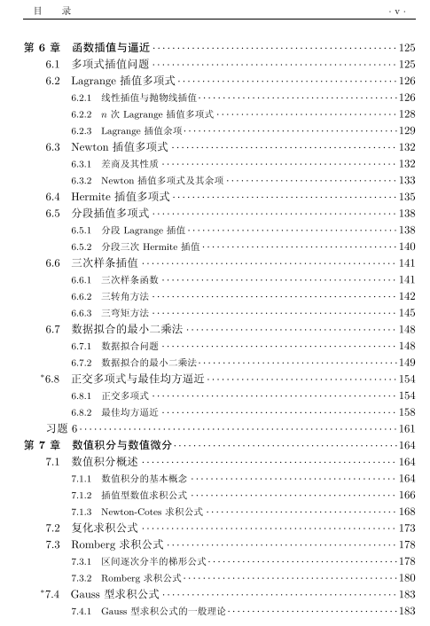

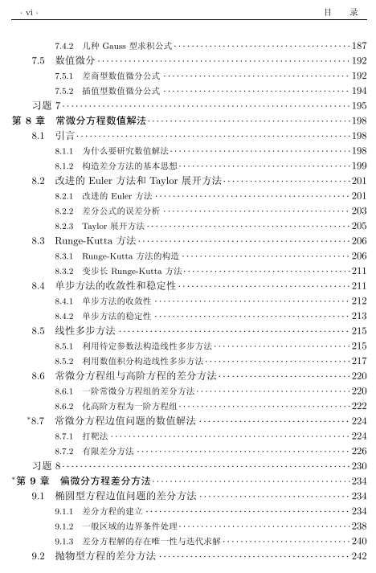

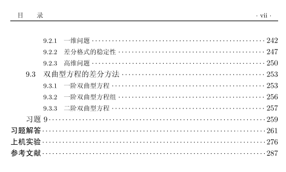

  

**02**

  

**正文展示**

  

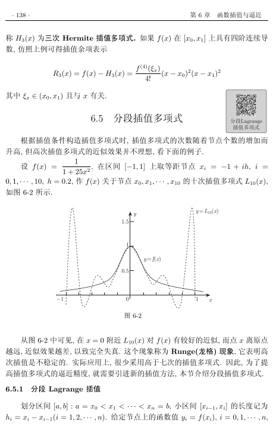

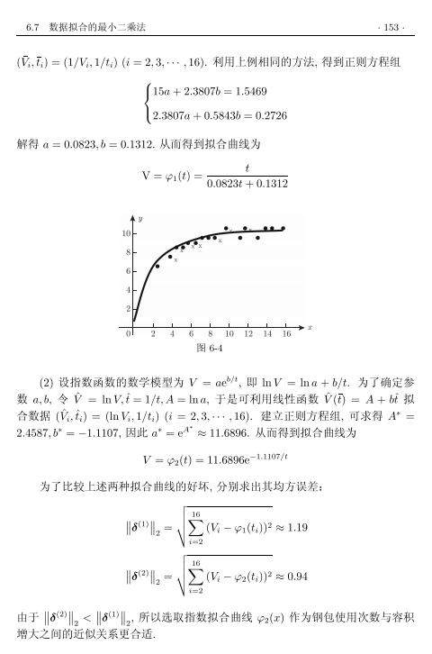

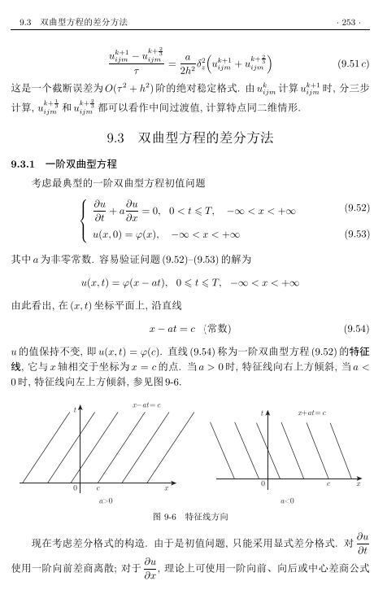

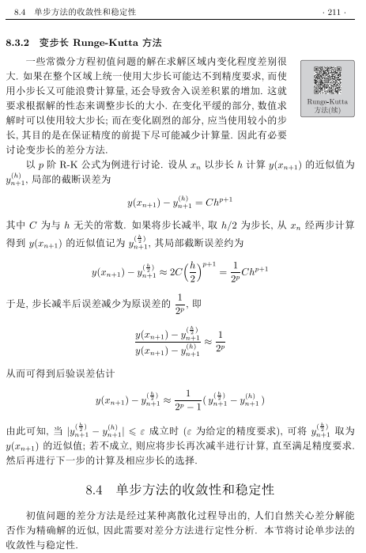

  

**‍‍0****3**

  

**购买链接**