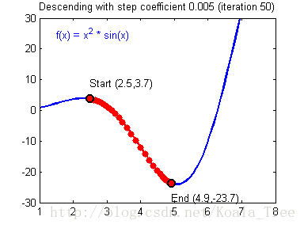

# 深入理解梯度下降算法

> 原文地址: [https://mp.weixin.qq.com/s/vseDqREX2T81GxMU\_xGLGQ](https://mp.weixin.qq.com/s/vseDqREX2T81GxMU_xGLGQ)

# 深入理解梯度下降算法

在机器学习领域，梯度下降算法是一种至关重要的优化方法，广泛应用于各种模型的训练过程中。它通过不断调整模型参数，以最小化目标函数，从而提高模型的性能和准确性。尤其是在BP反向传播算法中，每一层的权重参数通过梯度下降算法不断地迭代优化。

## 一、梯度下降算法的基本原理

梯度下降算法的核心思想是基于函数的梯度信息来更新参数，使目标函数逐渐减小，最终找到局部极小值或全局最小值。具体来说，其步骤如下：

1.  **初始化参数**：随机初始化模型的参数，如权重和偏置等。
    
2.  **计算梯度**：利用当前参数计算目标函数关于这些参数的梯度，即偏导数。
    
3.  **更新参数**：将每个参数沿着梯度的反方向移动一小步，步长由学习率控制。
    
4.  **重复迭代**：不断重复计算梯度和更新参数的过程，直到满足停止条件，如达到最大迭代次数或损失函数值足够小。
    

### 二、梯度下降算法的数学推导

为了更深入地理解梯度下降算法，我们需要回顾一些数学概念，并通过数学公式来详细推导其原理。

#### 1\. 导数与梯度

**导数** 是一元函数的变化率，表示函数在某一点的斜率。对于函数 ，其导数定义为：

例如，对于函数 ，其导数为：

**梯度** 是多元函数的导数，是各变量偏导数的向量形式，指向函数在该点上升最快的方向。对于二元函数 ，其梯度为：

对于多元函数 ，其中 ，其梯度为：

#### 2\. 梯度下降的更新公式

假设我们有一个目标函数 ，其中  是模型的参数向量。梯度下降算法通过以下步骤更新参数：

1.  **初始化参数**：随机初始化参数 。
    
2.  **计算梯度**：计算目标函数  关于参数  的梯度 。
    
3.  **更新参数**：将参数  沿着梯度的反方向更新，步长由学习率  控制：
    

1.  **重复迭代**：重复上述步骤，直到满足停止条件。
    

#### 3\. 学习率的作用

学习率  是梯度下降算法中的一个重要超参数，决定了参数更新的步长大小。较大的学习率可能导致训练过程不稳定，甚至发散；而较小的学习率则会使训练过程缓慢，收敛速度变慢。

#### 4\. 一维梯度下降实例

假设有一个简单的抛物线函数 ，我们可以通过梯度下降法找到其最小值点。具体步骤如下：

-   **初始化起始点**：例如 ，学习率为 。
    
-   **计算导数值**：即梯度 。
    
-   **更新参数**：按照梯度的反方向更新  的值：
    

例如，第一次迭代：

第二次迭代：

重复多次，直到满足停止条件。

#### 5\. 多维梯度下降实例

对于多变量函数，例如 ，梯度下降算法同样适用。具体步骤如下：

-   **初始化起始点**：例如 ，，学习率为 。
    
-   **计算偏导数**：形成梯度向量：
    

梯度向量为：

-   **更新参数**：按照梯度的反方向更新  和  的值：
    

例如，第一次迭代：

重复多次，直到满足停止条件。

通过以上数学推导，我们可以更清晰地理解梯度下降算法的工作原理和数学基础。这些公式和推导过程是梯度下降算法在实际应用中的理论支撑。

### 三、梯度下降算法的应用场景

梯度下降算法在机器学习和深度学习中有着广泛的应用，以下是一些常见的场景：

### 1\. 线性回归模型

在训练线性回归模型时，梯度下降算法可以用来最小化均方误差损失函数，找到最佳的权重和偏置参数。

### 2\. 神经网络训练

在深度学习中，梯度下降算法是训练神经网络的核心方法之一。通过反向传播算法计算梯度，并利用梯度下降法更新网络中的权重参数，以优化模型的性能。

### 3\. 逻辑回归模型

在逻辑回归模型中，梯度下降算法可以用于最大化似然函数，从而找到最佳的分类参数。

## 四、梯度下降算法的变体

除了基本的梯度下降算法外，还有一些变体在实际应用中表现出更好的性能：

### 1\. 随机梯度下降（SGD）

随机梯度下降在每次迭代中仅使用一个样本计算梯度，更新参数。这种方法计算效率高，但收敛过程可能较为波动。

### 2\. 小批量梯度下降（Mini-batch GD）

小批量梯度下降在每次迭代中使用一小部分样本来计算梯度，结合了批量梯度下降和随机梯度下降的优点，具有较好的收敛速度和稳定性。

### 3\. 动量梯度下降

动量梯度下降引入了动量项，使得参数更新时不仅考虑当前梯度，还保留了之前更新的方向和速度信息，有助于加速收敛并避免局部最小值。

## 五、梯度下降算法的优缺点

### 优点：

-   **简单易实现**：梯度下降算法的原理和实现相对较为简单，易于理解和应用。
    
-   **广泛适用**：适用于各种类型的机器学习和深度学习模型，是一种通用的优化方法。
    
-   **收敛性好**：在适当的条件下，梯度下降算法能够可靠地收敛到局部或全局最小值。
    

### 缺点：

-   **局部最小值问题**：在非凸优化问题中，梯度下降算法可能会陷入局部最小值，无法找到全局最优解。
    
-   **学习率选择敏感**：学习率的选择对算法的性能和收敛速度有较大影响，需要进行适当的调整和优化。
    
-   **计算资源需求**：对于大规模数据集和复杂模型，梯度下降算法可能需要大量的计算资源和时间。
    

## 六、编程实例

-   Python实现
    

`import numpy as np      # 激活函数：sigmoid   def sigmoid(x):       return 1 / (1 + np.exp(-x))      # 激活函数的导数   def sigmoid_derivative(x):       return x * (1 - x)      # 神经网络类   class NeuralNetwork:       def __init__(self, input_size, hidden_size, output_size):           # 初始化权重和偏置           self.weights_input_hidden = np.random.randn(input_size, hidden_size)           self.bias_hidden = np.zeros((1, hidden_size))           self.weights_hidden_output = np.random.randn(hidden_size, output_size)           self.bias_output = np.zeros((1, output_size))              def forward(self, X):           # 前向传播           self.hidden_input = np.dot(X, self.weights_input_hidden) + self.bias_hidden           self.hidden_output = sigmoid(self.hidden_input)           self.output_input = np.dot(self.hidden_output, self.weights_hidden_output) + self.bias_output           self.predicted_output = sigmoid(self.output_input)           return self.predicted_output              def backward(self, X, y, learning_rate):           # 反向传播           # 计算输出层误差           output_error = y - self.predicted_output           output_delta = output_error * sigmoid_derivative(self.predicted_output)                      # 计算隐藏层误差           hidden_error = np.dot(output_delta, self.weights_hidden_output.T)           hidden_delta = hidden_error * sigmoid_derivative(self.hidden_output)                      # 更新权重和偏置           self.weights_hidden_output += np.dot(self.hidden_output.T, output_delta) * learning_rate           self.bias_output += np.sum(output_delta, axis=0, keepdims=True) * learning_rate           self.weights_input_hidden += np.dot(X.T, hidden_delta) * learning_rate           self.bias_hidden += np.sum(hidden_delta, axis=0, keepdims=True) * learning_rate              def train(self, X, y, epochs, learning_rate):           for epoch in range(epochs):               # 前向传播               self.forward(X)               # 反向传播和权重更新               self.backward(X, y, learning_rate)               # 每隔一定轮数打印损失               if epoch % 1000 == 0:                   loss = np.mean((y - self.predicted_output) ** 2)                   print(f"Epoch {epoch}, Loss: {loss}")      # 示例数据   X = np.array([[0, 0], [0, 1], [1, 0], [1, 1]])   y = np.array([[0], [1], [1], [0]])      # 创建神经网络实例   nn = NeuralNetwork(input_size=2, hidden_size=2, output_size=1)      # 训练神经网络   nn.train(X, y, epochs=10000, learning_rate=0.1)      # 测试神经网络   for i in range(len(X)):       prediction = nn.forward(X[i].reshape(1, -1))       print(f"Input: {X[i]}, Predicted: {prediction[0][0]:.4f}")   `

-   Pytorch实现
    

`import torch   import torch.nn as nn   import torch.optim as optim      # 定义神经网络   class SimpleNeuralNetwork(nn.Module):       def __init__(self, input_size, hidden_size, output_size):           super(SimpleNeuralNetwork, self).__init__()           self.hidden_layer = nn.Linear(input_size, hidden_size)           self.output_layer = nn.Linear(hidden_size, output_size)           self.sigmoid = nn.Sigmoid()              def forward(self, x):           hidden_output = self.sigmoid(self.hidden_layer(x))           output = self.sigmoid(self.output_layer(hidden_output))           return output      # 示例数据   X = torch.tensor([[0.0, 0.0], [0.0, 1.0], [1.0, 0.0], [1.0, 1.0]])   y = torch.tensor([[0.0], [1.0], [1.0], [0.0]])      # 创建神经网络实例   input_size = 2   hidden_size = 2   output_size = 1   model = SimpleNeuralNetwork(input_size, hidden_size, output_size)      # 定义损失函数和优化器   criterion = nn.MSELoss()   optimizer = optim.SGD(model.parameters(), lr=0.1)      # 训练神经网络   epochs = 10000   for epoch in range(epochs):       # 前向传播       outputs = model(X)       loss = criterion(outputs, y)              # 反向传播和优化       optimizer.zero_grad()       loss.backward()       optimizer.step()              # 每隔一定轮数打印损失       if (epoch+1) % 1000 == 0:           print(f'Epoch [{epoch+1}/{epochs}], Loss: {loss.item():.4f}')      # 测试神经网络   print("测试结果：")   with torch.no_grad():       for i in range(len(X)):           prediction = model(X[i].unsqueeze(0))           print(f"Input: {X[i].numpy()}, Predicted: {prediction.item():.4f}")   `