# 电场矢量波动方程的三维有限元实现

> 原文地址: [https://mp.weixin.qq.com/s/XDwGKUJGZOOYEQJvuZeoMw](https://mp.weixin.qq.com/s/XDwGKUJGZOOYEQJvuZeoMw)

**简述**    

本次使用三维非结构化有限元实现较为复杂的微分边值问题：电场的矢量波动方程。采用四面体网格的节点有限元。

**1.微分边值问题**

物理背景：由频域maxwell方程组推导出无源电场矢量波动方程，描述了电场在无源情况下介质中的传播规律。

当研究区域内电导率远大于介电常数时候，此时不考虑介电常数影响。假设电场为平面波均匀入射研究区域，得到边值问题：

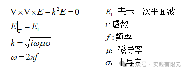

式中E表示电场，在三维中具有三个分量(Ex,Ey,Ez)。在边界上为已知平面波E1。

**2.有限元方程推导**

使用伽辽金方法推导，对微分方程乘以试探函数detaE，并在研究区域内进行积分得到积分方程：

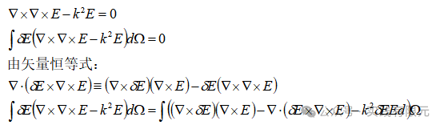

其中，第二项散度的积分可以通过散度定理处理为边界的积分：

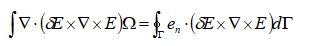

因此，有限元问题变成：

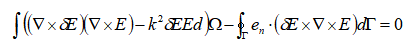

当仅考虑在边界加入第一类边界条件的时候，边界项可以不用处理，因为在强加第一类边界的时候乘以大数会消除掉边界项的影响，因此只考虑内部区域的公式。

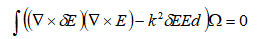

**3.四面体基函数** 

本次数值模拟采用四面体网格，并且使用线性节点有限元，已知四面体基函数表达式可以写成：（具体推导参考：[三维非结构化有限元实现-possion方程](http://mp.weixin.qq.com/s?__biz=MzkwNzUxOTM2NA==&amp;mid=2247484341&amp;idx=1&amp;sn=8f2dfbcd864b11b1a9209e65701b1307&amp;chksm=c0d6b75ef7a13e480ba93f26fb40f5e443eb8e0c0dbad1518ac4606f8f60f46520818e2eaa23&scene=21#wechat_redirect)）

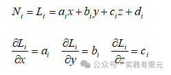

由于电场E为矢量三分量，因此电场的具体插值公式为：

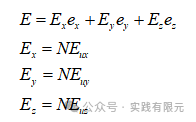 

式中带下标u的表示离散格式。可见对于四面体而言，每个节点表示电场的三个方向，即称之为每个节点有三个自由度，相对的如果每个节点仅表示一个值，则表示一个自由度。

**4.单元系数矩阵推导**

根据有限元方程，首先推导第一项，已知电场旋度的展开式：

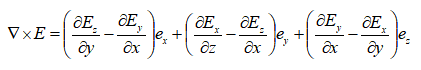

将形函数带入其中进行离散，推导得到旋度的离散格式：

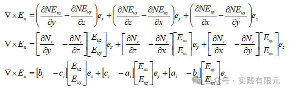 

进而可以推导得到：

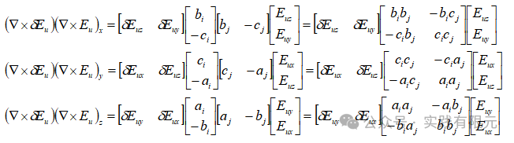

对上述式子进行处理，将每个方向的电场分量均表示为包含三个分量\[Ex,Ey,Ez\]形式的向量：

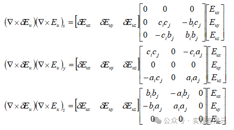 

如此，将上述表示三个方向的等式累加，对应的向量位置一一累加，很容易得到;

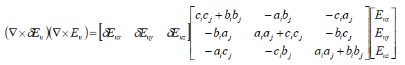

已知试探函数detaE不恒为0，因此可以约去，由此有限元第一项的系数矩阵为：

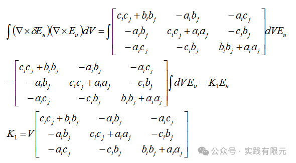 

针对有限元方程第二项，将被积部分进一步展开：

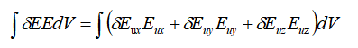

将形函数带入得到离散公式：

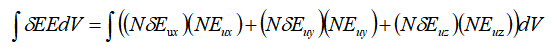

写成矩阵形式：

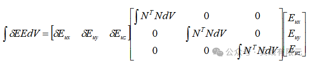  

进一步简化，得到：

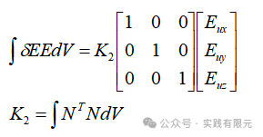 

可见，电场的三分量方向的系数矩阵是一样的，对于K2的推导，通过积分公式或者积分表不难得出（参考：[三维非结构化有限元实现-possion方程](http://mp.weixin.qq.com/s?__biz=MzkwNzUxOTM2NA==&amp;mid=2247484341&amp;idx=1&amp;sn=8f2dfbcd864b11b1a9209e65701b1307&amp;chksm=c0d6b75ef7a13e480ba93f26fb40f5e443eb8e0c0dbad1518ac4606f8f60f46520818e2eaa23&token=1014427739&lang=zh_CN&scene=21#wechat_redirect)）：

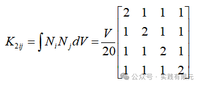

由此，可以得到电场矢量波动方程的单元系数矩阵：

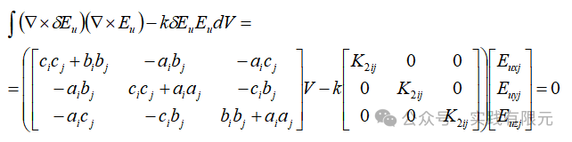

仔细观察，如果将上述式子完全展开，可以得到一个具体的12\*12矩阵的系数矩阵，并且可以发现电场的三个分量有着不同的系数。

**5.非结构网格与系数矩阵组装**

本次同样采用开源tetgen剖分得到四面体网格，在研究区域内标记一个小区域作为介质材料不同的区域，具体剖分结果如下：

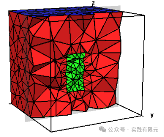 

系数矩阵组装与常规有限元组装一致，具体可以参考：[三维非结构化有限元实现-possion方程](http://mp.weixin.qq.com/s?__biz=MzkwNzUxOTM2NA==&amp;mid=2247484341&amp;idx=1&amp;sn=8f2dfbcd864b11b1a9209e65701b1307&amp;chksm=c0d6b75ef7a13e480ba93f26fb40f5e443eb8e0c0dbad1518ac4606f8f60f46520818e2eaa23&token=1898809487&lang=zh_CN&scene=21#wechat_redirect)。

边界条件采取乘以大数的方式加载，这里假设电场传播方向为z方向，极化方向为x方向。已知平面波电场在均匀介质的传播规律：

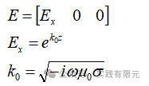

因此，假设点m存在表面，则全局系数矩阵与右端项乘以大数处理如下示意：

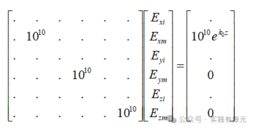 

**6.结果展示** 

研究区域大小10m\*10m\*10m，频率10000Hz,电导率1欧姆米。网格为4314个四面体，872个节点，所以全局系数矩阵为(872\*3)\*(872\*3),共计有872\*3个未知数。 

**a.当研究区域的介质为均匀介质时，理论解与数值解对比：**

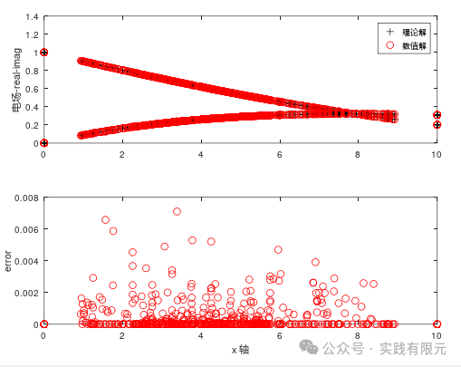

可见，理论解与数值解的趋势基本上一致，虽然存在一定误差，但基本上可以判断结果是正确的。可以观察电场三个分量的切片图：

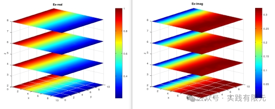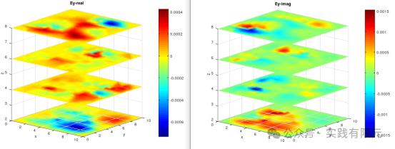

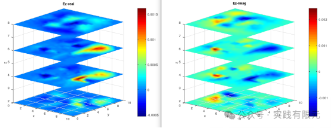

可见，只有Ex方向有电场值，Ey,Ez方向本应该为零，但是由于数值误差，均有一定的较小的误差值，并且是杂乱无章，说明Ey,Ez大体也是符合理论的，如果将网格加密，则可以进一步提高精度。 

**b.将网格图中，研究区域中心位置的电阻率设置为0.05欧姆米。**

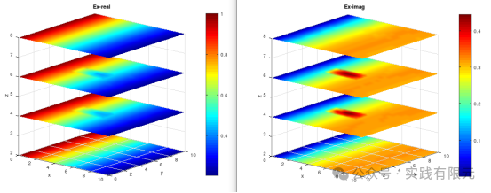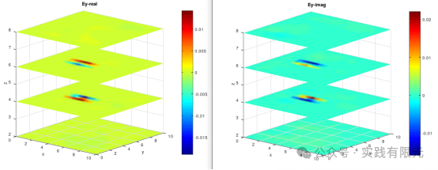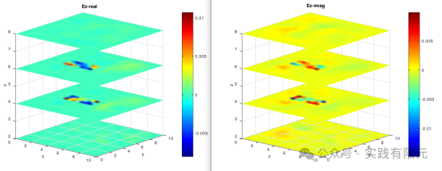 

可见，当研究区域不再是均匀介质的时候，电场Ex,Ey,Ez的响应在介质异常的位置均有明显的规律性体现。说明虽然电场是极化方向是x方向，但是由于介质不均匀的原因，导致在y、z方向均出现了电场，也可以理解为电场碰到介质不均匀时产生了二次场。从数值角度上讲则是微分方程通过旋度将x,y,z三个方向成功耦合在起来。 

**7.结论**

a.对于较复杂的边值问题，虽然形函数相对较为简单，但是在推导单元系数矩阵的时候要尤为小心，必要情况下可以检查单元系数矩阵是否对称、组装后对角线元素是否为非零等方法来判断矩阵正确与否。

b.本案例仅仅通过简单的模型来验证系数矩阵是否正确，对于介质非均匀情况并没有考虑介质在边界面的反射、电场连续性问题，因此对于非均匀模型的结果正确性无法保证。

c.例如想要避免电场在边界面的反射问题，可以加大研究区域或者加入吸收边界；如果要模拟电场在介质分界面法向不连续问题，需要对分界面采用足够细化的网格或者采用棱边有限元处理。