# 电磁矢量有限元迭代神器：FGMRES+AMS


> 原文地址: [https://mp.weixin.qq.com/s/skDivHmWUYwkw7-As0285Q](https://mp.weixin.qq.com/s/skDivHmWUYwkw7-As0285Q)

介绍

对于研究三维电磁矢量有限元仿真朋友应该了解，矢量有限元得到的稀疏矩阵条件数很差，这导致使用传统的迭代求解器很难收敛到足够精度。因此，基于辅助空间预条件（AMS）的FGMRES迭代求解器孕育而生，专门针对maxwell方程的迭代求解器。很多文献已经证明，对于大规模自由度矩阵而言，这种迭代求解器是稳定的，计算收敛性好，占用内存空间远小等优点。

本文是从开源代码中把这部分提取出来，简化接口，测试效果，降低该方法的使用门槛。

一、原理简介

FGMRES 之所以称为“灵活”广义最小残差法，是因为它在迭代过程中**允许动态更换预条件子**；而 AMS（Auxiliary-space Maxwell Solver）正是针对 Maxwell 方程体系专门构造的一类代数预条件子，可与 FGMRES 无缝配合

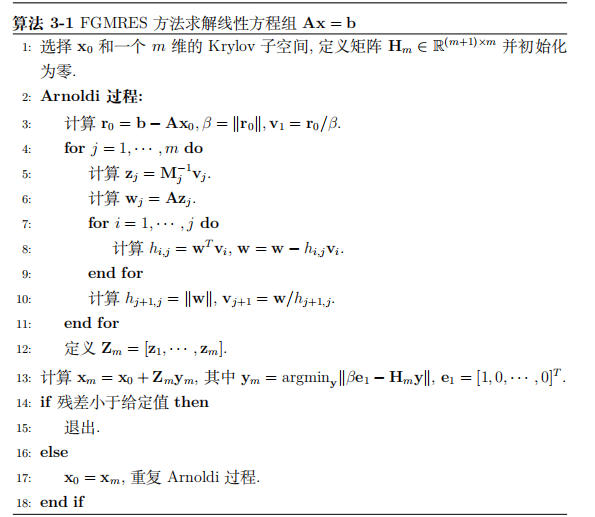

对于上述FGMRES迭代求解器流程而言，其中

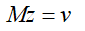

这里M即是预处理矩阵，根据这个系统，构造一种基于物理或者原方程特征的预条件矩阵，使得该矩阵足够逼近原始矩阵的同时，又能高效求解。进一步说明，则是预处理矩阵M的逆与原矩阵相乘得到的系统矩阵的条件数足够的小，这就能保证预处理后的线性系统能够很容易迭代收敛。

具体处理方式：首先对于Maxwell方程而言，都可以获得复数形式的方程：

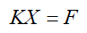

将之转化为实数系统：

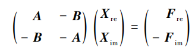

其中：

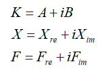

接下来，构造预条件矩阵M，将原始矩阵的实部虚部相加，此时的M矩阵既包含了原始方程的所有信息：

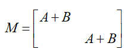

有了预条件矩阵，进一步需要求解关于Mz=v的内部方程，从M矩阵的构造可见，有两部分组成，并且一致，因此无论是使用直接求解还是迭代求解，这部分的内存相比于原矩阵会减小了一半。

但是直接求解该矩阵依然会有很大内存，为了避免直接求解，就有了辅助空间预条件AMS(Auxiliary space Maxwell Solver),该方法根据maxwell方程的特征构造而成，原理复杂，感兴趣参考相关文献。

该方法实现比较复杂，辅助空间预条件的理解困难，一般使用HYPRE程序库提供的接口实现，但是即使提供了接口，难度依然很高。

本文从开源代码中把这部分提取出来，分析并简化接口，以方便后续工程中直接调用，降低该方法的使用门槛。

二、安装环境

建议在ubuntu下配置环境，基于petsc环境库直接安装所有依赖环境，一步到位。其它环境可能安装会因为本身版本等原因安装困难。

```
git clone -b release https://gitlab.com/petsc/petsc.git petsc
```

三、数据接口数据

不考虑AMS的内部实现过程，单从所需要的数据考虑，对于一阶矢量有限元而言，共计需要五个数据：

标准的CSR格式的行个数、列索引、非零原始实部虚部、右端项实部虚部；网格信息：棱边到节点的映射关系、节点的坐标信息。

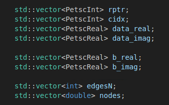

FGMRES-AMS整个代码流程：

```
1.初始化petsc与配置ams选项信息；
```

整个流程中，只需要把2步骤填写好即可求解，其他部分均封装好不用过多处理。

四、测试案例

输入一个matlab中已有的三维矢量有限元求解电场的稀疏矩阵。使用FGMRES-AMS求解，测试结果是否与matlab 直接求解结果一致。

测试信息，矩阵维度是3124个未知数：

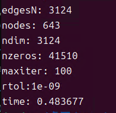

测试结果，25次迭代完成。

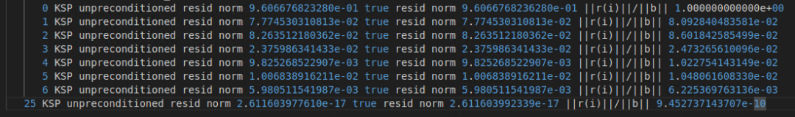

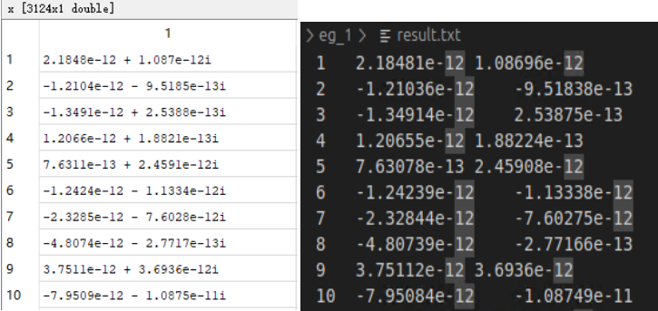

求解结果与matlab结果一致。下面展示下不同情况下的计算效率：

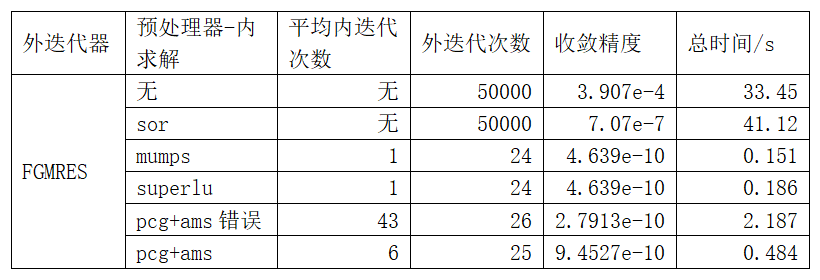

对比结果，仅使用外循环FGMRES，不使用预处理器完全无法收敛，使用传统的sor简单处理收敛精度也只能达到1e-7次方量级，但是依然无法完全收敛，并且迭代次数已经达到5万次，收敛的时间也在半分钟左右。对于这个自由度在3000左右的矩阵速度是非常慢的。

而使用了M预处理矩阵，无论预处理矩阵怎么求解，均可以收敛到1e-10次方量级，并且计算效率远高于不使用预处理矩阵。即使AMS的组装错误，其求解的时间也远低于无预处理的情况。

对于使用mumps、superlu、PCG+AMS对预处理矩阵求解,效果非常好，基本上在一秒以内完成计算。本例子中预处理直接求解的效率高于AMS是由于案例规模确实太小，如果矩阵规模更大，AMS的优势会慢慢体现。

总体上可以得出结果，本次的FGMRES+AMS的求解流程是正确的，基本上外循环在25次左右就完全收敛。

总结

1.本文意在让复杂的FGMRES+AMS简单化，易于后期使用；

2.值得注意的是，该求解器依赖于剖分网格，因此对于高阶有限元而言，处理情况更加复杂，开源软件MFEM中似乎已经集成了高阶情况下FGMRES+AMS求解器。

参考文献：

1.《基于自适应矢量有限元法的三维大地电磁正反演研究》

2.《面向实际地质情况的可控源电磁各向异性三维大规模并行正反演》

* * *

博主长期深入实践电磁学领域的有限元数值仿真技术，感兴趣的朋友可以添加博主公众号，欢迎共同探讨与有限元相关的技术知识。