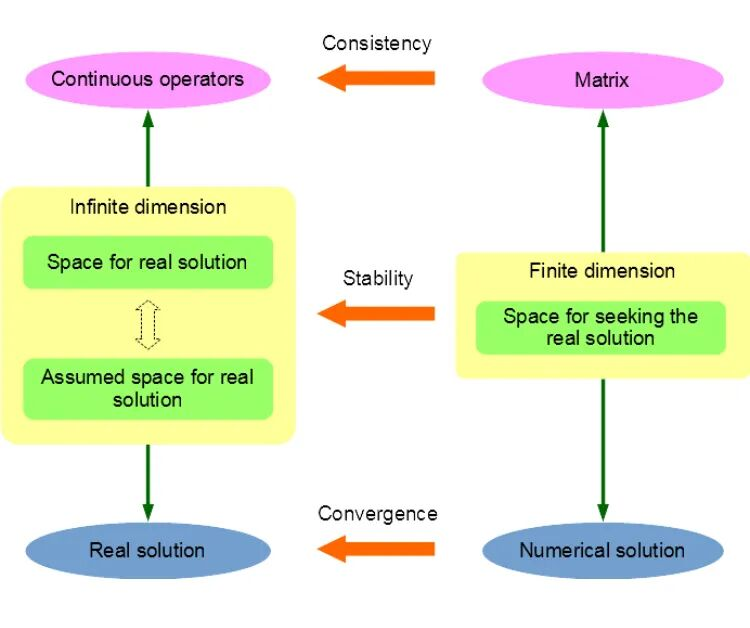
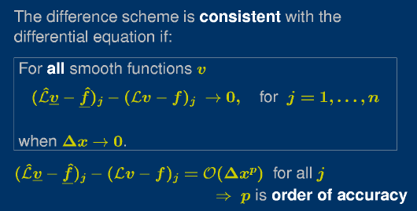
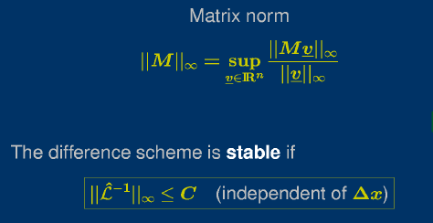
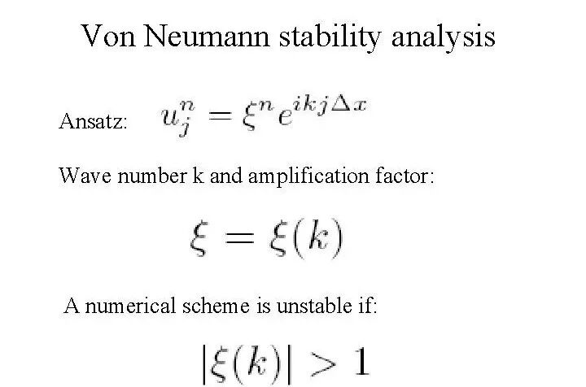
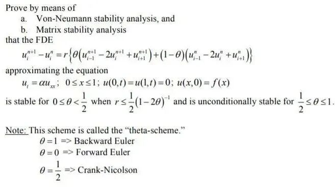
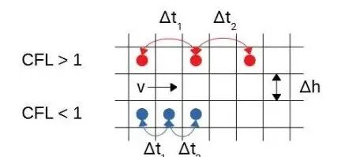
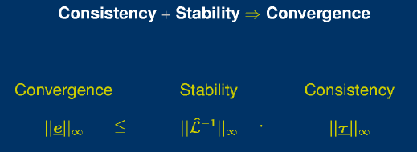
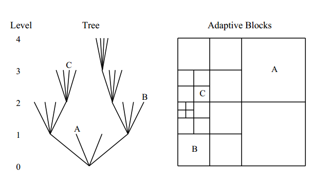
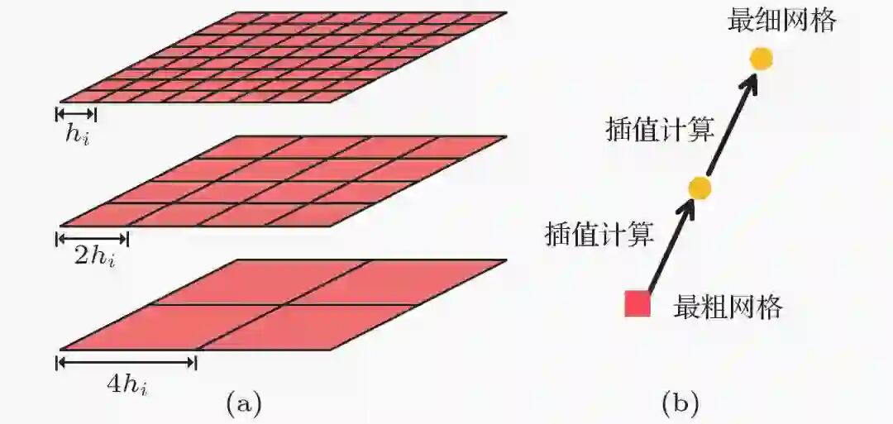
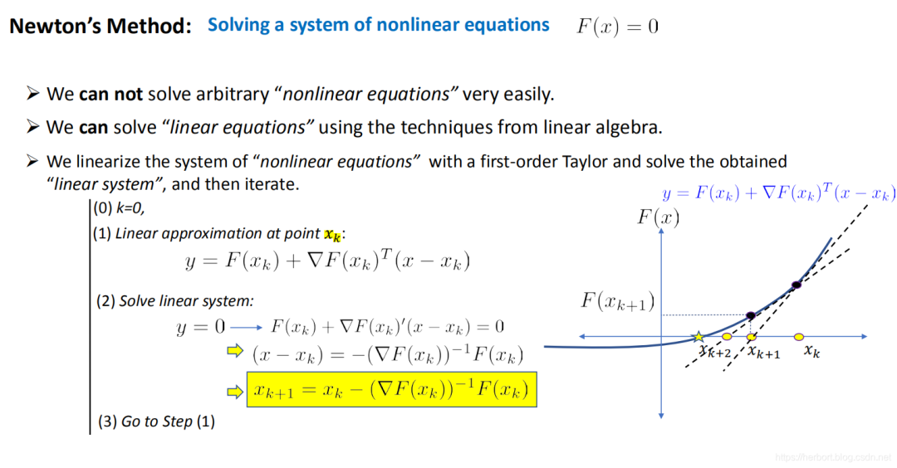

# 相容性、稳定性和收敛性：有限差分法核心概念解析

> 原文地址: [https://mp.weixin.qq.com/s/bz1uLKD\_XaOgPdiYdMECvQ](https://mp.weixin.qq.com/s/bz1uLKD_XaOgPdiYdMECvQ)

在数值分析领域，有限差分法（Finite Difference Method, FDM）是一种广泛应用于求解偏微分方程（PDE）的强大工具。它通过将连续的微分算子离散化为差分算子，使得复杂的数学问题可以转化为易于处理的代数方程组。然而，为了确保数值解的准确性和可靠性，理解并掌握相容性、稳定性和收敛性的概念及其相互关系至关重要。

本文旨在详细探讨有限差分法中这三个核心属性，并阐述它们之间的内在联系。我们将从定义出发，逐步深入到实际应用中的考量和挑战，帮助读者全面了解如何评估和选择合适的数值方法。

## 相容性：确保正确的数学模型表示

### 概念解析

相容性是指差分格式与原始微分方程的一致性。当网格间距 和时间步长 趋近于零时，如果差分格式能够逼近到微分方程，则称该差分格式为相容的。这是确保数值方法正确反映物理现象的基础。一个相容的方法意味着其截断误差随着步长的减小而趋向于零，即差分格式能逐渐更精确地捕捉到微分方程的本质。

### 分析工具：泰勒展开

为了量化相容性，我们通常使用泰勒展开来分析差分格式的截断误差。例如，考虑一维空间中的导数，向前差分公式：

根据泰勒展开，我们可以得到：

将上式代入差分公式后可得：

这里 表示高阶项，在 趋向于零时会变得非常小。因此，差分格式是相容的，因为其截断误差为 ，随着步长 的减小，截断误差也会相应减小。

对于更高阶导数或非线性项，可以通过多变量泰勒展开进一步研究相应的差分格式。例如，对于二阶导数 ，可以使用中心差分公式：

这个公式具有 的截断误差，意味着它比一阶差分公式提供了更高的精度。因此，在实践中，根据所需精度和计算成本之间的权衡，可以选择不同的差分格式。

## 稳定性：保证数值解的可靠性和有界性

### 概念解析

稳定性涉及到数值解随时间或迭代过程是否保持有界。即使初始条件或边界条件存在微小扰动，稳定的数值方法也应该保证计算结果不会无限增长。不稳定的数值方法可能会导致解的振荡或者发散，使得结果失去物理意义。因此，稳定性是确保数值方法可靠的另一关键因素。

### 分析工具：冯·诺依曼方法

冯·诺依曼方法是一种广泛应用于线性偏微分方程的稳定性分析工具。它基于傅里叶变换，假设解可以分解为不同频率成分的叠加。然后，检查每个频率成分的增长因子是否小于等于1，以此来确定差分格式是否稳定。对于某些特定类型的方程，比如抛物型方程或双曲型方程，这种方法能够给出明确的稳定性条件。

然而，冯·诺依曼分析有其局限性，它只适用于线性常系数方程，并且忽略了边界条件的影响。对于非线性问题或者变系数问题，需要采用更加复杂的方法来证明稳定性。例如，能量方法通过构造一个能量泛函并证明它随时间单调递减或保持不变来展示稳定性。还有就是矩阵理论中的谱半径条件，它要求差分格式对应的迭代矩阵的最大绝对特征值不超过1。

此外，在实际应用中，稳定性条件可能依赖于步长的选择和其他参数，如时间步长和空间步长的比例。因此，选择合适的时间步长和空间步长对于保证数值方法的稳定性是非常重要的。例如，在显式方法中，时间步长通常受到CFL条件（Courant-Friedrichs-Lewy condition）的限制；而在隐式方法中，由于其无条件稳定性，时间步长的选择相对更加灵活。

## 收敛性：最终目标是接近真实解

### 概念解析

收敛性是指随着网格尺寸趋于零，数值解能否无限接近于真实解。这是数值方法最终目的的体现，也是评价其有效性的标准之一。收敛性不仅关乎数值解的准确性，还反映了数值方法在极限情况下的表现。

### Lax等价定理与非线性问题

对于线性常系数偏微分方程，Lax等价定理给出了初边值问题收敛性的充分必要条件：

> 相容性和稳定性共同确保了收敛性。只要数值方法既相容又稳定，那它就一定是收敛的。

相容性、稳定性和收敛性之间存在着紧密的关系。一个数值方法要收敛，首先必须是相容的，这意味着差分格式能够正确地反映微分方程；其次，它还必须是稳定的，否则即使差分格式是相容的，由于不稳定，误差也可能迅速放大，导致结果失真。

对于线性常系数偏微分方程，Lax等价定理是完全适用的。但对于更复杂的非线性问题或者变系数问题，虽然相容性和稳定性仍然是必要的条件，但它们不一定能保证收敛性。此时，需要进一步的研究和证明来确保数值方法的有效性。例如，对于某些非线性问题，可以尝试引入一致收敛的概念，即不仅要求数值解在单个点上收敛，还要求在整个定义域内都收敛。

除了理论上的考量，实际应用中的收敛性验证也非常重要。这包括使用不同分辨率下的结果来进行比较，观察随着分辨率增加，数值解的变化趋势。如果数值解确实收敛，那么随着分辨率的提高，解应该逐渐趋同。另外，还可以通过与其他已知解析解或者更高精度的方法进行对比来检验收敛性。

## 实践中的挑战与策略

相容性、稳定性和收敛性并不是孤立存在的概念。实际上，它们往往相互影响。例如，通过改进差分格式以提高相容性，可能会改变其稳定性特性；而调整算法以增强稳定性，也有可能影响到相容性。因此，在设计和分析数值方法时，需要综合考虑这三个方面，以找到最优的解决方案。

在实际应用中，实现一个既相容又稳定且收敛的数值方法面临着诸多挑战。一方面，由于实际问题往往具有复杂的几何形状、边界条件以及非线性特征，使得构建合适的差分格式变得更加困难。另一方面，计算资源的限制也迫使我们在精度和效率之间做出折衷。

面对这些挑战，研究人员开发了许多策略和技术。例如，

-   自适应网格技术可以根据解的特点，动态调整网格密度，从而提高局部区域内的分辨率；
    

-   多重网格方法则结合粗细网格的优势，加速求解过程；
    

-   对于非线性问题，可以采用牛顿迭代等非线性求解器，以更好地处理非线性效应。
    

总之，有限差分法作为一种强大的数值工具，在科学计算领域有着广泛的应用。通过对相容性、稳定性和收敛性的深入理解和合理运用，我们可以更加有效地解决各种复杂的数学物理问题。

## 小结

综上所述，相容性、稳定性和收敛性是评价有限差分法性能的重要标准。它们各自关注数值方法的不同方面，但在实际应用中，这三者往往是相互关联、不可分割的。为了获得可靠的数值解，设计者应当确保所使用的差分格式既具有良好的相容性，又满足适当的稳定性条件，同时还要注意验证方法的收敛性，以确保数值解能够准确地反映物理现象。

# 推荐阅读

我们目前正和专业SCI论文英文润色机构**艾德思**开展全方位合作。如果您需要**论文和基金标书辅导服务**，欢迎扫码下方二维码，获取您的专属学术顾问，**锁定直减活动优惠**👇

********▲****长按扫码添加学术顾问咨询********▲****

 

  

  

**喜欢****作者******，请点********赞********和在看********

****