# 矢量有限元实例：二维波导本征模求解

> 原文地址: [https://mp.weixin.qq.com/s/qEFVV4GyWs6JDF-EbuiPrg](https://mp.weixin.qq.com/s/qEFVV4GyWs6JDF-EbuiPrg)

**简述**  

在电磁领域，有一类问题是本征值求解问题。即当无源情况下，求解已知腔体模型的谐振频率与其他一些重要参数，这对于设计滤波器等电路器件有着非常重要的指导意义。

本次从最简单的二维波导本征模问题出发，实现二维矢量有限元与节点有限元的混合编程，最终求解得到矩形波导的谐振频率。

**1.边值问题**

虽然是二维问题，但是由于三个方向的电磁在非均匀介质的情况下均可能存在，因此依旧从三维的电场双旋度方程出发：

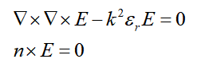

推导得到有限元方程，具体参考：[电场矢量波动方程的三维有限元实现](https://mp.weixin.qq.com/s?__biz=MzkwNzUxOTM2NA==&mid=2247484407&idx=1&sn=7d4552a3bef4471c0f6e202d684047ae&chksm=c0d6b71cf7a13e0af43f853105dca9dfaf33f89aae01fa3648c15ac23de1a1aa9c24cc079e6d&token=793975314&lang=zh_CN&scene=21#wechat_redirect)

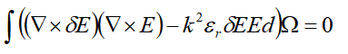

根据波导的结构特征，波导中任意模式的电场可以写成如下形式：

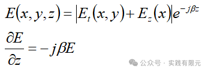

分解成切向平面的XY-->T和Z方向，对于梯度算子可以写成：

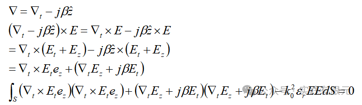

定义下面式子，以便于推导：    

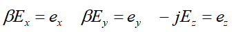

将上述定义带入到有限元方程中：

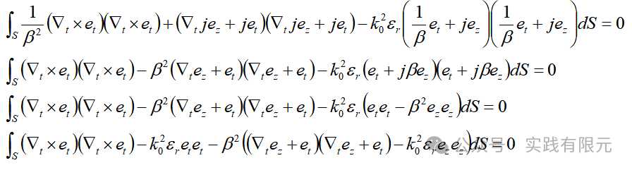

最终得到有限元方程如下：

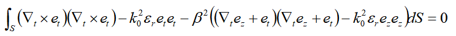

可见，上述方程既包含了XY平面的切向电磁分量也包含了Z方向的电磁分量，因此在有限元中既有矢量基函数部分，也会有节点基函数部分。

**2.基函数与单元系数矩阵推导**

本次实现采用简单的1阶基函数，因此节点基函数与矢量基函数分别可以表示为：

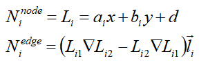

三角形基函数的推导具体推导参考：

[二维矢量有限元的详细实现过程](https://mp.weixin.qq.com/s?__biz=MzkwNzUxOTM2NA==&mid=2247484232&idx=1&sn=af1a7c52d138249b44f0a7b68cb8b45c&chksm=c0d6b7a3f7a13eb57ba43f42a180beb609e1d9e5928fa89828ca94912339bcaf36ff2a0eff40&scene=21#wechat_redirect)

[同轴线求电容，初探泊松方程的二维非结构化有限元](https://mp.weixin.qq.com/s?__biz=MzkwNzUxOTM2NA==&mid=2247483980&idx=1&sn=9803c31966314d8fbd90cede9faa1b60&chksm=c0d6b6a7f7a13fb19c485e758759ae83a99bc808c940178bd52bdedc32b5884c98969d8d4e6e&token=793975314&lang=zh_CN&scene=21#wechat_redirect)

因此，电磁未知数可以通过基函数表示，如下：

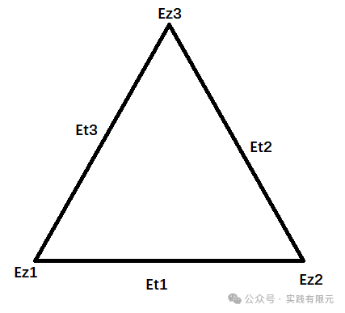    

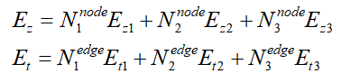

将上述基函数带入到有限元方程中进行离散，首先考虑有限元中不包含beta的部分：

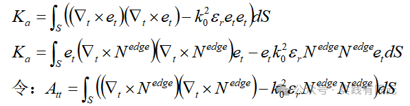

将Att写在矩阵中，表示为：

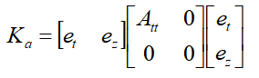

然后考虑有限元方程中包含beta的部分项：

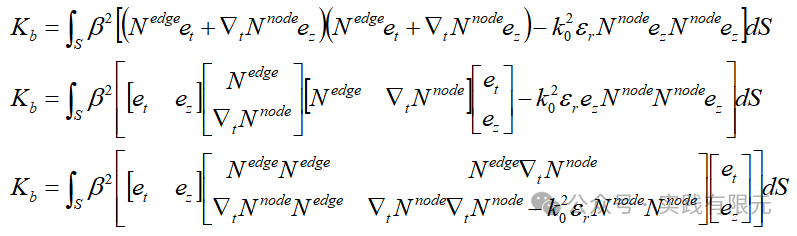

将上述部分进行简化，得到：

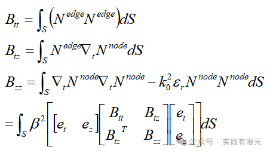

写成矩阵形式为：

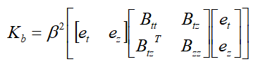

最终组合这两部分，得到：    

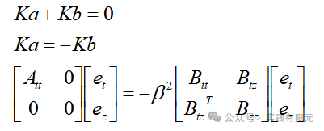

上述Ka,Kb就是单元系数矩阵,分别求解Att,Btt,Btz,Bzz后，组装起来即可得到。对于这些块矩阵的积分求解，均可以使用Hammer积分点（四面体叫做高斯积分点、三角形叫做Hammer积分点）积分求解的方法获得。

**3.系数矩阵的组装与处理**

组装方式需要同时知道单元与棱边的映射关系、单元与节点的映射关系。因此根据上述单元系数矩阵的关系，可以知道总未知数N=棱边数+节点数。

对于N\*N的系数矩阵，将每个网格的单元系数矩阵根据局部变化与全部变化的关系一一放入即可。

需要注意的是，根据上述推导，最终得到的特征值问题是一个病态问题，其中左端项的对角线上有大量的零元素，因此需要对其进行处理，下面介绍两种方法。

第一种方法是两边同时加上一个非零对角线的矩阵，这里则直接加入右端项矩阵，如下：

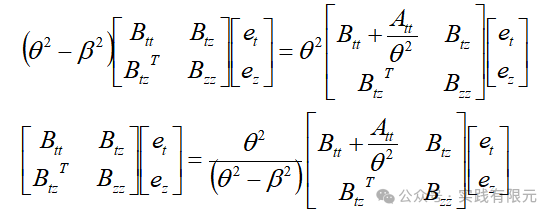

其中theta有介质材料唯一决定。

第二种方法是在原基础进行矩阵变换，首先展示矩阵等式：

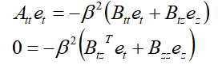

替换掉第一个等式中的ez，则：    

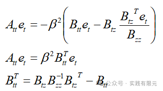

可见，这种方法有效的减小的未知数，将节点部分的未知数全部消除，但是这种方法的结果是导致系数矩阵不再是稀疏矩阵。

**4.结果展示**

几何模型是1m\*2m的矩形盒子，模拟矩形波导的横截面。网格10\*20\*2=400个三角形单元，均匀介质，相对介电常数为1。网格模型如下：

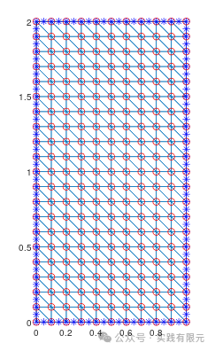

采用方法1的非零元素分布：

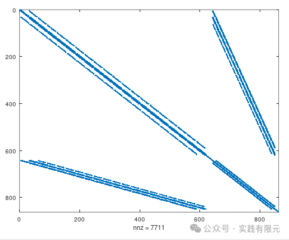

采用方法2得到的非零元素分布：

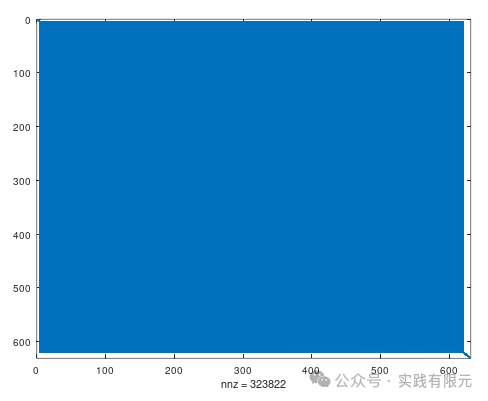

可见方法2虽然未知数减少了，但是非零元素急剧增加，导致系数矩阵不再是系数矩阵。这对于一些针对系数矩阵加速的线性方程求解器是非常不友好的。    

两种方法得到的谐振频率均是一样的，下面是理论谐振频率与数值计算的谐振频率对比：

Model

Theoy/Hz

Fem/Hz

1

7.5000e+07

7.4974e+07

2

1.5000e+08

1.4979e+08

3

1.6771e+08

1.6769e+08

4

2.1213e+08

2.1241e+08

可见数值结果与理论解是非常接近的，当然这也是由于模型非常的简单。下面展示不同谐振频率下电场的分布图：

A.谐振频率=7.4974e+07Hz，该模式也称之为主模。

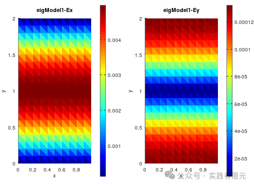

B.谐振频率=1.4979e+08Hz    

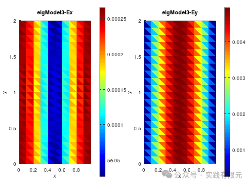

C.谐振频率=1.6769e+08Hz

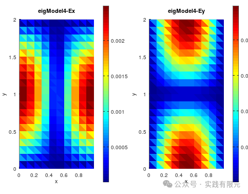

C.谐振频率=2.1241e+08Hz    

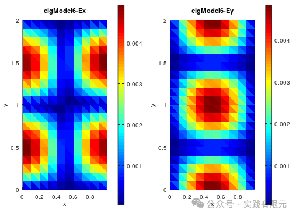

理论上存在无数个传播模式，但是一般研究电磁问题均在最简单的几个模式，以便于分析问题。

**总结**

1.本文成功实现腔体特征值问题的二维一阶有限元求解，其中使用了矢量基函数与节点基函数的混合有限元。

2.在1阶矢量有限元中，使用高斯积分的方法避免直接求解系数矩阵，为之后矢量有限元的高阶求解做好铺垫。