# 科学 · 新书 | 傅里叶级数的历史

原创 science press 有限元语言与编程 2025-02-16 12:00 山东

> 原文地址: [https://mp.weixin.qq.com/s/6e-9nPeDnO7mjysfUm2fag](https://mp.weixin.qq.com/s/6e-9nPeDnO7mjysfUm2fag)

  

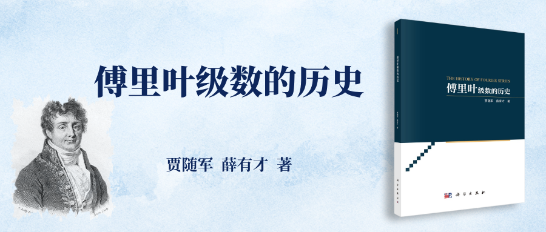

与傅里叶级数结缘于 2006 年攻读博士学位期间。在近现代数学史的讨论班上，我主讲了 18～19 世纪偏微分方程的历史，偏微分方程的历史是一个宏大的主题，我根本没有能力掌控，西安市长安区的翠华山脚下、香积寺以及潏河旁浓郁的柳荫里都留下了我忧郁的身影。然而这些主题中的“傅里叶级数”部分激起了我内心的涟漪。这一主题很有趣，有许多宝藏有待挖掘。 

  

傅里叶级数与音乐、天文学、物理学有着天然的联系，当我们一步步抽丝剥茧揭开其神秘面纱的时候，我们不得不惊叹于其丰富的内涵及宽广的应用。

  

古希腊时期，毕达哥拉斯(Pythagoras，约公元前 580—约前 500)就已经用数表示音高，音乐从某种意义上成为数学的组成部分。他阐述了天体音乐的观念，在他看来，天体的运行会在天界造成振动，而振动是声音产生的根源，因此，天体的运行会发出和谐美妙的声音，天体的运行也遵循一定的数量关系。

  

那么天体是如何运行的呢？在柏拉图(Plato，公元前 427—前 347)的观念中，上帝乃几何学家，天体的运行理应通过几何图形去描述。斗转星移、昼夜交替、四季轮回，天体的运行呈现出周期性，用什么几何图形描述这种周期性呢？在古希腊人的信念中，科学与艺术恰如一枚硬币的两面，它们是一个统一体。简单、和谐及神圣的比例关系是古希腊艺术与科学所共同遵循的基本原则。

  

古希腊人认为“圆是最完美的图形，所有天体运行的轨道都应当是圆”。他们用圆去描述天体的运动，这既有科学性即周期性方面的考虑，又有艺术层面的斟酌。古希腊人的艺术蕴含了理性的成分，而他们的科学又得到了艺术的滋养。

  

我们如何去描述圆周上一个质点的运动呢？当然是正弦函数。但古希腊的天文学家很快发现行星的运行轨迹并不是标准的圆，有时会有逆行的现象，同时还有明暗的变化。为了解释逆行与明暗的变化，天文学家托勒密(Claudius Ptolemaeus，约 100—约 170)用多个圆的叠加来描述天体的运行。因此，天体运行的轨迹就是正弦的组合。尽管托勒密把地球置于宇宙中心，但这种本质上是正弦组合的方式(托勒密并没有提出正弦的组合)在预测天文现象方面却十分有效。

  

让我们再次回到音乐领域，乐器分为弦乐器、管乐器与打击乐器，弦乐器如钢琴、古琴、吉他、小提琴等的发音来源于弦的振动，管乐器的情况是类似的，如小号、笛子、萨克斯等其乐音来源于空气柱的振动。在古希腊时期，人们已经发现一根琴弦发出的乐音并不是一个单一的音调，如果仔细辨听，会听到在一个主要的低频音调中隐藏着一系列高频音调。该如何解释这一诡异的现象呢？到底弦是如何振动的？泰勒(Taylor, 1685—1731)虽然是杰出的数学家，但对音乐弦的振动充满了好奇，他建立了弦振动的偏微分方程，方程的求解令他惊讶地发现，弦按正弦的模式进行振动。虽然我们感觉神奇，但这也是预料之中的，我们不是常常用正弦函数来描述简单的振动吗？但我们的问题并没有解决，我们听到的那根弦音有众多的音调，那意味着这根弦是以多个频率来振动的。我们简直无法想象，这根弦在振动时该有多凌乱，如果我们设想这根弦在琴板上跳舞，它跳的一定不是优美的华尔兹，而是如触电般的乱舞。那根弦婀娜多姿的身段在低频舞动，产生了响度最强的那个音即基音，那根弦的手臂、胳膊等部位还在如触电般高频舞动，从而产生了众多很弱的泛音，不管是基音还是泛音，都可以用正弦去表示它们，因此，琴弦发出的声音本质上是基音与泛音的叠加，可以用正弦的组合来描述它。大自然就像舞台上的魔术师，我们看到的、听到的只是假象，而庐山真面目总是隐藏在幕布后或黑箱中。我们总觉得我们看到的是一种颜色的光，但事实上它也是七色光的组合。乐音和光的情况实在是太相似了。音乐弦的振动与天体的运行具有相同的数学本质。天体的运行就相当于音乐弦的振动，两千多年后的今天，我仍然折服于毕达哥拉斯丰富的想象力及深邃的洞察力。那么我们今天为什么听不到宇宙琴弦发出的美妙乐曲呢？毕达哥拉斯说，“人在出生时是能够听到这种音乐鸣响的，由于它响个不停，没有响与不响的交替，故而人们后来便感觉不到它的存在了。”或许，我们的听觉已被尘世的喧嚣所损害，我们的心灵已被欲望所填满，宇宙琴弦的美妙乐曲已无法触动我们的心灵与听觉神经，然而，感觉不到并不意味着不存在。傅里叶(Fourier, 1768—1830)在闲暇时间开始了热传导的研究，他首先解决了半无穷矩形薄片的热传导问题，他认为热的传播就像音乐弦的振动一样，就像基音与众多泛音的奏鸣一样，有人这样评价他的热传导研究，“半无穷矩形薄片就是一个虚构的振动弦”。在热传导问题的解决中，傅里叶的大脑中浮现出了“振动弦”的图景，20 世纪提出的超弦理论为我们勾勒了一幅更为广阔的振动弦的图景。超弦理论企图回答宇宙的本原问题，整个宇宙由一些诸如电子、中微子、夸克等的基本粒子构成，当然，随着科学的进步、技术的日新月异，可能会有更小的粒子发现。然而，超弦理论认为，宇宙的最小组成单位是振动的弦，振动弦的不同振动方式产生了基本粒子，类似于前面提到的基音与泛音源于不同频率的振动，因此，万物在最微观的层次上是由振动弦的组合构成的。我们知道傅里叶变换能够实现从时域分析向频域分析的转换，能够把振动的波形图转化为频谱图，有了频谱图，我们很容易把握乐声的主要特征，这个频谱图就 是魔术师的幕后或黑箱。如果我们能够建立一种“最最广义的傅里叶变换”，就 可以把宇宙中所有从小到微观粒子大到星球振动的波形图转换为频谱图，通过这 个频谱图，我们了解所有粒子的质量及力荷(如引力等)。果真这样，自然和自然 法则真的从幕后走向了前台。

  

本书旨在梳理傅里叶级数起源与发展的历史脉络，揭示傅里叶级数与音乐、振动理论及热传导之间的关联，分析傅里叶级数创建的关键要素以及傅里叶级数对纯粹数学、理论物理甚至音乐领域产生的影响。由于傅里叶级数理论影响了 19世纪甚至 20 世纪数学的进程，以致调和分析成为 20 世纪 30 年代数学发展的主流方向，陈建功(1893—1971)关于傅里叶级数的研究成果标志着中国现代数学的兴起。因此，对想了解现代数学的读者来讲，傅里叶级数的历史及在中国的传播也是透视现代数学的一个重要窗口。  

  

本书由九个部分构成：  

  

第一部分(序、前言)，以通俗简洁的语言描述傅里叶级数与音乐、天文学及热传导的关系。

  

第二部分(第 1 章)，概括介绍傅里叶级数的历史，探讨了傅里叶级数历史的已有研究。

  

第三部分(第 2 章)，描述基音与泛音的共存现象，探究简单模式叠加观念的起源。 

  

第四部分(第3 章)，详细考察梅森(Mersenne, 1588—1648)、泰勒、约翰 · 伯努利(Johann Bernoulli, 1667—1748)等人确定基本模式的绝对频率以及形状的过程；分析这些数学家对简单模式叠加观念的贡献。

  

第五部分(第 4 章)，分析达朗贝尔(D’Alembert, 1717—1783)、欧拉(Euler, 1707—1783)、拉格朗日(Lagrange, 1735—1813)、丹尼尔 · 伯努利(Daniel Bernoulli, 1700—1782)从不同角度确定弦的振动形状(包括较高模式形状)的过程；探讨这些数学家对简单模式叠加观念的地位问题的认识。 

  

第六部分(第 5 章)，从傅里叶从事热传导研究的原因分析、傅里叶从事热传导研究的整体思路、傅里叶对离散物体热传导的研究、毕奥(Biot, 1774—1862)对傅里叶的启发等方面阐述了傅里叶分析建立的背景。

  

第七部分(第 6 章)，回顾傅里叶分析建立的过程，分析傅里叶分析成功建立的原因。 

  

第八部分(第 7 章)，傅里叶级数理论的影响。探讨了傅里叶级数理论对音乐产生的影响、对理论物理和应用数学产生的影响、对纯粹数学产生的影响。

  

第九部分(第 8 章)，探讨了傅里叶级数在中国的研究状况、中国学者的贡献以及中国的傅里叶级数教育。

  

**基本信息**

主编：贾随军  薛有才

ISBN：9787030783448    

定价：59.00元

出版时间：2024年11月

  

**内容简介**

傅里叶级数理论的产生是数学发展史上的重大事件。它的产生彻底平息了关于弦振动问题的争论，同时引领数学分析走向严格化。傅里叶级数理论经历近两百年的发展，已经成为现代数学的核心研究领域之一。本书主要运用历史研究法、比较法、文献法等方法对傅里叶级数理论的起源进行了考察，从音乐、物理学、数学以及科学发展的趋势等众多层面探讨了傅里叶级数理论的起源，探讨了傅里叶能够成功建立其级数理论的原因，从理论物理（包括应用数学）及纯粹数学两个方面考察了傅里叶级数理论产生的影响。

  

**本书目录**

向下滑动查看

  

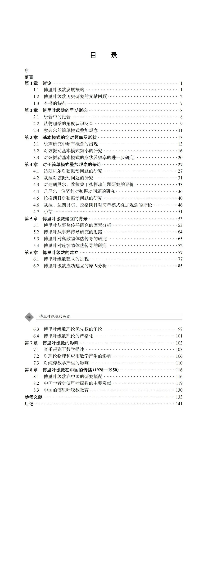

  

**精彩样章**

  

  

  

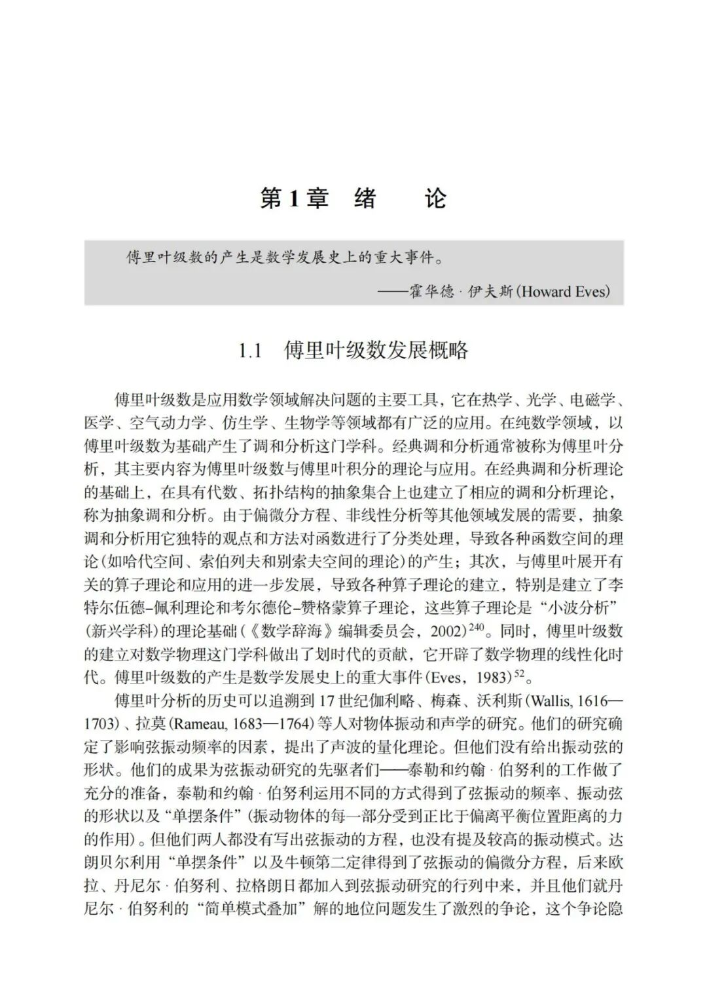

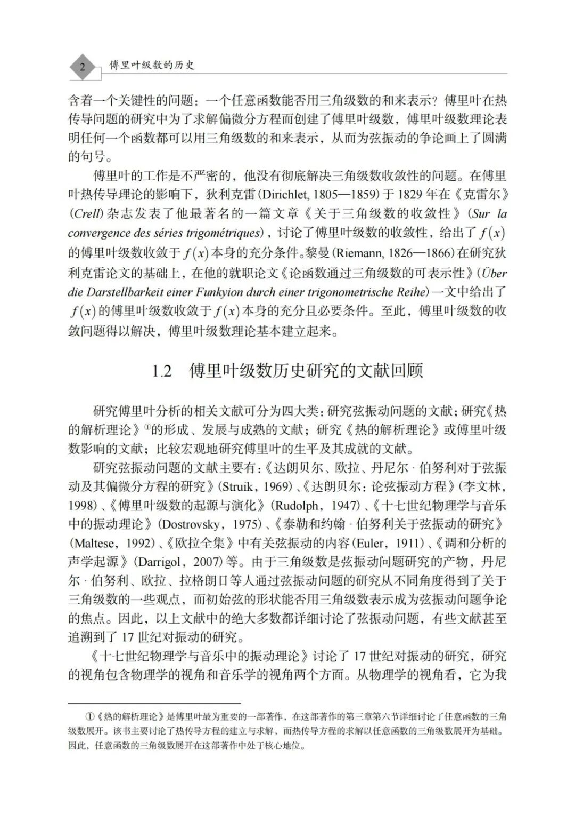

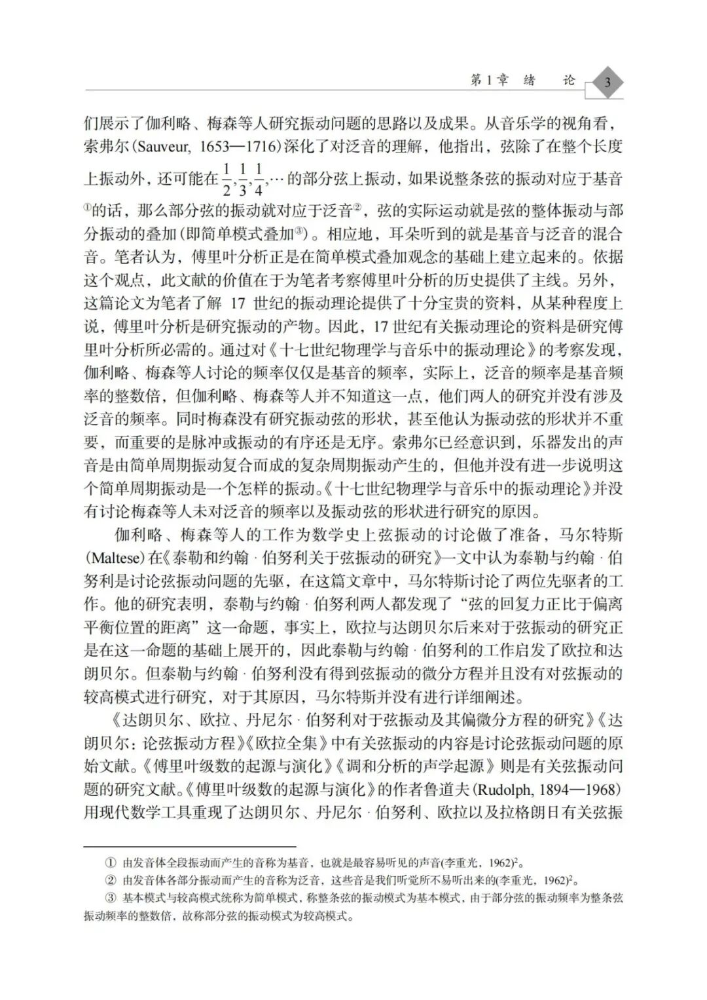

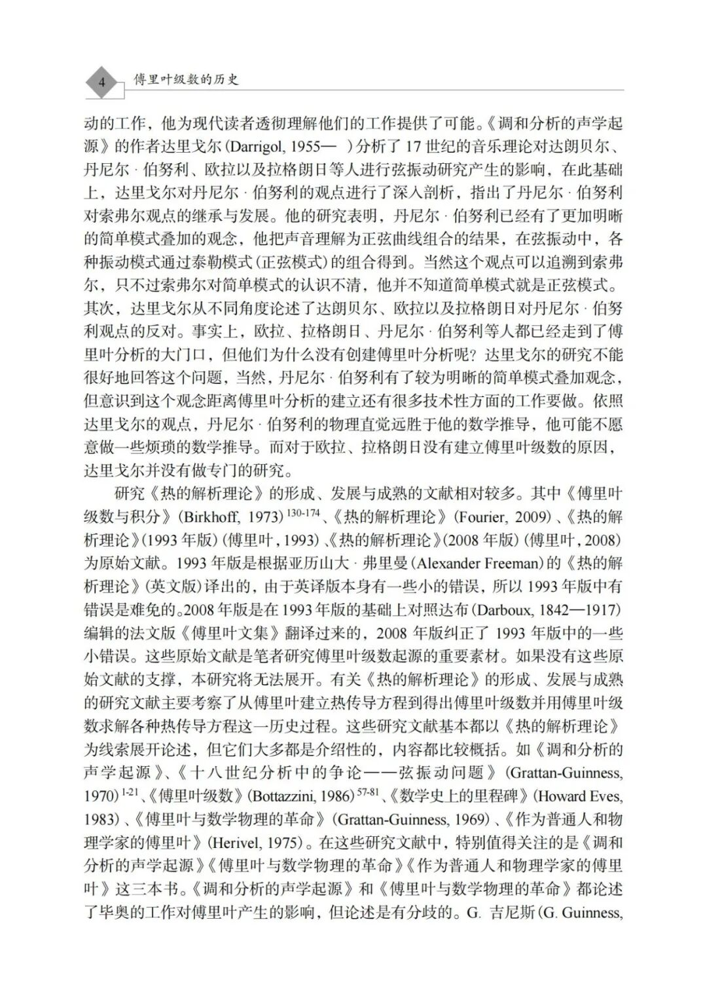

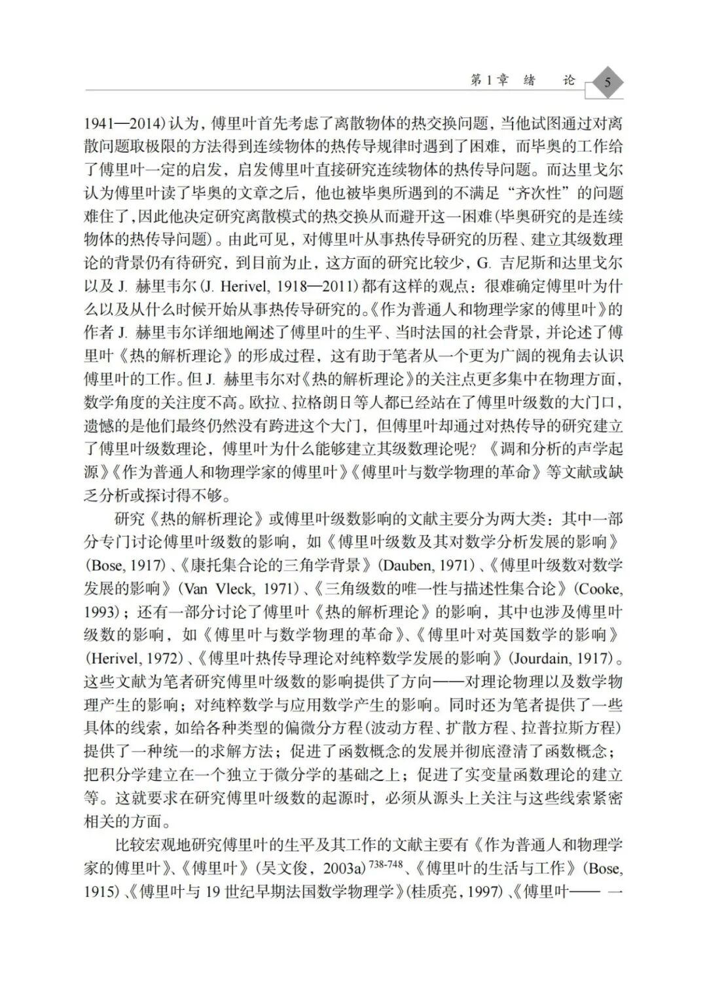

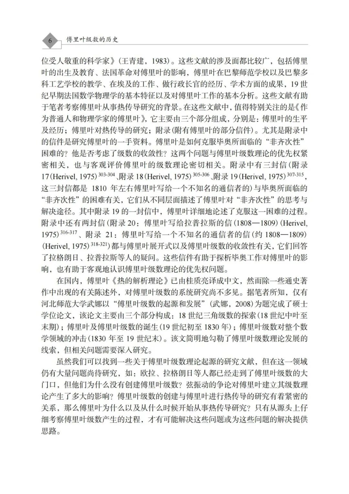

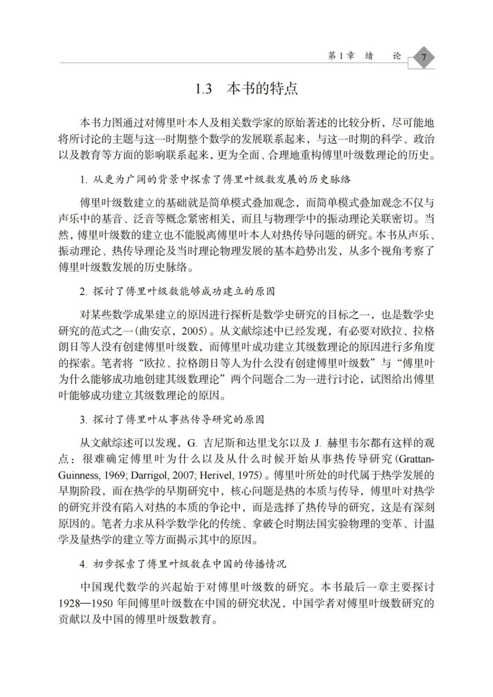

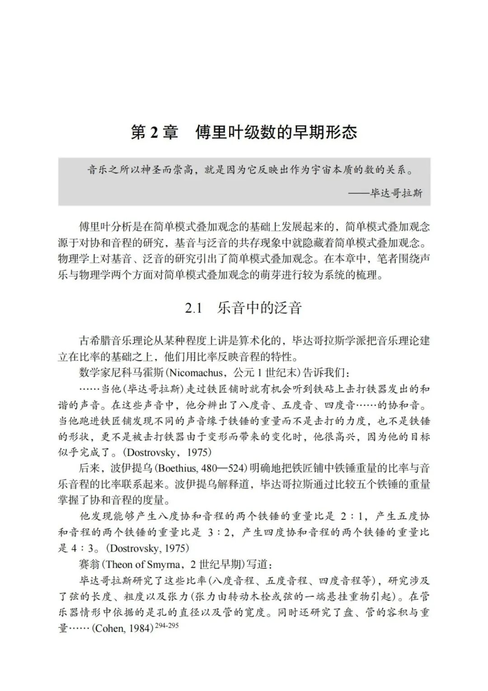

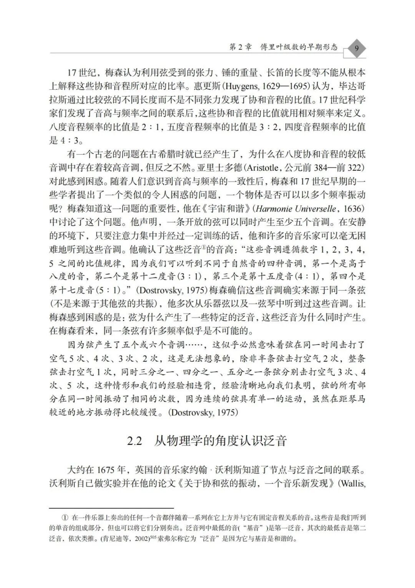

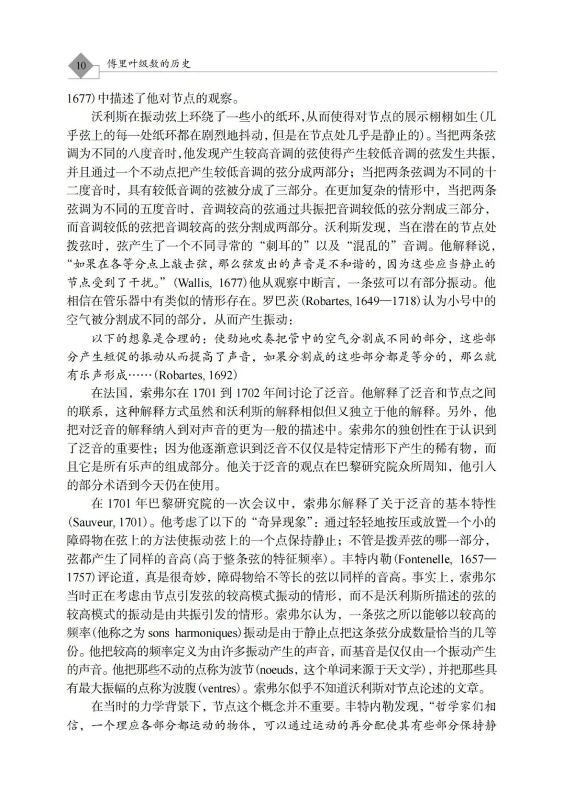

向右滑动，查看更多

**样书申请**

  

  

识别二维码

免费申请样书

  

  

  

  

  

更多教学服务  

关注微信公众号“**科学EDU**”

  

# 

近期文章：

1、[开启轻松备课之旅——免费教材样书与课件申请攻略](http://mp.weixin.qq.com/s?__biz=MzIzOTM0MDI2NA==&mid=2247697785&idx=1&sn=d9fa903d729cf5a31d97ee82c6bec164&chksm=e9261afede5193e8770bd04488ead9c66371f4f5e02d0ee66863170007b9e554486cc26001d5&scene=21#wechat_redirect)  
2、[“科学+”服务平台常见问题操作指南](https://mp.weixin.qq.com/s?__biz=MzIzOTM0MDI2NA==&mid=2247708922&idx=2&sn=d9591209bdf0c76c7224430ca2928c94&scene=21#wechat_redirect)

3、[数字教材《农作学（第三版）》正式出版 | 建设发展新农科，解读现代农作制度](https://mp.weixin.qq.com/s?__biz=MzIzOTM0MDI2NA==&mid=2247708922&idx=1&sn=338a7ee9fa024dd151efe6a11f3176ce&scene=21#wechat_redirect)

4、[科学 · 新书∣《智能医学》：推动医工深度融合，为医学创新带来无限可能](https://mp.weixin.qq.com/s?__biz=MzIzOTM0MDI2NA==&mid=2247708903&idx=1&sn=34a5a82716db8c240d354fecd1ce1dbb&scene=21#wechat_redirect)

传播科学，欢迎您点亮**★**星标，点赞、在看▼