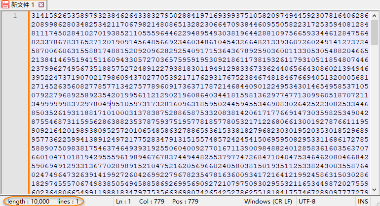

# 秒算万位圆周率！8行神奇的C语言代码

> 原文地址: [https://mp.weixin.qq.com/s/cxYJS5gH0ggiSABUX4YAjA](https://mp.weixin.qq.com/s/cxYJS5gH0ggiSABUX4YAjA)

  

## 

  

  

点击上方 蓝字 关注我们

## 

## 引言

数学之美，在于其简洁与深刻。在计算机科学领域，这种美更是得到了淋漓尽致的体现。今天，我们将探讨一个令人惊叹的现象——仅用 8 行 C 语言代码，就能秒算出万位的圆周率 π。这段代码不仅展现了编程的艺术，更体现了数学的奇妙。本文将深入剖析这段代码的工作原理，并引导读者理解如何利用整数运算实现高精度 π 值的计算。

## 代码展示

首先，让我们一睹这段神奇的代码真容：

`#include<stdio.h>   long a=10000,b=0,c=35000,d,e=0,f[35001],g;   int main(){     for(;b-c;)       f[b++]=a/5;     for(;d=0,g=c*2;c-=14,printf("%.4d",e+d/a),e=d%a)       for(b=c;d+=f[b]*a,f[b]=d%--g,d/=g--,--b;d*=b);   }`

为了验证这段代码的有效性，我们可以在本地编译并运行它。以下是对应的命令行代码：

`gcc -o pi pi.c   ./pi`

不到 1 秒钟即可计算完成。为了方便阅读，我们将输出结果复制并粘贴到纯文本文件中，如下图所示：

可以看到，运行结果恰好输出了 π 的前一万位，验证了代码的正确性和高效性。

这段代码虽然简短，但其背后隐藏着复杂的数学原理和高效的算法设计。接下来，我们将逐步揭开它的神秘面纱。

## 数学原理

### 计算π的公式

众所周知，π 是一个无理数，其值约为 `3.14159...`，但在实际应用中，我们往往需要更高精度的 π 值。为此，数学家们发展了多种计算 π 的方法，其中一种常用的方法是级数展开。本段代码采用了一种特殊的级数公式，即普法夫公式的一种变形：

这个公式收敛速度较快，适合用于高精度 π 值的计算。

### 公式的变形

为了便于编程实现，上述公式可以进一步变形为：

通过这种方式，我们可以从后向前逐项计算，从而避免了大数运算带来的复杂性。

## 算法解析

### 初始化

代码首先定义了一些变量，其中 `a` 的值为 `10000`，这是为了在后续计算中放大数值，确保精度。数组 `f` 用于存储中间结果，初始值通过 `f[b++] = a/5` 设置。

### 外层循环

外层循环 `for(;d=0,g=c*2;c-=14,printf("%.4d",e+d/a),e=d%a)` 控制计算的总次数。每次循环，变量 `c` 减少 `14`，这意味着每 `14` 次内层循环输出 `4` 位 π 值。该数值是基于级数的收敛速度得到的，即每 `14` 项可以增加 `4` 位有效数字。这也是 `c` 的初始值取为 `35000` 的原因，此时恰好可以计算出 π 的前一万位有效数字。

### 内层循环

内层循环 `for(b=c;d+=f[b]*a,f[b]=d%--g,d/=g--,--b;d*=b)` 实现了具体的计算过程。在这个循环中，变量 `d` 不断累加中间结果，并通过取模和除法操作更新数组 `f` 中的值。这个过程中，`d` 的值不断放大和缩小，最终得到所需的高精度 π 值。

### 整数运算的巧妙之处

在这段代码中，**所有运算均使用整数完成**，避免了浮点数运算带来的精度损失。具体来说，通过将分子放大 `10000` 倍，程序能够在整数范围内进行除法运算，并通过取模和除法操作逐步积累 π 的每一位。这种方式有效地避免了浮点数的舍入误差，保证了计算结果的准确性。

## 结语

通过本文的介绍，我们不仅了解了这段 8 行代码背后的数学原理和算法设计，还学会了如何利用整数运算实现高精度 π 值的计算。这段代码不仅是编程艺术的典范，更是数学之美的体现。希望读者能够从中获得启发，探索更多有趣的数学和编程问题。

  

