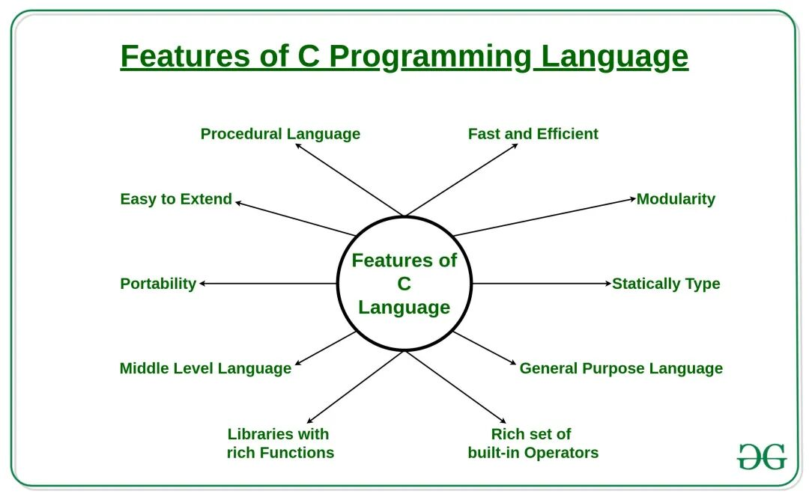
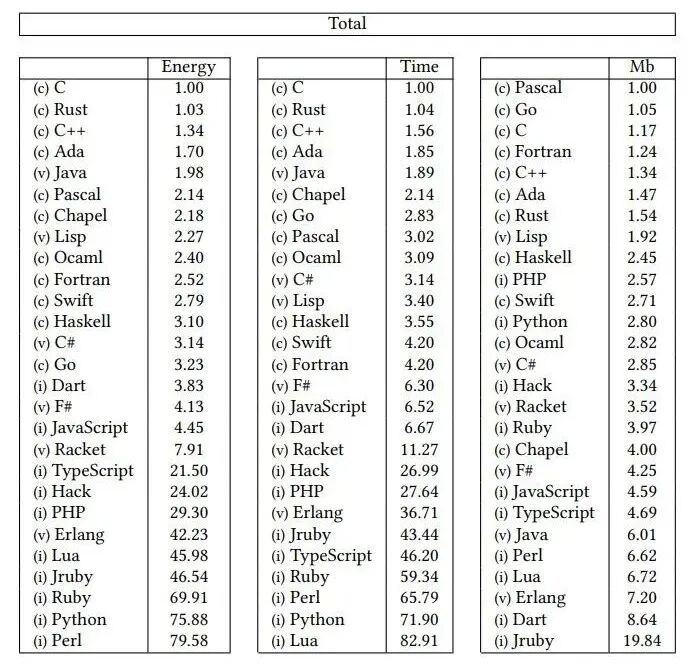
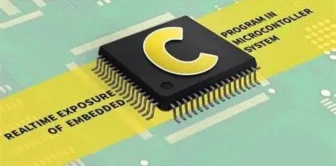
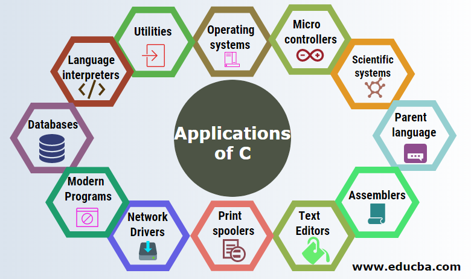

# 穿越时空的经典：C语言为什么能长盛不衰？

> 原文地址: [https://mp.weixin.qq.com/s/0dZizbTqY8gwgOxqxQlZag](https://mp.weixin.qq.com/s/0dZizbTqY8gwgOxqxQlZag)

  

在编程语言的浩瀚宇宙中，有的语言如同流星一般，在短暂的辉煌后消失于天际；而另一些则像恒星一样，持续地为技术进步照亮前路。在这片璀璨星空里，C语言无疑是最耀眼的一颗恒星。自1972年由Dennis Ritchie发明以来，它不仅成为了计算机科学的基础，还在无数应用场景中发挥着不可替代的作用。本文将深入探讨C语言为何能在数十年的变迁中依旧保持着旺盛的生命力。

## 高效性：速度与效率的象征

C语言之所以能够成为众多开发者心目中的首选，首要原因在于其高效的特性。C语言编写的程序经过编译后执行速度快、资源占用少。这种高效性能让C语言非常适合那些对性能要求极高的应用场合，比如操作系统的核心组件、设备驱动程序等。就像驾驶手动挡汽车，虽然需要更高的技巧，但直接控制带来的高效率是其他自动档无法比拟的。在这个数据密集型和性能敏感的时代，C语言的这一特点显得尤为重要。

无论是处理海量的数据流还是实时响应用户操作，C语言都能以其出色的性能满足需求。对于追求极致性能的应用来说，选择C语言意味着选择了速度与效率的最佳结合点。正因为如此，许多高性能服务器软件、数据库管理系统以及图形渲染引擎都基于C语言开发。

## 底层控制能力：硬件级别的精细操控

在某些特定领域，如操作系统开发、设备驱动编写或嵌入式系统设计，程序员需要对硬件进行精确到比特级的控制。C语言在这方面提供了强大的支持，允许直接操作指针和其他低级内存管理功能。通过使用C语言，开发者可以像乐队指挥般精准地调控每一个“乐器”，确保整个系统的流畅运行。这种底层控制能力是许多现代高级语言所缺乏的特质之一。

例如，在开发嵌入式系统时，为了最大限度地优化资源利用并保证系统的稳定性和可靠性，开发者必须能够自由访问硬件寄存器，并灵活配置中断服务例程。只有具备强大底层控制能力的语言才能胜任这样的任务，而这正是C语言的优势所在。此外，在物联网(IoT)设备的研发过程中，C语言同样扮演着关键角色，因为它能让开发者充分利用有限的计算资源，实现高效能的解决方案。

## 广泛应用基础：无处不在的技术基石

从Linux到Unix，再到Windows的部分核心组件，许多现代流行的操作系统都是用C语言构建而成的。这不仅仅是因为C语言具有卓越的性能表现，还因为它提供了一种标准化的方式来描述复杂系统的行为逻辑。除了操作系统之外，各种重要的库函数（如标准C库）也大多采用C语言编写。因此，学习和掌握C语言对于理解系统运作机制以及维护现有项目至关重要。

无论是在互联网基础设施建设方面，还是在移动应用程序开发乃至大型服务器集群部署中，我们都可以看到C语言的身影。以网络协议栈为例，TCP/IP协议族就是基于C语言实现的。正是由于有了这样坚实的技术基础，才使得全球范围内的信息交流变得可能。同时，随着云计算技术的发展，越来越多的企业开始依赖于基于C语言构建的服务平台来支撑其业务运营。

## 可移植性与兼容性：跨越平台的桥梁

C语言的一个显著特点是它的可移植性——即一段用C语言编写的代码可以在不同的硬件架构和操作系统上轻松移植。这种特性得益于C语言简洁的设计理念和广泛的编译器支持。无论是老旧的嵌入式设备还是最新的超级计算机，只要存在合适的编译工具链，C语言就能保证代码的一致性和有效性。

对于跨平台开发而言，C语言提供了一个理想的解决方案。开发人员只需编写一次源代码，然后针对不同目标环境进行适当的调整即可生成适用于多个平台的版本。这对于降低开发成本、提高工作效率具有重要意义。特别是在当前多核处理器普及、异构计算兴起的大背景下，C语言凭借其良好的可移植性和兼容性，继续巩固着自己在高性能计算领域的地位。

## 庞大的生态系统：丰富的资源与工具链

经过几十年的发展，围绕C语言已经形成了一个庞大且活跃的开源及商业软件生态系统。无论是操作系统内核、图形处理库，还是网络协议栈、数据库管理系统等领域，都有大量的成熟代码库和工具链可供开发者复用。这些资源极大地丰富了C语言的应用场景，同时也为开发者节省了大量的时间和精力。

例如，在嵌入式系统开发中，FreeRTOS是一个广泛使用的实时操作系统内核，它完全由C语言编写而成，并且已经被移植到了多种微控制器平台上。再比如，著名的图像处理库OpenCV也是基于C/C++开发的，它为计算机视觉研究者和工程师们提供了强大的算法支持。借助于这样一个成熟的生态系统，开发者可以快速搭建起自己的项目框架，并专注于解决具体问题而非重复造轮子。

## 教育与入门门槛：培养未来的技术精英

C语言因其简洁明了的语法结构，常常被选作学习计算机科学和编程的入门语言。通过学习C语言，学生们不仅可以掌握基本的编程概念，还能建立起扎实的理论基础。更重要的是，C语言教会了人们如何思考问题、解决问题，这对培养未来的科技人才至关重要。许多顶尖的计算机科学家和工程师都是从C语言起步，逐渐成长为各自领域的专家。

C语言的教学价值不仅体现在其作为初学者的第一门编程语言上，更在于它为后续深入学习其他高级语言打下了坚实的根基。掌握了C语言之后，学生可以更容易地过渡到C++、Java等面向对象编程语言的学习当中。此外，由于C语言与底层硬件紧密相关，因此它也为想要深入了解计算机体系结构的学生提供了宝贵的实践经验。

## 在新兴领域的应用：与时俱进的技术革新

尽管C语言诞生于上世纪七十年代，但它并没有因为时间的流逝而失去活力。相反，随着技术的进步，C语言的应用领域正在不断拓展。尤其是在嵌入式系统、实时系统、物联网(IoT)、人工智能(AI)以及自动驾驶技术等领域，C语言依然占据着重要位置。这些领域普遍对性能和精确控制有着极高要求，而C语言恰恰能满足这些需求。

以智能家电为例，智能家居产品的智能化程度越来越高，但与此同时对功耗和响应速度的要求也越来越严格。在这种情况下，C语言凭借其高效能的特点成为了理想的选择。同样的道理也适用于医疗设备和无人驾驶汽车等行业，它们都需要依赖高度可靠的控制系统来确保安全性和稳定性。而在AI领域，尽管Python等脚本语言近年来大受欢迎，但在涉及到深度神经网络模型训练和推理加速时，C语言仍然是不可或缺的利器。

## 结语：永恒的经典

综上所述，C语言不仅拥有深厚的根基，而且在新的技术潮流中依然保持着强大的竞争力。它之所以能够在编程语言的世界中屹立不倒，是因为它结合了高效的性能、底层控制能力、广泛应用基础、可移植性与兼容性、丰富的生态系统以及易于学习的特点。随着技术的不断进步和发展，C语言将继续作为一门重要的编程语言，在未来的技术发展中扮演不可或缺的角色。无论你是刚刚踏入编程世界的新手，还是经验丰富的资深开发者，C语言都值得你深入探索和学习。

  

## 推荐阅读

  

  

  

