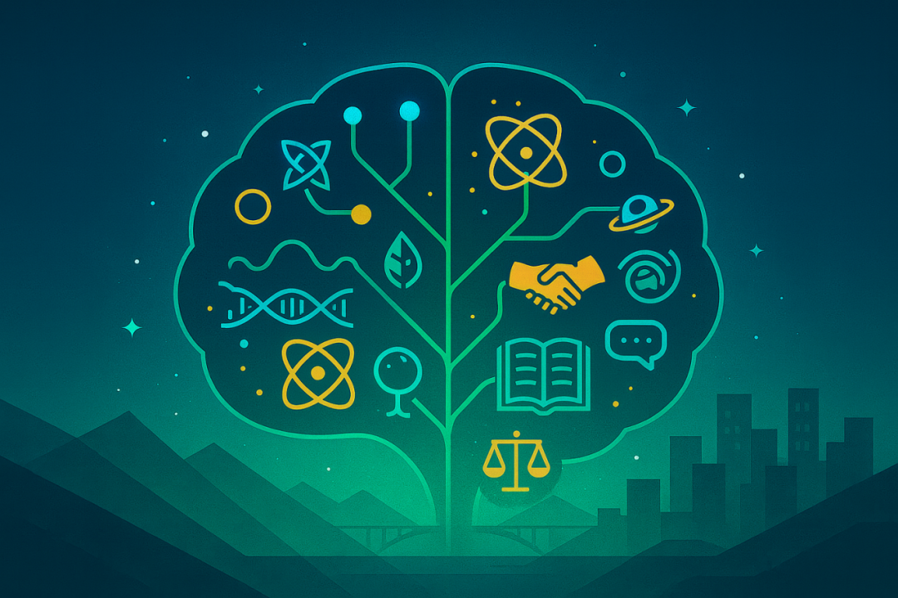
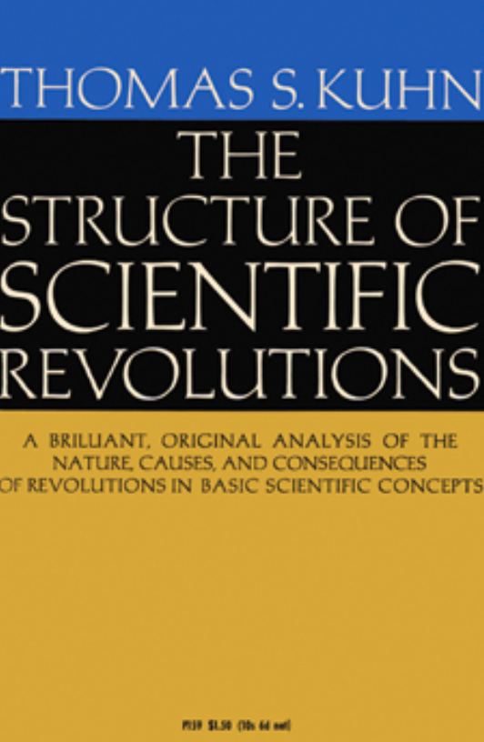
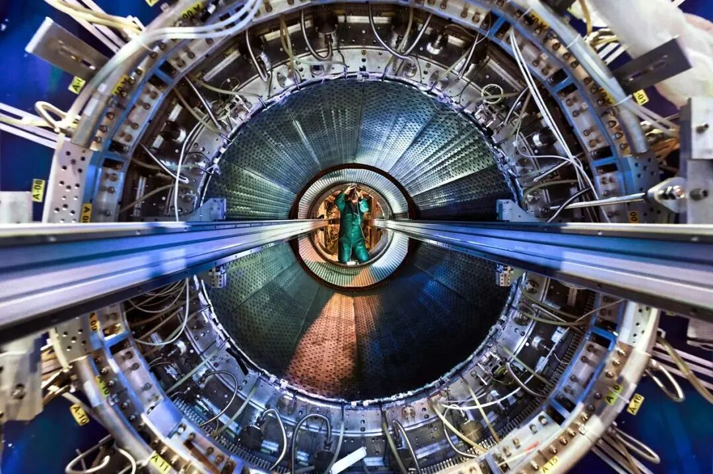
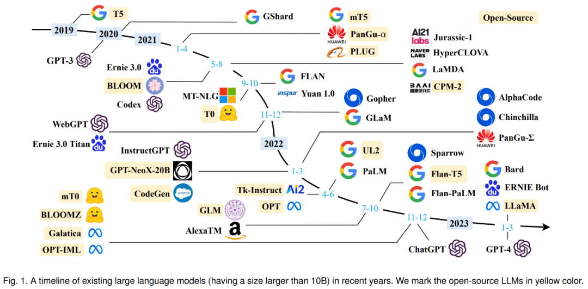
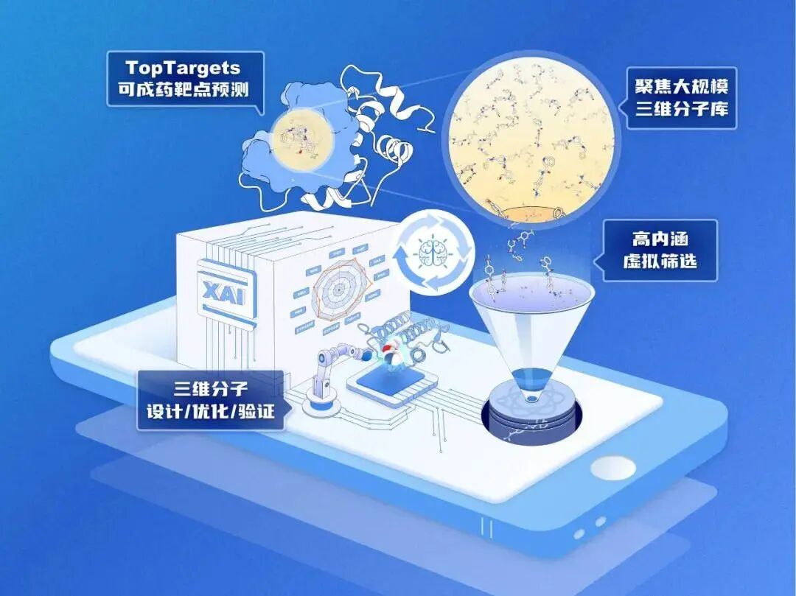
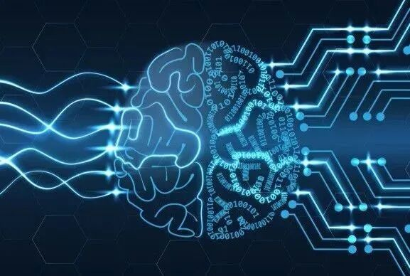

# 第五范式：人工智能如何重塑科学的疆界与未来

> 原文地址: [https://mp.weixin.qq.com/s/Dp3p\_I11w4rBKzcQez6vgw](https://mp.weixin.qq.com/s/Dp3p_I11w4rBKzcQez6vgw)

  

**点击蓝字 关注我们**

  

  

  

  

  

  

  

**导读**

**科学的“中年危机”与智能的破晓**

  

在人类知识的宏伟殿堂中，科学曾以其无与伦比的力量，引领我们走出蒙昧，洞察宇宙的秩序。然而，步入21世纪，这盏明灯似乎遭遇了某种“中年危机”。一方面，低垂的果实已被采摘殆尽，遗留下的重大问题，如宇宙暗物质的本质、意识的起源、气候变化的复杂动力学，其艰深与盘根错节的程度，远超以往任何时代。另一方面，高通量测序、大型对撞机、太空望远镜等尖端设备，以前所未有的速度制造着数据洪流，人类认知带宽的有限性与数据爆炸的无限性之间形成了难以逾越的鸿沟。科学的进步曲线，似乎正从指数增长的黄金年代，步入一个回报递减的平台期。

正当此时，一股颠覆性的力量正在悄然崛起，为这场深刻的危机带来了破局的曙光。这股力量，便是**以深度学习和大型模型为代表的现代人工智能（AI）**。它不再仅仅是科幻叙事中的遥远想象，而是作为一种强大的方法论和认知工具，开始深度介入科学探索的全过程。学术界与产业界不约而同地聚焦于一个新兴领域：**AI for Science（简称AI4S），即人工智能驱动的科学研究**。

本文旨在系统性地论证，AI4S的出现并非一次简单的技术迭代或效率提升，而是一场触及科学活动根基的深刻变革。它正在催生一种全新的知识发现与确证的框架，一种被誉为继经验科学、理论科学、计算科学和数据科学之后的“第五范式”——**智能科学**。这场变革的意义，堪比伽利略将望远镜对准星空，它赋予科学家的不再是延伸感官的“天眼”，而是一个能够处理超乎想象复杂度的“外脑”。我们将首先追溯科学研究范式的历史演进，以理解当前变革的历史必然性；随后，深入剖析AI4S的核心机制与技术支柱，揭示其如何重构科研的全链条；接着，我们将通过具体的跨学科案例，展示其惊人的赋能力量；最后，我们将探讨这场革命所引发的深刻的哲学与伦理挑战，并展望在人机协同的新纪元中，科学与科学家的未来形态。

  

  

  

  

本文字数：**5699字**

阅读时间：**8分钟**

**Part.1**

**科学方法的谱系演进：**

**通往第五范式的漫漫长路**

要理解第五范式的革命性，必须将其置于科学史的宏大坐标系中进行审视。科学哲学家托马斯·库恩在其里程碑式的著作**《科学革命的结构》**中提出，“范式”是特定时期科学共同体所共享的基本信念、理论、方法和价值观的集合。科学的进步并非线性知识的累积，而是通过“范式转换”的革命性跃迁实现的。回溯历史，我们可以清晰地辨识出通往智能科学的四级台阶。 

  

《科学革命的结构》封面

  

  

  

**第一范式：经验科学的黎明**

**（公元前至16世纪）**

这是科学最古老的形态，以观察、记录和归纳为核心特征。从亚里士多德对动植物的细致分类，到第谷·布拉赫数十年如一日地记录行星轨迹，这一时期的知识生产高度依赖**人类的直接感官和朴素的归纳推理**。科学家是自然的忠实描摹者。然而，其局限性也显而易见：观察范围受限于肉眼，难以穿透表象触及事物的内在因果机制，且易受主观偏见的影响。

  

  

**第二范式：理论科学的丰碑**

**（16至19世纪）**

随着文艺复兴和启蒙运动的到来，科学迎来了第一次伟大的革命。牛顿的万有引力定律、麦克斯韦的电磁场方程组，标志着理论科学范式的确立。科学家不再满足于“是什么”，而是开始追问“为什么”。他们运用数学这一抽象语言，构建**普适性的理论模型**来解释并预测经验现象。演绎法和假设-检验成为核心方法论，科学从描述的艺术，升华为**解释与预测**的精确学科。这一范式奠定了现代科学的基石，其辉煌成就至今仍在闪耀。

  

  

**第三范式：计算科学的崛起**

**（20世纪中叶）**

第二次世界大战后，**电子计算机的诞生**为科学研究提供了前所未有的工具。对于那些理论上存在，但解析上无法求解的复杂系统——例如天气系统中的流体力学方程、核爆炸的物理过程——科学家们可以通过数值模拟的方式进行近似求解。**计算科学**使得在“虚拟实验室”中进行实验成为可能，极大地扩展了理论科学的应用边界。这是人类首次大规模地借助非人智能，来延伸自身的计算与分析能力。

  

  

**第四范式：数据密集型科学的浪潮**

**（21世纪初）**

进入新千年，大型强子对撞机（LHC）、人类基因组计划、以及覆盖全球的传感器网络，将科学带入了一个**“大数据”**时代。 科学研究的主要瓶颈，从过去的理论贫乏或计算能力不足，转变为如何从海量的、多源异构的数据中挖掘出有价值的知识。 由图灵奖得主吉姆·格雷（Jim Gray）提出的**“第四范式”或“数据密集型科学”（Data-Intensive Science）**，其核心在于利用先进的算法和数据挖掘技术，在数据中自动发现模式、关联和异常。**机器学习**在此阶段开始崭露头角，成为处理和分析科学数据的重要工具。

  

大型强子对撞机/图源：中国核技术网

  

然而，第四范式亦有其内在的张力。它极其擅长发现“相关性”，但对于揭示现象背后的“因果性”则常常力不从心。**在数据的海洋中，研究者容易迷失于虚假的关联，而难以提炼出真正具有解释力的、可供检验的科学假说。**科学似乎需要一种新的能力，不仅能“看懂”数据，更能“理解”数据，甚至基于数据进行创造性的“思考”。这为第五范式的登场，铺设了最完美的舞台。

**Part.2**

**解构AI for Science：**

**一场科研全流程的智能化革命**

AI for Science的本质，是人工智能技术与科学研究内在逻辑的深度融合，它并非仅仅作为辅助工具出现，而是作为一种核心方法论，渗透到科研活动的每一个环节。如果说前四个范式分别解决了“看”（经验）、“想”（理论）、“算”（计算）、“筛”（数据）的问题，那么第五范式正在赋予科学一种全新的能力——“悟”，即**从复杂性中涌现出洞见的智能**。

  

  

**1\. AI角色的演进：**

**从加速器到协作者，再到引领者**

AI在科研中的角色，经历了一个从量变到质变的动态演化过程：

  

**AI作为“超级加速器”**

这是AI4S最直观的应用。在药物研发中，AI模型能以惊人的速度筛选数亿级别的分子化合物，预测其活性与毒性，将传统需要数年的筛选周期缩短至数周。在材料科学领域，AI可以快速模拟材料在不同条件下的性能，加速新材料的发现进程。 在计算流体力学、量子化学等领域，AI驱动的“代理模型”（Surrogate Models）能够以比传统数值求解器快数个数量级的速度，高精度地模拟复杂物理过程，**这本质上是对第三范式的极致增强**。 

  

**AI作为“假说生成器”**

这是革命性的跃升。传统的科学发现流程是“假说驱动”的，而假说的提出高度依赖科学家的知识储备、直觉和想象力。AI，特别是经过海量科学文献和数据训练的大型语言模型（LLMs）与知识图谱，能够跨越学科壁垒，发现人类研究者难以察觉的隐藏关联。它可以分析现有知识体系的“留白”，识别出研究的缺口和矛盾之处，从而**自主生成具有创新性的、可供验证的科学假说**。这标志着科学发现的源头，开始从纯粹的人类智慧，转向人机共创。

  

大型语言模型综述全新出炉：从T5到GPT-4最全盘点

/图源：极市平台

  

  

**AI作为“实验设计师”**

在假说提出后，如何设计最优的实验方案来验证它，是一个复杂的优化问题。**AI可以通过主动学习（Active Learning）和贝叶斯优化等技术，智能地规划下一步实验。它能够以最少的实验次数，获取最大的信息增益，从而在成本、时间和资源上实现巨大节约**。在粒子加速器控制、新材料合成路径探索等领域，基于强化学习的AI控制器已经展现出超越人类专家的性能。

  

**AI作为“理论构建者”**

这是AI4S最富挑战性也最激动人心的远景。AI能否从发现模式，走向构建具有解释力和预测力的理论体系？目前，通过**“符号回归”（Symbolic Regression）**等技术，AI已经可以在没有先验知识的情况下，仅从数据中逆向工程出描述物理系统运动的简洁数学方程。虽然距离构建如相对论般宏大的理论体系尚有距离，但这预示着，**AI未来或许能够帮助人类发现全新的物理定律或生命法则，成为科学理论创新的引领者。**

  

  

**2\. AI4S的技术基石**

这场科研范式革命的背后，是一系列关键AI技术的协同驱动：

  

**深度学习（Deep Learning）**

作为现代AI的核心引擎，其强大的**非线性表征能力**，使其在处理图像、序列、三维结构等高维复杂数据时无出其右。AlphaFold利用基于注意力机制的深度神经网络，精准预测蛋白质三维结构，解决了困扰生物学界半个世纪的难题，是AI4S的里程碑式成就。 

  

**生成式AI（Generative AI）**

以GANs、VAEs和扩散模型为代表，它们具备**“无中生有”的创造力。**在药物设计中，它们可以生成全新的、具有理想药理活性的分子结构。在材料学中，它们可以创造出具有特定光、电、磁属性的新型晶体结构。

  

生成式AI

  

  

**大型语言模型（LLMs）**

它们是强大的**“科学知识处理器”**。通过阅读和理解数以亿计的科学文献，LLMs能够进行文献综述、辅助论文写作、编写分析代码，甚至通过“思维链”推理，提出跨领域的创新见解。

  

**图神经网络（GNNs）**

科学研究的对象大多是复杂的网络系统，如分子相互作用网络、基因调控网络、脑连接组等。GNNs专门用于**学习和分析图结构数据**，为理解这些复杂系统提供了强有力的数学工具。

  

**因果推断（Causal Inference）**

为了超越“相关性”，AI4S必须拥抱因果。将**因果图模型、反事实推理**等方法与机器学习相结合，是确保AI发现的不是虚假关联，而是**真实因果机制**的关键。 这使得AI不仅能预测，还能解释“为什么”，从而产生真正可靠的科学知识。 

  

  

**3\. 跨学科应用的范例**

  

**生命科学与药物研发**

继AlphaFold之后，Isomorphic Labs等公司正利**用AI设计全新药物**，其首批AI设计的候选药物已进入人体试验阶段。AI平台能够将传统需要5年的临床前研发周期缩短至12-18个月，并降低高达40%的成本。

  

用AI设计药物

  

  

**材料科学与能源**

研究人员利用AI，在短短数周内完成了相当于数年工作量的计算，发现了多种有望用于制造更长效、更可持续电池的新材料。新加坡等国已将**AI驱动的材料发现**作为国家级战略，以期在可持续技术领域取得领先。 

  

**基础物理与天文学**

在大型强子对撞机的**数据分析**中，AI帮助物理学家从海量碰撞事件中筛选出稀有信号，寻找新粒子。在天文学领域，AI被用于分析星系巡天数据，分类星系形态，寻找引力透镜等奇异天体。

  

**气候科学**

AI正在被用于**提升气候模型的预测精度**，更准确地预报极端天气事件，并通过分析卫星遥感数据，监测全球森林砍伐、冰川融化等环境变化。 

  

**社会科学**

AI for Science的浪潮也正以前所未有的深度席卷社会科学领域，强化了**计算社会科学**这一前沿分支。研究者正利用AI分析社交媒体、人口流动、数字支付等大规模人类行为数据，以构建更精细的社会互动模型。例如，通过分析网络舆论的传播动力学，AI可以帮助识别和预测虚假信息的扩散路径；在经济学中，AI被用于分析复杂的金融市场数据以进行即时预测，或评估某项公共政策对特定人群的真实因果效应。在社会学、历史学和政治学中，大型语言模型能够处理数百万页的文本数据、访谈数据或档案数据，以追踪社会的变迁。**这使得对复杂社会现象进行大规模、动态和细粒度的量化研究成为可能，极大地拓展了社会科学的研究疆域和方法论工具箱。**

  

将大量数据分析与社会问题相结合的工作，即计算社会科学

  

  

**Part.3**

**知识论的断裂：**

**AI4S引发的哲学深思**

第五范式的降临，不仅是一场技术革命，更是一次深刻的认识论冲击。它动摇了诸多关于科学知识、发现与创造的传统观念，向我们提出了一系列亟待回答的哲学问题。

  

  

**1\. “黑箱”问题与可解释性的危机**

许多强大的AI模型，特别是深度神经网络，其决策过程如同一个不透明的“黑箱”。 倘若一个AI模型提出了一个颠覆性的科学结论，并被实验反复验证为真，但人类却完全无法理解其背后的推理逻辑，我们能称之为“科学知识”吗？这在预测的精准性与理论的解释性之间制造了深刻的张力。科学不仅追求“知其然”，更追求“知其所以然”。因此，**“可解释性AI”（XAI）的研究变得至关重要。 XAI的目标是打开黑箱，将模型的决策过程转化为人类可以理解的规则、特征重要性或因果关系图，从而在人与机器之间建立起信任和理解的桥梁。**

  

  

**2\. “发现”与“创造”的重新定义**

科学发现长期以来被视为人类心智的最高成就，与灵感、直觉、创造力等高度属人的品质紧密相连。当AI能够自主生成新颖且有用的假说时，我们该如何界定“发现”的主体？AI的“创造”与人类的创造有何本质区别？第五范式迫使我们反思，这些看似神秘的认知过程，或许在一定程度上可以被算法化和解构。科学家的角色，可能将从一个孤独的天才，转变为一个与强大AI系统共舞的“认知编舞者”，其核心价值更多地体现在**提出深刻的问题、批判性地评估AI的输出，以及进行最终的价值判断**。

  

  

**3\. 因果性、偏见与知识的确证**

如前所述，确保AI从相关性迈向因果性，是其能否产生可靠科学知识的命门。缺乏因果推理能力的AI，可能会将数据中的偶然巧合误认为普适规律，导致“数字炼金术”的产生。 此外，AI模型是在人类既有的数据上进行训练的，这意味着它们可能会继承甚至放大历史数据中存在的偏见，无论是理论上的谬误还是社会文化上的歧视。这可能导致AI固化过时的科学范式，或是在资源分配上歧视某些研究方向。因此，**建立一套严格的、针对AI驱动的科学发现的验证、确证和伦理审查流程，变得空前重要**。

  

  

**4\. 科学共同体的重塑**

第五范式也将重塑科学研究的组织模式。科研活动将更加依赖于大型的、开放的AI平台和高质量的、标准化的数据集。**跨学科的合作将成为常态，因为解决复杂问题需要融合不同领域的知识和AI专长。** 传统的同行评议、学术出版和成果归属等机制，都将面临挑战。如何评审一篇由AI深度参与甚至主导完成的论文？如何确保产生重大发现的AI模型和数据能够被复现？这些都是科学共同体必须面对和解决的新课题。

  

  

  

  

  

  

  

**结论**

**人机共创的未来与科学的新文艺复兴**

回到我们最初提出的问题：科学的“中年危机”。人工智能驱动的科学研究，即第五范式，为我们提供了穿越这场危机的路线图。它并非要取代人类科学家，而是旨在**构建一个前所未有的“人机融合”智能生态系统**。 在这个新范式中，AI将承担起绝大部分繁重的、重复性的数据处理、模拟计算和模式挖掘工作，将科学家从“数据劳工”的角色中解放出来。

人类科学家的核心价值将得到前所未有的凸显。他们将专注于那些更体现人类智慧的活动：提出富有洞察力的、真正重要的科学问题；凭借深厚的领域知识和批判性思维，对AI生成的假说和结论进行甄别与诠释；设计巧妙的实验来对关键节点进行验证；在复杂的伦理和价值困境中做出抉择；并最终将零散的发现，整合成宏大而优美的理论叙事。科学家将成为智慧的“牧羊人”，引导着强大的AI“羊群”，去探索未知知识的广袤草原。

**第五范式带来的，不仅仅是科学发现的“加速跑”，更是一场深刻的思维革命。**它鼓励我们以一种全新的、数据与模型双驱动的视角去审视世界，去挑战那些因人类认知局限而形成的理论边界。这或许将引领我们进入一个科学大发现的新时代，一个能够与牛顿、达尔文、爱因斯坦时代相媲美的“科学新文艺复兴”。在这场波澜壮阔的变革面前，每一位科研工作者、政策制定者和教育者，都应积极拥抱变化，主动实现自身的“智能化”转型，共同迎接这个由智能驱动的、充满无限可能的科学未来。 

**END**

**往期**

RECOMMEND

**推荐**

[GPT-5 | 一半是天才，一半是白痴，全球热议背后的人类集体心理](https://mp.weixin.qq.com/s?__biz=MzE5ODAzMjczNQ==&mid=2247483717&idx=1&sn=3792c24839eec476181af75636eec69d&scene=21#wechat_redirect)

[迟到的桂冠：诺贝尔奖等待时间延长与科学的中年危机](https://mp.weixin.qq.com/s?__biz=MzE5ODAzMjczNQ==&mid=2247483736&idx=1&sn=c2d1ca13402c8a3491eddb387b556056&scene=21#wechat_redirect)

**这是AI赋能社会科学的第4篇推送**

  

点赞

收藏

分享