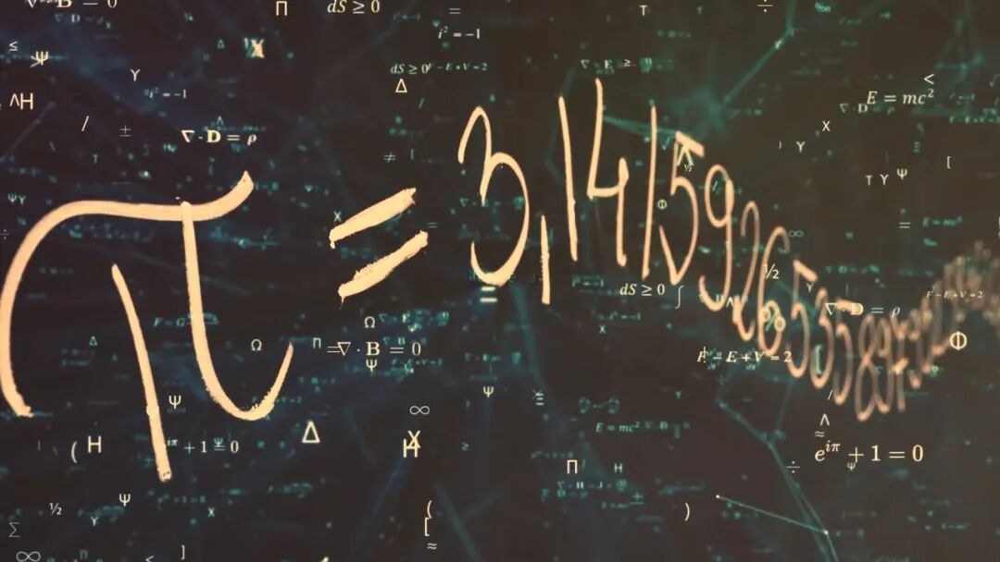
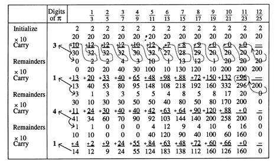
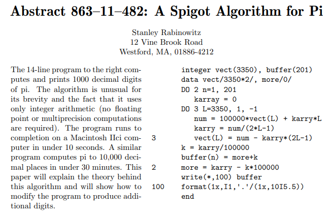

# 算法力量！14行代码，秒算千位圆周率！

> 原文地址: [https://mp.weixin.qq.com/s/GbuNIuJ\_HxVjagHnZ-A91g](https://mp.weixin.qq.com/s/GbuNIuJ_HxVjagHnZ-A91g)

在探索数学的奇妙之旅中，圆周率π无疑是最具魅力的常数之一，它以其无尽的不重复性挑战着人类对精确度的追求。1991年，斯坦利·拉宾诺维茨（Stanley Rabinowitz）的一篇论文震撼了数学界，他提出了一种创新算法——Spigot算法，仅使用简洁的整数运算，便能逐步揭示π及其他数学常数的无限奥秘。令人惊叹的是，该论文中一个仅有14行核心代码的Fortran程序，就足以计算出π至小数点后1000位！  

## Spigot算法的魅力

Spigot算法之所以引人入胜，在于它利用了巧妙的整数迭代过程，逐步生成π的小数位，而非传统方法中的连乘累加或级数展开。这种算法的特别之处在于它直接从算法内部“吐出”（Spigot原意为龙头或水嘴）π的每一位数字，而无需预先计算出整个分数序列或小数的前置部分。

## 14行代码，跨越世纪的计算力

上图给出了原始的Fortran 77代码。虽然只有简短的14行，却蕴藏着强大的计算能力。为了方便展示和分析，将其摘录如下：

      `integer vect(3350), buffer(201)         data vect/3350*2/, more/0/         DO 2 n=1, 201             karray = 0         DO 3 L=3350, 1, -1             num = 100000*vect(L) + karry*L             karry = num/(2*L-1)   3         vect(L) = num - karry*(2*L-1)         k = karry/100000         buffer(n) = more+k   2     more = karry - k*100000         write(*,100) buffer   100   format(1x ,I1,'.'/(1x,10I5.5))         end`

它首先定义了两个数组，`vect`用于存储中间计算结果，`buffer`用于累积最终输出的π值的每一位数字。程序以整数运算逐步更新数组`vect`中的元素，并通过一系列复杂的整除法和取模操作，巧妙地处理进位问题，从而逐渐构建出π的数值。经过201次循环，便能得到π的前1000位数字。

## 现代编程风格的重生

在编程风格方面，原有代码使用了小写字母，这在Fortran 77晚期是常见的做法。为了避免小写字母“l”与数字“1”相混淆，“L”被大写。由于在传统的Fortran语法中，首字母为 i 到 n 的变量类型被默认为整型（implicit typing），因此"carry"被写作了"karry"。数据初始化通过`data`语句完成，这在现代Fortran中并不推荐。为了适应现代编程习惯，我们将这段经典代码简单修改，重新编写为更加规范的现代Fortran版本。

`program pi   implicit none   integer :: vect(3350) = 2, buffer(201)   integer :: carry, n, L, k, more = 0, num      do n = 1, 201     carry = 0     do L = 3350, 1, -1       num = 100000 * vect(L) + carry * L       carry = num / (2*L - 1)       vect(L) = num - carry * (2*L - 1)     end do     k = carry / 100000     buffer(n) = more + k     more = carry - k * 100000   end do      write(*, "(1x, I1, '.'/(1x, 10I5.5))") buffer   end program pi   `

新代码明确了变量声明类型，使用`do...end do`替代行号，不再使用`data`初始化，直接在变量声明时赋初值。同时改进了格式输出指令的书写方式，使用了更灵活的字符串引用符（单引号或双引号）。通过这些改动，代码变得更加清晰易读，同时也保持了代码原有的准确性。

## 计算成果：π的美妙呈现

编译并执行以上代码，不到1秒钟的运算时间，我们得到了以下输出结果：

`3.   14159265358979323846264338327950288419716939937510   58209749445923078164062862089986280348253421170679   82148086513282306647093844609550582231725359408128   48111745028410270193852110555964462294895493038196   44288109756659334461284756482337867831652712019091   45648566923460348610454326648213393607260249141273   72458700660631558817488152092096282925409171536436   78925903600113305305488204665213841469519415116094   33057270365759591953092186117381932611793105118548   07446237996274956735188575272489122793818301194912   98336733624406566430860213949463952247371907021798   60943702770539217176293176752384674818467669405132   00056812714526356082778577134275778960917363717872   14684409012249534301465495853710507922796892589235   42019956112129021960864034418159813629774771309960   51870721134999999837297804995105973173281609631859   50244594553469083026425223082533446850352619311881   71010003137838752886587533208381420617177669147303   59825349042875546873115956286388235378759375195778   18577805321712268066130019278766111959092164201989   `

确实令人赞叹！从"3."开始，之后每行输出50位，直到第1000位，每一数字都准确无误。这不仅是算法的力量展示，更是人类智慧与数学之美的交响曲。

## 小结

综上所述，Spigot算法以极简的代码展示了算法设计的精妙。仅用短短14行Fortran代码，便解锁了长达千位的π的神秘面纱。这是数学与计算机科学完美结合的典范，也是对所有追求精确计算和算法优化的人们的鼓励。让我们一起探索更多的算法奇迹，解锁数学的无限可能！

**FEtch 系统**是笔者团队开发的新一代有限元软件开发平台。只需按照有限元语言格式填写脚本文件，即可在线自动生成基于**现代 Fortran** 的有限元计算程序，从而大幅提高 CAE 软件的开发效率。欢迎私信交流。

有任何疑问或建议，欢迎加Q群 "**FEtch有限元开发系统(519166061)**" 留言讨论。我们长期开展 FEtch 系统的试用活动，感兴趣的朋友入群后可直接联系管理员，免费获取**许可证文件**。