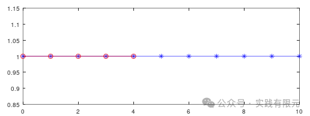
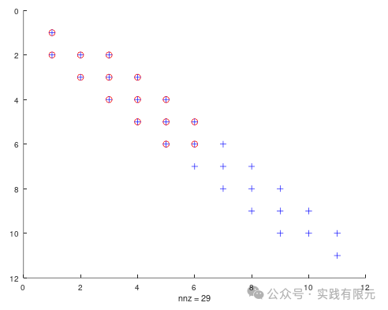
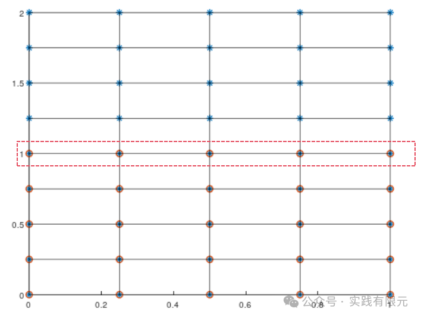
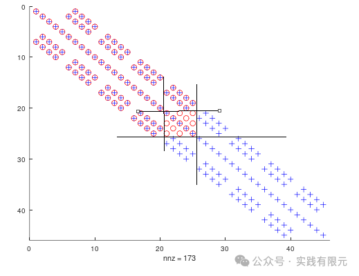
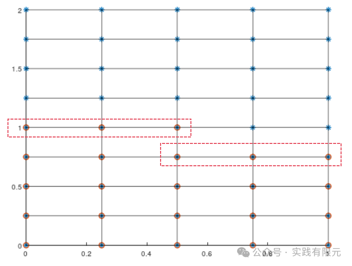
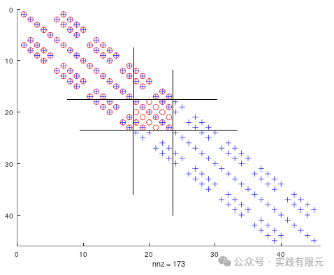
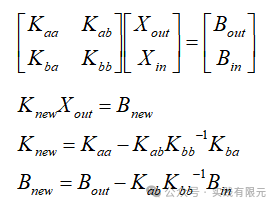
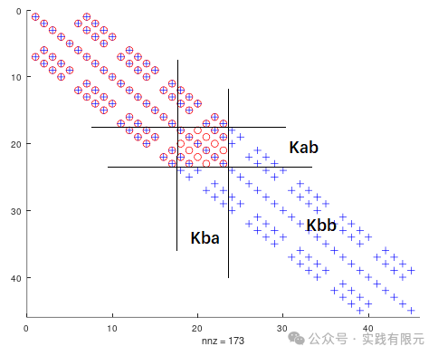
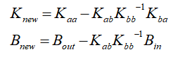
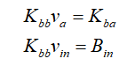

# 缩聚技术在网格结构层面上的技巧

> 原文地址: [https://mp.weixin.qq.com/s/UNB6OQgbMACDbTH99zXKdQ](https://mp.weixin.qq.com/s/UNB6OQgbMACDbTH99zXKdQ)

简述

本公众号中缩聚相关的内容已经有两篇了，感觉这技术还值得深挖。之前介绍了对高阶基函数进行缩聚的实现方法。本次从网格结构与有限元系数矩阵的角度出发，再次展示缩聚在网格结构层面上一些值得留意的现象，并且在缩聚过程中对求解矩阵的逆的一些观点。

在高阶有限元中使用缩聚，已经得出结论，对单元内部节点进行缩聚后不会改变系数矩阵本身的稀疏特性，因此，同样的类比在网格层面上，缩聚是否具备类似的特定。

下面以一维、二维泊松方程有限元的缩聚来讨论这些问题。所涉及有限元实现方法与缩聚文章请参考：

1.[二维网格的刚度矩阵缩聚再讨论](http://mp.weixin.qq.com/s?__biz=MzkwNzUxOTM2NA==&mid=2247485697&idx=1&sn=965c2d2a0ebf431412bf9a080ea60fc4&scene=21#wechat_redirect)

[2.](http://mp.weixin.qq.com/s?__biz=MzkwNzUxOTM2NA==&mid=2247485697&idx=1&sn=965c2d2a0ebf431412bf9a080ea60fc4&scene=21#wechat_redirect)[单元刚度矩阵的缩聚](http://mp.weixin.qq.com/s?__biz=MzkwNzUxOTM2NA==&mid=2247485355&idx=1&sn=cce7a1889f43bebd7ed4db236ee4471e&scene=21#wechat_redirect)

[3.](http://mp.weixin.qq.com/s?__biz=MzkwNzUxOTM2NA==&mid=2247485355&idx=1&sn=cce7a1889f43bebd7ed4db236ee4471e&scene=21#wechat_redirect)[最简单的一维有限元问题：求解cos函数分布](http://mp.weixin.qq.com/s?__biz=MzkwNzUxOTM2NA==&mid=2247483689&idx=1&sn=238051a214893aec197bde3511363463&token=264164521&lang=zh_CN&scene=21#wechat_redirect)

[4.](http://mp.weixin.qq.com/s?__biz=MzkwNzUxOTM2NA==&mid=2247483689&idx=1&sn=238051a214893aec197bde3511363463&token=264164521&lang=zh_CN&scene=21#wechat_redirect)[最简单的二维结构化有限元问题：求解拉普拉斯方程（改）](http://mp.weixin.qq.com/s?__biz=MzkwNzUxOTM2NA==&mid=2247483928&idx=1&sn=05e3ce02b78d231fd8da3f06e2ddc0e1&scene=21#wechat_redirect)

1.对网格的缩聚

对一维而言，一个10个线单元模型，共计有11个节点，如果对其后六个节点进行缩聚，缩聚的后节点与整个网格的关系如下：

观察缩聚前后的稀疏系数矩阵的非零元素分布：    

图中蓝色是缩聚前矩阵的非零元素分布，红色是缩聚后矩阵的非零元素分布。可以发现，在缩聚后，还存在的节点的非零元素个数位置均没有发生变化。也就是缩聚后矩阵的稀疏程度没有发生任何变化。

继续来观察二维模型，对于如下网格4\*8网格的模型，蓝色节点是所有节点，红色节点是缩聚后还存在的节点。

观察其缩聚前后的稀疏矩阵非零元素分布，蓝色为原始矩阵，红色为数据后矩阵：

发现缩聚后绝大部分非零元素位置并没有变化，唯一增加的是只有黑色框中的5\*5的矩阵块。不难发现，该矩阵块对应的节点正是网格中缩聚分界面上的五个节点。

同理，如果缩聚部分的分界点有六个点：

则其缩聚后只有对应的6\*6的矩阵中稀疏程度会发生变化：

可以发现，对于二维模型，缩聚过程中，稀疏矩阵的位置除了与缩聚点与非缩聚点的交界位置的稀疏程度发生变化外，其他位置的稀疏程度均没有发生变化。  

进一步思考，根据有限元组装矩阵本身的规律，任意自由度在矩阵中的系数仅与其相连的自由度相关。因此不难分析得到，缩聚后的稀疏矩阵的变化仅与缩聚部分相接触的自由度相关，与其他不相连的自由度无关。从网格层面上，可以理解成缩聚部分的结构特性全部归集到分界面的自由度上。

这对于一些结构比较特殊的模型非常友好，例如电磁学一些大模型中复杂的小结构可以缩聚到其分界面上，实现减小稀疏矩阵维度的同时又不会太过于改变矩阵稀疏程度。又例如对于力学中一些重复出现的结构，也可以通过缩聚减小计算量。

2.Kbb矩阵的逆矩阵的求解

缩聚技术中，关键公式就那么几个简单公式：

其中，最为麻烦的就是Kbb矩阵的逆的求解，当Kbb的逆难以求解的时候，这种方法对于计算效率是一个非常麻烦的事情，但是对于有限元而言，从网格结构与系数矩阵观察，似乎有更好的解决方法。如下图：    

对于Kbb的矩阵，如果模型足够大，这部分的逆是非常难以求解的，但观察下面公式中不难发现：

其实并不需要显示的求解Kbb的逆，仅需要知道invKbb\*Kba和invKbb\*Bin即可，将这两部分写成如下形式：

发现只要求解va和vin即可。也就是求解一个系数矩阵均为Kbb，存在多列右端项的线性方程组。这相对于直接求解Kbb的逆就容易很多，并且直接求解而言，仅需要一次LU分解即可求解得到多列右端项。    

更值得关注的是，对于右端项Kba对应在非零元素显示图中的Kba部分，不难发现Kba本身也是一个很大的稀疏矩阵，而且非零元素也仅存在于缩聚部分的分界点部分，也就是说对于上述两个例子，分界点分别是5、6个节点，那么Kba非零元素也仅存在于5列、6列，其他列全部为零。因此再来观察上述公式，右端项Kba实际需要求解的列向量应该是等于缩聚分界点的个数+一个Bin，如此就能大大减少LU分解后的回代求解的右端项个数。

总结

总结缩聚在网格结构层面上的结果：缩聚部分与未缩聚部分的分界面自由度的个数至关重要，这直接关系到缩聚后矩阵的稀疏程度保留与求解的效率问题。所以根据网格拓扑关系合适的选择缩聚部分是非常重要的。