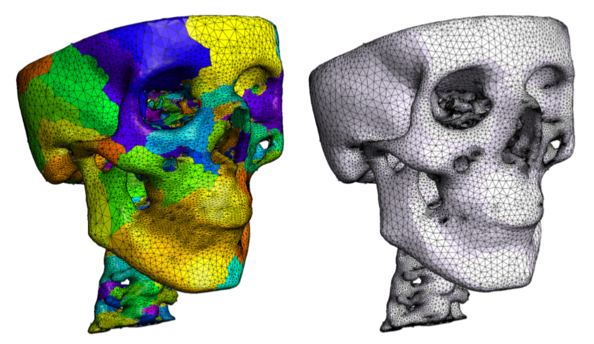
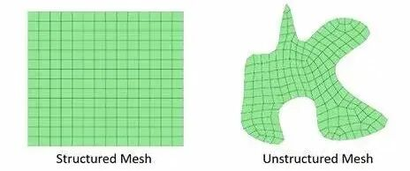
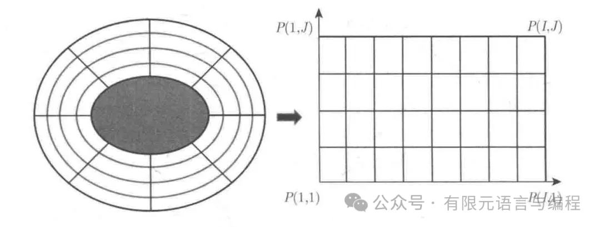
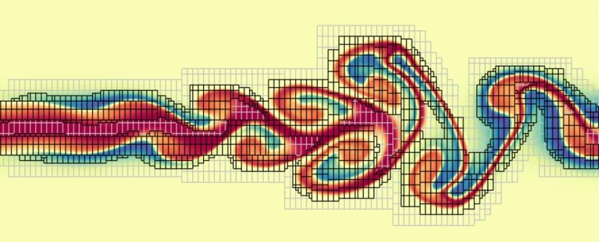
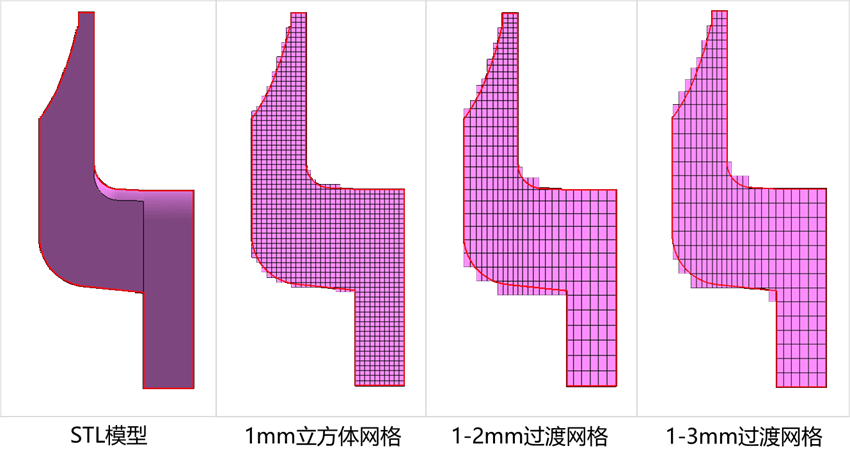
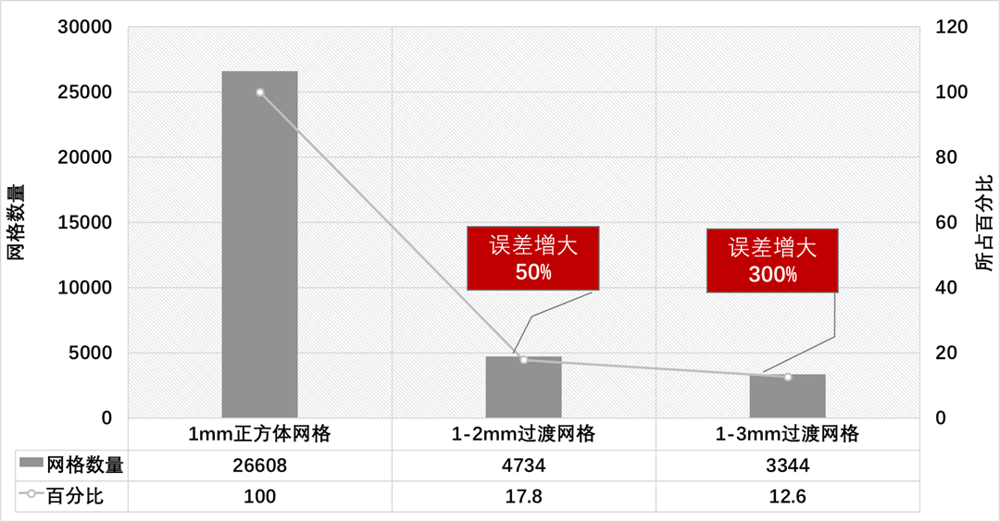
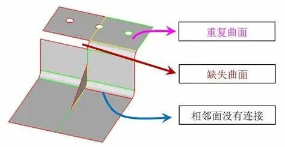
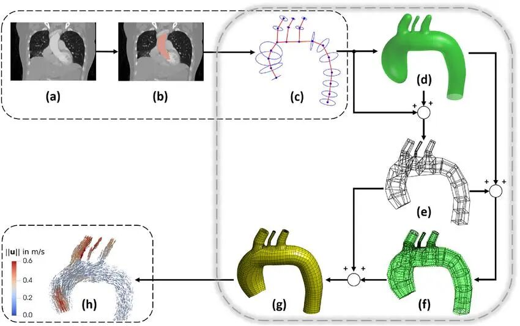
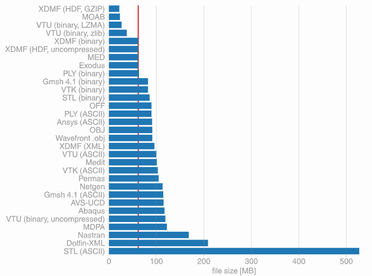

# 网格剖分：寻找最优解的探索

> 原文地址: [https://mp.weixin.qq.com/s/H3QtvB\_kOcqf6YHFdU5F3w](https://mp.weixin.qq.com/s/H3QtvB_kOcqf6YHFdU5F3w)

网格剖分（Mesh Generation），作为计算科学与工程领域的一项基础技术，扮演着至关重要的角色。在计算机辅助设计（CAD）、有限元分析（FEA）、计算流体动力学（CFD）等领域中，合理的网格剖分能够显著提高计算精度、效率和结果的可靠性。随着计算机技术的发展，网格生成方法也在不断进步，从传统的手工绘制网格，到如今的自动化、智能化网格生成工具，每一步都代表着科技的进步和对更高精度、更快速度追求的实现。本文旨在通过对网格剖分原理及其实践应用进行简要阐述，为广大科研工作者提供一些有益的参考。

## 网格剖分的基本概念

在数值模拟中，物理现象通常被描述为偏微分方程组。为了求解这些方程，需要将连续的空间离散化成有限数量的单元或节点组成的网格结构。因此，选择合适的网格对于确保最终解决方案的质量至关重要。

具体来说，网格剖分是指将连续的几何空间离散化为有限数量的小单元（如四边形、三角形等），这些小单元构成了整个计算域的近似表示。每个单元内部的物理量通过节点上的值来描述，而节点之间的连接关系则反映了原始几何结构的特点。根据不同的应用需求，可以选择不同类型的单元，比如二维问题常用的三角形单元或矩形单元；三维问题中的四面体、六面体等。

一个理想的网格应该满足以下几点：

-   **几何适应性**：精确捕捉物体形状特征。
    
-   **数值稳定性**：避免因过度细化导致计算不收敛。
    
-   **计算效率**：减少不必要的计算资源消耗。
    
-   **结果准确性**：保证模拟结果尽可能接近真实情况。
    

## 常见的网格类型及其特点

根据不同的应用场景和技术要求，存在多种类型的网格剖分方法。下面我们将介绍几种常用的网格形式：

### 结构化网格（Structured Mesh）

结构化网格由规则排列的矩形或其他多边形单元构成，适用于具有简单几何形状的问题域。其优势在于易于生成且容易实现高效的并行计算；然而，当面对复杂边界条件时，则显得不够灵活。

### 非结构化网格（Unstructured Mesh）

非结构化网格可以自由地适应任意复杂的几何形态，通过三角形、四面体等单元来填充整个问题区域。这种方法提供了更大的灵活性，但同时也增加了构建难度以及对存储空间的需求。

### 混合网格（Hybrid Mesh）

混合网格结合了上述两种方式的优点，在特定区域内采用结构化布局，而在其他地方则使用非结构化元素。这种策略能够在保持较高分辨率的同时降低整体复杂度。

### 自适应网格加密（Adaptive Mesh Refinement, AMR）

自适应网格加密是一种动态调整局部区域精细程度的技术。它允许在需要更高精度的地方自动增加更多的节点或单元，从而优化全局性能。例如，在流体力学仿真中，可以在涡流附近加强细节刻画以获得更加逼真的流动特性。

## 如何选择合理的网格？

要确定最佳的网格方案，必须综合考虑以下几个方面：

### 几何复杂度

对于简单的几何形状，如长方体或圆柱体，结构化网格往往是一个不错的选择，因为它们能够提供均匀而稳定的分布。但对于包含多个曲面交界处或者内部结构较为复杂的模型来说，非结构化或混合网格可能是更好的替代品。此外，某些特殊情况下还可以利用映射变换等手段将原始坐标系转换为更适合处理的形式。

### 物理现象特点

不同类型的物理过程对网格的要求也有所不同。例如，在固体力学分析中，我们通常希望得到光滑连续的应力场分布；而对于湍流模拟而言，则可能更关注于捕捉瞬态变化趋势。因此，在制定网格规划之前，首先要明确所研究对象的主要特征是什么，并据此调整相应的参数设置。

### 计算成本限制

虽然理论上越精细的网格越能反映出真实的物理行为，但在实际操作过程中往往会受到硬件设施和时间成本等因素的影响。因此，找到一个平衡点就变得尤为重要——既不能过于粗糙以至于影响到结果可信度，也不能太过细密造成资源浪费。一般来说，可以通过逐步试错的方法来进行试探性实验，直至找到满意的折衷方案为止。

### 数据后处理需求

最后还需考虑到后期可视化展示及数据挖掘阶段的需求。如果计划输出大量中间状态用于动画制作或是进一步统计分析的话，那么从一开始就应当留有足够的冗余度以便后续操作。同时也要注意保证各个层面之间的一致性和连贯性，以免出现信息丢失的情况。

## 实际应用中的挑战与对策

尽管理论上有许多成熟的网格剖分算法可供选用，但在具体实践中仍然会遇到不少困难。比如，由于制造误差等原因造成的 CAD 模型缺陷可能会给自动化流程带来麻烦；又或者是针对特定行业标准下的特殊要求难以直接套用通用工具包解决。针对这些问题，可以从以下几个角度出发寻求改进措施：

### 数据预处理与修复

-   **几何清理**：对于因制造误差等原因导致的CAD模型缺陷，可以通过专门的数据预处理软件对原始文件进行清理。这些工具可以识别并修正如非流形边、间隙、重叠面等问题，确保输入到网格生成器中的几何体是干净且一致的。
    
-   **特征提取与简化**：在不影响关键特性的前提下，适当简化复杂的几何结构，以减少不必要的细节，使得网格生成过程更加顺畅。同时，通过特征提取技术保留重要的工程特征，保证仿真结果的有效性。
    

### 定制化网格生成策略

-   **基于规则的局部调整**：为满足某些行业的特殊需求（例如航空航天领域的高精度要求），可以在全局网格基础上实施基于规则的局部调整。比如，在特定区域增加或减少单元密度，以适应不同的物理现象和边界条件。
    
-   **多尺度建模**：当面对具有多个长度尺度的问题时，采用多尺度建模方法可以在不同层次上应用最合适的网格类型。例如，宏观尺度使用较粗略的网格来捕捉整体趋势，而微观尺度则用更细密的网格描述精细结构。
    

### 集成先进的自动化与智能化技术

-   **机器学习辅助优化**：利用机器学习算法分析历史案例库，预测可能遇到的问题，并提出针对性的解决方案。此外，还可以训练模型自动选择最适合当前任务的网格参数设置，提高效率的同时也降低了人为干预的风险。
    
-   **自适应网格细化**：结合自适应网格细化技术，根据计算过程中出现的误差分布动态调整网格密度。这种方法不仅能够保证解的准确性，而且有助于节省计算资源。
    

### 加强跨学科合作与交流

-   **建立标准化接口**：促进不同领域间的协作，制定统一的标准和协议，以便于各种专用工具之间的无缝对接。这样可以避免重复劳动，加快项目进度，并确保最终成果的质量。
    
-   **知识共享平台建设**：创建一个集中的知识共享平台，鼓励工程师和技术人员分享他们在各自领域内的经验和技巧。通过这种方式积累集体智慧，共同攻克难题。
    

以上部分图片转自网络，如有不当请联系我们

## 总结与展望

综上所述，实现更合理的网格剖分是一项既充满挑战又极具价值的工作。随着科学技术不断发展进步，相信未来会有更多创新性的方法涌现出来，帮助我们在追求极致精准的同时也能兼顾效率与实用性。同时，我们也期待着看到更多跨领域协作成果的诞生，共同推动这一重要课题向前迈进。

  

**往期推荐**

[

通用前后处理软件 GiD 简介

](http://mp.weixin.qq.com/s?__biz=Mzk0MzI0NDU2NQ==&mid=2247484077&idx=1&sn=f91b124c472bc374439266d2fe28c394&chksm=c33796d7f4401fc1839829cd4211644369b8ff835bd043188dd758f3b0bf84e6df802814bfda&scene=21#wechat_redirect)

[

深入解析 | 有限元网格的常用生成算法

](http://mp.weixin.qq.com/s?__biz=Mzk0MzI0NDU2NQ==&mid=2247486027&idx=1&sn=b1ea230a5f179ab96b8e3335e7cab19a&chksm=c3379e31f440172700a08dfb621d9135f0170f5133b817caa70392bd1351cda050ae758262f6&scene=21#wechat_redirect)

[数值方法中的误差与步长：为什么更细的网格并不总是意味着更高的准确性？](http://mp.weixin.qq.com/s?__biz=Mzk0MzI0NDU2NQ==&mid=2247487499&idx=1&sn=6f4f778b786e4de26d8563021c81ab5e&chksm=c3378471f4400d67316264aeaf70fad630912cf588bbe642d820095e834ee5863bbbb3242c2a&scene=21#wechat_redirect)

# 推荐阅读

  

‍

我们目前正和专业SCI论文英文润色机构**艾德思**开展全方位合作。如果您需要**论文和基金标书辅导服务**，欢迎扫码下方二维码，获取您的专属学术顾问，**锁定直减活动优惠**👇

********▲****长按扫码添加学术顾问咨询********▲****

********

**喜欢****作者******，请点********赞********和在看********

****