# 自适应有限元：几种常见的后验误差

> 原文地址: [https://mp.weixin.qq.com/s/untL3rHG0IEj7iGuEi4wEQ](https://mp.weixin.qq.com/s/untL3rHG0IEj7iGuEi4wEQ)

**概述**  

本篇文章从一维例子出发，介绍自适应有限元中几种常见的后验误差，并且对比各自的优势。

后验误差按照实现方式，可以分为：基于恢复梯度的后验误差；基于残差的后验误差；基于物理场规律的后验误差；以及试测的基于纯粹梯度的后验误差。下面就这几种后验误差给出常见的表达式与测试结果。

**1.几种后验误差的基本原理**

**A.基于恢复梯度**

这种后验误差在之前介绍过，其基于理论：仿真数值解的精度在未知点位置的精度最高；数值解的梯度在高斯点位置精度最高；

因此可以通过获取单元内高斯点的高精度梯度解，进而通过插值等方式获得整个区域内其他精度低位置的梯度值，对比即可获得每个单元的梯度误差。详细可参考：

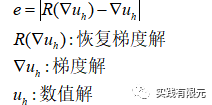

  

**B.基于残差的后验误差**

这种后验误差基于微分方程，根据理论，有限元求解求解结果一定是满足原微分方程的，因此将数值解带入到微分方程中，等式两边理论上应该成立。但是由于有限元本身求解的是弱解问题，因此存在一定误差，而这误差则可以用来评价该点的精度，以此作为后验误差。

一般的微分方程可以写成：  

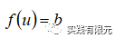

基于残差的后验误差表示为：

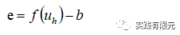

**C.基于物理场规律的后验误差**

这种后验误差基于本身研究问题的物理规律，根据物理规律，指定每个单元上的误差标准。

例如一维电磁场衰减，物理场满足电场、磁场在节点上连续；有限元本身只保证了电场连续，因此可以通过求解节点两侧单元的磁场是否连续作为误差判断标准。

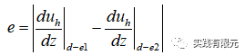

式子表示，使用内部节点两侧单元求解该点的磁场，两者的差值作为判断单元计算精度的标准。其实不难发现，本例子描述的基于物理规律后验误差本质上是恢复梯度的后验误差。在二维三维中则不是如此。

**D.基于纯粹梯度的后验误差**

这是作者梯度原理猜想的一种后验误差，其原理是：对于只要求表面节点精度而言，求解该点对于每个单元的梯度，因此获得每个单元对于该点的影响程度，对于影响大的网格进行加密。

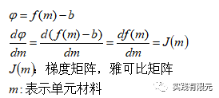

由于测试案例使用简单的一维模型，因此采用扰动法求解梯度矩阵。

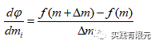

**2.测试**

本次测试案例以一维电磁场衰减为例，分别对上述几种后验误差进行测试，其中A、C在本例中是一种后验误差。测试标准以在研究区域发射电场表面的电阻率变化为标准。具体可参考：[二阶叠层基函数：二维电磁衰减数值模拟](http://mp.weixin.qq.com/s?__biz=MzkwNzUxOTM2NA==&amp;mid=2247484069&amp;idx=1&amp;sn=a52d10043b20af30f935ecbfd9413712&amp;chksm=c0d6b64ef7a13f5854c7b426fab0658cfd0d239518c5e8f636b05e1c73f251c4b7c4d776b14a&scene=21#wechat_redirect)。

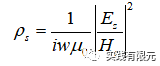

自适应有限元实现过程这里不再讨论，详细实现可以参考：[自适应有限元技术:一维电场衰减数值模拟](http://mp.weixin.qq.com/s?__biz=MzkwNzUxOTM2NA==&amp;mid=2247483839&amp;idx=1&amp;sn=e2f7a7363e057ae988054c5d83e180cb&amp;chksm=c0d6b554f7a13c420b5667c418d2d0fe4e40b4192beffb78b7c46052cf66476163a0a24ded5f&scene=21#wechat_redirect)。这里直接讨论几种后验误差的测试结果;

**A.测试一维电场在均匀介质中的传播规律**

初始网格与计算的电场如下，10个均匀网格单元，频率10000Hz。该网格计算的视电阻率为138欧姆米，与理论值100相差甚远。

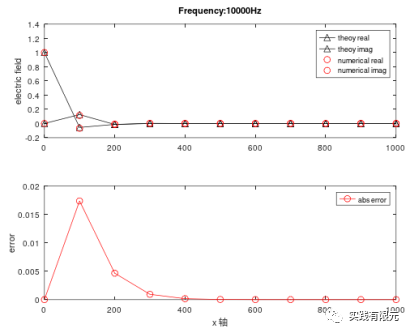

**a.基于恢复梯度A、物理场C的后验误差测试结果：**         

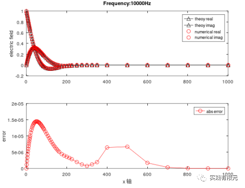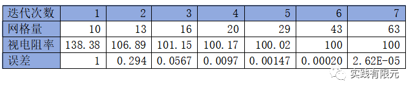

**b.基于残差B的后验误差测试结果：**

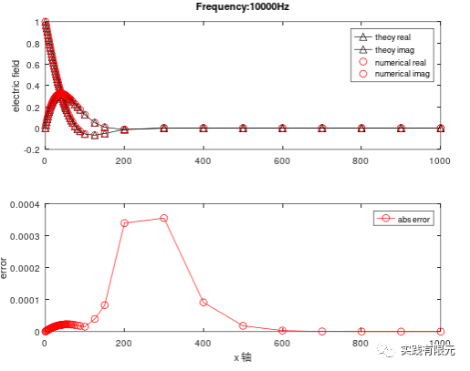

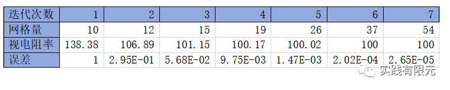

**c.基于纯粹梯度D的后验误差测试结果：**

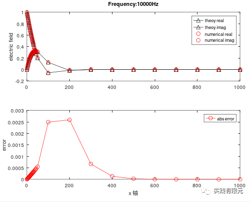

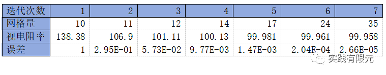

不难看出，三种后验误差加密得到的网格差异明显。

从电场本身的精度来看，基于恢复梯度的A、C后验误差的精度最大，而纯粹基于梯度D的后验误差精度最低。

从加密程度看，基于纯粹梯度D的加密集中在0点附近；而基于恢复梯度A、C则相对分散开；

从视电阻率精度结果来，三者误差均达到了可控范围0.01%内，但是基于恢复梯度A、C的网格量大于基于残差B大于纯粹梯度D。

因此，如果考虑视电阻率精度与网格量角度来看，基于纯粹梯度的方式D是最佳的。其次是基于残差，最后才是基于恢复梯度。

**B.测试一维电场在非均匀介质中的传播规律**

一维材料参数模型如下，在研究区域内存在低阻1欧姆米的区域。  

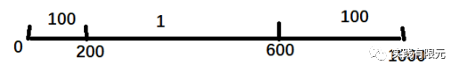

**a.基于恢复梯度A、物理场C的后验误差测试结果：**

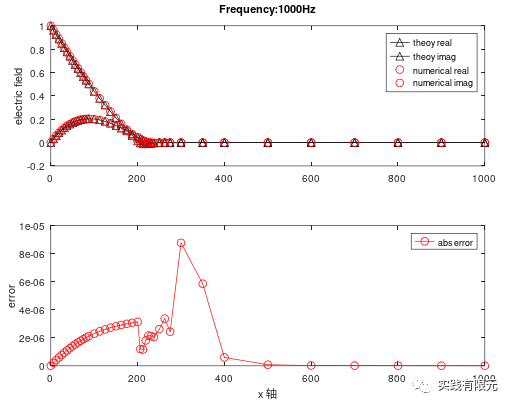

**b.基于残差B的后验误差测试结果：**

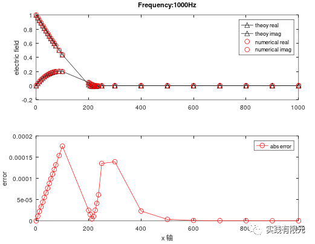

**c.基于纯粹梯度D的后验误差测试结果：**

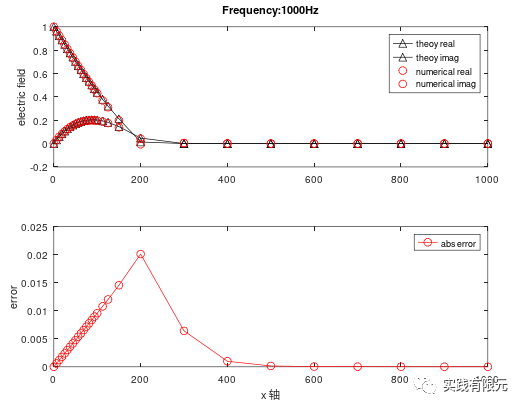

三种后验误差的视电阻率在该频率下的计算结果：

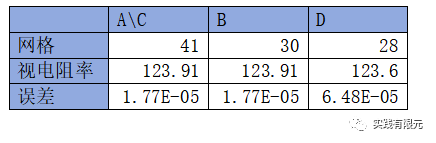

上述测试的视电阻率理论结果为123.91，可见整体上看基于残差的后验误差的精度和网格量是最佳的。纯粹基于梯度D的结果精度要稍微低一些。继续测试了几组频率，对比结果：

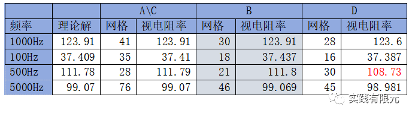

整体来说，基于残差B的后验误差方式的效果是最佳的，网格量少，视电阻率也几乎和理论解一致；基于恢复梯度的A、C精度是最高的，但是网格量也是最大的；基于纯粹梯度的D在频率500Hz的时候误差太大。

**3.总结**

使用一维模型，初步测试了几种后验误差的自适应收敛效果，其中整体上最佳方案是基于残差的后验误差，其次是基于恢复梯度、基于物理磁场；基于纯粹梯度的后验误差虽然网格量有时候很少，但是可能会计算不准确。