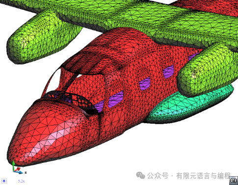
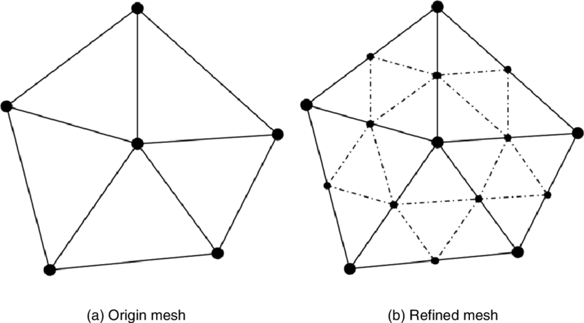
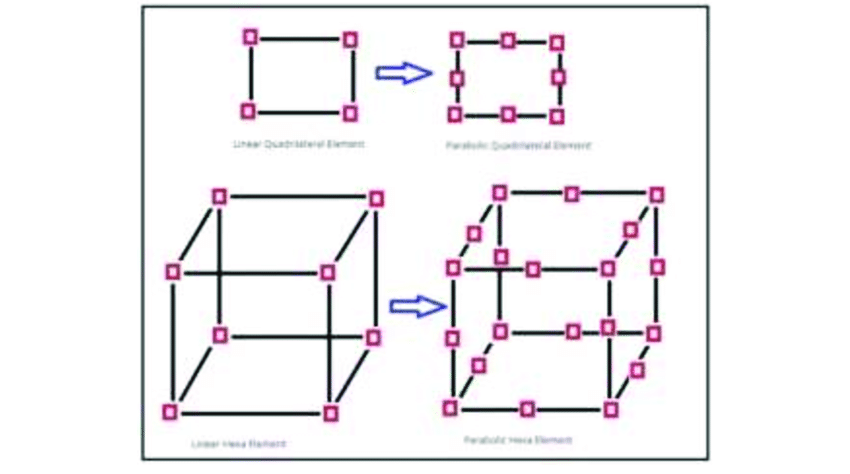
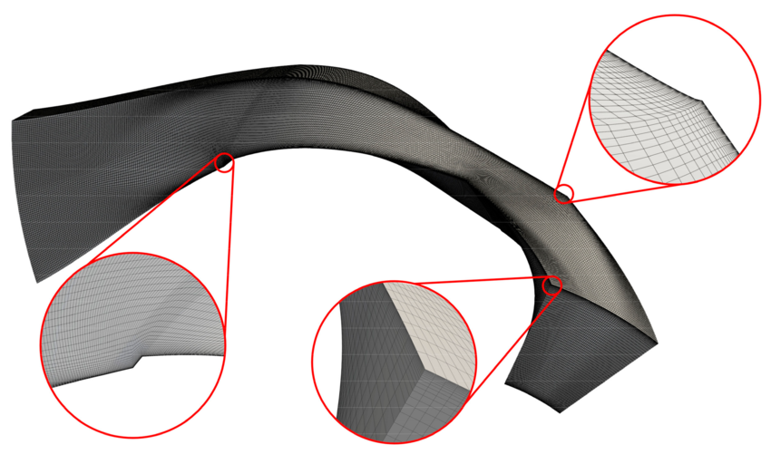
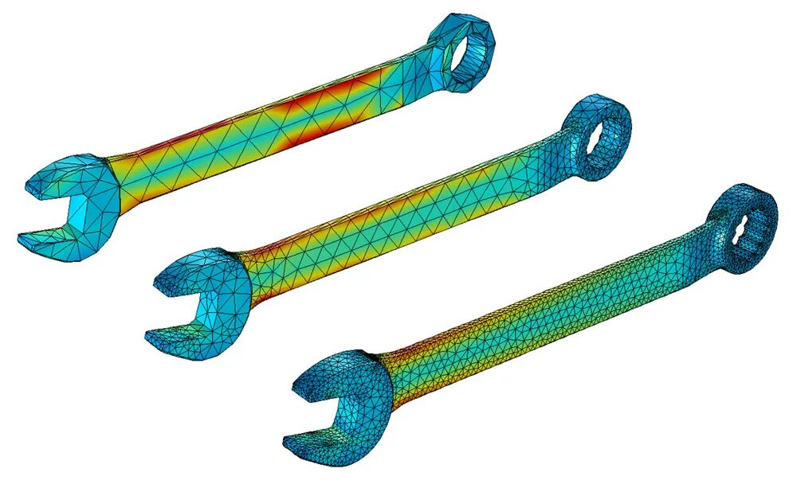
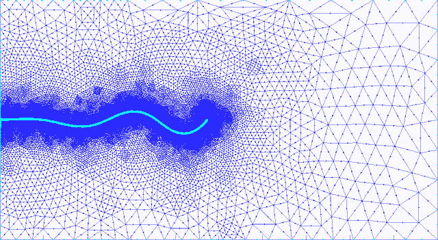
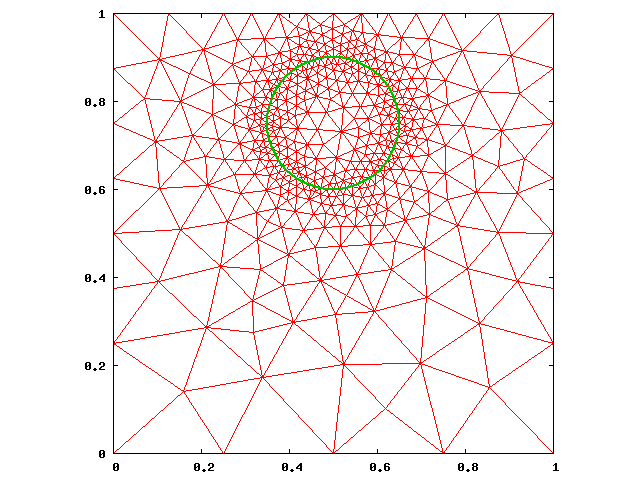
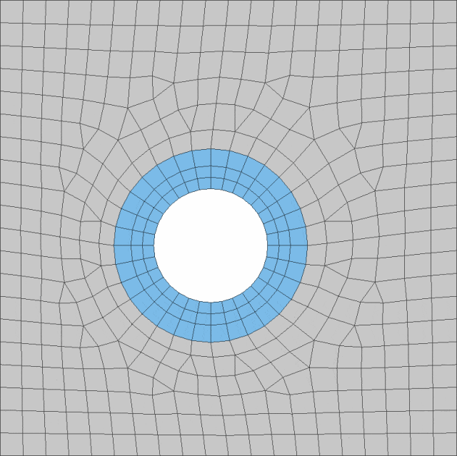
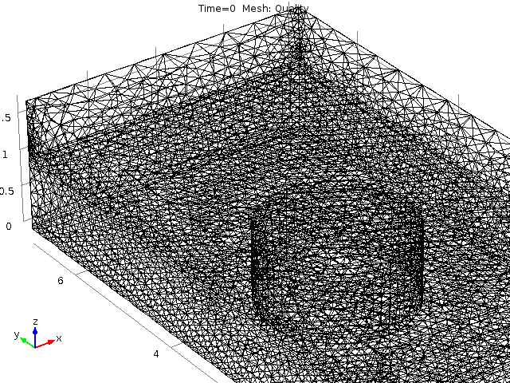

# 自适应网格细化技术：精准模拟的智慧之选

> 原文地址: [https://mp.weixin.qq.com/s/MXn-WMyyk-aJ61kVJh3K2g](https://mp.weixin.qq.com/s/MXn-WMyyk-aJ61kVJh3K2g)

点击上方蓝字关注我们

在计算流体力学(CFD)、有限元分析(FEA)及众多科学计算领域中，精确模拟复杂的物理现象是一项极具挑战性的任务。为应对这一挑战，自适应网格细化技术应运而生，成为提升模拟精度与效率的关键工具。本文将深入探讨自适应网格细化技术的核心概念、常见方法及其在实际应用中的价值，揭示其如何在保持计算成本可控的同时，实现对复杂物理场的精准刻画。

## 网格与求解的艺术

在数值模拟领域，网格扮演着基础且关键的角色。它将连续的物理空间离散化，使得复杂的偏微分方程得以通过数值方法求解。然而，网格的选择与布局直接影响着模拟的准确性和效率。过于稀疏的网格可能导致关键特征被遗漏，而过分密集的网格则会大大增加计算负担。因此，找到最优的网格布局，即在保证精度的同时控制计算成本，是每一个模拟研究者追求的目标。自适应网格细化技术正是为此而生。

## 网格自适应技术概览

网格自适应，简而言之，是一种动态调整网格布局的技术，旨在根据模拟区域内的物理特性自动优化网格结构。这一过程包括动态添加、删除或移动网格单元格和点，以适应解的局部特性。自适应技术的核心在于它能够识别并聚焦于误差较高的区域，针对性地细化这些区域的网格，而在误差较小的区域则进行去细化，从而达到全局的精度与计算成本的平衡。

自适应网格细化技术大致可以分为三类主要方法：h型、r型和p型，它们可以组合使用。每种方法各有千秋，适用于不同的模拟场景。

### h型网格细化（h-refinement）

h型细化是最直观的自适应技术，通过在感兴趣的区域减小网格单元尺寸（即减小特征长度h），增加局部网格密度。这种方法直接提升了局部分辨率，尤其适合于捕捉边界层、激波和梯度大的区域，如流体动力学中的边界层流动和气动声学现象。然而，随之而来的是系统自由度的增加，可能导致计算成本和内存需求的显著上升。在非结构化网格中，h型细化更为灵活，因为可以直接添加或删除节点和单元，而在结构化网格上则可能需要更复杂的算法来保持网格的一致性。

  

### r型网格细化（r-refinement）

与h型不同，r型网格细化不改变单元的数量和大小，而是通过移动或旋转网格单元，优化其位置和形状，以更好地匹配流动或物理场的方向。这种技术特别适用于改善网格质量，比如在流动方向上对齐网格，或避免出现过度拉伸的单元，从而提高模拟的准确性，同时保持计算成本的相对稳定。r型细化对于那些需要保持网格结构整体一致性，而又需优化局部布局的模拟尤为重要。

### p型网格细化（p-refinement）

p型细化则是在不改变网格结构的前提下，通过提高每个网格单元内使用的多项式阶数来提升解的精度。在有限元方法中，这意味着采用更高阶的基函数来近似解，能够在保持网格分布不变的情况下，有效减少数值误差。p型细化特别适用于需要极高精度但又难以实施网格结构调整的情况，如某些高精度的应力分析和电磁场模拟。

### 组合拳：多种细化方式的协同

在实际应用中，单一的网格细化技术往往难以满足所有需求，因此，将h型、r型、p型细化技术相结合，形成复合策略，成为提高模拟效率与精度的有效手段。例如，h型和r型细化的组合（称为hr型细化）可以在保持网格数量不变的情况下，通过局部增加网格密度和优化单元布局，达到既提高精度又控制成本的目的。而p型细化则常作为辅助手段，与h型或r型结合使用，以在特定区域实现更高的解算精度。这种灵活性使得自适应网格细化技术能够更加贴合复杂多变的物理场景。

## 实战应用：自适应网格技术的威力

自适应网格细化技术在多个领域的应用案例展示了其强大的实用价值。在航空工程中，通过对机翼周围流场的边界层进行h型细化，工程师能更准确地预测阻力和升力特性；在海洋工程中，h型细化网格能够有效捕捉波浪与结构物相互作用的复杂流场，提高对船舶运动和海洋结构稳定性分析的准确性；在地震波传播模拟中，r型细化被用来优化网格布局，以精确捕捉地震波的传播路径和强度变化；而在生物医学工程中，p型细化结合h型细化，帮助研究者更精细地模拟心脏瓣膜的血流动力学，指导医疗器械的设计与优化。

  

  

  

以上部分图片转自网络，如有不当请联系我们

## 结语：走向更智能的未来

综上所述，自适应网格细化技术以其灵活多样的方法和高效精准的性能，在数值模拟领域占据着举足轻重的地位。随着计算能力的持续提升和算法的不断进步，自适应网格细化技术正逐步向智能化、自动化方向发展，使得自适应网格策略能够更加精准地预测和响应物理场的变化，自动优化网格布局，甚至在实时模拟中动态调整。我们有理由相信，未来的模拟世界将更加精细，更加智能，为人类探索未知、解决现实问题提供强有力的支持。

# 推荐阅读

‍

我们目前正和专业SCI论文英文润色机构**艾德思**开展全方位合作。如果您需要**论文和基金标书辅导服务**，欢迎扫码下方二维码，获取您的专属学术顾问，**锁定直减活动优惠**👇

********▲****长按扫码添加学术顾问咨询********▲****

********

  

**喜欢****作者******，请点********赞********和在看********

****