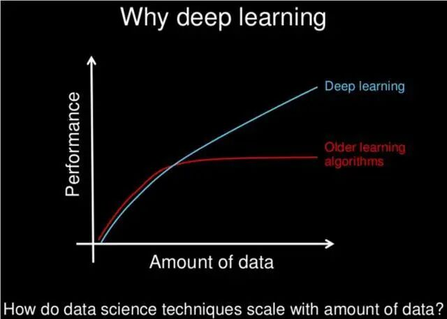
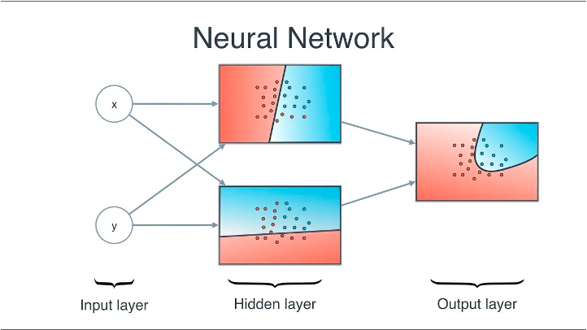
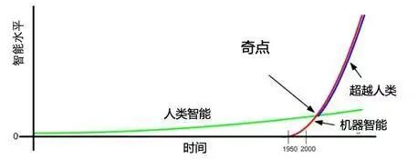
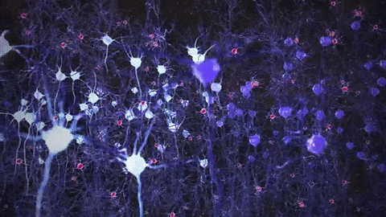
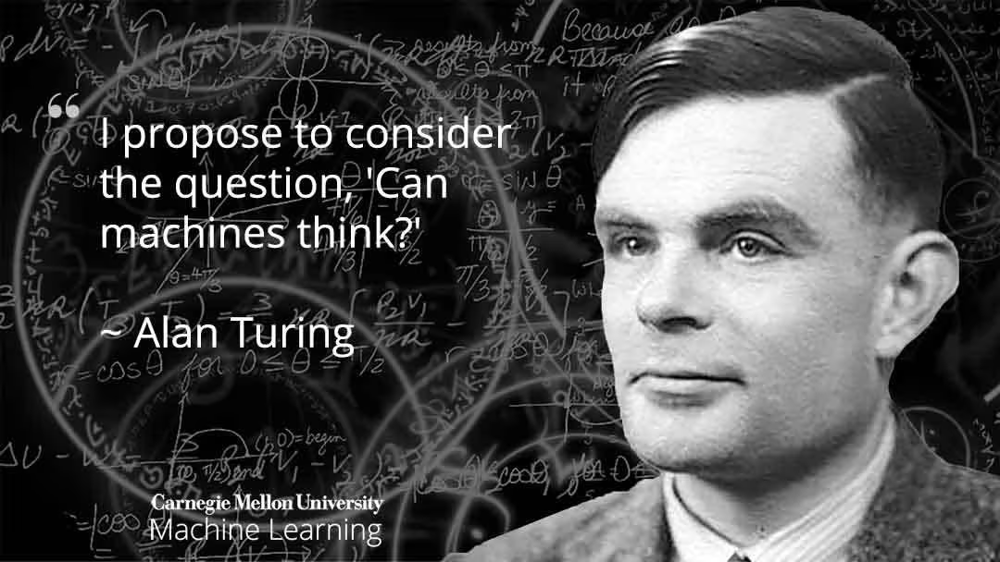
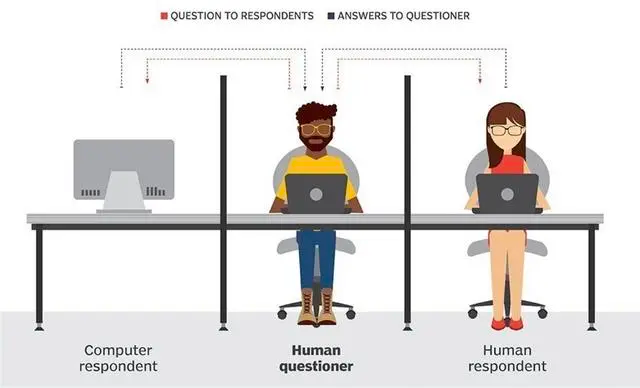

# 解密AI：从因果律到超级智能

> 原文地址: [https://mp.weixin.qq.com/s/vRaGupB0S-71IuXGXk1vOA](https://mp.weixin.qq.com/s/vRaGupB0S-71IuXGXk1vOA)

在这个充满无限可能的时代，我们常常思考这样一个问题：什么是人工智能？尤瓦尔·赫拉利在他的《人类简史》中提到，“这世间的一切皆是算法”。在人工智能领域，算法实质上就是函数。我们可以把一个神经网络视为广义上的函数，其中为输入变量，称为“因”，而函数的输出则被称为“果”。用公式表示即为。于是，“这世间的一切皆是算法”可以转化为“这世间的一切皆是”。

进一步推导后，我们会发现这一概念其实并不陌生。“因”与“果”的关系正是我们日常生活中无处不在的因果律。因此，“这世间的一切皆是”也可以理解为“这世间的一切皆是因果”。

最终，我们得到等式：

> “这世间的一切皆是算法！”
> 
> \= “这世间的一切皆是”
> 
> \= “这世间的一切皆是因果！”

## 深度学习与大模型训练

在人工智能深度学习领域，对某一特定现象进行数据化采样后，这些数据作为“数据集”被输入给函数处理。目的是希望在输入样本之后，能尽可能准确地模拟出期望的输出结果。为了实现这一点，函数内部结构需要不断调整，以达到最佳逼近效果。这种经过调整后的结构就是我们常说的“大模型”。

如果我们把整个世界看作一个整体，那么这个世界就可以用一个函数来表达世界。这个函数每天孜孜不倦地输出着各种结果，构成了我们眼前的世界，即世界。可以用世界世界世界来描述。

值得注意的是，世界的函数世界不需要我们人为去训练，因为造物主早已为我们安排好了这一切。这个宇宙诞生之初就固定下来的大模型，包含了所有基本规律、法则和定律。我们唯一能做的就是调整自己能够控制的某些变量，以期获得想要的结果。

## 科学探索与AI的角色

尽管人类已经研究了这个世界数千年，并发展出了语言符号文字以及科学体系，试图更清晰地描述和解析这个世界，但我们依旧无法完全掌握这个超级大模型的全貌。即使有了先进的AI技术的帮助，我们也只是触及了它的冰山一角。

人工智能也是对这个世界的一个细微描述，它是世界的一个输出。人类通过无数次尝试不同的输入，终于发现了AI这个令人惊讶的结果。例如，将GPU、TPU等硬件设施、神经网络架构、大规模训练数据集等要素组合起来，形成相关的，就能产生我们期待的。

## AI的发展潜力

当前，人工智能仍处于初级阶段，与完整的世界相比还有很大的差距。即便达到了AGI（通用人工智能）水平，仍有巨大的维度差异。然而，一旦到达ASI（超级人工智能）阶段，我们将看到弥合这一差距的可能性。根据《奇点临近》中的加速回归理论，一旦达到某个关键点，剩下的进程可能会迅速完成。

我对AI最终能够模拟出整个世界的信心坚定不移。有趣的是，尽管AI目前在世界面前显得微不足道，但它却与世界有着相同的“不可解释性”。这种特性很可能源于AI模仿了人脑中千亿级神经元组成的万亿级神经网络。

## 图灵测试与不可解释性

图灵在其经典论文《计算机器与智能》中指出，衡量智力的标准应基于其外部行为表现而非内在运作逻辑。图灵测试正是这一理念的体现，它关注的是机器是否能在某些方面表现出与人类相似的能力，而不是要求它们完全复制人类的思维方式。

ChatGPT这样的语言对话生成模型之所以被视为人工智能，是因为它们在与人类互动时展示的内容非常接近人类的真实反应，而不是因为它们的运算方式与人类思维相同。这是人工智能的“不可解释性”所在，也是它与传统机器学习的区别之一。

## 结语

虽然“不可解释性”让许多人对人工智能感到恐惧，但只有克服这种恐惧，成为AI的训练师、架构师，甚至最终与其融为一体，我们才能真正了解整个宇宙。在这个过程中，我们将不断探索、挑战自我极限，向着未知的未来迈进。无论前方有多少困难和挑战，我们都应该保持好奇心和探索精神，勇敢地迎接每一个新的发现。毕竟，正是这种不懈追求才推动了人类社会的进步和发展。随着科技的日新月异，相信不久的将来，我们将揭开更多关于人工智能乃至整个宇宙的秘密，书写属于我们的辉煌篇章。