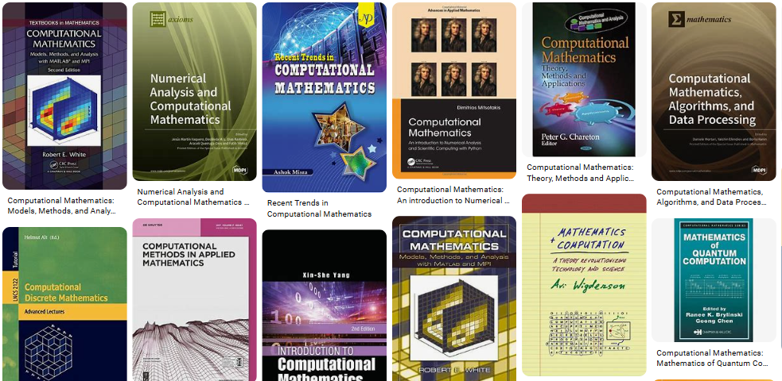
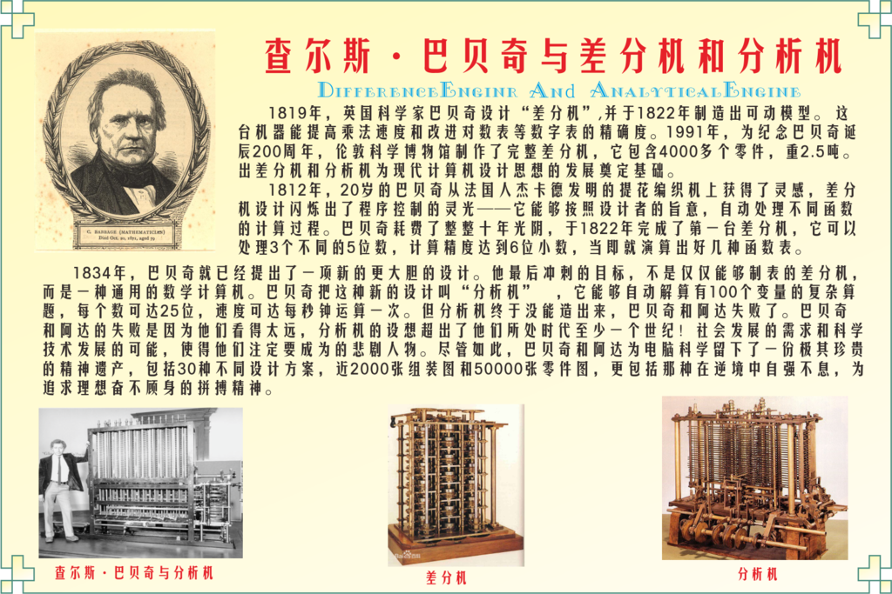
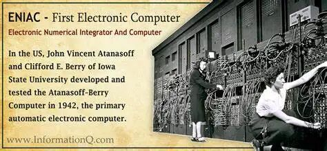
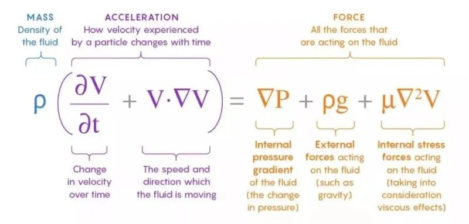
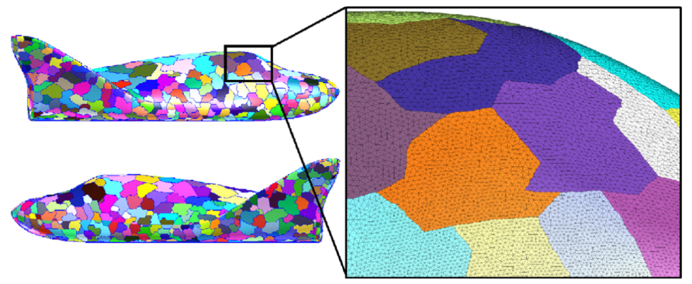
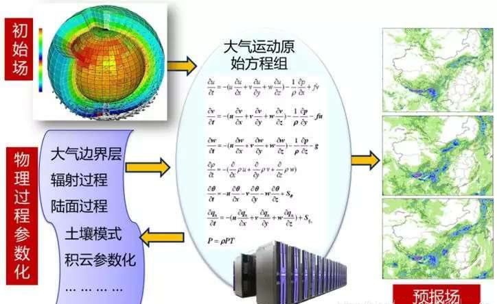
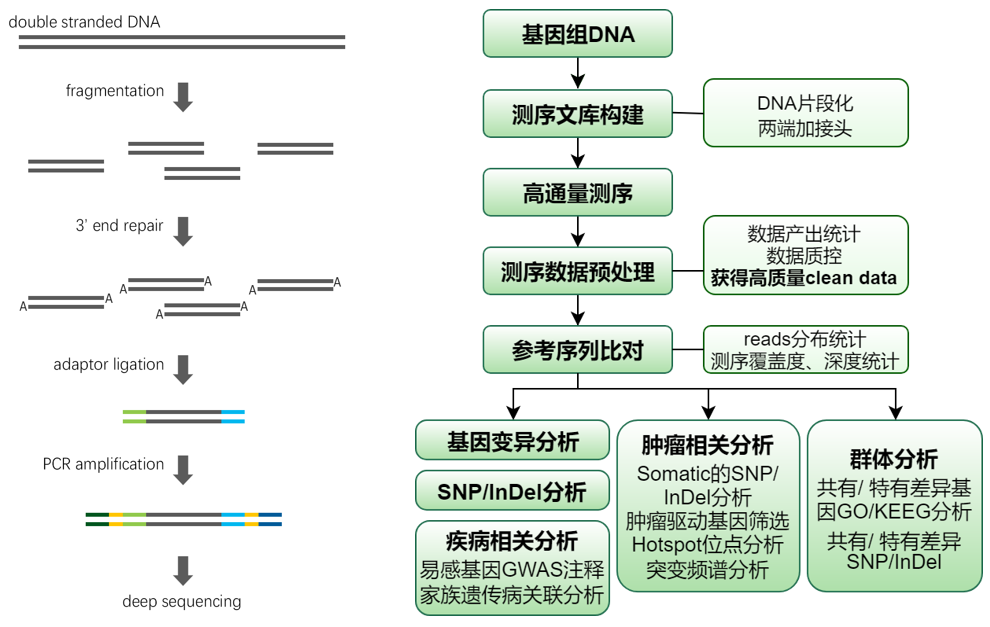
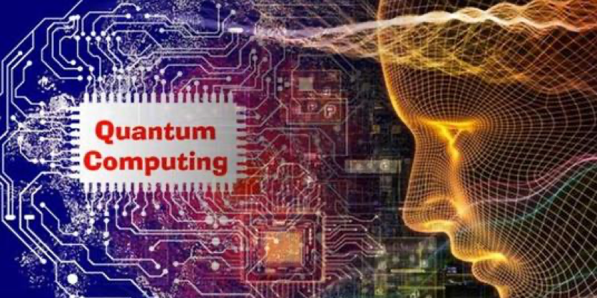

# 计算机与计算数学：从理论到实践的跨越

> 原文地址: [https://mp.weixin.qq.com/s/mkzgxCReU7tbyj8BcaUVRw](https://mp.weixin.qq.com/s/mkzgxCReU7tbyj8BcaUVRw)

  

  

在21世纪这个信息爆炸的时代，计算机已经成为我们生活中不可或缺的一部分。从智能手机到超级计算机，从互联网到人工智能，计算机技术的发展不仅改变了我们的生活方式，也推动了科学研究、工程设计等领域的深刻变革。然而，在这背后，有一门学科默默地为这些进步提供了坚实的理论基础和算法支持——这就是计算数学。

**计算数学**作为一门交叉学科，它融合了纯数学、应用数学以及计算机科学等多个领域的内容，旨在通过数值方法求解复杂的数学问题，并利用计算机实现高效准确的计算。随着计算机硬件性能的不断提升和软件算法的持续优化，计算数学的应用范围日益扩大，从天气预报到基因测序，从金融风险评估到航天飞行控制，几乎涵盖了所有需要定量分析的行业。本文将带您走进计算数学的世界，探索其历史渊源、核心思想及未来发展方向。

## 计算数学的历史沿革

### 早期探索：从手工计算到机械辅助

计算数学的历史可以追溯到古代文明时期，当时人们已经开始使用简单的工具进行基本运算。例如，古埃及人用绳子测量土地面积；中国古人发明了算盘来帮助商业交易中的加减乘除。到了17世纪，随着微积分学说的确立，牛顿和莱布尼茨等人开创性地提出了求解微分方程的方法，使得许多物理现象能够被数学模型描述出来。但是，由于缺乏有效的计算手段，这些理论成果往往只能停留在纸面上，难以应用于实际问题中。

直到工业革命时期，人类才开始尝试制造专门用于数学计算的机械设备。**查尔斯·巴贝奇**（Charles Babbage）设计出了差分机和分析机，虽然最终未能完全建成，但它们标志着自动计算时代的开端。进入20世纪初，**理查德森**（Lewis Richardson）这位英国科学家更是大胆构想了“天气预报工场”的设想，即通过大规模的人力协作完成复杂气象数据的处理工作。尽管受限于当时的条件无法真正实施，这一想法却预示着后来数值天气预报技术的成功之路。

### 里程碑事件：电子计算机的诞生

二战期间，为了满足军事需求，各国纷纷投入资源加速研制高性能计算设备。1946年，世界上第一台通用电子数字积分器与计算机 **ENIAC** 在美国宾夕法尼亚大学问世，开启了电子计算机的新纪元。随后几年里，**冯·诺依曼架构**的确立、存储程序概念的提出等一系列创新成果相继涌现，极大地提高了计算机的运算速度和灵活性。与此同时，**图灵机理论**为算法设计提供了坚实的理论依据，而数值代数领域的突破则让大型矩阵运算变得可行。

在此背景下，计算数学迎来了前所未有的发展机遇。一方面，科学家们不再局限于传统的解析方法，而是积极探索基于离散化思想的新途径；另一方面，借助快速发展的计算机技术，他们得以验证和完善各种数值算法，从而促进了该学科体系的逐步完善。

## 计算数学的核心内容

### 离散化：连接连续世界与离散世界的桥梁

在自然界和社会生活中，许多现象都可以用微分方程来描述。例如，流体力学中的纳维-斯托克斯方程、热传导过程中的傅里叶定律等都是典型的例子。

然而，直接求解这些方程往往十分困难，甚至不可能实现。因此，计算数学家们创造性地引入了**离散化**的概念，即将原本连续变化的空间或时间划分为若干个离散点或时间段，在每个离散单元内采用适当的近似函数代替原始变量，进而构建起一系列易于求解的小型方程组。

这种方法不仅简化了问题结构，而且使得复杂系统能够在有限精度范围内得到合理的近似表达。常见的离散化策略包括**有限差分法**、**有限体积法**和**有限元法**等。其中，

-   有限差分法是最古老也是最直观的一种方式，它通过泰勒展开的方式对方程中的导数项进行局部线性化处理；
    
-   有限体积法则侧重于保持物理量守恒特性，适用于流体动力学等领域；
    
-   而有限元法则因其灵活性强、适应范围广而在工程力学等方面展现出独特优势。
    

### 稳定性与收敛性：确保计算结果可靠性的关键因素

当我们将一个连续的问题转化为离散形式后，如何保证所得解的质量就成为了亟待解决的重要课题。具体来说，我们需要关注两个方面的问题：

-   一是算法是否稳定，即输入数据发生微小扰动时输出结果是否会随之剧烈波动；
    
-   二是算法是否收敛，即随着网格细化程度提高，计算所得近似解能否逐渐逼近真实值。
    

只有同时满足这两个条件，才能确保最终获得的结果具有较高的可信度。

为此，计算数学家们发展了一系列严格的理论框架和技术手段。例如，针对显式格式容易出现振荡失稳的情况，Crank-Nicolson 格式应运而生，有效克服了原有方法中存在的缺陷；又如，在研究非线性偏微分方程时，Lax-Richtmyer 定理给出了判断数值方案稳定性的充分必要条件；再比如，对于多尺度或多物理场耦合问题，则可通过引入多重网格法或多水平迭代法等方式提高整体效率。总之，通过不断改进和完善现有理论，计算数学始终致力于寻找更加稳健高效的求解路径。

### 高效性：追求极致性能的艺术

除了保证计算结果的正确性和可靠性之外，另一个不容忽视的因素就是效率问题。毕竟，在面对海量数据处理任务时，任何细微的时间延迟都可能导致整个项目的失败。为此，计算数学家们一直在努力探寻更快捷的解决方案。这里所说的“快”，不仅仅是指单次运算耗时短，更重要的是在整个求解过程中体现出良好的扩展性和并行性特征。

近年来，随着 GPU 加速卡、分布式集群等新型计算平台的普及应用，越来越多的研究者开始着眼于开发适合并行环境下的数值算法。例如，基于**区域分解**原理的 Schwarz 交替法可以将大规模问题拆分成若干个小规模子问题分别求解，然后再合并成全局解；又如，借助**机器学习**技术构建代理模型，可以大幅减少传统仿真所需的时间成本。此外，还有不少学者尝试结合**深度神经网络**与经典数值方法的优势，开辟出一条全新的智能化计算道路。

## 计算数学的应用实例

### 数值天气预报：从梦幻到现实的伟大飞跃

正如前文所提到的那样，理查德森早在1922年就曾梦想过建立一个庞大的计算工厂来进行全球天气预测。遗憾的是，受制于当时的技术水平，他的理想并未成为现实。直到1950年代，随着电子计算机的广泛应用，数值天气预报才真正步入正轨。特别是1954年 BBC 电台首次成功播报数值天气预报以来，这项技术得到了迅猛发展。如今，凭借超级计算机的强大算力和卫星遥感提供的丰富观测资料，我们可以提前数天乃至一周以上较为准确地预知未来的天气状况，这对于农业灌溉、航空运输等行业有着不可估量的价值。

值得注意的是，在数值天气预报中，计算数学扮演着至关重要的角色。通过对大气运动规律建模并离散化处理，研究人员能够模拟出不同高度层上的温度、湿度、风速等诸多气象要素的变化趋势。不仅如此，他们还会综合考虑地形地貌、海洋环流等多种因素的影响，力求使预测结果尽可能贴近实际情况。可以说，正是有了计算数学的支持，才使得现代气象服务变得更加精准可靠。

### 基因测序与生物信息学：解读生命密码的新钥匙

自人类基因组计划启动以来，科学家们已经积累了海量的 DNA 序列数据。如何从中挖掘有价值的信息，揭示遗传物质背后的奥秘，成为当今生物学研究中最热门的话题之一。在这里，计算数学同样发挥着举足轻重的作用。例如，在组装基因片段时，需运用图论知识构建最优路径；在比对不同物种间的相似性时，则要借助概率统计学原理计算距离矩阵；而在预测蛋白质折叠形态时，更离不开分子动力学模拟的帮助。

除此之外，计算数学还为个性化医疗带来了新的希望。通过分析患者个体的基因变异情况，医生可以根据具体情况制定更为合适的治疗方案。这不仅有助于提高疗效，还能减少不必要的副作用。总之，在生命科学领域，计算数学正以其独特的魅力吸引着越来越多的关注目光。

### 金融风险管理：防范经济危机的安全网

金融市场是一个充满不确定性的复杂系统，股票价格涨跌、汇率波动、信用违约等现象随时可能发生。为了有效应对这些挑战，金融机构必须建立起一套完善的风控机制。此时，计算数学再次挺身而出，为从业者提供了强有力的决策支持工具。

以期权定价为例，布莱克-舒尔斯公式便是利用随机微积分推导出来的著名成果。它通过设定合理的假设条件，将期权价值表示为标的资产当前价格、执行价格、到期时间等因素之间的函数关系。这样一来，投资者便可以根据市场行情及时调整仓位，降低潜在损失。类似地，在评估信贷风险时，Logistic 回归模型也被广泛应用于客户信用评分系统之中，帮助银行筛选优质贷款对象。总而言之，计算数学正在悄然改变着金融行业的运作模式，为经济社会健康发展保驾护航。

## 展望未来：计算数学的无限可能

回顾过去几十年间计算数学取得的巨大成就，我们不难发现，这门学科始终保持着旺盛的生命力和发展潜力。展望未来，随着量子计算、拓扑数据分析等新兴领域的崛起，计算数学必将迎来更加广阔的发展空间。一方面，传统数值方法将继续朝着精细化、高效化方向迈进，进一步提升求解精度和速度；另一方面，跨学科交叉融合将成为主流趋势，催生出更多富有创意的研究课题。

例如，在人工智能领域，深度学习算法本质上也是一种数值优化过程。通过借鉴计算数学的思想方法，我们可以更好地理解神经网络内部的工作原理，进而为其训练过程提供理论指导。又如，在材料科学方面，借助多尺度建模技术和高通量计算平台，有望加速新材料的研发进程，推动新能源、航空航天等行业实现质的飞跃。再比如，在智能交通管理中，利用大数据挖掘技术和实时仿真技术，可以优化城市道路布局，缓解拥堵现象，提高出行效率。

总之，计算数学不仅是现代科学技术发展的基石，更是人类探索未知世界的有力武器。相信在未来日子里，它将继续书写属于自己的辉煌篇章，为我们创造更加美好的明天贡献智慧与力量。希望读者朋友们能通过这篇文章对计算数学有一个初步的认识，感受到这门学科的魅力所在。

  

**往期推荐**

[

历史回眸：有限差分法的诞生与发展

](http://mp.weixin.qq.com/s?__biz=Mzk0MzI0NDU2NQ==&mid=2247490088&idx=1&sn=265b532af468d9a5289042ff85cb3939&chksm=c3378e52f440074474e423ca3a33c435b02050456559d02d5eae9ff96f6ad6fca1595569116e&scene=21#wechat_redirect)

[

网格剖分：寻找最优解的探索

](http://mp.weixin.qq.com/s?__biz=Mzk0MzI0NDU2NQ==&mid=2247489337&idx=1&sn=a07b1d7fac502a7b7e68ebea1efe3f84&chksm=c3378343f4400a556cfe49992b991e20ec0a9b53ba09d056c8ac67c1d6b667cea380ef4fa3fc&scene=21#wechat_redirect)

[

数值计算中的误差及减小误差的原则

](http://mp.weixin.qq.com/s?__biz=Mzk0MzI0NDU2NQ==&mid=2247488424&idx=1&sn=b6654a3d4f75bb83a0c3abba0661079f&chksm=c33787d2f4400ec47a76f6bda3d5feb1a3d72cc34d6369b47354132b641207db0dc3f74f0f73&scene=21#wechat_redirect)

  

## 推荐阅读

  

‍

  

  

**给我一组控制方程，还你一套专业软件。**我们长期从事多场耦合有限元算法和软件的研发工作，掌握全流程的 CAE 软件开发技能。如果您需要相关的技术服务，非常欢迎私信交流和扫码咨询。

**喜欢****作者******，请点********赞********和在看********

****