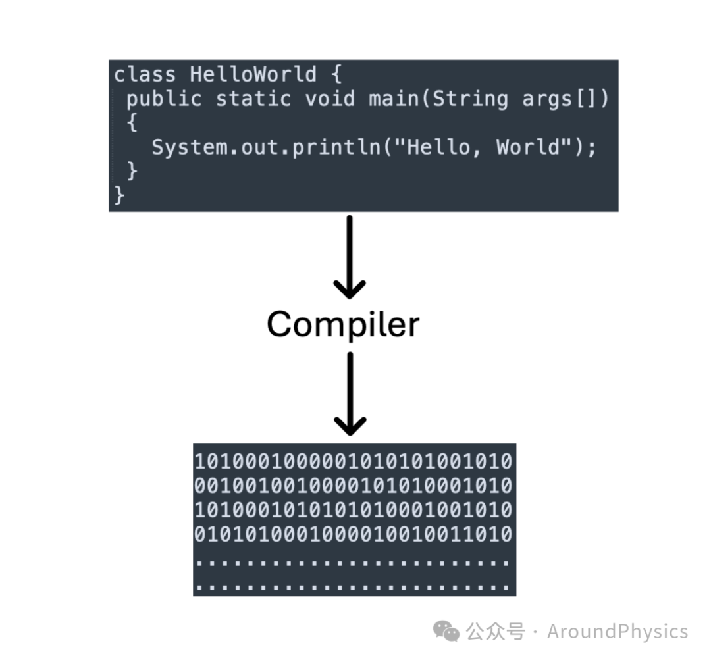
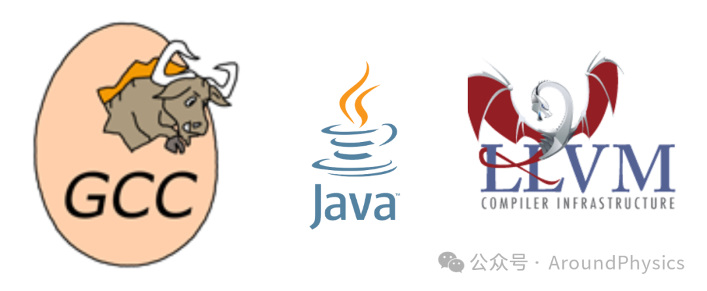

# 计算机编译器Compiler的发展历程

> 原文地址: [https://mp.weixin.qq.com/s/IMYhSFPcaKqxiTK4f\_yMsQ](https://mp.weixin.qq.com/s/IMYhSFPcaKqxiTK4f_yMsQ)

编译器是计算机科学领域中的一个核心概念，它为高级编程语言到机器代码的转换提供了关键的工具和技术。编译器技术的发展历程是计算机科学发展的一个重要组成部分，它经历了多个阶段的演变和进步。

1.  早期编译器与解释器
    

编译器的发展可以追溯到计算机科学的早期阶段。20世纪50年代，随着计算机技术的发展，人们开始尝试将高级编程语言翻译成机器语言，以便计算机能够理解和执行。最早的编译器和解释器出现了，这些工具使程序员能够使用更高级别的抽象来编写程序，而不必直接面对底层的机器细节。

2.  优化编译器的兴起
    

20世纪60年代，随着计算机硬件性能的提升，人们开始探索如何提高编译器的性能。优化编译器技术应运而生，这些编译器不仅能够将高级语言转换为机器代码，还能够在此过程中应用各种优化技术，以提高程序的执行效率。例如，常量折叠、死代码删除、循环展开等技术被引入到编译器中，以生成更加高效的机器代码。

3.  结构化编程和面向对象编程
    

20世纪70年代和80年代，结构化编程和面向对象编程成为主流。编译器开始支持更多结构化编程语言的特性，如过程和函数、控制结构等。同时，随着面向对象编程的兴起，编译器也开始支持面向对象语言的特性，例如类、继承、多态等。这一时期，C++、Objective-C等语言的编译器相继问世，为面向对象编程提供了更好的支持。

4.  并行计算和多核处理器的挑战
    

进入21世纪，随着多核处理器和并行计算技术的出现，编译器技术面临新的挑战。传统的编译器需要考虑并行执行、数据共享和同步等问题，以充分利用多核处理器的性能优势。因此，一些新的编译技术应运而生，如自动并行化、向量化等，以优化并行计算性能。

5.  即时编译技术的发展
    

21世纪初，随着虚拟机技术的普及，即时编译（Just-In-Time Compilation, JIT）技术开始得到广泛应用。JIT编译器在程序执行过程中将高级语言代码动态编译成本地机器代码，从而提高程序的性能。JIT编译器在Java虚拟机、.NET平台等领域得到了广泛应用，极大地提升了动态语言和虚拟机环境的性能。

6.  面向领域特定语言（DSL）的发展
    

近年来，随着对定制化需求的增加，面向领域特定语言（DSL）的发展越来越受到关注。DSL是针对特定领域或问题领域设计的编程语言，它可以提供更高效、更具表现力的编程体验。编译器技术开始应用于DSL的开发，以提供定制化的编程解决方案。

编译器技术的详解

编译器技术涉及多个细节和方面，包括词法分析、语法分析、语义分析、优化和代码生成等：

词法分析（Lexical Analysis）：词法分析是编译过程的第一个阶段，其主要任务是将源代码中的字符序列转换为单词（Token）序列。这个阶段通常由词法分析器（Lexer）来完成，它根据事先定义好的词法规则（正则表达式或有限自动机）来识别和生成单词。

语法分析（Syntax Analysis）：语法分析是编译过程的第二个阶段，其主要任务是将单词序列转换成语法树或语法分析树（Parse Tree）。这个阶段通常由语法分析器（Parser）来完成，它根据事先定义好的语法规则（通常是上下文无关文法）来解析单词序列并构建语法树。

语义分析（Semantic Analysis）：语义分析是编译过程的第三个阶段，其主要任务是对语法树进行静态语义检查，以确保程序的语义正确性。这个阶段通常包括类型检查、作用域分析、常量折叠等处理，以及生成符号表等数据结构。

优化（Optimization）：优化是编译过程中的一个重要环节，其目标是通过改进生成的中间代码或目标代码，以提高程序的性能和效率。优化技术包括常量传播、死代码删除、循环优化、内联函数、代码重排等，这些优化技术可以单独应用也可以组合使用。

代码生成（Code Generation）：代码生成是编译过程的最后一个阶段，其主要任务是将经过优化的中间表示（如语法树、三地址码等）转换为目标机器代码。这个阶段通常由代码生成器完成，其生成的机器代码可以是汇编代码、目标机器指令等，以便计算机硬件能够执行。

符号表管理（Symbol Table）：符号表是编译器中用于存储变量、函数、类型等符号信息的数据结构。它记录了这些符号的属性和作用域信息。在编译过程中，符号表被用于进行语义分析、代码生成等操作，同时也需要进行管理和维护。

错误处理（Error Handling）：错误处理是编译器中一个重要的功能，它负责检测并报告源代码中的错误，如语法错误、类型错误等。编译器需要设计合适的错误处理机制，以便及时发现和定位错误，并提供有用的错误信息帮助程序员进行修复。

编译器技术涉及的细节非常丰富，包括词法分析、语法分析、语义分析、优化、代码生成、符号表管理和错误处理等方面。这些细节相互配合，共同构成了编译器的核心功能和流程。

以下是几款在计算机科学领域中具有重要地位的编译器：

GCC (GNU Compiler Collection)：GCC是一套由GNU开发的编译器集合，支持多种编程语言，包括C、C++、Objective-C、Fortran、Ada等。它是开源软件，广泛用于各种操作系统和平台，包括Linux、macOS、Windows等，被认为是业界最主要的编译器之一。GCC除了提供基本的编译功能外，还包括优化功能和调试工具，能够生成高效的机器代码。

LLVM (Low Level Virtual Machine)：LLVM是一个模块化和可重用的编译器架构，提供了一组用于构建编译器的工具和库，包括编译器前端、优化器和代码生成器等。LLVM的设计使得它更容易与其他工具集成，并且能够提供更好的优化和可扩展性。

Microsoft Visual C++ Compiler：Microsoft Visual C++ Compiler是Microsoft开发的C++编译器，用于Windows平台上的C++开发。它是Microsoft Visual Studio集成开发环境的一部分，支持最新的C++标准，并提供了强大的优化和调试功能。

Java 编译器 (javac)：Java 编译器 (javac) 是用于将Java源代码编译成字节码的编译器。它是Java开发工具包 (JDK) 的一部分，被广泛用于Java应用程序的开发和部署。

Clang/LLVM：Clang是基于LLVM的C、C++、Objective-C编译器前端，被广泛用于替代传统的GCC编译器。它具有更好的错误信息和诊断能力，速度更快，并且支持更多现代化的语言特性。

编译器技术作为计算机科学领域中的一个重要分支，在过去几十年中取得了巨大的进步。从最早的简单翻译器到如今复杂的优化编译器系统，编译器技术不断演进，以满足不断变化的需求和挑战。随着技术的不断发展，编译器技术将继续发挥重要作用，推动计算机科学领域的进步与创新。