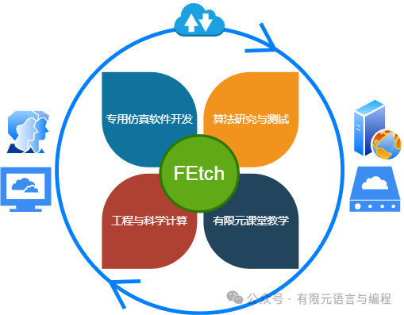

# 谈谈有限元程序开发，兼谈 FEtch 入门

> 原文地址: [https://mp.weixin.qq.com/s/JyxHoiBGssPKnEnpBc0pHg](https://mp.weixin.qq.com/s/JyxHoiBGssPKnEnpBc0pHg)

## 学习基础

经历过近几年研究生招生，我们发现喜欢做计算的学生明显要少于喜欢做实验的。就岩土工程专业来说，十个当中能有一个感兴趣就算相当不错了。思索良久，一个重要的原因应该是数值计算的入门门槛比较高，所需的基础知识范围比较广。要知道，数学基础、专业知识、编程技能，这三个方面的功力都要过硬，才有可能做出像样的原创性成果。

粗略地讲，一个合格的有限元计算方向的研究生，至少要扎实地学习过以下一些**课程**：

-   **数学基础**  
    微积分、线性代数、数值分析、数学物理方程
    
-   **有限元基础**  
    变分原理和加权余量法、有限元方法
    
-   **专业知识基础**  
    固体力学、传热学、流体力学、渗流力学 **或** 电磁学，等等
    
-   **编程基础**  
    Fortran、C/C++、Matlab **或** Python 等至少一种，且需具备一定的实操经验
    

以上课程应该是最基本的，任何一项都不可或缺。从一个科研老鸟的角度，这些内容并不算太多，相信理工科的大多数同学在本科阶段或硕士一年级阶段完全可以掌握这些知识。需要说明一下，学习这些课程时，重要的不是解题有多快，分数有多高，而是**要建立起清晰的理论框架和逻辑体系，概念性和公理性的知识一定要深刻理解，杜绝原则性的错误**。过了基础这一关，就可以进入自己专业课题的研究阶段了。

## 从零开发有限元程序的难度

在开始写有限元程序之前，我们首先要对什么是程序有一个清晰的认识。简单来说，

> 程序 = 算法 + 数据结构

一套完整的有限元程序也是这样构成的。从上述框架出发，有限元方法对应的其实是算法部分。随手拿一本有限元的书翻一翻，你就可以得到详细的计算步骤甚至伪代码，掌握难度相对不大。而最繁杂的部分，其实在于数据结构。

有限元计算过程会涉及到**大量的信息**，包括但不限于

-   节点坐标信息
    
-   节点自由度信息
    
-   网格信息
    
-   材料信息
    
-   初值信息
    
-   边值信息
    
-   控制参数信息
    
-   计算结果信息
    

这些信息所对应的**数据的存储和传递策略，以及如何与前后处理器无缝对接**，对于程序开发人员来说，这本身就是一个极大的考验。

展开来讲，比如，如何设计数据存储格式，以方便地统筹管理一维、二维和三维问题的数据，保证良好的统一性；如何协调组织不同单元类型的网格剖分数据，例如应对同时存在三角形单元和四边形单元的情况；如何组织物理材料信息，以便于处理材料分层的问题；如何实现不同类型的边界条件，要知道第一类和第二、三类边界条件的处理方法是完全不同的；等等，这些都需要自己来设计规划。

此外，**数据结构与你选择的编程语言也有很大关系**。Fortran、C/C++ 和 Matlab 语言本身就各具特点，相应的，适合的数据结构也是大相径庭。其他的，再如，开发策略上是面向对象还是面向过程，是计算效率优先还是计算规模优先，等等，这些都要求你有深厚的编程功底，才有可能从容地进行研判和取舍。

明白了以上逻辑关系，就不难想象自己从零开始开发一套有限元程序是多么困难了。在你有限元理论基础非常扎实的前提下，如果没有饱满的热情，没有大量的时间和精力的投入，这仍将是一项不可能完成的任务。

## 什么是 FEtch

为了**将科研工作者从繁重的代码编写工作中解放出来**，为用户节省大量的编程时间，大幅降低有限元程序的开发成本，我们推出了一款专业的软件开发平台 —— FEtch 系统 （**F**inite-**E**lement-applica**t**ions generating ma**ch**ine）。

FEtch 是近四十年来不断发展和完善的有限元语言的全新生成器。其核心是采用专用的有限元语言来书写程序的代码，通过元件化思想来实现有限元计算的基本工序，从而为各领域、各类型的有限元问题提供一个极其有力的求解工具。

**从程序开发角度来看，FEtch 系统本质上是定义了一套较为通用的数据结构和有限元算法库，并进行封装处理，然后以此为基础设计了操作规范。**它的底层是大量的模板文件，顶层是相应的语法规则。用户在使用时，只需按照格式要求编写脚本文件即可，从而摆脱了繁杂的需要特别处理的数据结构的烦恼，这样就可以让用户将主要精力集中在最有创造性的工作，即物理模型建立和更高效的算法研究上，实现将理念快速转化成为现实成果。

毫不夸张地说，**掌握了 FEtch，你可以在数天甚至数小时内完成通常需要一个月甚至数月才能完成的编程工作。**如果你正在编写有限元程序或者有志于开发属于自己的专用有限元程序，那么，非常欢迎你一起加入 FEtch 学习的大家庭！

  

## 如何快速入门

兴趣是最好的老师，或者说，在学习中找到乐趣才能持续学习下去。学习过程中，一定要找到自己专业方向相关的合适的应用场景，尽早做出东西来。即使是最简单的算例实现也行。**由易到难，由简到繁，逐步推进；做出结果，不断地得到正反馈，才能在其中找到乐趣。**

总的来说，不同类型问题的程序的**开发难度**大致有如下排序：

-   稳态 < 瞬态
    
-   线性 < 非线性
    
-   单自由度 < 多自由度（标量场 < 矢量场）
    
-   单物理场 < 多物理场
    
-   全耦合 < 解耦合
    
-   1 维 < 2 维 < 3 维
    
-   直角坐标系 < 柱坐标系 < 球坐标系
    

稳态线性问题是基础中的基础。新手可以从简单的问题入手，循序渐进，逐步增加难度。

例如，对于传热学方向，这里推荐从二维问题结合一维算例入手，按照线性稳态->线性瞬态->非线性稳态->非线性瞬态的顺序来学习。基础打牢之后，再换成三维问题，重新开始以上的学习步骤。其他学科方向也是类似的。

这里推荐**从 FEtch 技术网站的公开算例开始**你的学习。网站上的每一个算例都讲解得非常详细，包括具体问题的控制方程、弱形式、求解策略、源代码、前处理的详细步骤和后处理的计算结果。这些算例都是经过充分测试的，通过简单的复制粘贴和单击操作就可以得到一套短小精悍的有限元程序。

在学习算例的过程中，适当阅读有限元语言的语法文档。做到**以算例为主，语法文档为辅。** 如果你能完成整个网站一半的算例，语法自然而然也就掌握了。一定不要抱着语法文档死读，太乏味了，你会头晕的！

学会重复、学会继承，在此基础上才能继续发展、继续创新。

## 一些小建议

最后，还有以下几个小建议供大家参考：

-   动手之前，请先理清 FEtch 客户端、FEtch 服务器、有限元语言脚本、生成的 exe 程序 和 前后处理软件 GiD 这几者之间的关系，理解工作目录下每个文件的作用和存在的意义。
    
-   FEtch 以 Fortran 90 作为有限元语言的目标编译语言，中间会用到大量的 Fortran 语句。如果你的 Fortran 编程基础为零，那么请先入门一下 Fortran。不必学得太深，能够看懂算例中 Fortran 语句就可以了。Fortran 是最接近自然的数学语言，它的入门门槛其实非常低，所以不必有太大的心理负担。后面完全可以边用边学，根据自己的需要，继续深入学习 Fortran 编程。
    
-   如果出现有限元知识严重不足的情况，例如，弱形式不会推，方程、有限元基本理论、源代码总是对不上，和自己的专业知识关联不起来，等等，这是前期欠账太多的结果。不管是查阅图书文献，还是去听公开课，请全力以赴，先补全欠缺的知识点。
    
-   你必须要有明确的研究问题，明确的研究目的。你的目的不能抽象，必须可以分解成可实施的详细步骤。
    
-   不要收集了一大堆资料，逛了一大堆论坛，就是不动手。边操作、边研究、边学习、边解决，研究才是最好的学习。问题解决之日，就是学习完成之时。
    

暂时先总结这些，后续根据具体问题再慢慢补充。

欢迎使用 FEtch ，Gook Luck ！

有任何疑问或建议，欢迎加Q群 "**FEtch有限元开发系统(519166061)**" 留言讨论。我们长期开展 FEtch 系统的免费试用活动，感兴趣的朋友入群后可直接联系管理员，免费获取**许可证文件**。