# 边值问题与泛函问题的互推技巧

> 原文地址: [https://mp.weixin.qq.com/s/cMEREFhuM4M1gLjce\_8krA](https://mp.weixin.qq.com/s/cMEREFhuM4M1gLjce_8krA)

简述

在有限元法的实现过程中，获得有限元离散方程的关键是将边值问题转化为泛函求极值问题，即变分问题（Ritz法）。但是对于Ritz法，往往难以理解并获得泛函问题，因此往往有限元的推导选择加权余量法，即伽辽金方法进行推导。

这里介绍一种边值问题与泛函问题的互相推导技巧，意在能够更加深入的理解边值问题与泛函问题的等价关系。推导问题针对一维边值问题的通式。

1.边值问题到泛函问题的推导

一般的已知边值问题均可以表示为：

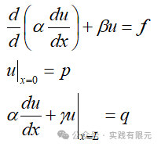

其中，包括了第一类边界和第三类边界。

对边值问题乘以试探函数（权函数）并积分，类似伽辽金法的做法，得到：

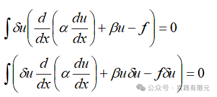

当α系数是连续的情况下，对上述积分式子的第一项进行分部积分，得到：

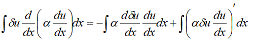

导数的积分等于本身：

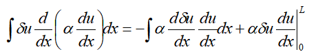

由于在x=0位置，u=p为第一类边界条件：注意这里的推导已经使用到第一类边界条件边界条件：    

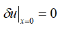

所以有：

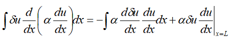

带入到原方程得到：

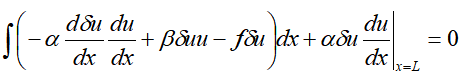

注意，上述式子就是我们经常使用伽辽金方法得到的变分问题，如果将其进行离散，即可进一步得到有限元离散方程。

现在我们将对变分结果进行反推得到泛函问题，一个基本常识知道，泛函取极值问题则是变分，即泛函对u的导数则是上述式子左边的结果，因此对变分求u的积分即是泛函的结果：

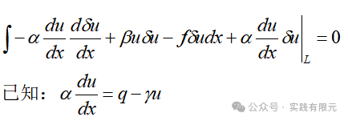

注意这里是带入了第三类边界条件：

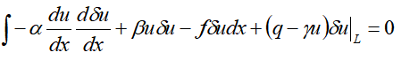

deta u看出是微分的概念，对u进行积分，得到泛函F:

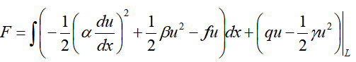

此时，就由边值问题推导得到了泛函方程。注意，这里是对u进行积分，所以对x的积分或者导数无影响。

总览推导过程，我们是先从边值问题得到了变分问题，然后在积分得到泛函问题。整个过程中将边值问题的边界条件融入到推导过程中。    

2.泛函问题推导到边值问题

理解了上述逆向推导过程，泛函到边值问题的正向推导就会显得非常简单，首先对泛函问题的u进行求导得到：

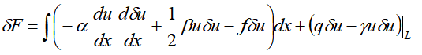

变分问题，也就是泛函求极值的问题，所以令上述方程等于0：

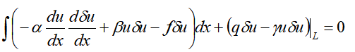

对第一项进行分步积分：

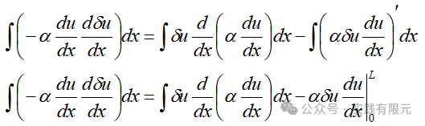

带入原方程中：

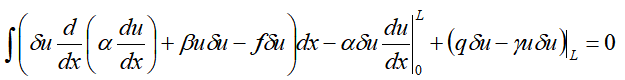

这里需要注意，考虑第一类边界条件x=0，u=p，则detaU=0带入整理方程，整理得到：

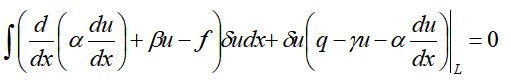

已知deta u为微分的概念，不常为零，因此想要方程等式成立，积分项与边界项必须同时为零，从而得到：

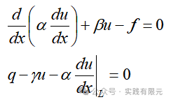    

最终，添加已经使用的第一类边界条件，得到整理即可得到边值问题：

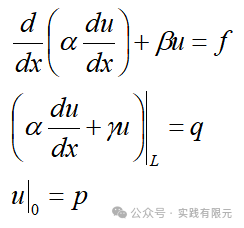

需要注意的是，这里我们也是提前使用了第一类边界条件，否则会得到一个第二类边界条件：

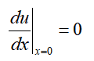

该边界条件又称之为自然边界条件。从有限元实现的角度可以发现，该边界条件不需要进行任何处理，因为其结果为零。

3.总结

a.该上述技巧使用伽辽金方法的推导方法，实现了泛函问题与边值问题的互推方法，对有限元的理解与推导具有一定的帮助；

b.该方法的关键在于将deta u理解为微分的概念；

c.需要注意，该方法推导过程存在一些不严谨地方，例如连续性等笔者未考虑的问题，但是对于帮助二者之间的推导是有一定帮助的。