# 边界元入门-基础知识

原创 cx ycx 实践有限元 2025-07-26 19:03 四川

> 原文地址: [https://mp.weixin.qq.com/s/oeiwDGPHVlO8clo84HH24A](https://mp.weixin.qq.com/s/oeiwDGPHVlO8clo84HH24A)

简述

该文章补充边界元相关的一些数学知识，能更好地理解边界元的原理与实现方法。

1.Deta函数的定义

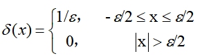

根据函数定义满足：

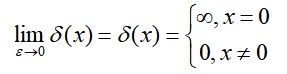

该函数在积分下有明确的意义：单位脉冲函数

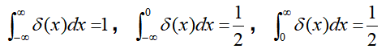

对于任何包围x=0的区间内，均满足以上积分结果。因此，它的一个重要的性质，若u(x)在x=0处连续，则有：

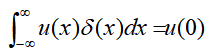

示意图表示：

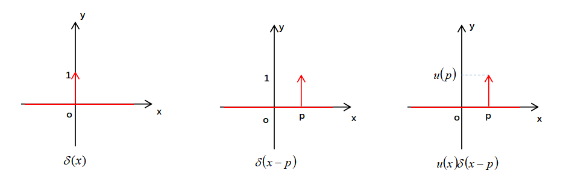

通过上述deta函数的性质与示意图，我们进一步了解，deta函数在x=p位置有值，其他位置为零。因此，任意函数乘以deta函数，得到的均是x=p处的结果。

如果将deta函数作为一种基函数来理解，不同位置的deta函数即可离散表示一个连续的函数。例如任意为值的p点：

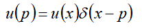

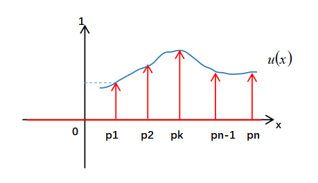

可见，deta函数作用在任意函数上，相对于在对应的p点位置采样。还可以发现，deta函数的一个重要性质，无论函数u是几维度,通过deta函数作用后统统变成的零维。这点在边界元的推导中起到了非常重要的作用。

2.基本解的概念

线性微分算子L对函数u进行某种微分，构成的方程：

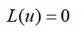

例如拉普拉斯算子等。

用点q表示动点，p表示固定点，若某函数经过微分算子L微分运算后，得到一个以p点为中心的负deta函数。即：

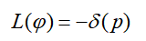

则称该函数为微分算子的基本解。

下面以三维拉普拉斯算子的基本解为例子：

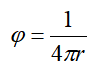

该基本解满足：

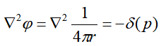

证明：将三维坐标写成球坐标形式：

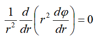

积分结果为：

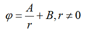

让该式子依次满足基本解的定义，即phi函数通过拉普拉斯算子后，得到一个负deta函数。根据deta函数性质，有：

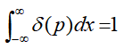

因此，将求解的解带入拉普拉斯算子，要求下面等式成立，求出其中的A和B

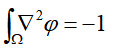

直接对上述式子求导积分肯定不行的，会发现等于0。我们需要对其做散度定理，将区域积分变换到边上积分。

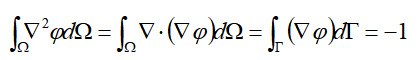

将积分坐标系放置在球坐标系上，此时公式变成：

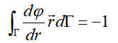

带入求解的phi解，得到：

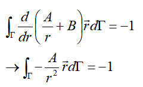

由于r是球的半径，而积分区域是球面，因此积分过程不会对r产生变换，此时，上述积分可以得到：

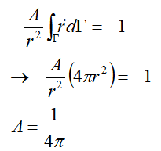

带入到原结果，取B=0，得到：

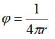

如此，求得三维拉普拉斯算子的基本解。在电场中，基本解的意义点单位电量的电荷在空间中的电场分布规律。常见的两个微分算子的基本解：

二维拉普拉斯方程的基本解：

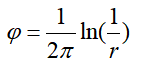

三维霍姆霍兹方程的基本解：

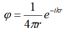

由于一些复杂的微分算子其基本解很难获得，因此这也是限制边界元运用的一个重要原因。

3.格林公式

第一格林公式：

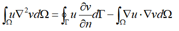

第二格林公式：

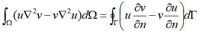

这里提及格林公式的并不是准备证明或者推导，这是观察到其方程的一些特点，有助于我们进一步了解有限元与边界元的一些联系。

观察第一格林函数，如果熟悉有限元公式推导，会发现这个公式很熟悉，例如在对拉普拉斯方程的有限元推导过程中，v是未知量：

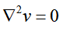

将该微分方程变成有限元方程的时候，首先乘以试探函数u，然后使用恒等式将二次导数降阶（分步积分），得到的就是第一个格林公式：

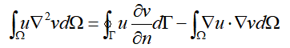

在有限元中，一般在边界上已知v值，或者知道其梯度值，此时右端第一项均作为已知的右端项处理，从而获得区域内部的有限元方程：

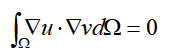

这是有限元的推导。在边界元中用到的也是格林公式，只不过是第二格林公式。第二格林公式的由来也很简单，将第一格林公式的v,u互换位置，然后相减，即可得到。

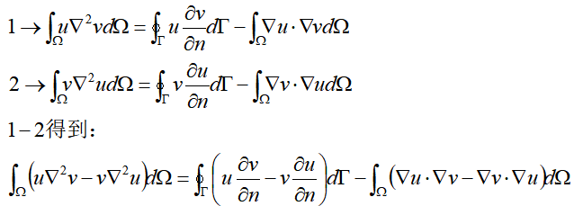

由于等式右端第二项的内积是可以互换的，因此这一项等于零。由此获得格林第二公式。很神奇的事情，第二格林函数中消掉了使用在有限元中梯度乘梯度的积分项。反而保留了边界项。

而边界元的推导，正是从第二格林函数开始的。边界元的进一步推导中，引入的基本解的函数v，其具有deta函数的性质，进一步将左边项的区域积分降维，最终实现将区域求解问题全部转化为边界求解问题。

例如拉普拉斯方程，deta函数性质使得下面式子成立：

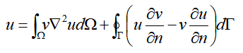

而本身u的拉普拉斯算子等于零，于是得到与区域内完全无关的边界积分方程：

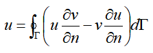

即使微分方程的右端项不为零，例如泊松方程，但是方程可以显示的获得：

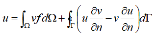

此时由于基本解已知，f已知，因此可以提前使用解析的方法获得该项的积分结果，也相当于只求解边界上的数值结果。

总结

本文介绍了边界元实现的基本原理，通过把deta函数，基本解，格林第二公式巧妙的结合，降低模型维度，获得仅含有边界项的积分方程。

第一、二格林公式分别作为有限元、边界元方法推导过程中的重要公式，其中奥妙不可言语，感叹格林公式的强大，用AI的话来说：

“第一格林公式通过能量关联为FEM提供变分基础，而第二格林公式通过基本解为BEM提供降维工具。二者在数学上的递推关系反映了从全域能量描述到边界相互作用描述的过渡，恰好对应FEM和BEM的不同建模哲学。”

* * *

博主长期深入实践电磁学领域的有限元技术，感兴趣的朋友可以添加博主公众号，欢迎共同探讨与有限元相关的技术知识。