# 边界元入门实现-二维拉普拉斯方程

原创 cx ycx 实践有限元 2025-07-22 18:21 四川

> 原文地址: [https://mp.weixin.qq.com/s/-u3b1U6p8MvcBMf1DMBmzg](https://mp.weixin.qq.com/s/-u3b1U6p8MvcBMf1DMBmzg)

简述

本文介绍边界元（BEM）数值模拟方法，在实际情况中，有限元虽然能解决几乎所有问题，但是当考虑到效率与精度的时候，与其他方法融合或许会有更好的效果。

本文是入门级的边界元实现，基于简单的拉普拉斯方程实现了边界元数值模拟的基本流程。

1.边值问题

边值问题还是以最为熟悉的拉普拉斯方程为例，求解同心圆上任意一点的电位分布。

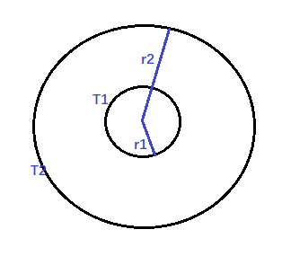

二维拉普拉斯方程：

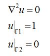

可以获知，拉普拉斯方程的基本解为：

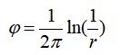

基本解具有性质：

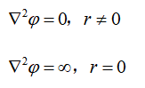

满足deta函数：

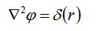

具有deta函数性质：

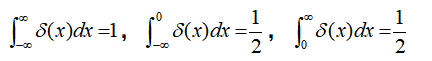

对于任何包围x=0的区间内，均满足以上积分结果。因此，它的一个重要的性质，若u(x)在x=0处连续，则有：

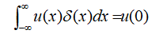

基本解的意义：在二维均匀空间中，放置在P位置的点电荷在看空间任意位置产生的电势。可以看出，其u的拉普拉斯算子积分其实就是电荷密度的积分，积分结果为1，说明正好是点电荷。

2.区域内积分方程

接下来推导积分方程，已知第二格林函数公式如下：

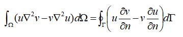

将待求解u和基本解带入其中，得到：

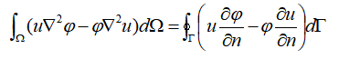

进一步推导，带入基本解与待求解u的拉普拉斯算子所具有的性质：

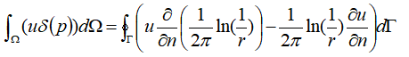

分析上述等式未知数，左边项表示区域内任一点位置的u值，右边点为边界上的u值与u值的梯度。

所以，上述等式表示，区域内任意一点位置的u值，可以通过边界u值及其梯度的积分运算获得。

在该问题中，边界的u值是已知的，未知的是u值的梯度。因此，对于二维区域问题而言，简化为求解一维边界问题，只要求解获得u及其梯度，那么其他位置均可以获得。这就是边界元中，将二维将阶到一维的本质原因。

要完成这求解，还必须知道左端项在边界上的deta积分。

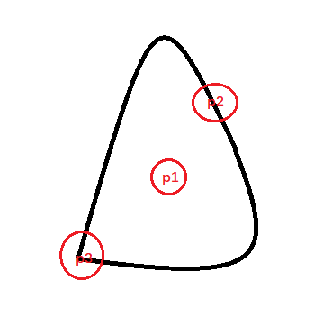

这里不对deta积分做严格推导，通过上述示意图可以很好的理解其积分结果。图中三个点的特性：p1是区域内任意点不包含边界；p2表示边界上连续的点；p3表示边界上间断的点。

对于p1点而言，其位置的的积分结果可以理解为，围绕p1的红圈的面积乘以deta的值，由于deta仅在p1等于1，此时让红圈半径r逼近于0，不难看出，p1位置的积分结果：

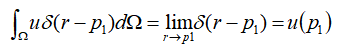

继续分析p2点的积分结果，同样的道理，红圈半径r逼近于0的时候，得到p2的积分，但是此时区域内的面积仅仅占红圈面积的一部分，由于p2是连续的，因此随着红圈r的缩小，红圈内属于区域内的面积将逐渐趋于一半，此时，p2的积分结果可以获得：

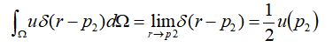

分析p3点，此时由于p3是不连续的，无论红圈r如何小，p3始终存在一个折角，此时红圈面积始终被该折角分为两部分，区域内占据其中一部分，因此通过折角可以知道红圈面积在区域内的实际占比，由此可以获得p3的积分结果：

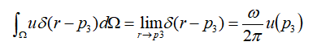

对于本次求解而言，边界上全部是连续的，因此边界积分方程进一步可以写成：

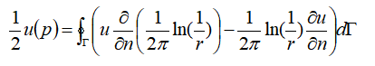

简化写，得到：

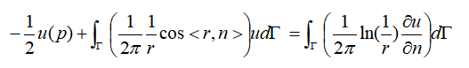

上述方程，才是符合该问题的边界积分方程。

3.离散边界积分方程

获得积分方程后，下一步需要将连续的边界离散化，然后使用基函数获取每一段的积分结果，最终累加所有单元获得整个边界的积分公式，因此，积分方程的离散化形式可以写成：

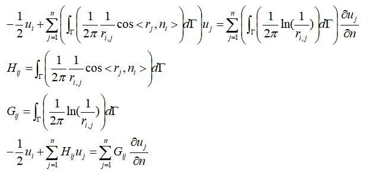

最终，可以表示为：

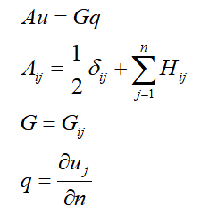

可以从边界元积分方程的离散结果看出，任意一点u的值的贡献，是由边界上所有边界点的场值与场值梯度的贡献。因此，可以推断最终矩阵A,G应该是一个满阵。

在每个单元中，边界元也存在基函数，这里一个单元仅取中点最为待求解未知数，属于零阶基函数，即N=1。

在实现中，最重要的步骤就是求解H矩阵和求解G矩阵。由于是零阶基函数，因此一个单元对应的H,G就一个数据，其中需要注意的问题：

I.当r=0的时候，也就是i==j的时候，此时1/r等于无穷大，需要特殊处理,需要使用求极限的方式求取Hii和Gii的结果。  

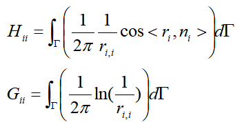

对于Hii不难得出，由于ij重合，r的方向和n的方向相互垂直，此时cos(pi/2)=0，因此Hii=0。

对于Gii，首先将Gii的积分区域进行变换：  

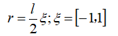

此时，积分区域变成\[-1,1\]，Gii变成：  

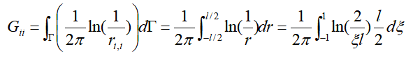

进一步推导：  

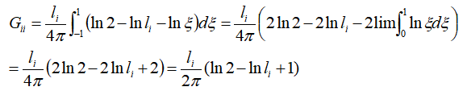

对于式子中的积分项，可以通过求极限获得：  

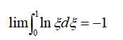

如此，获得Gii的计算公式：  

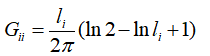

II:注意i点的法相方向与j到i的向量方向的乘积。

由于在计算Hij的过程中，需要注意单元的法向方向于r的方向向量，因此必须统一单元的方向性问题，由于本问题是同轴圆问题，因此方向规定为，内圆的法向朝着内部，而外圆的法向朝着外部。

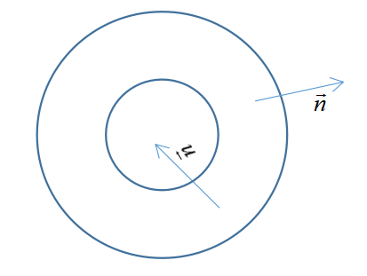

处理好这些问题后，即可正确的求解G、H矩阵，需要提醒，对于i不等于j的情况，最好使用高斯积分求解，并且可尝试不同阶数的高斯积分，以获得最佳精度。

最终获得系数矩阵方程如下：  

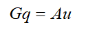

已知u，求解得到q。然后根据区域内的积分公式，获得任意点位置的u值：  

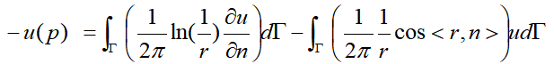

此时，区域内任意点不会与边界点重合，因此不存在i=j的情况。

4.测试结果

```
%% 参数设置
```

边界元网格划分：

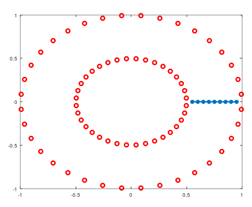

红色为边界元求解网格，蓝色为求解内部数值u，通过内部点u的数值分析测试精度。

当num=36\*2个网格的时候，高斯阶数=1，测试结果：

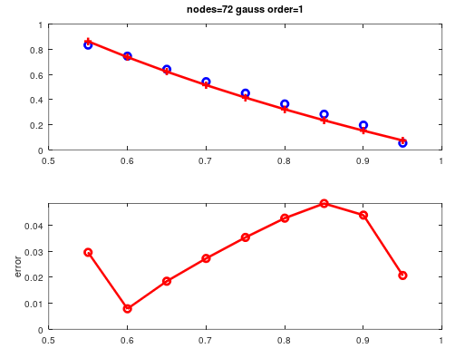

当num=36\*2个网格的时候，高斯阶数=2，测试结果：

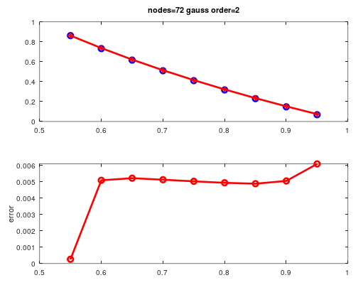

当num=36\*10个网格的时候，高斯阶数=1，测试结果：

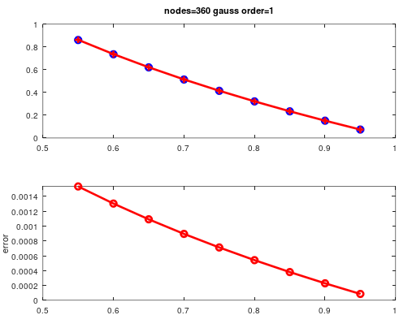

将内部点各个方向的结果均恢复，可以得到二维可视化结果：

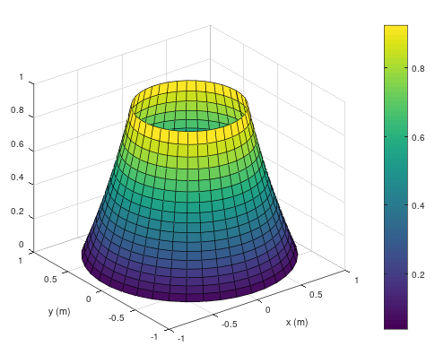

上述结果的理论解与数值解一致，说明边界元的实现成功。通过不同网格，不同高斯阶数显示，适当的采取高斯高阶进行插值，可以获得更好的求解精度。

总结

本文基于拉普拉斯方程，实现了边界元数值模拟的基本流程。

边界元的实现流程：首先确定微分方程的基本解，然后使用第二格林函数获得积分方程。离散积分方程，处理不同位置的积分方程表达式，然后组装边界元矩阵，最终求解获得边界的数值与对应梯度。根据求解结果使用积分方程可恢复每个位置的解。

实现过程中需要注意的点：1.正确处理边界不连续点、连续点；2.确保单元节点的顺序一致；3.适当使用高阶高斯积分，能有效提高计算精度。

* * *

博主长期深入实践电磁学领域的有限元数值仿真技术，感兴趣的朋友可以添加博主公众号，欢迎共同探讨与有限元相关的技术知识。