# 边界元处理多域问题-拉普拉斯方程


> 原文地址: [https://mp.weixin.qq.com/s/gBAfyNGKQTc76awaS4xgEg](https://mp.weixin.qq.com/s/gBAfyNGKQTc76awaS4xgEg)

简述

在上篇边界元文章中，介绍的是均匀的二维同轴圆的边界元实现，在实际问题中，多种介质材料是必然的，而对于边界元而言，由于其依赖于均匀空间的基本解，因此在多域（多材料）问题上需要特殊处理。

本文依然以简单二维同轴圆为案例模型，介绍研究区域中存在两个区域情况下的边界元是如何实现的，依次延展可以推广到任意多区域的边界元处理方法。

1.边值问题

对于以下模型，满足拉普拉斯方程，模型存在两个区域，区域1、2的材料不一致，例如介电常数不一致（ε₁、 ε₂）。

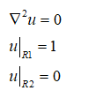


该模型存在解析解公式：

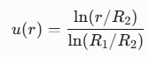

2.多域边界元推导

由于最基本的边界元研究区域必须是均匀的，因此将上述区域分成两个区域来考虑，区域1、区域2分别满足拉普拉斯方程。

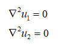

在外部边界条件r=R1，r=R2位置为第一类边界条件，分别落在各自的区域。对于红色区域分界边界，根据拉普拉斯方程，满足以下条件：

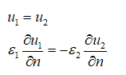

在电磁学中，分别表示电势连续和电位移连续。可见区域1、2的介电常数差异在公式中体现在边界条件的连续性上。

接下来，需要把不同区域的边界元表达式写出来，然后想办法通过交接区域的边界条件联立区域1、区域2的基本方程。

首先，对每个区域应用格林公式，得到边界积分方程：

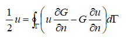

其中G表示二维拉普拉斯方程的基本解：

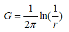

最终可以化简为：

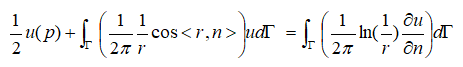

写成矩阵求解公式：

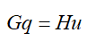

其中：

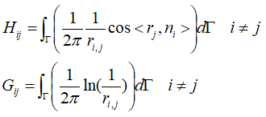

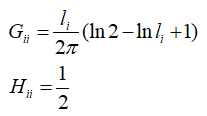

上述是对单个区域的边界元的推导，更加详细可以参考：[边界元入门实现-二维拉普拉斯方程](https://mp.weixin.qq.com/s?__biz=MzkwNzUxOTM2NA==&mid=2247486538&idx=1&sn=3da6b8c8af826db2bb851b6e27eb1d40&scene=21#wechat_redirect)[边界元入门-基础知识](https://mp.weixin.qq.com/s?__biz=MzkwNzUxOTM2NA==&mid=2247486539&idx=1&sn=b18d99ff120163676f27e9800a5dcd38&scene=21#wechat_redirect)

对于区域1、区域2而言，分别满足：

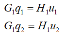

接下来考虑内部交接边界条件，把各自区域分成交接区域与非交接区域，此时，方程可以写成：

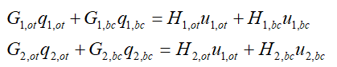

其中ot边界无关交接区域的边界，bc表示两个区域的交接边界。根据上述各自的边界条件，已知：

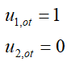

因此，方程的右端项的第一项是可以通过积分获得的右端项，此时方程可以改写成：

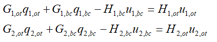

然后考虑交界面的边界条件：

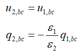

带入上述等式，得到耦合方程：

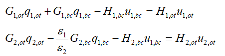

将方程写成矩阵形式，能更加清晰地表示：

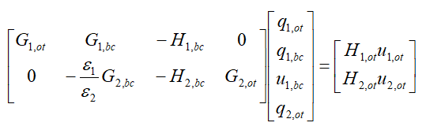

可见，带入交界面边界条件后，成功将两个基本边界元方程耦合在一起。求解上述方程，即可得到交界面区域的电势与对应的梯度。

然后通过交接面的边界条件，恢复各自区域的数值与梯度。最后在各自区域使用基本的边界元方程，即可获得任意位置的电势分布。

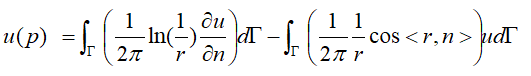

3.测试结果

测试参数：

```
%同轴圆 半径，数值
```

网格如下：

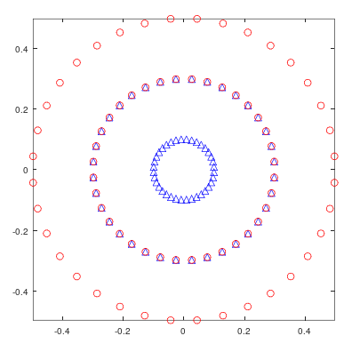

边界元结果与理论解进行对比：

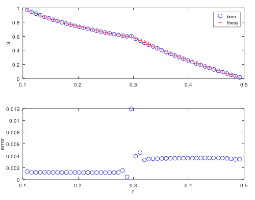

结果显示，趋势与理论解基本一致，误差在分界面上最大。值得注意的是，对于零阶基函数而言，适当的高阶高斯积分能有效提高精度。上述结果为四阶高斯积分结果，下面依次展示1~3阶的高斯积分结果作为对比。

一阶高斯积分结果：

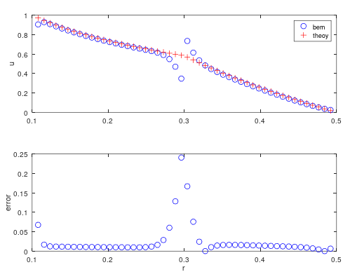

二阶高斯积分结果：

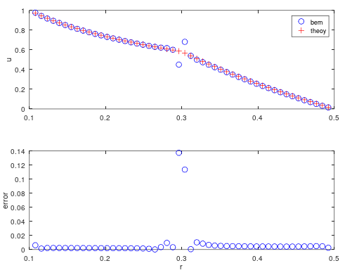

三阶高斯积分结果：

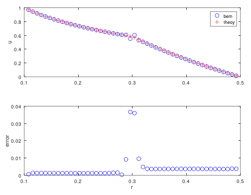

因此在实际操作中，在效率与精度的平衡下，适当的使用高阶高斯积分，能得到更高的精度。

总结

本文介绍了多域边界元的实现方程，从两个区域的模型入门，详细阐述了耦合边界的具体公式与实现手段。

相比于单域而言，多域问题在耦合边界的精度对高斯积分的阶数有了明显的体现。这也反过来说明耦合边界处的精度明显比其他地方低。

对于更加复杂的模型而言，这种传统的耦合方法效率会越来越低，这就必须使用更多的技术来处理，例如边界元+有限元结合、快速多极子方法、区域分解等等。

  

* * *

博主长期深入实践电磁学领域的有限元数值仿真技术，感兴趣的朋友可以添加博主公众号，欢迎共同探讨与有限元相关的技术知识。