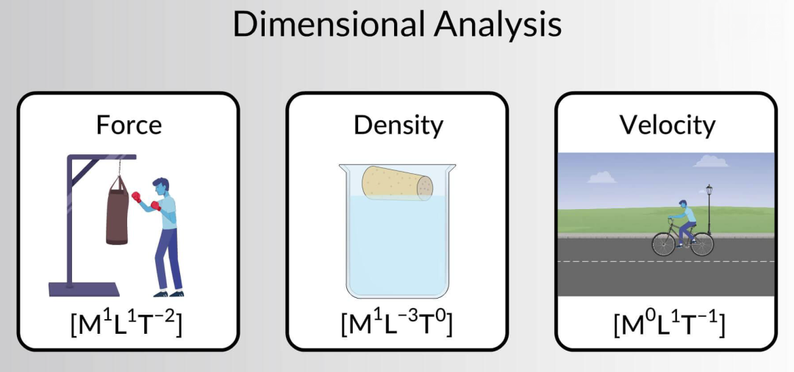
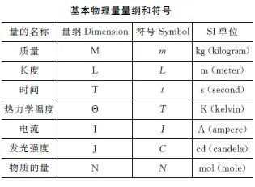
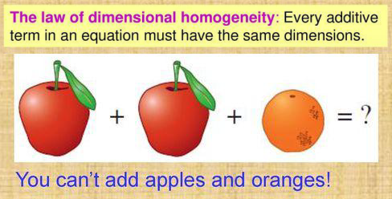
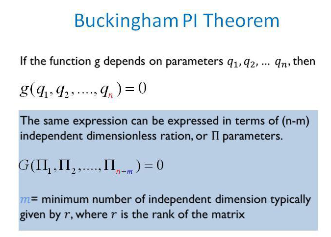
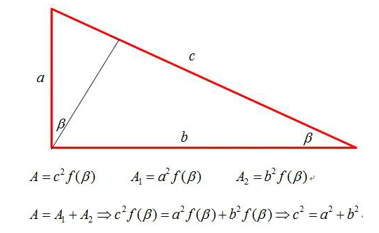
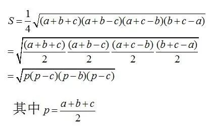
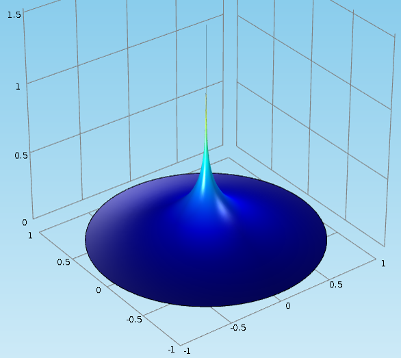

# 量纲分析方法：一种洞察物理现象本质的有力工具

> 原文地址: [https://mp.weixin.qq.com/s/B3hJ8FQ-yVmFeL3decd\_mQ](https://mp.weixin.qq.com/s/B3hJ8FQ-yVmFeL3decd_mQ)

  

点击上方「蓝字」关注我们

## 引言 

在物理学、工程学以及其他科学领域，当我们试图理解和预测自然界中发生的各种现象时，往往需要构建数学模型来描述这些现象。而量纲分析（Dimensional Analysis）作为一种定性分析方法，能够帮助我们在没有完整理论的情况下，对某一物理现象进行推断和理解。它不仅是一个建立数学模型的强大工具，而且是检验公式正确性的有效手段。本文将详细介绍量纲分析的基本原理、应用步骤以及一些具体的案例，旨在为读者提供一个全面了解这一重要概念的视角。

## 什么是量纲？ 

当我们对一个物理概念进行定量描述时，总离不开它的一些特性，比如，时间、质量、密度、速度、力等等，这种表示不同物理特性的量，称之为具有不同的**量纲**，记为  。另外，物理量的度量又离不开单位，比如质量的单位可以为 、 ，速度的单位为 、 等。但当用数学公式描述一物理量时，等号的两端就必须保持量纲的一致性和单位的一致性。换言之，量纲分析就是基于量纲一致的原则来分析物理量之间关系的一种方法。

实际中，有些物理量的量纲是基本的，称为**基本量纲**，而其他的物理量的量纲可由这些基本量纲来表示。例如，在力学中，基本量纲是质量的量纲  、长度的量纲  和时间的量纲 。而速度的量纲为  ，加速度的量纲为  。此外，也有些量是无量纲的，比如圆周率  或自然对数底数 ，此时记为   。

## 量纲齐次原则 

量纲齐次原则指出，任何正确的物理定律所对应的方程都应该是量纲齐次的，这意味着方程中的各项应该具有相同的量纲。这个原则确保了物理规律的合理性，因为只有具有相同量纲的物理量才能相加减或者比较大小。

比如，牛顿第二定律  中，左边的力  与右边的质量  乘以加速度  的量纲是一致的，都是。

又例如，动量定律:  ，左边的量纲为，右边的量纲为 ，即量纲是齐次的。

因此，量纲齐次性不仅是构建物理模型的基础，也是验证已知物理公式正确与否的一个重要标准。

## Buckingham  定理 

Buckingham  定理是量纲分析的核心内容之一，它为我们提供了一种系统化的方法来寻找物理问题中涉及的所有物理量之间的关系。根据该定理，如果有  个物理量  满足某个物理定律，并且  个基本量纲可以用来描述这些物理量，则存在一组  个相互独立的无量纲组合 ，使得未知函数  与原方程等价。这一定理极大地简化了复杂物理问题的研究过程，使我们能够在不知道具体物理机制的情况下得到关于物理量之间关系的重要信息。

  

## 应用量纲分析的具体步骤 

要应用量纲分析解决实际问题，通常遵循以下六个步骤：

(1) **收集相关物理量**

将与问题有关的物理量(变量和常量)收集起来，记为 ，根据问题的物理意义确定基本量纲，记为 

(2) **写出各物理量的量纲**

对于每一个物理量 ，写出它的量纲形式 。

(3) **构造无量纲组合**

假设所有物理量  之间满足关系  ，其中  为待定的， 为无量纲的量，因此  ，于是有

(4) **求解线性方程组**

量纲矩阵  ，若  ，则从线性方程组中可解得  个基本解，记

(5) **获得无量纲参数**

记  ，则  为无量纲的量。

(6) **探索物理规律**

尝试找出这些无量纲参数之间的关系 ，从而揭示隐藏在背后的物理规律。

## 简单应用 

为了更好地理解量纲分析的应用，在研究物理问题之前，我们可以先看两个简单又有趣的纯数学例子。

### 证明勾股定理

关于勾股定理的证法大约已经超过 360 种了。下面我们使用量纲分析来证明，感受一种别开生面的手法。

一个直角三角形的面积  可以由它的一条边（譬如斜边 ）和一个锐角（譬如  ）所决定。注意到角度  是无量纲的（因为角度的定义是弧长除以半径，当然是无量纲的）。显然，从量纲的角度来看，三角形面积的表达式唯一可能的形式为  的平方与某个自变量为  的函数的乘积。有了这个认识，我们就可以立刻推导出勾股定理。我们用斜边上的高把直角三角形分成两小的直角三角形，它们的面积分别记为  和 ，因此有 ，进而得到 。

### 推导海伦公式

这也是一个数学的例子。假设已知三角形的三边长度分别为 ， 和 ，试求三角形的面积 。学过高中数学的读者应该知道，借助正弦和余弦定理，经过一番运算可以得到用  来表示三角形面积  的海伦公式，运算过程还是挺复杂的，而量纲分析则提供了一种更为简单的方法。

首先， 三个边长具有轮换对称性，所以可以猜测  里面应该包含了  这个因子。又假设 ，此时这个三角形将退化成一条线段，面积  应为 ，这告诉我们  里面应该包含了  这个因子。同理，我们知道  里面还应该包含了  和  这两个因子。接来下，把这四个因子乘起来得到 ，但这个结果的量纲是长度的四次方，为了得到面积的量纲（长度的平方），我们需要开方。最后，选一个很容易计算面积的正三角形  来把前面的无量纲系数  确定下来，这样，我们就得到了海伦公式。

## 空间点热源的扩散问题 

接下来，我们回归物理问题，采用量纲分析方法来研究热传导中的空间点热源扩散问题。在这个问题中，我们将考虑一个瞬时出现在空间某一点上的热源，分析它如何影响周边的温度。利用 Buckingham  定理，我们就可以轻松得出温度分布函数与其他几个物理参数的依赖关系。

### 问题的提出

设初始时刻  在空间中有一热量为  的瞬时热源，位于原点处  。热量通过介质向无穷空间扩散。试研究点热源的扩散规律。

### 模型的假设

(1) 任意时刻 ，空间任一点（径向距离为  ）的温度为  ；

(2) 介质的初始温度为 0；

(3) 问题的基本量纲为长度、质量、时间和温度的量纲，即  。

### 模型的建立与求解

由热学知识可知，在  时刻，空间任一点（径向距离为  ）的温度为  ，其中  为介质的体积比热，即单位体积的介质温度升高一度所需热量。 为介质的扩散系数。它可以由  来确定，其中  是单位时间通过单位面积的热量。

根据 Buckingham  定理，可设  。

由模型假设，我们有

；

；

 为热量  的量纲，它与功的量纲相同，即为   ；

 ；

 。

事实上，由

则

于是，量纲矩阵为

由于 ，因此线性齐次方程组  有  个基本解。可取

于是，可得两个相互独立的无量纲的量

且有  与  等价。

根据隐函数存在定理，可得  ，稍作变换一下得到

其中 ， 为待定的函数。

另一方面，空间点热源的扩散问题实际上可以采用热传导方程来精确求解，此时有

对比发现，这与量纲分析得到的结果是完全一致的。

总的来说，量纲分析法只能给出温度函数依赖于其他参数的关系，虽然无法直接给出具体的数学表达式，但已经大大缩小了可能的形式范围。

## 小结 

综上所述，量纲分析是一种非常有用的分析工具，它可以让我们在缺乏足够理论支持的情况下，对物理现象做出合理的推测和解释。尽管这种方法不能替代详细的理论分析，但它确实提供了另一种思考问题的角度，并有助于快速筛选出不合理或不可能的情况。随着科学技术的发展，量纲分析将继续扮演着不可或缺的角色，特别是在跨学科研究中发挥桥梁作用，连接起看似不相关的各个领域。

# 推荐阅读

我们目前正和专业SCI论文英文润色机构**艾德思**开展全方位合作。如果您需要**论文和基金标书辅导服务**，欢迎扫码下方二维码，获取您的专属学术顾问，**锁定直减活动优惠**👇

********▲****长按扫码添加学术顾问咨询********▲****

  

  

**喜欢****作者******，请点********赞********和在看********

****