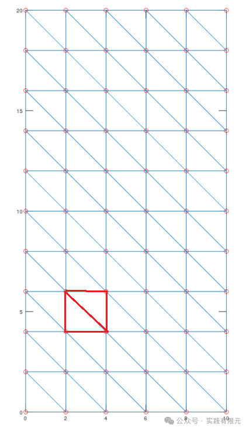
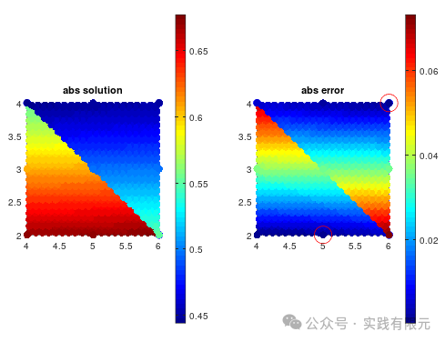
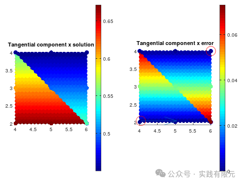
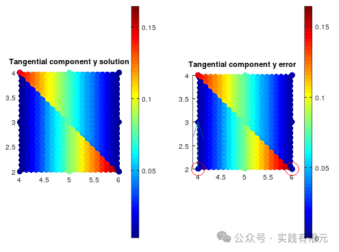
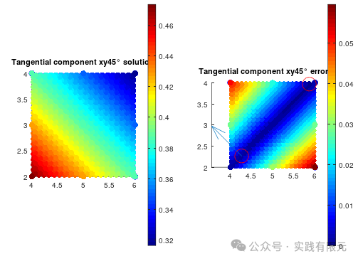
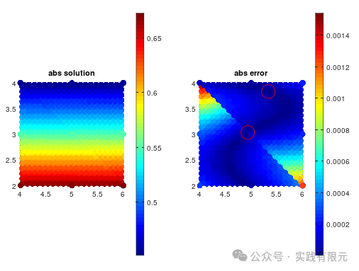
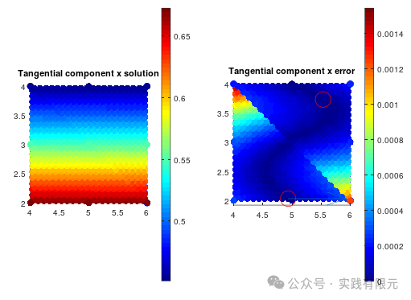
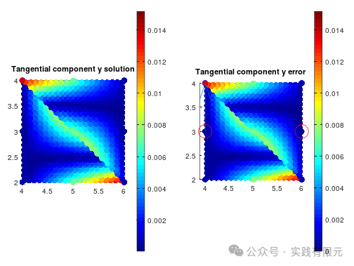
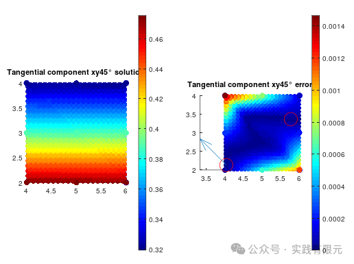
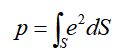

# 针对二维矢量有限元解的精度分析

> 原文地址: [https://mp.weixin.qq.com/s/E7kxz9inva5EVL2m\_eM-CA](https://mp.weixin.qq.com/s/E7kxz9inva5EVL2m_eM-CA)

简述

本文对二维矢量有限元的一阶、二阶基函数的结果精度进行分析，得出一些结论以及一些疑惑点。

分析的边值问题为电场在电介质中衰减问题，矢量有限元的实现过程这里不再赘述，请参考文章:

[二阶矢量有限元实现：二维电场在介质中的衰减](http://mp.weixin.qq.com/s?__biz=MzkwNzUxOTM2NA==&mid=2247485872&idx=1&sn=e08e67c618bccf5771f665277db06aa8&scene=21#wechat_redirect)

[矢量有限元实例：二维波导本征模求解](http://mp.weixin.qq.com/s?__biz=MzkwNzUxOTM2NA==&mid=2247485838&idx=1&sn=a07fb932edf305a4b6a5abe971297f14&scene=21#wechat_redirect)

1.分析某个网格内各插值点的电场精度

采用的具体网格如下，5\*10\*2=100个网格，其中选择图中红色区域的两个网格作为分析网格。如图所示：    

下面分别在这两个三角形中均匀选取800个内点于12各边界点进行分析，求解获得其数值解电场的绝对值与误差（abs solution、abs error）、数值解与理论解在各方向的切向分量结果与对应误差（x、y、xy45°）。

**对于1阶矢量基函数**    

i:电场绝对值结果与其误差  

ii:电场在X方向棱边的分量结果与其误差

    

iii:电场在Y方向棱边的分量结果与其误差

iiii:电场在XY45°方向棱边的分量结果与其误差

可以发现，对于电场绝对值而言，精度最好的点不在三角形顶点上，而在与x方向平行的棱边上。

进一步分析，将电场解在三个棱边上的切向场，此时精度最高的点基本上落在对应切向边的中点。这恰好符合有限元原理，在未知数节点上取得最佳精度，对于矢量有限元而言，最佳精度则落在棱边中点处。    

值得关注的另一个点是矢量有限元只确保切向连续的原理在上述各方向的切向分量中也体现的淋淋尽致，可以发现X、Y边的切向场在两个单元的斜边上明显是不连续的，即使是几乎相同的位置，左右两端的结果也差别很大，而xy45°边的切向方向的斜边上连续变化的。

而该例子中X方向的切向分量占据主要，因此这也导致电场绝对值在斜边上不连续的结果。这也解释了为什么电场绝对值的精度最好点在与X方向平行的棱边上。

**对于2阶矢量基函数**

i:电场绝对值结果与其误差

ii:电场在X方向棱边的分量结果与其误差

 iii:电场在Y方向棱边的分量结果与其误差

    

iiii:电场在XY45°方向棱边的分量结果与其误差

相比于一阶，二阶在各个切向分量的精度显示更加的奇怪，不再呈现如一阶的线性变化，其区域内会明显形成一个连续的不规则的高精度区域，其原理不得而知，猜测是由于二阶基函数本身是由二次幂组成的。

值得关注的是，相比于一阶的X方向切向分量在斜边上的不连续，二阶的X方向在切向方向分量是连续的，分析其一是由于二阶精度本身远高于一阶，其二可以理解一阶基函数对与棱边的法向方向完全没有约束，而二阶基函数对与棱边的法向有一定的约束，因为其包括组成是由完备的一阶基函数与二阶的旋度基函数组成。

从整体来说，无论一阶、二阶，网格内精度最好的点均出现在棱边中点位置，而二阶网格的内部也有更多精度最好点，具体位置暂不确定。

但是对于需要对电场进行面积积分获得功率的情况，上述的精度位置显得不是那么重要，只需要通过高斯积分原理，选择对应阶数的积分点积分即可。例如对电场的平方进行积分，如下公式：

下面展示了平均选择积分点与采取hammer积分点的数值积分结果与理论积分结果的对比：    

积分方式

一阶

二阶

均匀积分点1个

13.323+11.884i

12.208+12.935i

均匀积分点5个

13.431+11.780i

12.569+12.589i

均匀积分点10个

13.435+11.777i

12.580+12.578i

hammer积分1个

13.323+11.884i

12.208+12.935i

hammer积分点4个

13.436+11.776i

12.585+12.575i

hammer积分点7个

13.436+11.776i

12.584+12.575i

理论积分结果

**12.587+12.578i**

**12.587+12.578i**

结果与预期基本上一致，二阶的积分结果远好于一阶，二者取对应阶数的hammer积分点获得的积分结果精度最好。

略微不同的是采用更高阶的积分点的结果还是会有一些变化，这应该是源于矢量有限元原本是高阶取旋度获得的原因。

总结

1.这部分内容具体分析的矢量有限元的解的精度分布规律，发现一阶、二阶的一些差异与连接边上的一些规律，这对于深入理解矢量有限元有一定的帮助。

2.对于常见的对场的积分求解运算，矢量有限元与传统的节点有限元具有类似的结论，即积分点选择对应阶数的hammer积分点最佳，虽然更高阶的结果有变化，但是影响不是很大。

3.发现二阶的结果在连续性等问题上要远远优于一阶结果。这是由于一阶完全没有了梯度方向的约束，导致了即使连续的分界面上依然出现不连续的情况；而高阶基函数的低阶部分具有梯度方向的约束效果，所以在连续介质的边界上效果更好。    

4.虽然知道了高阶矢量基函数的由来方法，但是依旧不理解为什么二阶基函数要保留完备的低阶基函数，即保留梯度部分，如果全部均只使用旋度部分会出现什么情况？