# 非饱和渗流问题的有限元求解

> 原文地址: [https://mp.weixin.qq.com/s/Mgc8cmbFwqZme7dbXY5f9w](https://mp.weixin.qq.com/s/Mgc8cmbFwqZme7dbXY5f9w)

点击上方「蓝字」关注我们

许多岩土工程问题会涉及到非饱和渗流过程，如降雨入渗或地下水变化时土质边坡与堤坝的稳定性评价，垃圾填埋场内部污染物质的运移模拟，冻土中相变发生时的渗流过程分析，高放核废料的地质深埋处理等。因此，有效地模拟和分析非饱和渗流过程有着重要的实际意义，一直是岩土工程、水利工程、环境工程中的一项热门课题。本文以二维非饱和渗流问题为例，介绍有限元方法和 FEtch 系统在求解渗流问题中的应用。

## 控制方程

### 微分形式

Richards 方程是非饱和渗流理论的基本方程。我们以孔隙水压力水头 作为基本变量，， 为孔隙水压力， 为水的容重；以 表示竖直方向的坐标。如果考虑重力作用，则 还代表了位置水头。此时，总水头为 。在二维直角坐标系下，Richards 方程可以表示为

式中， 为多孔介质的孔隙率， 为饱和度， 为渗透系数， 为水平方向的坐标， 为时间。如果不考虑重力作用，则上式左侧最后一项 为 。

在初始时刻，压力水头为 ，即初始条件为

假设在边界 上压力水头为定值 ，在边界 上流量为定值  (流入为正)，则边界条件可表示为：

1.  强制边界条件
    

2.  自然边界条件
    

其中， 为多孔介质表面的单位法向量。

### 弱形式

运用变分原理，由以上方程得

将其转化为弱形式，可得

代入边界条件，可得

### 离散化

对上式进行空间离散化后，可写成矩阵形式

其中 为压力水头向量， 为压力水头对时间的导数向量， 为质量矩阵， 为刚度矩阵， 为载荷向量。采用向后差分法进行时域离散，可将上式改写为

整理得

其中，上标 代表当前时间步， 代表上一时间步。 和 均为 的函数，因此，上式是一个非线性方程组，无法直接求解，需要引入迭代过程。

最常用的处理方法是采用直接迭代法（也称 Picard 法），进行线性化，得到

其中，上标 表示   时间步下的迭代步数。上式在每个时间步下都需要反复地迭代计算，直至误差 小于某一设定的阈值。我们可以通过使用松弛因子，来大幅提高直接迭代法的收敛速度。该方法已被写入 NFE 算法模板库，是 FEtch 系统默认的非线性迭代算法。

### 材料本构模型

非线性问题远比线性问题要复杂。由于非线性参数的函数形式千变万化，所以通常需要针对具体的问题专门地设计程序。对于 FEtch 系统而言，由于脚本文件是完全自主可控的，只要基本框架搭好，后面需要改动的地方极少。

孔隙水压力和相对渗透系数是饱和度的函数，它们之间的关系通常需要根据试验数据进行拟合，目前已有多种通用模型可以描述，如广泛使用的 van Genuchten 模型、Brooks-Corey 模型等。为了后续算例的计算需要，这里考虑以下两种模型。

-   **自然指数模型**
    

这里将持水特征曲线和渗透系数函数假设为压力水头 的自然指数形式，主要应用于求解析解。式中， 为残余饱和度， 为与土性相关的模型参数， 为饱和渗透系数。

-   **van Genuchten 模型**
    

式中，有效饱和度 ， 、 和 是与土性相关的模型参数，通常取 。

## 算例1

**一维均质土的非饱和渗流**

考虑无限长的均质土层，设其厚度为 ，底部对应地下水位（），顶部为入渗边界，以入渗流量为 0 时的稳定状态为初始状态，时间 时入渗流量变为 。持水特征曲线和渗透系数函数采用自然指数模型来描述。模拟过程中的具体参数取值如下表所示。

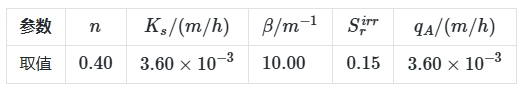

### 前处理

进入 GiD 前处理，建立一个 的长方形区域，它的两个对角的角点坐标分别为（0, 0）和（0.1, 1）。网格剖分采用 4 节点等参单元。为了在保证计算精度的同时尽量减少网格数量，从下到上按 1.1:1 的比例进行网格局部加密，共使用了 40 个单元，82 个节点。

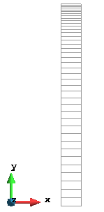

### 计算结果

通过自动改变时间步长，变化范围从 到 ，总共使用了 183 个时间步。对计算结果稍加整理，效果如下。

**压力水头的演化过程**

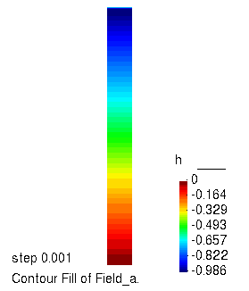

**不同时刻压力水头的空间分布**

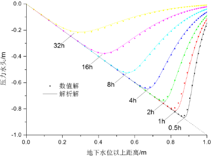

**不同高度处压力水头随时间的变化**

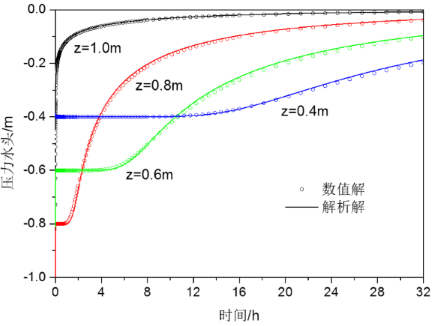

可以看到与解析解符合得很好。同时无论在时间和空间域内，模拟结果都没有震荡现象发生，充分证明了算法和程序的有效性。

## 算例2

**二维砂槽的非饱和渗流**

Vauclin 等进行的二维室内渗流试验也是检验算法的典型算例。流动区域为 的厚 的砂土，底部为不透水边界，两侧为自由排水边界。土体为颗粒分布很规则的河砂。初始水位为 ，试验开始后在土槽顶部中间 的范围均匀施加 的降雨强度，共 。试验中对流动域内自由水面位置的变化等数据进行了测量。该类砂土的孔隙水压力水头和渗透系数与饱和度之间的关系由 van Genuchten 模型来描述。模拟过程中的具体参数取值如下表所示。根据对称性，从中线截取区域的右半部分进行计算。

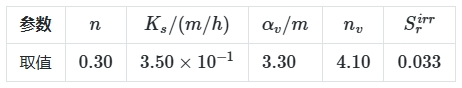

### 前处理

进入 GiD 前处理，建立一个 的长方形区域。采用 4 节点等参单元，将该区域剖分为 750 个双线性四边形等参单元，共 806 个结点。

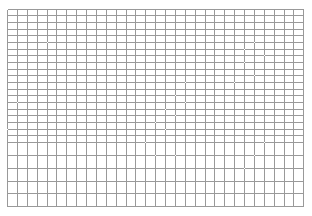

### 计算结果

通过自动改变时间步长，变化范围从 到 ，总共使用了 202 个时间步。对计算结果稍加整理，效果如下。

**压力水头的演化过程**

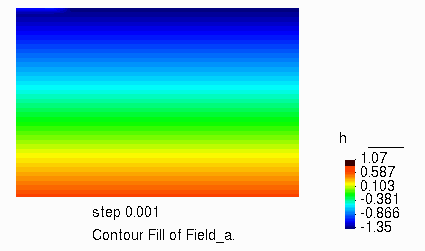

**部分等值线的演化过程**

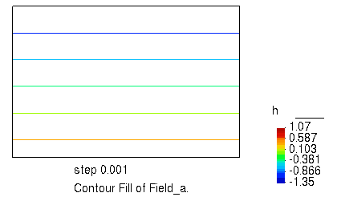

**不同时刻地下水位位置模拟结果与试验结果对比**

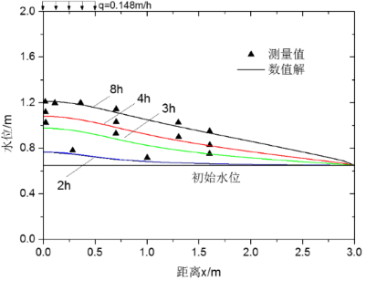

通过不同时刻地下水位位置（ 处）模拟结果与试验结果的对比，可以看出两者吻合较好。

**不同观察点的压力水头随时间的变化**

选取入渗前沿的点 A (0, 2.0)、B (0,1.6)、C (0, 1.2)、D (0.5, 1.6)、E (0.5, 1.2) 和 F (1.0,1.2) 作为观察点，压力水头随时间变化的情况如下图所示。

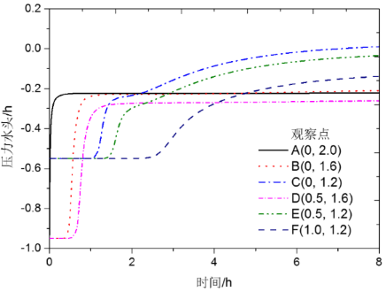

可以看到，随着入渗的进行，孔隙水压力逐渐上升，向正孔压发展，且整个变化过程是平滑和稳定的，进一步证明了算法和程序的有效性。

  

  

**往期推荐**

[

**一图读懂 FEtch 的工作流程**

](http://mp.weixin.qq.com/s?__biz=Mzk0MzI0NDU2NQ==&mid=2247484242&idx=1&sn=2a466b3d5070c1b304e651802fea1935&chksm=c3379728f4401e3ea99bd94415da1bb7b51a747a79b49b83529abc75100adddadf2eef86c95a&scene=21#wechat_redirect)

[

**谈谈有限元程序开发，兼谈 FEtch 入门**

](http://mp.weixin.qq.com/s?__biz=Mzk0MzI0NDU2NQ==&mid=2247484241&idx=1&sn=75293632dd989a5060fb4c803ca54b3a&chksm=c337972bf4401e3d2334e5a5e4a403bd4b9bffbb599e5626680ab56e9a67f3a2dd2e8a4129ae&scene=21#wechat_redirect)

[

**通用前后处理软件 GiD 简介**

](http://mp.weixin.qq.com/s?__biz=Mzk0MzI0NDU2NQ==&mid=2247484077&idx=1&sn=f91b124c472bc374439266d2fe28c394&chksm=c33796d7f4401fc1839829cd4211644369b8ff835bd043188dd758f3b0bf84e6df802814bfda&scene=21#wechat_redirect)

  

  

## 推荐阅读

  

  

**FEtch 系统**是笔者团队开发的新一代有限元软件开发平台。只需按照有限元语言格式填写脚本文件，即可在线自动生成基于**现代 Fortran** 的有限元计算程序，从而大幅提高 CAE 软件的开发效率。

我们长期开展 FEtch 系统的试用活动，欢迎私信交流和扫码咨询，免费获取**许可证文件**。

**喜欢****作者******，请点********赞********和在看********

****