# 高阶插值基函数与叠层基函数细节对比

> 原文地址: [https://mp.weixin.qq.com/s/SCz\_q4cKJrzHKEkgBReQeQ](https://mp.weixin.qq.com/s/SCz_q4cKJrzHKEkgBReQeQ)

**简述**  

    高阶插值型有限元和叠层型有限元的区别到底在哪些地方，细节点到底有什么，这里把一维2阶有限元的两种基函数的有限元求解过程拿来一一对比，分析两者的相同点与不同点，更有助于理解二者的基函数原理。  

1.  **边值问题**  
    

    首先给出对用于对比的边值问题，依旧沿用最简单的cos分布的边值问题：  

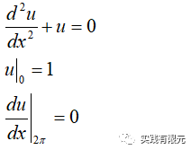

    该问题的解析解为：

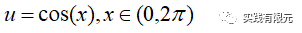

**2.有限元离散方程的推导（无区别）**

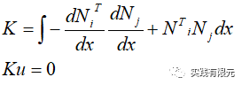

    详细推导参考：[最简单的一维有限元问题：求解cos函数分布](http://mp.weixin.qq.com/s?__biz=MzkwNzUxOTM2NA==&amp;mid=2247483689&amp;idx=1&amp;sn=238051a214893aec197bde3511363463&amp;chksm=c0d6b5c2f7a13cd49795a90d7a3509ff6e6a5fbd744fe1f1721af17a4cb8e93827383ddc9d60&scene=21#wechat_redirect)

**3.基函数与单元系数矩阵（有区别）**

    针对一维线段的拉格朗日插值多项式，任意高阶的基函数都是在其基础上组合叠加而成。  

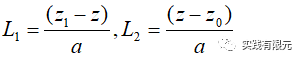

    **（1）二阶插值基函数**

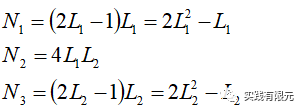

        该基函数对网格单元对应关系，满足插值关系：  

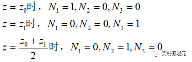

        对应的单元系数矩阵为：  

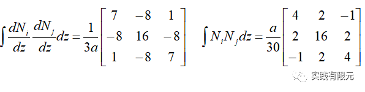

    **（2）叠层基函数**

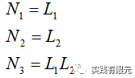

    该基函数与网格对应关系：仅N1,N2满足一定关系，N3不对应具体网格点的数值解。

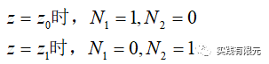

    单元系数矩阵为：  

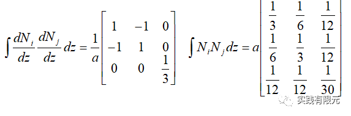

    对比上述两者基函数本身区别，两者根据L1,L2得到的组合方式完全不同，插值基函数每个部分与网格点均能对应，叠层基函数仅1阶部分与网格点对应，高阶部分不对应任何网格点。

    因此，基函数的完全不同，导致的单元系数矩阵肯定也完全不同。  

**4.网格未知数（自由度）分布（有区别）**

       **（1）插值基函数**

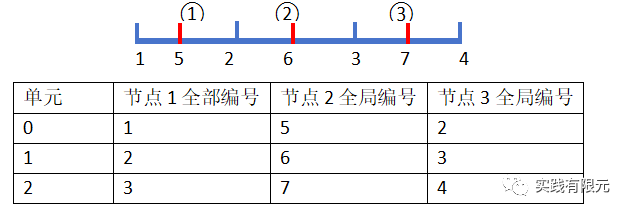

       **（2）叠层基函数**  

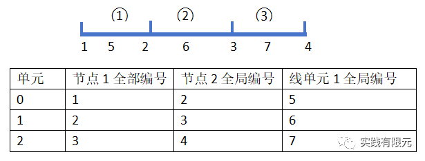

    从网格可以明显看出，插值基函数N3对应的是节点3，落在网格中心点；而叠层基函数N3对应的叫做线单元1，表示网格单元位置，并不落在具体的某个点上。

    而且根据基函数N1,N2,N3的排序差别，对应的全局节点编号也存在顺序上的差别，不过未知点（自由度）个数是一致的，都是7个未知数。

**5.全局系数矩阵**

    由于单元系数矩阵完全不一致，以及全局未知数编号存在顺序上差异，所以全局系数矩阵组装的结果也完全不同，具体的系数矩阵参考：  

    **叠层基函数参考：**[一维高阶叠层有限元实现](http://mp.weixin.qq.com/s?__biz=MzkwNzUxOTM2NA==&amp;mid=2247483750&amp;idx=1&amp;sn=3da0cb99d39eb4586ab282794683f930&amp;chksm=c0d6b58df7a13c9b872b692a35e4b39106de14406cd9924b2e6cab71830b32d61b4104cafee6&scene=21#wechat_redirect)

    **插值基函数参考：**[一维高阶插值基函数有限元实现](http://mp.weixin.qq.com/s?__biz=MzkwNzUxOTM2NA==&amp;mid=2247483719&amp;idx=1&amp;sn=c2e8474e625f4d8f8e5218c4d238294d&amp;chksm=c0d6b5acf7a13cbacc3f02d721852d8870c8ba1742166a7b103a4d879718035c4bf599a7beec&scene=21#wechat_redirect)

    不过，在该边值问题上，二者的边界条件上设置几乎都是一致的，第一类边界条件都是在起始点乘以大数加以实现；第二类边界条件则是在网格终点添加对应的点系数矩阵。  

    该现象与具体边值问题相关，不同的边界条件，以及二维、三维问题，在处理边界条件还是可能有很大差别。

**6.计算结果对比**  

    在获得最终的系数矩阵K和右端项B后，根据X=K\\B就可以获得求解结果：这里具体对比了3个均匀网格下叠层基函数和插值基函数的未知数求解结果：

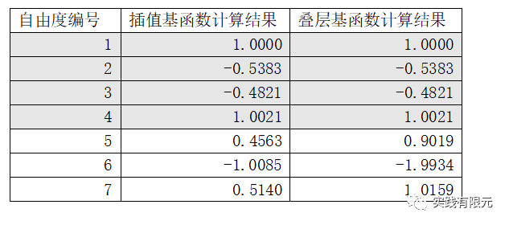

    从X的求解结果可以看出，二者的在1~4节点的结果一致，5~7位置的结果不一致。这也再次说明了插值基函数在高阶部分与叠层基函数存在着本质上的区别。

    我们通过上述的结果，插值获得网格单元中心点的数值结果。根据拉格朗日基本插值关系，对于中心点，L1,L2的计算结果为：  

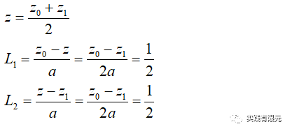

    **（1）插值基函数的插值过程**

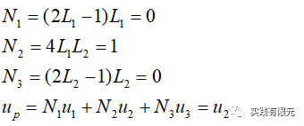

    可见，插值基函数三个单元的中心点的数值解就依次分别为X求解结果的5、6、7号节点的数值解，这与第3部分分析的插值基函数性质是一致的。

    **（2）叠层基函数的插值过程：**

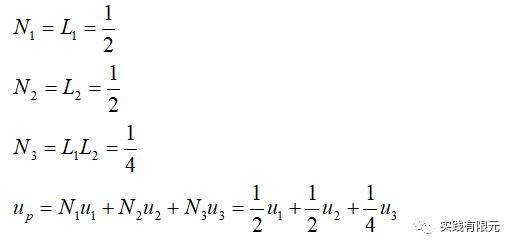

    依次，带入X求解结果，得到三个中心点的数值结果：

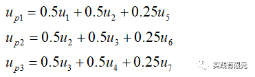

    可见，叠层基函数的中心点数值解不是自由度X中5~7号的结果，5~7号的结果扮演的是提高插值精度的角色。这里再次明确的看出两种基函数的区别，下面是两者插值结果的精度对比：

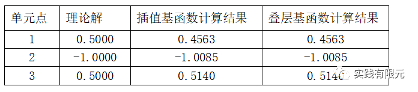

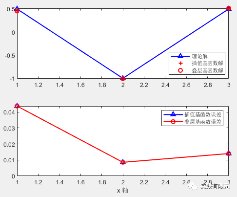

    可见，虽然两者形函数不同，求解的X结果也不一致，但是通过各自的插值最终得到的结果是一致的。并且两者同为二阶基函数，计算精度也几乎是一致的。正所谓殊途同归。

7.总结

    (1)通过对简单模型计算结果的详细分析，从结果上更加清晰了叠层基函数与插值基函数的不同点。

    (2)虽然基函数不同，但是二者在相同阶数下计算结果的精度是一致的；

    (3)二者本质区别在于：插值基函数的高阶部分就是网格点上的数值解；叠层基函数的高阶部分不表示网格上具体点，表示的是线单元，高阶数值结果表示对应线单元的高阶精度修正量。