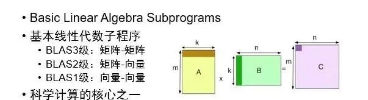
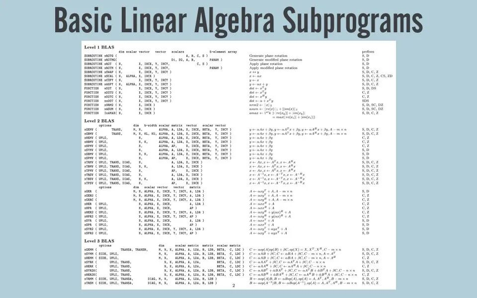
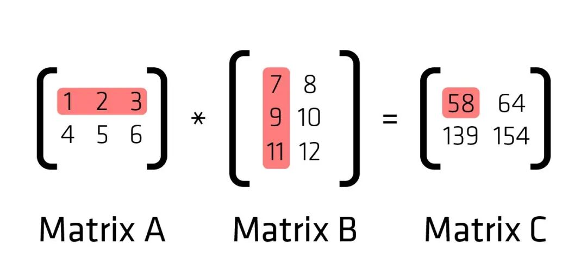

# BLAS简介：基于Fortran的高性能矩阵计算基础库


> 原文地址: [https://mp.weixin.qq.com/s/FXkxeezDVEY7asjl\_PWX1g](https://mp.weixin.qq.com/s/FXkxeezDVEY7asjl_PWX1g)


点击上方「蓝字」关注我们


在科学计算和工程领域的软件开发中，Fortran语言因其卓越的性能、直接的数组操作以及广泛应用于高性能计算（HPC）领域的库支持而久负盛名。其中，Basic Linear Algebra Subprograms（BLAS）库就是基于Fortran开发的重要基础库之一，它为数值线性代数运算提供了高度优化的标准接口。本文旨在为Fortran程序员提供一个简要的BLAS库应用指南，从其历史背景、功能特性、使用方法到性能优化，帮助开发者更高效地利用这一强大工具。

## BLAS的历史与重要性

BLAS的历史可以追溯到20世纪70年代末，最初由Jack Dongarra、Jim Bunch、Cleve Moler和Gilbert Stewart等人共同制定。它的设计初衷是为了提供一组低级、可移植的矩阵和向量运算接口，以促进线性代数软件的标准化和优化。BLAS定义了三个级别（Level 1, Level 2, Level 3）的子程序，分别对应于基本的「向量运算」、「向量-矩阵运算」和「矩阵-矩阵运算」，这些运算构成了大多数科学计算中的核心计算部分。

BLAS的重要性在于，它允许编写的代码独立于底层硬件架构，同时通过库的具体实现来充分利用特定平台的并行性和向量化能力。现代BLAS实现（如Intel MKL、OpenBLAS、ATLAS等）经过精心优化，能够为Fortran程序带来显著的性能提升，尤其是在大规模线性代数问题上。



BLAS的层次结构

### 「Level 1: 向量运算」

Level 1 BLAS包括向量加法、减法、点积、标量乘向量、向量归一化等操作。这些是最基本的线性代数运算，为更高层次的运算提供构建块。例如，`daxpy`函数执行向量加法与标量乘法结合的操作：`y = α*x + y`，其中`α`是标量，`x`和`y`是向量。

### 「Level 2: 向量-矩阵运算」

Level 2 BLAS主要涉及向量与矩阵的乘法运算，如矩阵向量乘法（`dgemv`）、矩阵转置后乘以向量（`dgemv`的变体）、以及对称矩阵与向量的乘法等。这些操作在解决线性方程组、最小二乘问题等应用中极为常见。

### 「Level 3: 矩阵-矩阵运算」

Level 3 BLAS是性能优化的关键所在，主要处理矩阵间的乘法运算，如一般矩阵乘法（`dgemm`）、对称矩阵乘法等。这些操作在许多科学计算任务中占据计算密集型部分，因此高效的实现至关重要。现代BLAS库通过分块技术、多线程并行处理和向量化指令等手段，极大提升了这些运算的执行效率。



## Fortran中使用BLAS

要在Fortran程序中使用BLAS，首先需要正确安装并配置BLAS库。具体步骤可能因操作系统和BLAS实现的不同而有所差异，但通常包括下载库文件、设置环境变量、以及链接库到项目中。

以下是一些常用的BLAS实现：

-   「Intel Math Kernel Library (MKL)」：商业级库，针对Intel处理器高度优化。
    
-   「OpenBLAS」：开源实现，支持多线程并行计算。
    
-   「ATLAS (Automatically Tuned Linear Algebra Software)」：自动调整的BLAS库，根据目标系统进行优化。
    


其中，开源的OpenBLAS已被应用于科学计算、工程计算、数据分析、深度学习算法、人工智能等诸多领域，被Caffe、MXNet、julia、Ubuntu、debian、OpenSuse、GNU Octave等国际知名项目所集成，有力地支持了各类指令集处理器进入到高性能计算领域。

## 编程示例



以Level 3的矩阵乘法为例，假设我们要使用Fortran调用BLAS的`dgemm`函数完成两个矩阵A和B的乘积得到C，其Fortran代码片段如下：

```
program matrix_multiply  implicit none  integer, parameter :: dp = selected_real_kind(15)  integer :: m, n, k, lda, ldb, ldc  real(dp), allocatable :: A(:,:), B(:,:), C(:,:)  real(dp) :: alpha = 1.0_dp, beta = 0.0_dp  ! 初始化矩阵尺寸  m = 800  n = 500  k = 300  lda = m  ldb = k  ldc = m  ! 分配内存  allocate(A(m,k), B(k,n), C(m,n))  ! 填充矩阵A和B（这里省略）  ! 例如 A = 1.0; B = 2.0    ! 调用dgemm  call dgemm('N', 'N', m, n, k, alpha, &              A, lda, B, ldb, beta, C, ldc)  ! 打印结果或进一步处理（这里省略）  ! 例如 print*, C(1,1),C(m,n)  deallocate(A, B, C)end program matrix_multiply
```

请注意，调用`dgemm`前需确保矩阵A、B、C已经正确初始化，并且参数传递要符合BLAS规范，特别是字符参数（如'N'表示不转置矩阵）和矩阵维度的对应关系。

## 性能优化策略

-   ### 利用矩阵布局
    

BLAS库通常期望矩阵按行优先（Column-Major Order）存储，这与Fortran默认的数组布局一致。保持这种一致性有助于BLAS内部优化。

-   ### 并行计算
    

选择支持多线程的BLAS实现（如OpenBLAS、MKL），并确保通过环境变量或编译选项启用线程并行，可以显著加速计算。

-   ### 合理分块
    

对于非常大的矩阵运算，手动分块并多次调用BLAS函数，可以减少缓存未命中，提高数据局部性，从而提升性能。

-   ### 避免数据复制
    

尽量减少数据在BLAS调用前后的复制操作，特别是在进行连续的BLAS运算时，考虑复用中间结果。

## 结语

BLAS库不仅是Fortran数值计算的加速器，更是连接算法与硬件优化的桥梁。掌握BLAS的使用不仅能够提升代码的性能，还能加深对线性代数运算底层机制的理解。随着HPC领域的发展，BLAS的持续优化和新实现不断涌现，为Fortran程序员提供了更加广阔的空间，以应对日益复杂和规模庞大的科学计算挑战。通过深入理解和有效利用BLAS，开发者可以为自己的应用程序注入强大的计算动力，推动科学研究和技术进步。

# 推荐阅读

https://www.netlib.org/blas/

https://github.com/OpenMathLib/OpenBLAS


**FEtch 系统**是笔者团队开发的新一代有限元软件开发平台。只需按照有限元语言格式填写脚本文件，即可在线自动生成基于**现代 Fortran** 的有限元计算程序，从而大幅提高 CAE 软件的开发效率。欢迎私信交流。

有任何疑问或建议，欢迎加Q群 "**FEtch有限元开发系统(519166061)**" 留言讨论。我们长期开展 FEtch 系统的试用活动，感兴趣的朋友入群后可直接联系管理员，免费获取**许可证文件**。