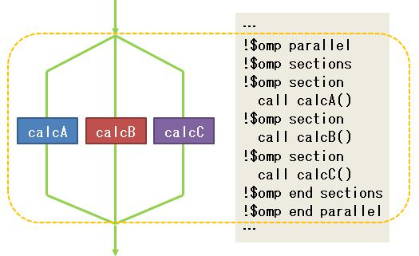

# Fortran与OpenMP | Sections指令解析

> 原文地址: [https://mp.weixin.qq.com/s/K0PVMSj2e4Yh9s4T2px-\_w](https://mp.weixin.qq.com/s/K0PVMSj2e4Yh9s4T2px-_w)

在现代计算中，并行编程已经成为提高程序性能的关键技术之一。OpenMP 是一种广泛使用的并行编程模型，它通过一组编译器指令（即 pragmas）来简化多线程并行程序的开发。对于使用 Fortran 进行科学计算和数值模拟的开发者来说，掌握 OpenMP 可以极大地提升代码的执行效率。本文将重点介绍 OpenMP 中的 `sections` 指令，这是一个非常有用的构造，可以让你轻松地将程序的不同部分分配给多个线程执行，从而实现并行加速。

## Sections指令概述

`sections` 指令是 OpenMP 提供的一种结构化并行构造，它允许程序员将一个工作单元分解成若干个独立的部分（section），每个部分可以由不同的线程独立执行。这特别适用于那些可以自然分割成多个独立任务的工作负载，例如对数据集的不同部分进行处理。

### 「基本语法」

在 Fortran 程序中，`sections` 指令以 `!$omp sections` 指令开头，以 `!$omp end sections` 指令结束，其中每段以 `!$omp section` 指令开始。

`sections` 指令的基本形式如下：

`!$omp sections[子句列表]          private(变量列表)          firstprivate(变量列表)          lastprivate(变量列表)          reduction(运算符:变量列表)   !$omp section       ! 第一部分的代码   !$omp section       ! 第二部分的代码   ! 更多的 section...   !$omp end sections [nowait]   `

其中，方括号 `[]` 表示可选项。可选项可以在 `private`、`firstprivate`、`lastprivate` 和 `reduction` 这些子句中进行选择。`sections` 结构的结束处有一个隐含的同步(或等待)。如果指定了 `nowait` 子句，则可以跳过这个隐含的同步。

由于 `sections` 指令在大多数情况下与一个独立的 `parallel` 指令一起使用，因此，OpenMP 提供了一个组合指令 `!$parallel sections` 来方便编程。

`parallel sections` 指令会启动一个并行区域。如果在这个区域内定义多个 `section`，每个 `section` 都会被分配给一个线程执行。当所有 `section` 完成后，线程会同步，确保所有指定的任务都已完成。

一个程序中可以定义多个 `sections` 结构。同一个 `sections` 中 `section` 之间处于并行状态，而`sections` 与其他 `sections` 之间处于串行状态。

## 典型示例

为了更好地理解 `sections` 的用法，我们来看一个简单的例子。

假设我们需要分别对 3 个大小不同的一维数组（a、b 和 c）进行从大到小的排序，我们可以将任务分成 3 部分，每部分负责计算一个数组的排序。下面是具体的代码。

`program multi_sections     use omp_lib     implicit none     integer, parameter :: N = 1000     real,allocatable :: a(:), b(:), c(:)     integer :: tid,nthreads        allocate(a(N), b(N+100), c(N+200))     call random_number(a)     call random_number(b)     call random_number(c)          call omp_set_num_threads(3)            print '(a)','section no.  nthreads   id'   !$omp parallel private(tid,nthreads)   !$omp sections   !$omp section     tid=omp_get_thread_num()      nthreads=omp_get_num_threads()     print '(a,i8,i8)','section 1',nthreads,tid     ! 第1个数组的排序     call sort(a)    !$omp section     tid=omp_get_thread_num()      nthreads=omp_get_num_threads()     print '(a,i8,i8)','section 2',nthreads,tid     ! 第2个数组的排序     call sort(b)   !$omp section     tid=omp_get_thread_num()      nthreads=omp_get_num_threads()     print '(a,i8,i8)','section 3',nthreads,tid     ! 第3个数组的排序     call sort(c)   !$omp end sections   !$omp end parallel     print '("first 3 numbers in a : ",3f10.7)', a(1:3)     print '("first 3 numbers in b : ",3f10.7)', b(1:3)     print '("first 3 numbers in c : ",3f10.7)', c(1:3)      deallocate(a,b,c)        contains     subroutine sort(x)       real x(:), tmp       integer i, j       do i = 1, N - 1         do j = i + 1, N           if (x(i)<x(j)) then             tmp = x(i)             x(i) = x(j)             x(j) = tmp           end if         end do       end do     end subroutine sort   end program multi_sections   `

编译并执行上述代码后，运行结果如下：

`section no.  nthreads   id   section 1       3       0   section 2       3       1   section 3       3       2   first 3 numbers in a :  0.9992937 0.9992247 0.9991976   first 3 numbers in b :  0.9999692 0.9996313 0.9993972   first 3 numbers in c :  0.9997560 0.9997137 0.9982413   `

在这个例子中，我们使用了 `sections` 指令调用了 3 个线程，并行化执行了 3 个独立的任务。每个线程随机选择了 1 个数组进行排序。通过这种方式，即使数组大小不一，我们也能有效地利用多核处理器的优势。

## 注意事项

-   「数据共享与私有性」：在 `sections` 区域内，变量的共享或私有属性非常重要。默认情况下，变量是共享的，这意味着所有线程都可以访问这些变量。如果需要每个线程拥有自己的副本，则应使用 `private` 子句来声明。
    
-   「禁止跳转」：`section` 内部不允许出现能够到达 `section` 之外的跳转语句，也不允许有外部的跳转语句到达 `section` 内部。
    
-   「同步问题」：虽然 `sections` 指令会自动在线程之间同步，但在某些情况下，可能还需要额外的同步机制，比如使用 `barrier` 指令来确保所有线程到达某个点后再继续。
    
-   「性能考量」：尽管并行化可以提高性能，但创建和管理线程本身也有开销。因此，只有当任务足够重，能够显著超过线程管理成本时，使用 `sections` 才是有益的。
    

## 小结

OpenMP 的 `sections` 指令为 Fortran 程序员提供了一种简单而强大的工具，用于并行执行独立的任务。通过合理地划分任务并利用多核处理器的能力，可以显著提高程序的运行效率。希望本文能帮助你在实际项目中更好地应用这一特性。随着并行计算技术的发展，掌握这些技能将使你在解决复杂计算问题时更加游刃有余。

  

往期推荐

[

Fortran与OpenMP | 简化并行难题，解锁多核力量

](http://mp.weixin.qq.com/s?__biz=Mzk0MzI0NDU2NQ==&mid=2247486048&idx=1&sn=90d8b67d1e0cc5ac942cb1dea04c668c&chksm=c3379e1af440170c7e4cc8e5ddf2521cf483c5c51eec9687fa3e52256b750a9736f553077080&scene=21#wechat_redirect)

[

Fortran与OpenMP | 从"Hello World"启航

](http://mp.weixin.qq.com/s?__biz=Mzk0MzI0NDU2NQ==&mid=2247486155&idx=1&sn=b06fe984ba3261cfe833497c3016f69d&chksm=c3379eb1f44017a769325ef1dda174e2607b567bf1f2e6227f32a4192a31fa4006cb29219028&scene=21#wechat_redirect)

[

Fortran与OpenMP | Do指令解析

](http://mp.weixin.qq.com/s?__biz=Mzk0MzI0NDU2NQ==&mid=2247487400&idx=1&sn=9a4015d7b45e58b21330ef5c9f25a67b&chksm=c3379bd2f44012c4fb442ee389ce3353b1a4d97c74eda022e3665be298efde64c2672878c47a&scene=21#wechat_redirect)

  

# 推荐阅读

**FEtch 系统**是笔者团队开发的新一代有限元软件开发平台。只需按照有限元语言格式填写脚本文件，即可在线自动生成基于**现代 Fortran** 的有限元计算程序，从而大幅提高 CAE 软件的开发效率。欢迎私信交流。

有任何疑问或建议，欢迎加Q群 "**FEtch有限元开发系统(519166061)**" 留言讨论。我们长期开展 FEtch 系统的试用活动，感兴趣的朋友入群后可直接联系管理员，免费获取**许可证文件**。

