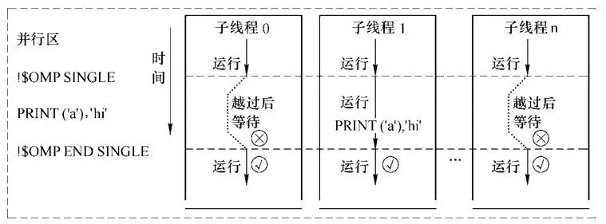

# Fortran与OpenMP | Single指令解析

> 原文地址: [https://mp.weixin.qq.com/s/LtiP33ZCebNSXvXuH4s2Fg](https://mp.weixin.qq.com/s/LtiP33ZCebNSXvXuH4s2Fg)

在并行计算领域，OpenMP 作为一种广泛使用的并行编程接口，为 Fortran 等高级语言提供了强大的支持。特别是在多核处理器普及的今天，如何有效地利用这些核心资源成为了提升程序性能的关键。本文将详细介绍 OpenMP 中的`single`指令，帮助 Fortran 程序员更好地理解和应用这一指令，从而优化并行程序的设计。

## 什么是`single`指令？

在并行编程中，我们经常需要在一个并行区域内执行某些特定的代码段，这些代码段可能需要以串行的方式执行，或者只需要由一个线程来完成。例如，初始化操作、输出结果或更新共享数据等。`single`指令正是为了满足这种需求而设计的。它允许在一个并行区域内指定一段代码，这段代码仅由一个线程执行，而其他线程则在该段代码执行完毕后继续执行后续代码。

## `single`指令的基本语法

`single`指令的基本语法如下：

`!$omp single [子句列表]       代码块   !$omp end single [nowait] [copyprivate(变量列表)]   `

-   「子句列表」：可以包含`private(变量列表)`和`firstprivate(变量列表)`子句。`private`子句定义了在`single`结构中私有的变量，每个线程都会有一个独立的副本。`firstprivate`子句不仅定义了私有变量，还指定了这些变量的初始值。
    
-   「代码块」：在这部分代码中，只有被选中的线程会执行。
    
-   「nowait」：如果指定了`nowait`子句，那么在`single`结构结束后，其他线程不会等待执行`single`结构的线程完成，而是直接继续执行后续代码。
    
-   「copyprivate(变量列表)」：这个子句用于将`single`结构中修改的私有变量的值复制到其他线程的相应变量中。
    

## 注意事项

1.  「单一线程执行」：虽然`single`结构内的代码只能由一个线程执行，但这个线程不一定是主线程。任何线程都有可能被选中执行`single`结构内的代码。
    
2.  「同步机制」：默认情况下，`single`结构结束后，所有线程会在`end single`处同步。如果使用了`nowait`子句，则其他线程会直接继续执行后续代码，不再等待执行`single`结构的线程。
    
3.  「跳转限制」：`single`结构内部不允许出现能够到达`single`结构之外的跳转语句，也不允许有外部的跳转语句到达`single`结构内部。这是为了确保`single`结构的完整性和一致性。
    

## 示例代码解析

为了更好地理解`single`指令的使用方法，我们来看一个具体的示例代码：

`program single_example     use omp_lib     implicit none     integer :: tid, nthreads     integer :: a        call omp_set_num_threads(3)        !$omp parallel private(a, tid)     tid = omp_get_thread_num()     a = tid     print "(a, i5, a, i5, a)", "a =", a, " id =", tid, " before single"        !$omp single     nthreads = omp_get_num_threads()     tid = omp_get_thread_num()     a = a + 10*tid + 100     print "(a, i5, i5)", "single: nthreads =", nthreads     print "(a, i5, a, i5, a)", "a =", a, " id =", tid, " during single"     !$omp end single copyprivate(a)        tid = omp_get_thread_num()     print "(a, i5, a, i5, a)", "a =", a, " id =", tid, " after single"     !$omp end parallel      end program single_example   `

编译并运行，得到

`a =    2 id =    2 before single   a =    1 id =    1 before single   a =    0 id =    0 before single   single: nthreads =    3   a =  122 id =    2 during single   a =  122 id =    2 after single   a =  122 id =    1 after single   a =  122 id =    0 after single   `

在这个示例中，我们首先设置了三个线程，然后在并行区域内定义了一个私有变量`a`和一个线程ID变量`tid`。每个线程在进入`single`结构前都会输出自己的`a`值和线程ID。`single`结构内的代码仅由一个线程执行，该线程会修改`a`的值，并输出相关信息。最后，通过`copyprivate`子句将`a`的值复制到其他线程的相应变量中，所有线程在`end single`处同步后继续执行后续代码。

## 应用场景与优势

`single`指令在并行编程中有许多应用场景，包括但不限于：

1.  「初始化操作」：在并行区域开始时，某些全局变量或共享数据需要进行初始化，这时可以使用`single`指令来确保只由一个线程执行初始化操作。
    
2.  「输出结果」：在并行计算完成后，通常需要将结果输出到文件或控制台。为了避免多个线程同时输出导致混乱，可以使用`single`指令来控制输出操作。
    
3.  「更新共享数据」：在并行计算过程中，有时需要更新一些共享数据结构。为了保证数据的一致性，可以使用`single`指令来确保这些操作的原子性。
    

## 小结

`single`指令是 OpenMP 中一个非常有用的工具，它可以帮助 Fortran 程序员在并行区域内高效地执行特定的串行代码段。通过合理使用`single`指令，不仅可以简化代码逻辑，还可以提高程序的性能和可靠性。希望本文能够帮助读者更好地理解和应用`single`指令，从而在并行编程中取得更好的效果。

  

往期推荐

[

Fortran与OpenMP | 简化并行难题，解锁多核力量

](http://mp.weixin.qq.com/s?__biz=Mzk0MzI0NDU2NQ==&mid=2247486048&idx=1&sn=90d8b67d1e0cc5ac942cb1dea04c668c&chksm=c3379e1af440170c7e4cc8e5ddf2521cf483c5c51eec9687fa3e52256b750a9736f553077080&scene=21#wechat_redirect)

[

Fortran与OpenMP | 从"Hello World"启航

](http://mp.weixin.qq.com/s?__biz=Mzk0MzI0NDU2NQ==&mid=2247486155&idx=1&sn=b06fe984ba3261cfe833497c3016f69d&chksm=c3379eb1f44017a769325ef1dda174e2607b567bf1f2e6227f32a4192a31fa4006cb29219028&scene=21#wechat_redirect)

[Fortran与OpenMP | Private与Shared子句解析](http://mp.weixin.qq.com/s?__biz=Mzk0MzI0NDU2NQ==&mid=2247486338&idx=1&sn=5c765c558f4443148723bf79643c92b0&chksm=c3379ff8f44016eeb0406fdc92abd7e4bec2802ca3a5df81d8c5419da78053425f467b21b379&scene=21#wechat_redirect)

  

  

  

# 推荐阅读

**FEtch 系统**是笔者团队开发的新一代有限元软件开发平台。只需按照有限元语言格式填写脚本文件，即可在线自动生成基于**现代 Fortran** 的有限元计算程序，从而大幅提高 CAE 软件的开发效率。欢迎私信交流。

有任何疑问或建议，欢迎加Q群 "**FEtch有限元开发系统(519166061)**" 留言讨论。我们长期开展 FEtch 系统的试用活动，感兴趣的朋友入群后可直接联系管理员，免费获取**许可证文件**。

