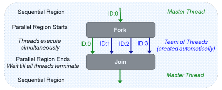

# Fortran与OpenMP | 从"Hello World"启航

> 原文地址: [https://mp.weixin.qq.com/s/0nhKM7UJtlu4pzEPSgDz1A](https://mp.weixin.qq.com/s/0nhKM7UJtlu4pzEPSgDz1A)

  

点击上方「蓝字」关注我们

在并行计算领域，OpenMP作为一种广泛使用的、基于共享内存的并行编程模型，为开发者提供了一种简便的方式来加速自己的应用程序。对于Fortran程序员而言，OpenMP的集成尤为自然，允许你利用多核处理器的威力，而无需深入复杂的并发编程细节。本文将引导你通过一个简单的“Hello World”示例，开启Fortran与OpenMP结合的并行编程之旅。

## OpenMP简介

OpenMP (Open Multi-Processing) 是一种编译器指令集，支持C、C++和Fortran等语言，用于指导编译器如何生成并行代码。通过在源代码中嵌入特殊的注释（Fortran中以`!$OMP`开头），程序员可以指定哪些部分的代码应该并行执行，如何分配数据，以及如何同步线程等。

## 准备工作

在开始之前，请确保你的开发环境支持OpenMP。大多数现代Fortran编译器（如GNU Fortran、Intel Fortran Compiler等）都内置了对OpenMP的支持。编译时需要启用OpenMP选项，例如使用gfortran时，可以简单地通过添加`-fopenmp`编译选项来实现。

## HelloWorld示例

让我们从最简单的“Hello World”程序开始，逐步引入OpenMP的并行性。下面是一个未使用OpenMP的Fortran版本的“Hello World”程序：

`program hello_world     implicit none     print *, "Hello, World!"   end program hello_world   `

接下来，我们将利用OpenMP让这段程序并行输出多条“Hello, World!”信息。

`program hello_openmp     use omp_lib     implicit none        integer :: tid        call omp_set_num_threads(4) ! 设置线程数为4     !$OMP PARALLEL PRIVATE(tid)       tid = omp_get_thread_num() ! 获取当前线程编号       print *, "Hello, World from thread ", tid, &               " of ", omp_get_num_threads()     !$OMP END PARALLEL      end program hello_openmp   `

在这个版本中，我们做了以下改动：

1.  「引入OpenMP库」：通过`use omp_lib`语句，使程序能够使用OpenMP提供的函数和指令。
    
2.  「设置线程数」：`call omp_set_num_threads(4)`指定了要使用的线程数量为4。这个值可以根据实际情况调整。
    
3.  「并行区域」：使用`!$OMP PARALLEL`和`!$OMP END PARALLEL`指令标记出需要并行执行的代码块。
    
4.  「线程私有变量」：通过`PRIVATE(tid)`子句声明，`tid`变量在每个线程中都有自己独立的副本，存储各自的线程编号。
    
5.  「获取并打印线程信息」：`omp_get_thread_num()`返回当前线程的编号，而`omp_get_num_threads()`则返回当前并行区域中活动线程的数量。
    

## 编译与运行

确保在编译时加上OpenMP支持，比如使用gfortran编译器：

`gfortran -fopenmp hello_openmp.f90 -o hello_openmp   ./hello_openmp   `

运行后，你将看到类似以下的输出。每次运行可能会有不同的顺序，因为线程的执行是并发且无序的：

 `Hello, World from thread 3 of 4    Hello, World from thread 1 of 4    Hello, World from thread 0 of 4    Hello, World from thread 2 of 4`

## 多种方法设置线程数量

并行计算时的线程数量如何设置？OpenMP 允许用户以多种方式来设置线程数量，以下是一些常见的方法：

1.  「omp\_set\_num\_threads() 函数」：在代码中，你可以使用 `omp_set_num_threads()` 函数来明确设置要使用的线程数量。例如，上面例子中的`call omp_set_num_threads(4)` ，将线程数设置为4。
    
2.  「num\_threads 子句」：在 `parallel` 区域前，你可以使用 `num_threads` 子句来指定该特定区域使用的线程数。例如：
    
    `!$OMP PARALLEL num_threads(4)   // 并行执行的代码块   !$OMP END PARALLEL   `
    
3.  「OMP\_NUM\_THREADS 环境变量」：在程序运行前，可以通过设置环境变量 `OMP_NUM_THREADS` 来指定线程数。根据程序运行的操作系统平台，可以这样做：
    
    `# Linux或Unix   export OMP_NUM_THREADS=4   # Windows   set OMP_NUM_THREADS=4   `
    
4.  「编译器默认值」：如果没有显式设置，OpenMP可能会使用编译器或运行时库的默认设置，通常这会是检测到的处理器逻辑核心数。
    

如果使用多种方法同时进行了设置，一般是编译器默认实现的环境变量的优先级最低、编程人员设置的环境变量的优先级较高、库函数的优先级最高。

## 可设的线程数量有限制吗？

理论上是没有限制的，但上限肯定会受到操作系统的约束。

如果你的CPU是6核，理论上拥有12个逻辑线程（假设支持超线程），OpenMP允许你设置更多的线程数量，比如20个、100个，甚至更多，即使这远超过了物理和逻辑核心的数量。

然而，当设置的线程数超过实际的硬件线程数时，操作系统会通过「时间片轮转」等机制来管理这些线程，让它们共享CPU资源。这意味着每个线程的实际执行时间会减少，导致整体效率下降，因为线程上下文切换会引入额外的开销。

当然，凡事无绝对。在某些情况下，如果程序中有「大量的I/O操作或其他阻塞操作」，较多的线程可以让CPU在等待时切换到其他线程执行，从而可能提高整体的吞吐量。

因此，OpenMP程序的性能表现可能会根据任务的具体情况而变化，有时过多的线程反而会导致性能降低。最佳线程数通常需要根据具体的应用场景和负载测试来确定。

## 小结

通过这个简单的“Hello World”示例，我们体验了在Fortran程序中利用OpenMP进行并行编程的基本步骤。这只是冰山一角，OpenMP提供了丰富的特性来控制并行任务的执行，包括循环并行化、数据划分、锁和原子操作等高级功能，使得开发高性能、可扩展的并行应用变得更加直接和高效。继续探索OpenMP的世界，你会发现更多提升程序性能的秘诀。

# 推荐阅读

**FEtch 系统**是笔者团队开发的新一代有限元软件开发平台。只需按照有限元语言格式填写脚本文件，即可在线自动生成基于**现代 Fortran** 的有限元计算程序，从而大幅提高 CAE 软件的开发效率。欢迎私信交流。

有任何疑问或建议，欢迎加Q群 "**FEtch有限元开发系统(519166061)**" 留言讨论。我们长期开展 FEtch 系统的试用活动，感兴趣的朋友入群后可直接联系管理员，免费获取**许可证文件**。