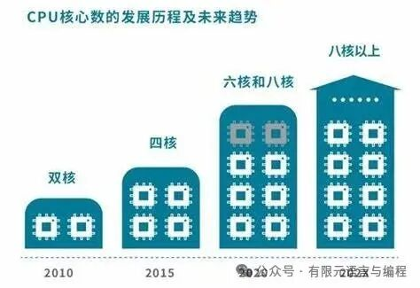
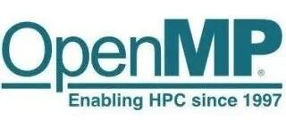
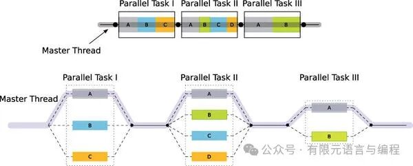
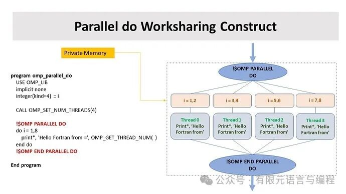

# Fortran与OpenMP | 简化并行难题，解锁多核力量

> 原文地址: [https://mp.weixin.qq.com/s/GAdj6qyhji28Hukb2yLsMw](https://mp.weixin.qq.com/s/GAdj6qyhji28Hukb2yLsMw)

  

点击上方「蓝字」关注我们

在科技日新月异的今天，高性能计算已经成为科学研究和工业应用不可或缺的一环。为了充分利用现代多核处理器和分布式系统的计算能力，开发者们不断探索高效的并行编程技术。Fortran，作为一门历史悠久且专为科学计算优化的语言，结合OpenMP并行编程模型，构成了实现高性能计算的有力工具。本文旨在深入探讨Fortran语言的特性和优势，以及OpenMP如何助力Fortran程序实现高效的并行处理，同时揭示两者结合后可能面临的挑战和应对策略。

## Fortran：科学计算的常青树

Fortran，全称为“FORmula TRANslation”，自1957年问世以来，便以其对数学表达式的直接支持和对高性能计算的强大适配性，成为了科学和工程计算领域的首选语言。历经数十年的演进，从最初的 FORTRAN 66、77 到现代的 Fortran 90/95、2003/2008/2018 和最新的 Fortran 2023，每一次迭代都带来了新的功能和改进，不仅增强了对现代编程范式的支持，如面向对象编程、模块化设计、泛型编程，还进一步优化了数组操作和并行计算能力，使Fortran能够更好地服务于日益复杂和规模庞大的科学计算需求。

## OpenMP：并行编程的加速器

随着技术的发展，现代计算机的CPU核心数量不断增加，传统的串行计算模式已经无法充分利用这些硬件资源。并行编程允许程序同时在多个核心上执行，从而显著加快了计算速度，特别是在处理大规模数据和复杂计算任务时。

  

OpenMP，作为一种广泛应用的并行编程模型，旨在通过高级抽象层简化并行程序的开发。它提供了一系列编译指导语句（pragma directives），允许程序员在保持原有代码结构的基础上，向编译器指示哪些部分的代码应当并行执行，以及如何管理数据共享、线程同步等问题。OpenMP的优势在于其易用性和跨平台性，支持包括Fortran、C、C++在内的多种编程语言，并且能够在多种操作系统和硬件平台上运行，为开发者提供了一个统一的并行编程框架。

  

### OpenMP的核心特性

-   **简洁性**：通过简单的编译指导语句，如`!$omp parallel`，即可实现并行化，避免了低级线程管理的复杂性。
    
-   **扩展性**：程序可以根据需要增加或减少并行区域，以适应不同的计算资源和性能需求。
    
-   **移植性**：由于OpenMP是一种标准，其编译指导语句和库函数在遵循该标准的编译器上均可通用，这使得基于OpenMP的代码能够在不同系统和架构之间轻松迁移。
    
-   **灵活性**：提供了对共享变量、私有变量、锁、屏障等多种并行编程元素的支持，以满足不同场景的需求。
    

## Fortran与OpenMP的协同效应

Fortran语言自身的高效性和对数组运算的优化，与OpenMP的并行化能力相结合，为解决大规模科学计算问题提供了一个高效、灵活的解决方案。比如，在处理大规模矩阵运算、物理模拟、气候建模等计算密集型任务时，只需在Fortran代码的关键循环中添加OpenMP的并行编译指导指令，即可自动将循环体内的操作分配给多个线程执行，从而显著提高执行效率。

  

### 实现并行化的步骤

1.  **标识并行区域**：首先，识别出程序中的计算密集型部分，如循环，这些通常是并行化的首要目标。
    
2.  **添加并行编译指导指令**：在这些区域前后添加OpenMP的并行指令，如`!$omp parallel do`，指示编译器生成并行代码。
    
3.  **管理数据共享**：使用OpenMP的专用指令，如`private`、`shared`等，明确指定哪些变量是每个线程私有的，哪些是共享的。
    
4.  **同步与通信**：通过锁、屏障等机制确保线程之间的正确同步，避免数据竞争和一致性问题。
    
5.  **性能调优**：分析并行执行的性能，根据实际运行情况调整并行粒度、负载均衡等参数，以达到最佳性能。
    

  

## 面临的挑战与对策

尽管Fortran搭配OpenMP为并行计算提供了便利，但实践中也存在一些挑战：

-   **数据依赖与竞态条件**：并行化过程中容易出现数据依赖问题，导致程序结果不可预测。开发者需仔细分析程序逻辑，合理使用OpenMP提供的数据环境类型和同步机制。
    
-   **负载不均**：不同线程处理的工作量不一致可能会降低整体效率。采用动态分配工作项或调整并行区域的大小可以帮助改善负载均衡。
    
-   **调试困难**：并行程序的调试通常比串行程序更为复杂。使用专门的并行调试工具，如Intel的VTune Amplifier或Allinea Debugger，有助于定位并解决问题。
    
-   **非共享内存系统限制**：OpenMP主要针对共享内存系统设计，对于分布式内存系统（如计算机集群）的支持有限。在这些环境下，可能需要考虑其他并行模型，如MPI（Message Passing Interface）。
    

## 小结

Fortran与OpenMP的结合，为科学计算和高性能计算领域提供了一个强大的工具集。Fortran的计算效率和对数组操作的优化，加之OpenMP带来的并行处理能力，使得开发者能够快速开发出既高效又易于维护的并行程序。面对并行计算中的挑战，通过细致的分析、合理的并行设计、有效的调试工具以及适时地采用混合并行模型，可以最大限度地发挥这种组合的优势，推动高性能计算技术的持续进步。未来，随着计算硬件的不断演进和并行编程模型的持续发展，Fortran与OpenMP的合作将为解决更复杂、更大数据规模的科学问题开辟新的可能性。

# 推荐阅读

**FEtch 系统**是笔者团队开发的新一代有限元软件开发平台。只需按照有限元语言格式填写脚本文件，即可在线自动生成基于**现代 Fortran** 的有限元计算程序，从而大幅提高 CAE 软件的开发效率。欢迎私信交流。

有任何疑问或建议，欢迎加Q群 "**FEtch有限元开发系统(519166061)**" 留言讨论。我们长期开展 FEtch 系统的试用活动，感兴趣的朋友入群后可直接联系管理员，免费获取**许可证文件**。