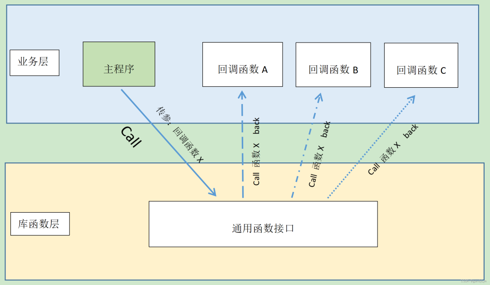

# Fortran中的函数与回调：概念与实践

> 原文地址: [https://mp.weixin.qq.com/s/BnHKCOM1R\_tkOo4Kqm-ZCg](https://mp.weixin.qq.com/s/BnHKCOM1R_tkOo4Kqm-ZCg)

点击上方「蓝字」关注我们

在编程领域中，回调函数是一种强大而灵活的机制，它们不仅增强了代码的复用性和可维护性，还使得程序结构更加清晰和模块化。在 Fortran 这一经典的编程语言中，也存在着与回调函数相关的概念和技术。本文将深入探讨 Fortran 中的回调函数概念，并通过一个简单示例来演示其应用，以帮助读者更好地理解和掌握这一高级编程技巧。

## 函数基础

在 Fortran 中，函数是一种可以接受输入参数并返回一个值的过程。函数的定义包括了函数名、返回类型、输入参数及其类型等。它通常用于计算一个表达式的结果，并且可以被程序中的其他部分调用多次。下面是一个简单的函数示例，该函数计算两个实数的和。

### 「函数定义」

`function add(a, b) result(c)     implicit none     real, intent(in) :: a, b     real :: c     c = a + b   end function add   `

在这个例子中，`add` 函数接收两个输入参数 `a` 和 `b`，并且返回它们的和。`intent(in)` 属性指定了这两个参数是只读的，意味着函数不会修改它们。

### 「调用函数」

可以在主程序或其他子程序中调用上述函数，调用方法非常简单，只需要使用函数名并传递相应的参数即可。如下所示：

`program main     implicit none     real :: x, y, z     x = 5.0     y = 3.0     z = add(x, y)     print *, "The sum is: ", z   end program main   `

这里，`main` 程序调用了 `add` 函数，并将结果存储在变量 `z` 中。

## 回调函数

回调函数，简单来说，就是「将函数作为参数传递给另一个函数」，使得接收函数（主函数）在适当的时候可以“回过头来”调用这个传入的函数（回调函数）。这相当于用户可以根据需要，向通用函数或模块传递自定义功能的代码段，将行为的定义推迟到运行时，从而实现更加动态和灵活的编程。

在 Fortran 中，实现这一机制涉及到抽象接口(abstact interface)和过程绑定(procedure binding)的概念。

### 「抽象接口和过程绑定」

为了更好地理解 Fortran 中的回调函数的定义，我们首先需要了解抽象接口。「抽象接口」是一种定义一组操作（通常是函数或子程序）的方式，而不具体指定这些操作的实现。这就像是为一组相关的行为定义了一个契约，而具体的实现可以由不同的过程或模块来完成。

通过抽象接口，我们可以为回调函数定义必须遵循的签名，即函数的输入输出参数类型和返回值类型。这是确保回调函数兼容性的关键。

假设我们需要一个子程序 `caller`，它接收两个实数和一个函数（即回调函数）作为参数，并将该函数应用到两个实数上来进行一些操作并得到一个实数。要实现这一功能，首先我们需要定义一个抽象接口，以描述回调函数的签名：

`abstract interface     function def_func(a, b) result(c)       implicit none       real, intent(in) :: a, b       real :: c     end function def_func   end interface   `

接着，我们继续具体定义 `caller` 子程序。这里需要进行「过程绑定」，使用 `procedure` 语句来绑定已定义的抽象接口和即将被调用的回调函数，以约束作为参数传入的回调函数的格式，保证代码的规范性。例如：

`subroutine caller(x, y, func)     implicit none     !绑定抽象接口和回调函数     procedure(def_func) :: func     real, intent(in) :: x, y     real :: z     z = func(x,y)     print *, z      end subroutine caller   `

实际操作中，我们通常将以上内容封装到一个模块里面，以方便后续调用。

`module func_mod     abstract interface       function def_func(a, b) result(c)         implicit none         real, intent(in) :: a, b         real :: c       end function def_func     end interface   contains     subroutine caller(x, y, func)       implicit none       procedure(def_func) :: func       real, intent(in) :: x, y       real :: z       z = func(x, y)       print *, z        end subroutine caller   end module func_mod   `

### 「使用回调函数」

现在我们具体地实现并使用一下回调函数。假设我们想让 `caller` 子程序调用加法函数 `add` 和乘法函数 `mult` 来分别操作两个实数，主程序可以这样来写：

`program main     use func_mod     implicit none     real :: x, y     x = 5.0     y = 3.0     !使用回调函数     call caller(x, y, add) !加法     call caller(x, y, mult) !乘法    contains     !加法函数     function add(a, b) result(c)       real, intent(in) :: a, b       real :: c       c = a + b     end function add     !乘法函数     function mult(a, b) result(c)       real, intent(in) :: a, b       real :: c       c = a*b     end function mult   end program main   `

我们注意到，作为回调函数的加法函数 `add` 和乘法函数 `mult` ，它们的输入输出参数格式与前面抽象接口中的定义的 `def_func` 是完全一致的，有效地保证了调用过程的安全性。

编译并运行，我们得到了以下预期的结果：

`> gfortran main.f90 -o main && main      8.00000000      15.0000000   `

## 讨论

Fortran 中的回调函数是通过抽象接口和过程绑定的方式来实现的，这一技术为我们的编程带来了更多的可能性：

-   为代码编写提供了一种高度的灵活性和可扩展性。我们可以轻松地添加新的函数类型，只要它们满足抽象接口的定义，就可以与现有的代码无缝集成。
    
-   有助于提高代码的可读性和可维护性。通过明确地定义抽象接口，我们可以清晰地看到哪些操作是可用的，而不需要在具体的代码中去查找和理解各种不同的函数和子程序。
    
-   可以促进代码的复用。我们可以在不同的项目中定义和使用相同的抽象接口，只要具体的实现满足要求，就可以重用已有的代码。
    

## 小结

通过上述示例，我们可以看到，Fortran 中的回调函数通过抽象接口和过程绑定的方式实现，为编程带来了更多的可能性和灵活性。开发者可以利用这一特性设计出更加动态、响应式的系统，并提高代码的可读性和可维护性。希望这篇介绍能激发你探索 Fortran 回调函数更深层次应用的兴趣。

  

**往期推荐**

[

深入浅出Fortran过程接口：确保代码安全与有效交互的关键

](http://mp.weixin.qq.com/s?__biz=Mzk0MzI0NDU2NQ==&mid=2247484605&idx=1&sn=121c23968804b120a463966aa5515aaf&chksm=c33790c7f44019d12a482c3df09dde9ab741dbb63fa546a1639fcb910d34ff5d020deedfb4d2&scene=21#wechat_redirect)

[

现代Fortran探索之旅 | Module模块

](http://mp.weixin.qq.com/s?__biz=Mzk0MzI0NDU2NQ==&mid=2247484413&idx=1&sn=bc6a2c9ab33e140df5e10f3604588fc0&chksm=c3379787f4401e918bbf72bce2a7c3161e7ae4ba750e7b7394ccd17a443f072e36ca756bccba&scene=21#wechat_redirect)

[

Fortran调用C语言：应用Gauss-Legendre积分计算圆周率

](http://mp.weixin.qq.com/s?__biz=Mzk0MzI0NDU2NQ==&mid=2247485196&idx=1&sn=6174d38dcb7f9d9fd62bf49a07bd05b6&chksm=c3379376f4401a6039df0331af833a8dd1d4fb2f4d2d9b4f227311b3cf80175136d75ee2dab4&scene=21#wechat_redirect)

  

# 推荐阅读

**FEtch 系统**是笔者团队开发的新一代有限元软件开发平台。只需按照有限元语言格式填写脚本文件，即可在线自动生成基于**现代 Fortran** 的有限元计算程序，从而大幅提高 CAE 软件的开发效率。欢迎私信交流。

有任何疑问或建议，欢迎加Q群 "**FEtch有限元开发系统(519166061)**" 留言讨论。我们长期开展 FEtch 系统的试用活动，感兴趣的朋友入群后可直接联系管理员，免费获取**许可证文件**。

