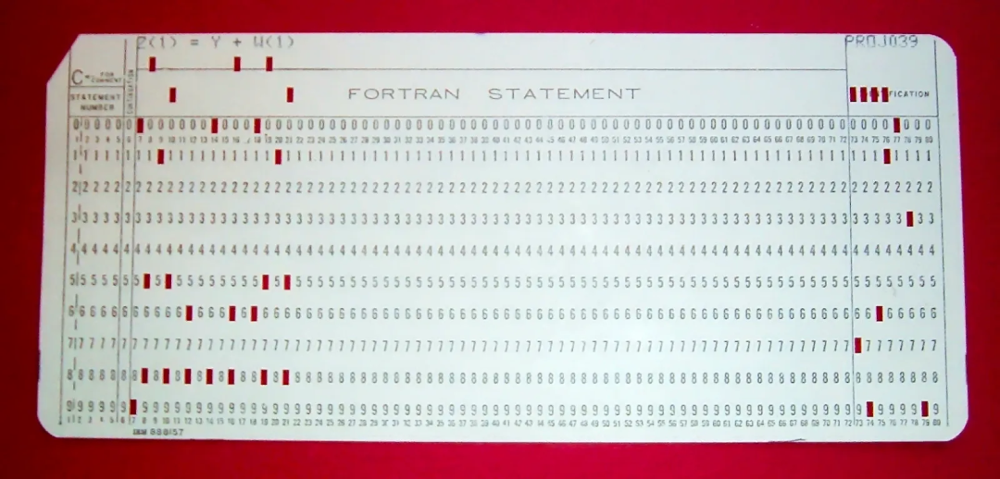
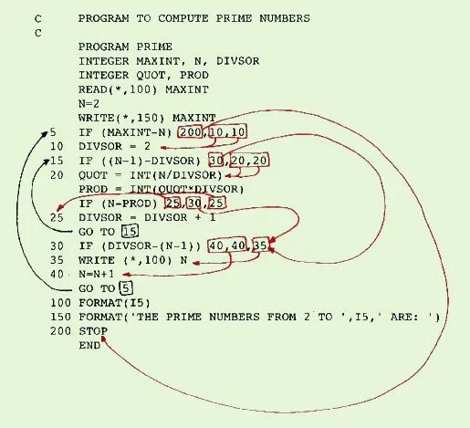

# Fortran中的行号：用？还是不用？

> 原文地址: [https://mp.weixin.qq.com/s/3Zkv3wEp3sFaZUT-CQHJ\_A](https://mp.weixin.qq.com/s/3Zkv3wEp3sFaZUT-CQHJ_A)

在编程语言的悠久历史中，Fortran作为一门起源于穿孔卡片时代的语言，承载着丰富的传统和实践。随着技术的发展，数以万行计的大型代码库在现代科学计算领域中被广泛运用，对可读性和维护性的需求日益凸显。因此，**淘汰那些降低代码清晰度和可维护性的旧式编码习惯，成为了当务之急。**

Fortran语言中的行号便是其中一个历史悠久的特性，源自该语言早期使用穿孔卡片进行编程的时代。**行号在Fortran程序中主要用于标识代码行**，允许程序的某部分直接引用特定行，以执行跳转或指定格式化输入输出等操作。虽然Fortran编程中的行号使用已逐渐被淘汰，但在特定场景下，这一古老的机制依然有其存在的必要。

  

## 历史背景

在穿孔卡片时代，每张卡片代表程序的一行代码，行号有助于在卡片排序混乱或丢失的情况下重新组织程序。此外，早期的编译器和编辑工具依赖行号进行代码定位和控制流管理。

在Fortran 77及其更早版本中，行号位于代码行的开始位置，占用第1到第5个字符。行号后紧跟续行指示符（如果有的话）、语句本身以及注释。早期的Fortran程序中，行号常与`GOTO`语句结合使用，实现程序流程的无条件跳转。

  

## 行号使用的弊病：实例分析

### 「示例1：`DO`循环与`CONTINUE`语句」

想象一位经验丰富的老教授编写的代码片段（BadEx01.f90）：

`do 10 i=1,10   do 20 j=1,10      write(6,*) i+j   20 continue    10 continue   `

这种风格的问题在于，容易混淆`10`和`20`行号的顺序，导致错误地关闭循环。随着循环体的增长，分辨哪个`CONTINUE`对应哪个`DO`循环变得困难，且编辑器的自动格式化功能可能失效。

更好的做法是结合代码缩进(`code indent`)，使用结构化的结束语句：

`do i=1,10       do j=1,10           write(6,*) i+j       end do   end do   `

### 「示例2：`GOTO`语句跳离循环」

即便是相对年轻的开发者，也可能会写出下面这样的代码（BadEx02.f90）：

`do i=1,10       if(f(i) > 0) goto 30   end do   30 continue   `

这应该是极力避免的。长代码中，`GOTO`的目标位置难以追踪，降低了可读性。

更好的实践是采用`EXIT`指令：

`do i=1,10       if(f(i) > 0) exit   end do   `

## 不得不使用行号的场合

尽管上述讨论强调了避免使用行号的重要性，但在Fortran中，某些情况下仍需依赖行号，这主要是由于语言规范的历史遗留。

### 「格式说明符」

定义输出格式时，如`FORMAT`语句，必须通过行号引用，如：

`100 format(f10.4)   !...      write(*,100) x      !...      write(*,100) y   `

尽管如此，对于不那么频繁复用的格式，直接在`WRITE`语句内嵌入格式描述可能是更佳选择。

`write(*,'(f10.4)') x   `

### 「文件输入与EOF检测」

在`READ`命令中使用`END`选项来检测文件结束（EOF），之后的处理需要跳转到指定行号，例如：

`open(11,file='example.dat')   do while(.true.)       read(11,*,end=100) record       print*, record   enddo   100 close(11)   `

虽然这种做法引入了行号以进行跳转，影响代码的可读性，但不得不承认，对于判断读取文件结束这一需求来说，这确实是一项非常简捷实用的方法。

## 结论

综上所述，虽然Fortran编程中的行号使用已逐渐被淘汰，但在特定场景下，这一古老的机制依然有其存在的必要。为了最大程度地提升代码质量，开发者应当熟悉这些规则，并在可能的情况下，积极采用更加现代、清晰的编程实践。

**FEtch 系统**是笔者团队开发的新一代有限元软件开发平台。只需按照有限元语言格式填写脚本文件，即可在线自动生成基于**现代 Fortran** 的有限元计算程序，从而大幅提高 CAE 软件的开发效率。欢迎私信交流。

有任何疑问或建议，欢迎加Q群 "**FEtch有限元开发系统(519166061)**" 留言讨论。我们长期开展 FEtch 系统的试用活动，感兴趣的朋友入群后可直接联系管理员，免费获取**许可证文件**。