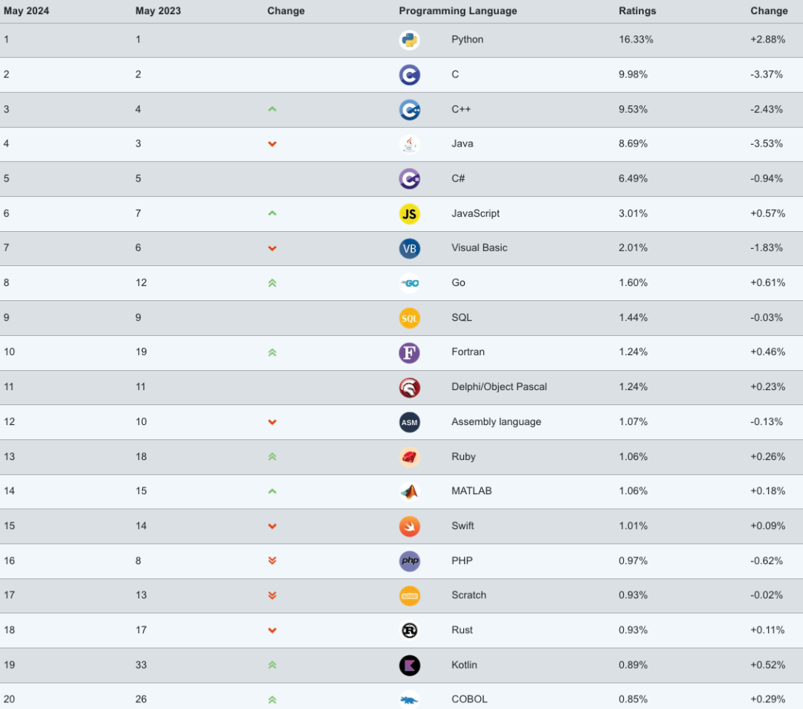
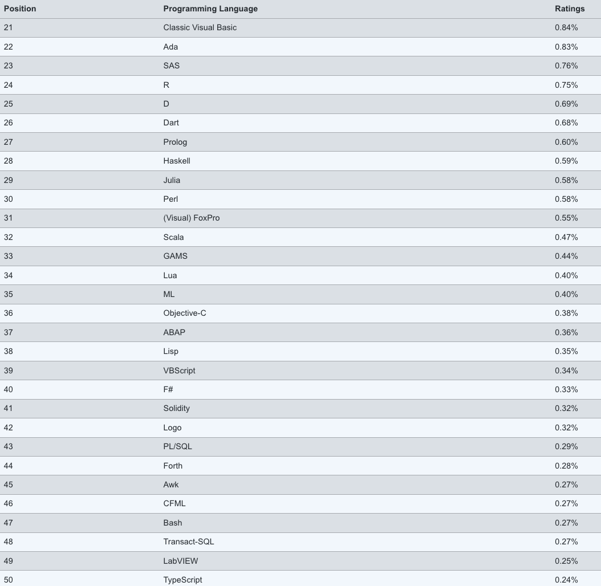
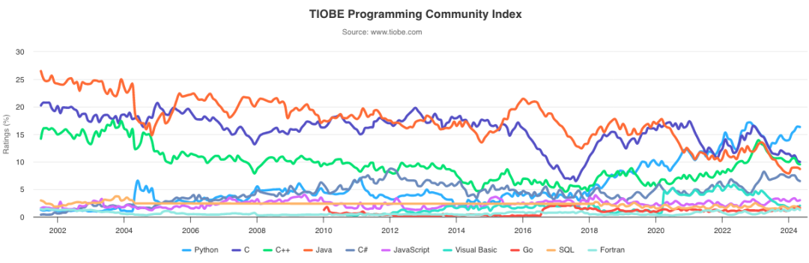
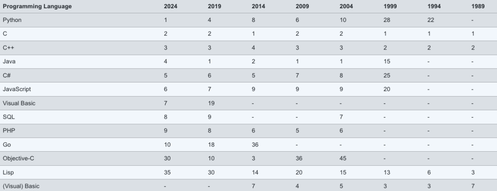
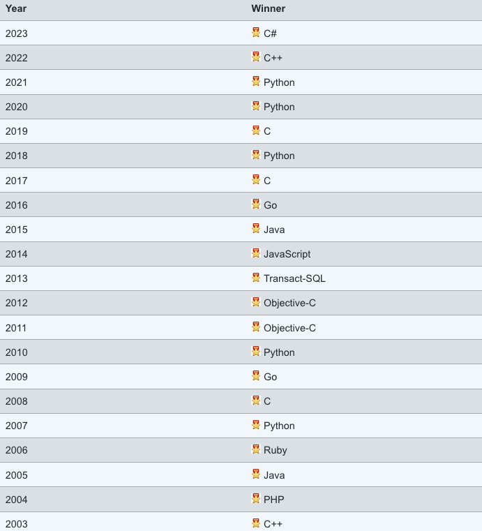

# Fortran语言连续两个月进入Top10 | TIOBE 5月榜单发布

> 原文地址: [https://mp.weixin.qq.com/s/33s35RcqtyS8\_vlRxGxoAA](https://mp.weixin.qq.com/s/33s35RcqtyS8_vlRxGxoAA)

  

  

点击上方蓝字关注我们

  

  

5 月 TIOBE 编程语言榜单已发布，一起来看看本月有什么值得关注的新变化吧！

****

**67 岁老牌语言 Fortran 连续两个月进入 Top10**

和过往榜单相比，主流的编程语言并没有太大变化，Python 增幅依然迅猛，以 16.33% 的市场份额稳居第一。其次分别为 C、C++、Java 和 C#。

从官方分析角度来看，TIOBE 官方在 5 月榜单中给出的标题是“Fortran 进入 Top 10，这到底是怎么回事？”

论及 Fortran，这门高级编程语言已经有 67 年的发展历史。起初，由 IBM 的 John Backus 和他的团队开发出来。Fortran 的初衷是为了让科学家和工程师能够更容易地编写数学和科学计算程序，而不需要深入了解底层的机器代码。

在其发展初期，Fortran 成为了科学计算的标准，广泛应用于航天、气象学、物理学、工程学等领域。随着时间的推移，Fortran 经历了多个版本的发布和更新，不断发展壮大。后来，Fortran 逐渐成为科学计算领域的主导语言之一，因其高效的数值计算能力和简单易用的特性而备受青睐。

然而，随着计算机技术的发展，其他编程语言如 C 和 C++、Python、MATLAB、R 等语言也逐渐崭露头角，开始在高性能计算、科学计算领域竞争，Fortran 的流行度在一些领域有所下降。

如今，Fortran 在 2024 年 4 月份的指数中重返 Top10，并在 2024 年 5 月份的指数中依然保持第十名的位置，也让人眼前一亮。要知道在 4 月份之前，Fortran 最后一次出现在 TIOBE 前十名中是在 2002 年 4 月份。

对此，TIOBE 的首席执行官 Paul Jansen 将 Fortran 近期的崛起归因于该语言在数值/数学计算方面的优势。

“尽管在这个领域有很多竞争对手， 但Fortran 有其存在的理由，”Jansen说道。他指出了竞争对手的缺点：

-   Python 虽然是首选，但速度较慢；
    
-   MATLAB 非常易于用在数学计算维度，但附带昂贵的许可证；
    
-   C/C++ 虽然是主流且快速，但没有原生计算支持；
    
-   R 速度慢；  
    
-   Julia 虽然正在崛起，但尚未成熟。
    

“在这些语言的丛林中，Fortran 看起来是快速的，具有原生数学计算支持，成熟且免费。悄然间，Fortran 在慢慢但确定地赢得市场份额。这是令人惊讶但不可否认的。”

****

**其他编程语言**

以下为 Top 21-50 的编程语言榜单：

第 51-100 名如下，由于它们之间的数值差异较小，仅以文本形式列出（按字母排序）：

-   ABC, ActionScript, Algol, Apex, APL, bc, Boo, Carbon, CIL, CL (OS/400), CLIPS, Clojure, Common Lisp, Curl, DiBOL, Erlang, Factor, Groovy, Hack, Icon, Inform, Io, J, JScript, Ladder Logic, Lingo, LiveCode, LPC, MQL5, NATURAL, Nim, OCaml, OpenEdge ABL, Oxygene, Paradox, PL/I, PowerShell, Pure Data, Q, Ring, RPG, Scheme, Smalltalk, SPARK, Standard ML, WebAssembly, Wolfram, X++, Xojo, XPL 
    

********

**Top 10 编程语言 TIOBE 指数走势（2002-2024）**

****

## **历史排名（1988-2024）**

注：以下排名位次取决于 12 个月的平均值。

## **编程语言“名人榜”（2003-2023）**

## 

**【说明】：**

TIOBE 编程语言社区排行榜是编程语言流行趋势的一个指标，每月更新，这份排行榜排名基于全球技术工程师、课程和第三方供应商的数量，其中包括了流行的搜索引擎以及技术社区，如 Google、百度、维基百科、必应等等。具体的计算方式详见：https://www.tiobe.com/tiobe-index/programming-languages-definition/。请注意这个排行榜只是反映某个编程语言的热门程度，并不能说明一门编程语言好不好，或者一门语言所编写的代码数量多少。

这个排行榜可以用来考察你的编程技能是否与时俱进，也可以在开发新系统时作为一个语言选择依据。