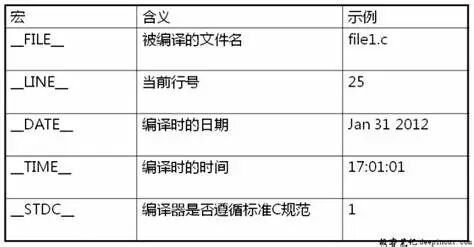

# Fortran调试技巧 | 借用C语言中的FILE和LINE宏

> 原文地址: [https://mp.weixin.qq.com/s/c5s\_BU5e8WfzlMNnn1aPPA](https://mp.weixin.qq.com/s/c5s_BU5e8WfzlMNnn1aPPA)

  

点击上方 蓝字 关注我们

在编程过程中，调试是一项不可或缺的工作。良好的调试习惯不仅能够帮助开发者快速定位和解决问题，还能提高代码的质量和可维护性。对于 Fortran 这样的传统语言来说，尽管它的语法和特性可能不如现代语言那么丰富，但开发者仍然可以通过一些技巧来增强其调试能力。本文将介绍如何在Fortran中利用C语言的 `__FILE__` 和 `__LINE__` 宏来辅助调试，以期为 Fortran 开发者提供一种有效的方法来追踪错误发生的位置。

## C 语言中的 FILE 和 LINE 宏

在 C 语言中，预处理器提供了几个有用的内置宏（如下表所示），其中包括 `__FILE__` 和 `__LINE__`。`__FILE__` 宏会被预处理器替换为一个包含当前源文件名称的字符串，而 `__LINE__` 则会被替换为一个表示当前源文件行号的整数。这两个宏在编写错误报告或日志记录时非常有用，因为它们可以帮助开发者准确地定位到代码中的具体位置。

例如，在 C 语言中，你可以这样使用它们：

`#include <stdio.h>      int main() {       printf("An error occurred in %s on line %d\n", __FILE__, __LINE__);       return 0;   }   `

编译并运行上述代码，将会得到

> An error occurred in main.c on line 5

这有助于快速找到问题发生的地点。

## 在 Fortran 中使用 C 语言的宏

Fortran 作为一种古老的编程语言，同样支持预处理器指令。这意味着在某些情况下，我们也可以在 Fortran 代码中使用 `__FILE__` 和 `__LINE__` 宏。不过，需要注意的是，这需要在编译时启用预处理器。不同的 Fortran 编译器有不同的预处理器启用方式，例如，Intel Fortran 编译器使用 `/fpp` 选项，而 gfortran 则使用 `-cpp` 选项。

下面是一个名为 `main.f90` 的 Fortran 语言示例程序，展示了如何使用这两个宏：

`program main       implicit none       print *, "An error occurred in "//__FILE__//" on line ", __LINE__   end program main   `

对于 Intel Fortran 编译器，可以使用以下命令进行编译：

`ifort /fpp main.f90   `

而对于 gfortran，则应使用：

`gfortran -cpp main.f90   `

编译并运行，得到

> An error occurred in main.f90 on line 3

这与 C 语言程序的结果完全一致。

事实上，我们可以通过添加 `-E` 选项，令编译器只执行预处理，而不进行实际的编译，从而更好地观察宏替换后的代码。需要说明的是，`-E` 选项这个选项在所有编译器中都是通用的。

下面是不同 Fortran 编译器的命令：

-   Intel Fortran
    

`ifort /fpp -E main.f90 /nologo   `

执行后的输出结果为

`# 1 "main.f90"   program main     implicit none     print '(A,I0)', "An error occurred in "//"main.f90"//" on line ",3   end program main   `

这里增加的 `/nologo` 是一个编译器选项，用于禁止显示编译器的版权信息。

-   gfortran
    

`gfortran -cpp -E main.f90   `

执行后的输出结果为

`# 1 "main.f90"   # 1 "<built-in>"   # 1 "<command-line>"   # 1 "main.f90"   program main     implicit none     print '(A,I0)', "An error occurred in "//"main.f90"//" on line ",3   end program main   `

## LINE 的字符串化

### 「在 C 语言中的应用」

`__FILE__` 和 `__LINE__` 宏非常有用，但在各个地方编写错误消息 `print '(A,I0)', "An error occurred in "//__FILE__//" on line ",__LINE__` 可能会很麻烦。因此，错误消息有时也会被定义为宏或函数样式的宏。在这种情况下，经常需要将 `__LINE__` 转换为字符串。

在 C 语言中，为了将 `__LINE__` 转换为字符串，通常会使用 `#` 操作符。`#` 操作符被用作一元运算符，将其参数作为字符串返回。下面是一个名为 `main.c` 的 C 语言示例程序。

`#define _TOSTRING(NUMBER) #NUMBER   #define TOSTRING(NUMBER) _TOSTRING(NUMBER)   #define AT __FILE__ ":" TOSTRING(__LINE__)      #include <stdio.h>      int main()   {     printf("Fatal error at %s\n", AT);     return 0;   }   `

编译并运行，得到

> Fatal error at main.c:9

### 「在 Fortran 中的复现」

在 Fortran 中，虽然我们也可以直接使用宏，但不同编译器对宏的支持情况有着明显的差别。

对于上面的 C 语言示例程序，对应的 Fortran 代码如下：

`#define _TOSTRING(NUMBER) #NUMBER   #define TOSTRING(NUMBER) _TOSTRING(NUMBER)   #define AT __FILE__//":"//TOSTRING(__LINE__)      program main     implicit none     print '(A)', "Fatal error at "//AT   end program main   `

使用 Intel Fortran 编译并运行，得到

> Fatal error at main.f90:7

这与 C 语言程序的结果是完全一致的。

然而，如果使用的是 gfortran 编译器，则会导致如下编译错误：

`main.f90:7:52:          7 |   print '(A)', "Fatal error at "//AT         |                                                    1   Error: Syntax error in expression at (1)   `

原因在于，gfortran 在预处理时不识别 `#` 操作符，因此在展开 `__LINE__` 时，会得到 `#7` 而不是 `"7"`。

为此，我们可以通过自定义函数来解决这个问题，比如下面的示例代码：

`#define FILE __FILE__//":"      program main     implicit none     print '(A)', "Fatal error at "//FILE//toString(__LINE__)        contains     function toString(number) result(string)       integer(4),intent(in) :: number       character(10):: String       write(string,'(I0)') number     end function toString        end program main   `

运行后的结果为：

> Fatal error at main.f90:7

在这个例子中，我们定义了一个名为 `toString` 的函数，该函数接收一个整数参数，并将其转换为字符串形式。然后，我们在打印错误信息时调用了这个函数，将 `__LINE__` 宏的值传递给它。这样，即使是在 gfortran 下，也能正确地将行号转换为字符串，整个程序可以正常地编译和运行。

## 小结

通过本文的介绍，我们了解到如何在 Fortran 中利用 C 语言的 `__FILE__` 和 `__LINE__` 宏来增强代码的调试能力。虽然 Fortran 的预处理器支持可能不如 C 语言那样强大，但通过适当的方法和技巧，我们依然能够在 Fortran 项目中实现类似的功能。无论是使用 Intel Fortran 还是 gfortran，开发者都可以根据自身的需求选择合适的方式，使自己的 Fortran 程序更加健壮和易于维护。希望本文能够为那些正在使用 Fortran 进行开发的朋友提供一些有价值的参考。

  

**往期推荐**

[

一个Fortran程序的诞生：逐步解析GFortran的编译过程

](http://mp.weixin.qq.com/s?__biz=Mzk0MzI0NDU2NQ==&mid=2247486463&idx=1&sn=2ed123deba5303668aecabde533de114&chksm=c3379f85f4401693b667e0edc2aea236b7c5b7191438144c380e0b78ef745f85fbf8e420d0ba&scene=21#wechat_redirect)

[

现代Fortran探索之旅 | GFortran常用编译选项

](http://mp.weixin.qq.com/s?__biz=Mzk0MzI0NDU2NQ==&mid=2247484528&idx=1&sn=d8c6a0482df80da2b525bba462c8c6c7&chksm=c337900af440191cb2d5a60ece0a13c99bfd55f1308ed2a1c13f85bc847a9e40cfd25774e4ca&scene=21#wechat_redirect)

[

Fortran开发环境极简配置教程

](http://mp.weixin.qq.com/s?__biz=Mzk0MzI0NDU2NQ==&mid=2247484359&idx=2&sn=f5e95d2ccaa5a2772913b688bb597ec3&chksm=c33797bdf4401eab947281eff9a587cee3e92ccedf773afe28e813c81c290ea468df17258461&scene=21#wechat_redirect)

  

# 推荐阅读

**FEtch 系统**是笔者团队开发的新一代有限元软件开发平台。只需按照有限元语言格式填写脚本文件，即可在线自动生成基于**现代 Fortran** 的有限元计算程序，从而大幅提高 CAE 软件的开发效率。欢迎私信交流。

有任何疑问或建议，欢迎加Q群 "**FEtch有限元开发系统(519166061)**" 留言讨论。我们长期开展 FEtch 系统的免费试用活动，感兴趣的朋友入群后可直接联系管理员，免费获取**许可证文件**。

  

