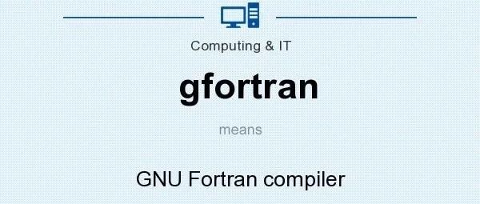
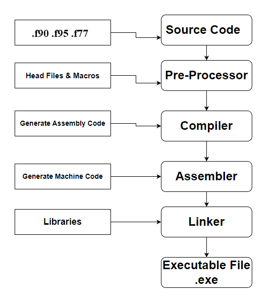
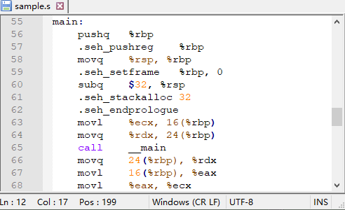
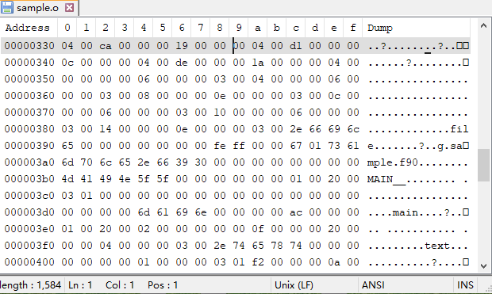
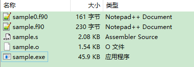

# 一个Fortran程序的诞生：逐步解析GFortran的编译过程

> 原文地址: [https://mp.weixin.qq.com/s/S2o1DhqckT6qPbBAIo-ZXw](https://mp.weixin.qq.com/s/S2o1DhqckT6qPbBAIo-ZXw)

点击上方「蓝字」关注我们

在科学计算和工程领域，Fortran语言因其卓越的性能和高效处理数值运算的能力而备受青睐。当谈及如何将一行行Fortran代码转化为可执行的程序时，编译器扮演了至关重要的角色。GFortran，作为GNU项目的一部分，是GNU Fortran编译器，它延续了GCC（GNU Compiler Collection）的传奇，专为Fortran语言设计，支持最新的Fortran标准，包括Fortran 2003、2008及后续版本。本文将揭示GFortran如何通过一系列精细的步骤，将Fortran程序从概念变为现实。

## 

GFortran是谁？

  

GFortran起源于对Fortran语言的热爱和对高性能计算的追求。Gfortran这个名字结合了“GNU”和“Fortran”，明确指出了它属于GNU项目并且专门服务于Fortran语言的编译需求。作为GNU编译器家族的一员，它不仅继承了GCC的强大功能，还针对Fortran语言特性进行了深度优化。GFortran不仅仅是一个编译器，它更是连接开发者思维与机器语言的桥梁。

### 功能特点

1.  **高性能**: GFortran致力于生成高效、优化的代码，尤其在科学计算和数值分析领域表现出色。
    
2.  **跨平台**: 作为GCC的一部分，GFortran可以在多种操作系统上运行，包括Linux、macOS、Windows等，具有良好的跨平台兼容性。
    
3.  **开源免费**: 作为自由软件，GFortran遵循GPL许可，用户可以免费获得并修改其源代码。
    
4.  **集成开发环境支持**: GFortran能够与许多流行的IDE（如Eclipse、Code::Blocks、Visual Studio Code等）无缝集成，方便开发者进行代码编写、编译、调试。
    
5.  **丰富的库支持**: GFortran能够与众多科学计算库（如BLAS, LAPACK, HDF5等）配合使用，便于开发高性能的科学和工程应用。
    
6.  **动态与静态链接**: 支持生成动态链接库和静态链接库，满足不同场景下的部署需求。
    

## 

 Windows下安装和部署GFortran，请参考：

\> [Fortran开发环境极简配置教程](http://mp.weixin.qq.com/s?__biz=Mzk0MzI0NDU2NQ==&mid=2247484359&idx=2&sn=f5e95d2ccaa5a2772913b688bb597ec3&chksm=c33797bdf4401eab947281eff9a587cee3e92ccedf773afe28e813c81c290ea468df17258461&scene=21#wechat_redirect)

  

Fortran程序的孕育过程

  

一个Fortran程序的编译过程可以分为四个阶段：**预处理、编译、汇编和链接**。

  

### 第一阶段：预处理（Preprocessing）

预处理，是编译器在编译之前，对源代码进行的一些“替换”、“选择” 等操作。它对于代码的宏观控制、维护、跨平台等都有很好的作用。虽然Fortran不像C/C++那样频繁使用预处理指令，但在某些情况下，预处理仍然是必要的。例如，用宏定义指令`#define`来定义一些宏观参数，以便在程序代码里统一使用，减少修改量，以及用`#include`指令来引入其他源文件或定义。GFortran编译器支持基本的预处理操作。Fortran的预处理相对简单，主要关注于源代码的初步整理。如果不包含复杂的预处理指令，此步骤可能很简短或直接跳过。

### 第二阶段：编译（Compilation）

在这一阶段，GFortran开始它的魔法。它读取经过预处理的Fortran源代码，将其转换为低级的中间表示（Intermediate Representation, IR）。这个过程涉及词法分析、语法分析、语义分析等多个层面，确保代码符合Fortran语言规范，同时进行类型检查、常量折叠等优化工作。

### 第三阶段：汇编（Assembly）

接下来，GFortran将IR进一步编译成汇编代码，这是更接近硬件的低级语言。在这个阶段，抽象的高级语言结构被转换为特定处理器架构的机器指令。这些指令以汇编语言的形式存在，虽然对于人类阅读可能不太友好，但对于计算机来说却是直接可执行的指令蓝图。

### 第四阶段：链接（Linking）

最后，到了链接阶段，GFortran将编译得到的目标文件与其他必要的库文件合并。这一步骤解决了所有外部引用，比如程序调用的标准库函数或第三方库。通过解析符号表，链接器确保所有函数调用、全局变量等都能正确地绑定到它们的实际地址。最终，一个完整的、可执行的程序就此诞生。

## 

实战演练

  

假设我们有一个简单的Fortran程序`sample0.f90`，用于计算两个数的和。为了充分展示预处理的效果，代码中使用了宏定义`#define N 3`：

`#define N 3   program sample  implicit none     integer :: a, b, sum  a = N     b = 2     sum = a + b  print *, "Sum is: ", sum   end program sample`

### 1\. 预处理：

`gfortran -E -cpp sample0.f90 -o sample.f90   `

执行以上命令，生成了`sample.f90`，包含以下内容：

`# 1 "sample0.f90"# 1 "<built-in>"# 1 "<command-line>"# 1 "sample0.f90"      program sample  implicit none     integer :: a, b, sum  a = 3  b = 2     sum = a + b  print *, "Sum is: ", sum   end program sample`

我们看到，根据原始代码中开头的宏定义，预处理之后常量`N`被替换成了`3`。

### 2\. 编译：

`gfortran -S sample.f90 -o sample.s   `

继续编译，生成了汇编代码文件（`sample.s`），包含以下内容：

### 3\. 汇编：

`gfortran -c sample.s -o sample.o   `

进一步，将汇编代码编译为目标文件（`sample.o`），全部为二进制代码：

### 4\. 链接：

`gfortran sample.o -o sample.exe   `

最后，通过以上命令完成链接，生成了可执行文件（`sample.exe`）。

  

出于演示目的，以上步骤比较繁琐。实际应用中，以上四步完全可以合并为一条编译命令语句：

`gfortran -cpp sample0.f90 -o sample.exe   `

## 

小结

  

从简洁的Fortran代码到复杂的机器语言指令，GFortran编译器如同一位技艺高超的炼金术师，将程序员的思想一步步转化为计算机能理解并执行的指令。这一系列编译过程不仅体现了软件工程的严谨与高效，也是现代计算科学不可或缺的一环。通过GFortran的精心雕琢，Fortran程序得以在各种平台上展现出其强大的计算能力，继续在科学计算领域绽放光彩。

# 往期精选

# 

[\* 现代F_ortran_探索之旅 | _GFortran_与动态链接库](http://mp.weixin.qq.com/s?__biz=Mzk0MzI0NDU2NQ==&mid=2247484562&idx=1&sn=0f6fe80fac5a7ea58c9335c379cfcfc7&chksm=c33790e8f44019fe8360386166a42687153bbad58ca2240b91862ef5352f4b5061d3ea60fdff&scene=21#wechat_redirect)

[\* 现代F_ortran_探索之旅 | _GFortran_常用编译选项](http://mp.weixin.qq.com/s?__biz=Mzk0MzI0NDU2NQ==&mid=2247484528&idx=1&sn=d8c6a0482df80da2b525bba462c8c6c7&chksm=c337900af440191cb2d5a60ece0a13c99bfd55f1308ed2a1c13f85bc847a9e40cfd25774e4ca&scene=21#wechat_redirect)

  

# 推荐阅读

  

**FEtch 系统**是笔者团队开发的新一代有限元软件开发平台。只需按照有限元语言格式填写脚本文件，即可在线自动生成基于**现代 Fortran** 的有限元计算程序，从而大幅提高 CAE 软件的开发效率。欢迎私信交流。

有任何疑问或建议，欢迎加Q群 "**FEtch有限元开发系统(519166061)**" 留言讨论。我们长期开展 FEtch 系统的免费试用活动，感兴趣的朋友入群后可直接联系管理员，免费获取**许可证文件**。

**喜欢****作者******，请点********赞********和在看********

****