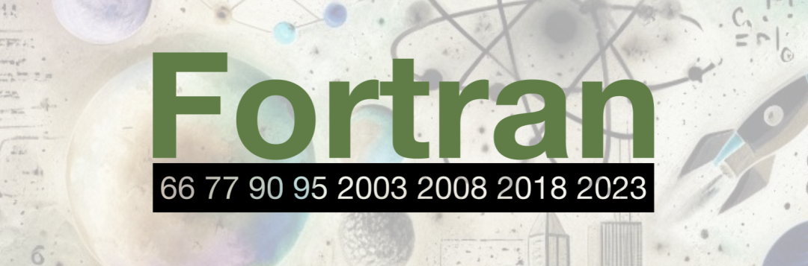

# 现代Fortran探索之旅 | 发展历程

> 原文地址: [https://mp.weixin.qq.com/s/zWwVPf-dOxx-SQWoQVJviA](https://mp.weixin.qq.com/s/zWwVPf-dOxx-SQWoQVJviA)

现代Fortran语言的发展历程始于Fortran 90的发布，这一版本标志着Fortran语言从传统的数值计算工具向现代高级编程语言的转变。自那时起，Fortran经历了一系列的更新和改进，每个新版本都在前一个版本的基础上增加了新的特性和功能，以适应不断变化的计算需求和技术进步。下面，我们将详细回顾从Fortran 90到Fortran 2023的每个版本的重要更新。

## Fortran 90 (1991)

Fortran 90是Fortran语言的一个分水岭，它引入了许多现代编程概念，使得Fortran变得更加强大和灵活。

**重要更新**:

-   **模块化**: 引入了模块（module）的概念，允许程序员将相关的变量、常量、类型定义和子程序封装在一起，提高了代码的组织性和重用性。
    
-   **数据类型**: 新增了多种数据类型，包括逻辑（logical）、字符（character）和复杂（complex）类型，以及对数组的增强，如数组的自动大小分配。
    
-   **指针和动态内存**: 引入了指针（pointer）的概念，允许动态分配和操作内存，为高级数据结构和内存管理提供了支持。
    
-   **结构化编程**: 支持了如IF-THEN-ELSE、CASE结构和循环控制结构（如DO WHILE和EXIT）等结构化编程元素，提高了代码的可读性和可维护性。
    

## Fortran 95 (1997)

Fortran 95是对Fortran 90的小幅更新，主要是为了解决标准实施中的一些问题，并没有引入新的编程特性。

Fortran 2003 (2003)

Fortran 2003是一个重大的更新，它增加了对面向对象编程的支持，以及其他一些现代编程概念。

**重要更新**:

-   **面向对象编程**: 引入了类型扩展和继承、多态、动态类型和抽象接口，这些特性使得Fortran能够支持面向对象的设计模式。
    
-   **C语言接口**: 提供了与C语言的接口，使得Fortran程序可以调用C语言编写的库，或者将Fortran程序与C语言程序集成。
    
-   **IEEE浮点异常处理**：增加了对IEEE浮点异常的处理，这对于科学计算中的数值稳定性和错误处理非常重要。
    
-   **国际化**: 支持了国际化字符集，使得Fortran程序可以处理多种语言的文本。
    

## Fortran 2008 (2008)

Fortran 2008进一步增强了并行编程和错误处理的能力。

**重要更新**:

-   **并行编程**: 引入了Coarray的概念，这是一种新的并行编程模型，允许程序在不同的处理器或计算节点上运行。
    
-   **错误处理**: 新增了异常处理机制，使得程序能够更优雅地处理运行时错误。
    
-   **类型声明**: 引入了类型声明的简化语法，使得类型定义更加直观。
    
-   **数组和循环**: 引入了数组和循环的简化语法，提高了代码的可读性。
    

## Fortran 2018 (2018)

Fortran 2018在Fortran 2008的基础上进一步增强了语言特性，特别是在并行编程和数值计算方面。

**重要更新**:

-   **并行特性**: 增强了并行特性，包括对OpenMP和MPI的支持，使得Fortran能够更好地利用多核和多处理器系统。
    
-   **C语言接口**: 对C语言接口进行了改进，使得Fortran和C语言的交互更加方便。
    
-   **枚举类型**: 引入了枚举类型，这是一种新的类型，允许程序员定义一组命名的常量。
    
-   **简化的声明**: 引入了更简洁的声明语法，使得代码更加简洁。
    

## Fortran 2023 (2023)

Fortran 2023是最新的Fortran标准，它在保持Fortran语言传统优势的同时，引入了一系列新特性，以适应现代计算的需求。

**重要更新**:

-   **更长的语句和声明长度**: 放宽了对源代码行长度的限制，允许每行最多包含一万个字符，整体语句长度可以长达一百万个字符。
    
-   **泛型编程的支持**：增加了支持泛型编程的特性，如typeof()和classof()，以及使用整数数组指定数组下标、秩和边界的新语法。
    
-   **条件表达式**: 引入了一种新的条件表达式，允许在单个表达式中根据条件选择多个可能的值。
    
-   **与C语言的互操作性增强**: 扩展了`c_f_pointer`内在过程，允许其指针结果具有指定的下界，并提供了在Fortran和C字符串之间转换的过程。
    
-   **输入输出的改进**: 新版本增加了对`at`编辑描述符的支持，以及对实数值输出时前导零的控制。
    
-   **Coarray的增强**: 允许具有Coarray最终成分的类型的对象作为数组或可分配变量，并引入了`put with notify`操作。
    
-   **枚举类型的引入**: 引入了“真正”的枚举类型，具有与C枚举互操作的特性。
    

## 小结

总结来说，从Fortran 90到Fortran 2023，Fortran语言经历了显著的现代化改进，不断引入新的特性来满足现代计算的需求。这些改进包括**模块化编程、数据类型的扩展、动态内存管理、并行计算支持、错误处理机制的增强，以及与C语言的互操作性**等。这些特性的引入，使得Fortran不仅在传统的数值计算和科学工程领域保持了其优势，而且在现代的并行计算和多核编程领域也展现出了强大的生命力。随着Fortran 2023的发布，Fortran语言继续在高性能计算和科学计算领域发挥着重要作用。

  

  

**FEtch 系统**是笔者团队开发的新一代有限元软件开发平台。只需按照有限元语言格式填写脚本文件，即可在线自动生成基于**现代Fortran**的有限元计算程序，从而大幅提高 CAE 软件的开发效率。欢迎私信交流。

有任何疑问或建议，欢迎加Q群 "**FEtch有限元开发系统(519166061)**" 留言讨论。我们长期开展 FEtch 系统的免费试用活动，感兴趣的朋友入群后可直接联系管理员，免费获取**许可证文件**。