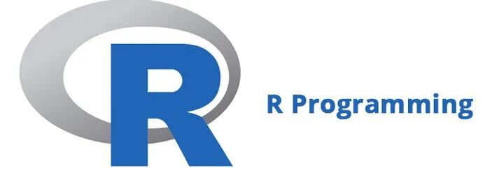
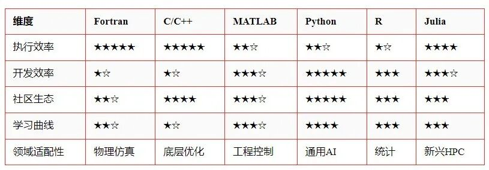

# 科学计算编程语言全景图：从Fortran到Julia的技术演进与选择指南

> 原文地址: [https://mp.weixin.qq.com/s/l0Fh0P5UbnqA3Mifwe69tQ](https://mp.weixin.qq.com/s/l0Fh0P5UbnqA3Mifwe69tQ)

在科学与工程领域，编程语言是连接理论模型与现实世界的桥梁。面对海量数据处理、复杂数值模拟和高性能计算需求，不同编程语言凭借其独特优势在历史长河中各领风骚。本文将带你纵览科学计算领域的六大核心语言，剖析它们的诞生背景、技术特性与适用场景。

## Fortran（1957年）：科学计算的活化石

### 历史

作为世界上首个高级编程语言，Fortran（Formula Translation）由IBM团队为物理学家设计，于1957年首次发布。它的出现标志着计算机编程从低级语言向高级语言的转变，极大地提高了编写复杂科学计算程序的效率。尽管经历了多次版本更新，包括最新的Fortran 2023标准，它仍然支撑着NASA气候模型和量子化学计算等关键领域。这不仅证明了Fortran的强大功能，也展示了它在现代科学计算中的持续重要性。

### 优点

-   **专为数值计算优化**：Fortran自诞生之初就被设计用于高效处理数学公式和数值计算，其编译器能够生成非常高效的机器代码。
    
-   **执行效率接近底层语言**：得益于其对硬件的良好支持和优化，Fortran程序往往能实现接近汇编语言的速度。
    
-   **内置多维数组和并行计算支持**：这些特性使得Fortran非常适合大规模并行计算任务，如天气预报和流体力学仿真。
    
-   **庞大的遗留代码库**：许多科学研究和工程项目依赖于数十年积累下来的Fortran代码，形成了一个巨大的生态系统。
    

### 缺点

-   **语法风格陈旧**：Fortran的语法相对古老，缺乏一些现代编程语言的便利性和灵活性。
    
-   **缺乏现代语言特性**：例如，相比Python或Julia，Fortran缺少动态类型系统和垃圾回收机制。
    
-   **新生代开发者接受度较低**：由于学习曲线较陡，以及现代语言提供的更友好开发环境，年轻一代程序员可能不太愿意学习Fortran。
    

### 典型场景

-   流体力学仿真
    
-   气候建模
    
-   有限元分析
    

## C/C++：底层优化的终极武器

### 历史

作为系统级编程语言，C和C++被广泛用于操作系统、嵌入式系统以及各类高性能软件的开发。在科学计算领域，它们常用于实现核心算法和库，如OpenCV和TensorFlow，以确保最佳性能。

### 优势

-   **极致性能满足毫秒级延迟需求**：C/C++允许开发者直接控制硬件资源，从而达到极高的执行效率。
    
-   **内存控制实现资源精细管理**：精确的内存分配和释放机制有助于减少内存泄漏和碎片化问题。
    
-   **跨平台兼容性行业领先**：几乎所有主流操作系统都支持C/C++，这使得编写可移植的应用变得容易。
    

### 局限

-   **开发周期长，调试复杂度高**：手动管理内存和其他低级细节增加了错误发生的概率，同时也延长了开发时间。
    
-   **缺少原生数值计算语法糖**：相比专门设计的科学计算语言，C/C++在处理数学运算时不够直观。
    
-   **安全漏洞风险相对较高**：不正确的指针操作或缓冲区溢出等问题可能导致严重的安全隐患。
    

### 核心价值

-   有限元求解器
    
-   计算内核加速
    

## MATLAB（1984年）：工程领域的瑞士军刀

### 历史

MATLAB（Matrix Laboratory）由MathWorks推出，最初是一个交互式的矩阵计算环境，后来通过添加Simulink等功能扩展成为控制系统设计的行业标准。MATLAB以其强大的矩阵运算能力和丰富的工具箱而闻名，广泛应用于教育、科研和工业界。

### 优点

-   **即开即用的可视化工具和领域专用工具箱**：提供了大量的预构建函数和图形界面，便于快速开发和测试算法。
    
-   **直观的矩阵运算语法**：MATLAB的核心是矩阵操作，这种设计让科学家和工程师能够轻松地表达复杂的数学概念。
    
-   **丰富的教学资源和商业技术支持**：无论是在线教程还是官方文档，MATLAB都提供了详尽的学习材料和支持服务。
    

### 缺点

-   **闭源授权费用高昂**：对于个人用户或小型企业来说，购买MATLAB许可证可能会造成一定的经济负担。
    
-   **大规模计算依赖外部引擎**：虽然MATLAB本身擅长小规模和中等规模的计算任务，但在处理大数据集时通常需要借助外部工具。
    
-   **通用编程能力较弱**：与其他编程语言相比，MATLAB在处理非数值计算任务时表现不佳。
    

### 典型用户

-   大学实验室
    
-   汽车电子控制系统开发
    

## Python（1991年）：科学计算的民主化推手

### 历史

由Guido van Rossum创造的Python是一种通用编程语言，起初并未特别针对科学计算。然而，随着NumPy/SciPy生态系统的兴起，Python逐渐成为数据科学和机器学习领域的首选工具。CERN的大型强子对撞机数据分析项目就是一个很好的例子，展示了Python在处理大规模科学数据方面的强大能力。

### 优点

-   **简洁语法降低学习曲线**：Python以其清晰易读的语法著称，即使是初学者也能迅速上手。
    
-   **Pandas/Matplotlib等库覆盖全流程分析**：从数据清洗到可视化，Python拥有丰富的第三方库来满足各种需求。
    
-   **无缝集成C/Fortran加速模块**：当性能成为瓶颈时，可以通过调用C或Fortran代码来提升执行速度。
    

### 缺点

-   **原生性能瓶颈**：相比于C或Fortran，Python在处理大规模数值计算时效率较低。
    
-   **全局解释器锁（GIL）限制多线程效率**：GIL的存在使得Python在多线程环境中难以充分利用多核处理器的优势。
    
-   **环境配置复杂度较高**：尤其是当涉及到多个版本的库和包管理时，可能会遇到兼容性问题。
    

### 典型案例

-   机器学习模型训练
    
-   基因组序列分析
    

## R（1993年）：统计学的母语

### 历史

R脱胎于贝尔实验室的S语言，旨在为生物统计和计量经济学提供一个灵活且强大的计算平台。如今，CRAN仓库托管了超过1.8万个专业程序包，涵盖了从基础统计学到高级机器学习的各种应用。

### 优点

-   **ggplot2等可视化库业界领先**：R的绘图功能尤其出色，能够创建高质量的专业图表。
    
-   **统计模型实现覆盖全面**：无论是经典统计方法还是最新研究成果，R都有相应的实现。
    
-   **活跃的学术社区支持**：作为一个开源项目，R受益于全球研究者的贡献，不断引入新的特性和改进。
    

### 缺点

-   **内存管理效率制约大数据处理**：R在处理大规模数据集时可能会遇到性能瓶颈。
    
-   **语法规则异于常规编程范式**：对于习惯其他编程语言的人来说，R的独特语法可能需要时间适应。
    
-   性能敏感场景需调用C++：为了提高运行速度，有时不得不编写部分代码使用C++。
    

### 典型应用

-   临床试验数据分析
    
-   金融风险建模
    

## Julia（2012年）：性能与生产力的新平衡

### 历史

Julia是由麻省理工学院（MIT）的研究人员开发的一种多范式编程语言，目标是在保持高水平抽象的同时实现接近C语言的执行速度。通过即时编译（JIT），Julia能够在2021年跻身全球超级计算机TOP500官方工具集之列。

### 优点

-   **类型系统支持高性能数值计算**：Julia的静态类型系统允许编译器生成高度优化的机器代码。
    
-   **多重分派机制增强代码扩展性**：这种方法简化了函数重载，并促进了代码复用。
    
-   **原生并行计算和GPU加速支持**：Julia天生支持并发和分布式计算，非常适合处理大规模科学问题。
    

### 挑战

-   **第三方库成熟度仍在发展**：尽管Julia社区正在快速增长，但某些领域可能缺乏成熟的解决方案。
    
-   **编译延迟影响交互体验**：首次加载或重新定义函数时，JIT编译过程可能导致短暂的停顿。
    
-   **企业级应用案例有待积累**：相较于老牌语言，Julia在企业环境中的实际应用案例还不够丰富。
    

### 潜力领域

-   实时物理仿真
    
-   量化金融策略开发
    

## 语言选择决策矩阵

## 选择建议

根据上述分析，不同的编程语言适用于不同的应用场景：

-   **传统物理建模**：如果你的工作涉及维护大量Fortran遗产代码或者需要进行高度优化的数值计算，那么Fortran仍然是一个不错的选择。
    
-   **硬件级优化**：当涉及到最底层的硬件优化时，C/C++依然是不可替代的选择。
    
-   **快速原型开发**：对于那些希望快速验证想法的研究人员来说，Python结合Jupyter Notebook提供了一个理想的交互式环境。
    
-   **企业级工程系统**：MATLAB/Simulink组合适合于需要严格控制和验证的闭环控制系统设计。
    
-   **统计建模**：R及其Tidyverse套件为数据科学家提供了强大的统计分析工具。
    
-   **性能敏感型研究**：Julia因其出色的性能和生产力平衡，在实时物理仿真和量化金融等领域展现出巨大潜力。
    

科学计算的语言版图仍在持续进化，新兴语言如Mojo正在尝试融合Python生态与LLVM性能。开发者应根据团队技术栈、项目周期和精度需求，构建多层次工具链——或许用Python快速验证idea，再用Julia重写性能瓶颈模块，才是这个时代的终极解法。

