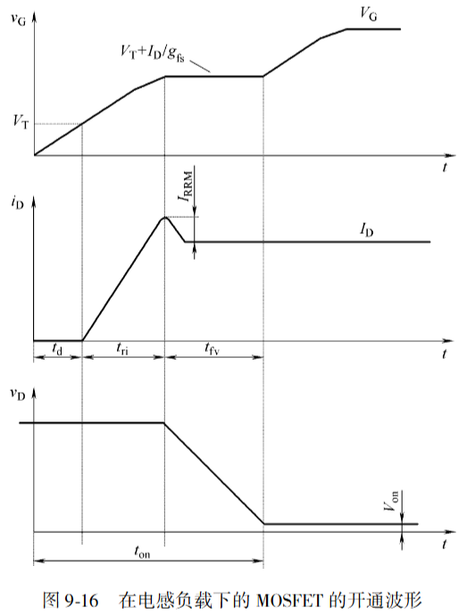
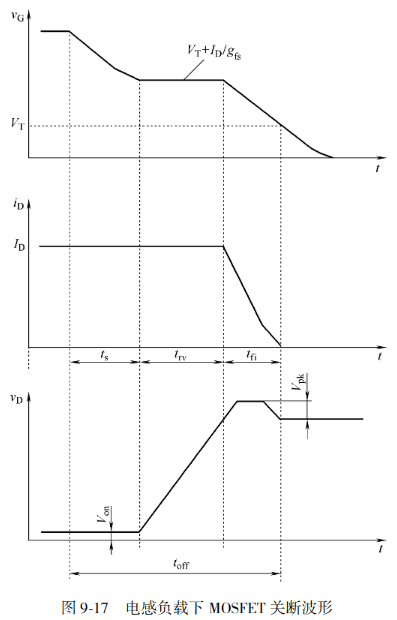
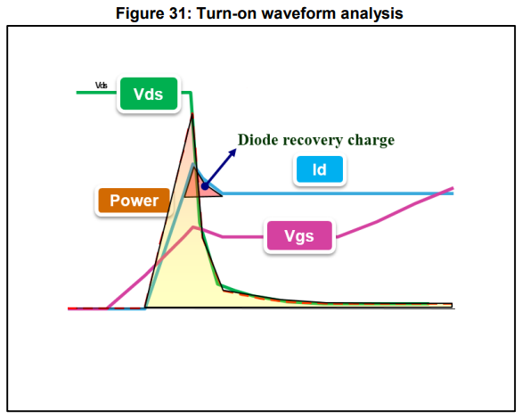

# MOSFET发热元凶大揭秘：导通、开关与看不见的“第三者”

原创 傅存敬 电磁散人 2025-11-28 07:06 广东

> 原文地址: [https://mp.weixin.qq.com/s/tBYPl\_4CPTiJUbWI3Fauzw](https://mp.weixin.qq.com/s/tBYPl_4CPTiJUbWI3Fauzw)

欢迎回到我们MOSFET发热案的“案发现场”！上篇文章我们确认了“受害者”——[芯片结温](https://mp.weixin.qq.com/s?__biz=MzE5MTYzNjgzOA==&mid=2247484773&idx=1&sn=0f1705efc893f9ff8646957691a71ed0&scene=21#wechat_redirect)(Tj)——正在持续“发烧”，情况危急。今天，我们作为“电控神探”，就要把藏在幕后的三大“发热元凶”一个个揪出来，让他们在证据面前无所遁形！

目前，我们已经锁定了两位高度可疑的“惯犯”，它们几乎在每一次电路工作中都会出现。让我们先来分别“审问”一下这两位头号嫌疑人。

#### **第一幕：审问头号嫌疑人——“蛮力罪犯”导通损耗**

这位“罪犯”的作案手法非常直接、粗暴，就是依靠“蛮力”。它在我们命令MOSFET“开门”（导通）让电流通过时下手。

它的“犯罪档案”如下：

-   **作案工具**: 导通电阻 `Rds(on)`。
    
-   **犯罪公式**: `Pcond = Rds(on) * ID²` 
    
-   **犯罪特征**:
    

1.  **恃强凌弱**: 电流 `ID` 越大，它的破坏力就越以**平方**的形式急剧增长！在电机堵转、启动等大电流场合，它就是绝对的“主犯”。
    
2.  **欺软怕硬**: 它的作案工具 `Rds(on)` 会随着“现场温度”(Tj)的升高而变得更强，形成我们上篇文章讲的“[热失控](https://mp.weixin.qq.com/s?__biz=MzE5MTYzNjgzOA==&mid=2247484773&idx=1&sn=0f1705efc893f9ff8646957691a71ed0&scene=21#wechat_redirect)”恶性循环。同时，它还极其依赖我们给的“开门信号”(Vgs)，信号弱一点，它的破坏力就会指数级增强。
    

**小结:** 这位“蛮力罪犯”的罪行清晰明了，主要在**大电流**场合发难，是我们首先要控制住的对象。

#### **第二幕：审问二号嫌疑人——“快手刺客”开关损耗**

审问完“蛮力犯”，我们来看看另一位风格迥异的“罪犯”。它从不恋战，讲究“快进快出”，但每一次出手都极其致命。它就是“快手刺客”——开关损耗。

它的“犯罪档案”如下：

-   **作案时机**: 在MOSFET“开门”和“关门”的一瞬间。
    
-   **作案手法**: 利用电压(Vds)和电流(Id)交错的瞬间，制造出巨大的瞬时功率 `P = V * I`。
    
-   **犯罪公式\[1\]**: Psw ≈ ½ \* Vds \* Id \* (ton + toff) \* fsw
    
-   **犯罪特征**:
    

1.  **天下武功，唯快不破**: 它的作案次数和我们的“命令频率”(PWM频率 `fsw`)完全同步。频率越高，它在单位时间内出手的次数越多，总破坏力就越大。在高频应用中，它甚至会超过“蛮力犯”，成为头号元凶。
    
2.  **身法受外部影响极大\[2\]**: 它的“出手速度”(`ton`, `toff`)，受到硬件工程师设计的驱动电路（特别是驱动电阻`Rg`）的直接影响。一个不好的驱动设计，等于给了这个“刺客”更长的作案时间。
    

**小结:** 这位“快手刺客”的罪行非常狡猾，专挑**高频率**场合下手，它的“武功”高低，和我们的硬件设计息息相关。

#### **第三幕：剧情反转！揪出“看不见的第三者”**

同仁们，当我们以为抓住了“蛮力犯”和“快手刺客”，案件就要告破的时候，请再复盘一下案情，有经验的电控“老鸟”是否会觉得有点不对劲？因为在某些“高频作案现场”，损耗总是比我们用前两个嫌犯的罪行加起来算出的要高！

Bingo！原来在每个作案周期之间，都有一段极其短暂的**“死区时间”（Dead time）**。就在这片不被注意的阴影里，隐藏着我们真正的“**第三者”——体二极管！**

它不是一个独立的罪犯，而是潜伏在MOSFET内部的**“内鬼”**！它的存在，不仅自己会犯罪，更可怕的是，它会与“快手刺客”开关损耗**里应外合**，让整个案件的恶劣程度再上一个台阶！

这位“第三者”的罪行分为两步：

1.  **第一宗罪：公然收“过路费”。**在死区时间，它被迫出来为续流电流“开路”，此时它会收取一笔高昂的“过路费”——二极管正向压降 `Vsd`。这个损耗 `Pdiode_cond = Vsd * I`，虽然单次不高，但积少成多。
    
2.  **第二宗罪：阴险的“背后捅刀”——反向恢复！** 这才是它最阴险、最“第三者”的行径！当它的“值班时间”（死区时间）结束，对面桥臂的MOSFET要开通时，它本应立刻“下班”（关断）。但它不会！它会“耍流氓”，在短时间内形成一个**反向的恢复电流Irr\[1\]**。
    

这个Irr像一个**叛徒**，它会直接叠加到对面MOSFET的开通电流上！这就导致：

-   **让“快手刺客”的武器升级**: 对面MOSFET在开通时，面对的不再是正常的负载电流`I`，而是（I + Irr）的巨大电流尖峰！这使得开关损耗被急剧放大！
    

-   **制造混乱**: 巨大的`di/dt`和`dv/dt`会产生严重的电磁干扰(EMI)和电压过冲，让整个“犯罪现场”一片狼藉，甚至可能直接击穿元凶自己或同伙。
    

**最终定罪:** “看不见的第三者”——体二极管，它的可怕之处不在于自己收的那点“过路费”，而在于它的**反向恢复特性**，极大地加重了主犯“开关损耗”的罪行，是导致高频下损耗异常、振荡和可靠性下降的**核心共犯**！在很多高速、高性能的应用中，它才是最应该被提防的“幕后黑手”！

#### **第四幕：结案陈词**

现在对本案做结案陈词：

-   在**电机启动、堵转等大电流、低速**的“犯罪现场”，**“蛮力罪犯”导通损耗**是主犯。
    
-   在**电机高速巡航等高工作频率**的“犯罪现场”，**“快手刺客”开关损耗**与**“内鬼”体二极管**联合作案，成为主要威胁。
    

至此，MOSFET发热案的三大元凶全部归案！我们不仅认清了它们的脸，还洞悉了它们各自的作案手法和偏好。

  

参考文献：

\[1\] AN4783: Thermal effects and junction temperature evaluation of Power

\[2\] Josef Lutz, et al. 功率半导体器件:原理、特性和可靠性\[M\]. 卞杭, 杨莺等, 译. 北京: 机械工业出版社, 2015: 247 - 248.

文档链接：

\[1\] https://pan.baidu.com/s/1-KVcICpKdTrwGp9\_tjvEPg?pwd=xkba 提取码: xkba

\[2\] https://pan.baidu.com/s/1PKRbS5y4EVC6Nf6w67X5CA?pwd=gfi9 提取码: gfi9