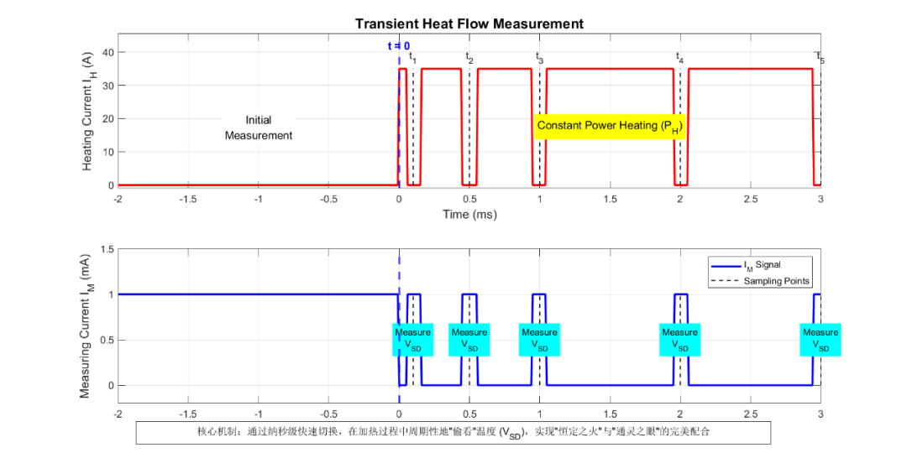
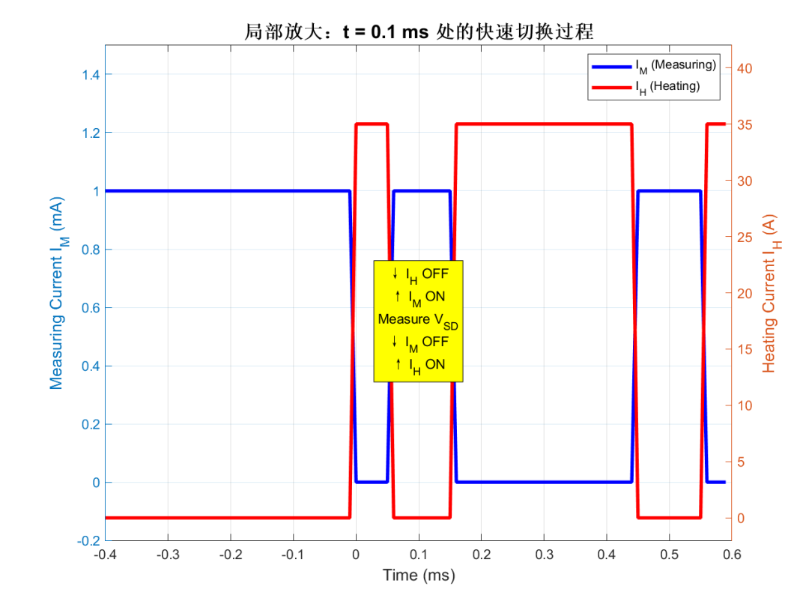
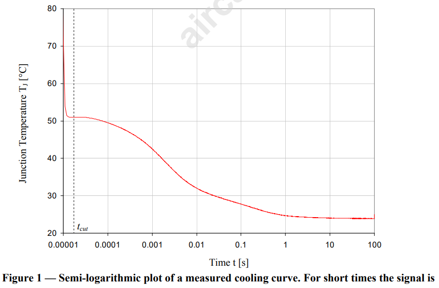
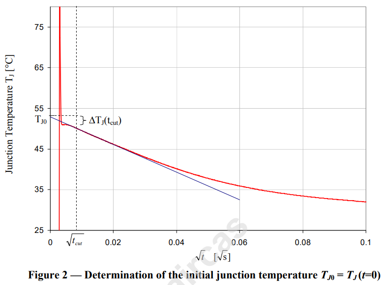

# 《MOSFET热失效重案组》| 案卷03：消失的零点 —— 重建犯罪现场的初始温度

原创 傅存敬 电磁散人 2025-12-10 07:06 广东

> 原文地址: [https://mp.weixin.qq.com/s/xxz3CImdhay1clFVYwThKw](https://mp.weixin.qq.com/s/xxz3CImdhay1clFVYwThKw)

通过对“嫌疑人供词”（Datasheet）的严密分析，我们已经掌握了最关键的物证——Zth曲线。但这份证据是厂商单方面提供的，其真实性和适用性仍有待考证。更重要的是，我们不能永远依赖别人的证据，我们重案组必须掌握独立取证的能力！

因此，从今天开始，我们将深入研究那本传说中的“高级侦探手册”——**JESD51-14标准**\[1\]。我们将学习其中最核心的侦查技术，亲手去测量、去验证，最终锁定真凶。

同仁们，想象这样一个场景： 我们在一个刚刚发生过爆炸的密室里取证。爆炸的中心点（结温），温度最高。爆炸结束后，现场开始慢慢冷却。我们的任务，是要精确地知道爆炸**那一瞬间**，中心点（结温）的温度到底有多高。

但是，一个巨大的难题摆在我们面前：爆炸的冲击波（电磁干扰）摧毁了我们离得最近的所有高速摄像机。等我们反应过来，能用的设备拍到第一帧清晰画面时，现场已经冷却了一小段时间了。

我们丢失了最关键的`t=0`时刻的数据！就像一部侦探小说里，凶案发生后，凶手巧妙地抹去了最初几分钟的所有痕迹。我们称之为**“消失的零点”**。

今天，JESD51-14标准就要教给我们第一招绝活：**如何在证据缺失的情况下，利用科学推理，精确地重建出**`**t=0**`**时刻的现场温度！**

**第一项技术：TSEP——会说话的“弹孔”**

我们怎么在不进入滚烫的MOSFET芯片内部的情况下，知道它的温度呢？我们总不能把温度计插进去吧？

JESD51-14告诉我们，不需要！MOSFET自己就会“说话”。我们只需要找到它身上那个对温度最敏感的“特征”。这个特征，就叫**TSEP（Temperature Sensitive Electric Parameter，温度敏感电参数）**。

想象一下，一个老侦探通过观察墙上的“弹孔”形状，就能判断出子弹的口径和射击角度。TSEP就是我们手里的“弹孔”。

对于MOSFET来说，最常用的TSEP就是它的**体二极管正向压降（Vsd）**。

-   **原理：** 在一个很小的、固定的正向电流下（比如10mA），这个Vsd值会随着温度的升高而线性地降低。
    
-   **前期准备（校准）：** 我们在案发前，需要先把这个MOSFET放在一个温控烤箱里，从25℃、30℃、35℃……一路升上去，在每个温度点都测量一下对应的Vsd值。这样，我们就绘制出了一条“Vsd\-温度”的对应关系曲线。这条曲线的斜率，就是著名的**K因子（K-Factor）**。
    
-   **应用：** 有了这条曲线，以后我们想知道它的结温，只需要给它通一个相同的小电流，测一下Vsd，再到曲线上一查，温度就出来了！这就实现了“只用电，量温度”。
    

**结论：TSEP是我们远程、无损读取MOSFET“核心体温”的唯一合法手段。**

**第二项技术：冷却曲线——记录“热量逃逸”的轨迹**

好，现在我们有了测量温度的“高速摄像机”（TSEP）。JESD51-14标准（第4.1.2节）给出了标准的“拍摄手法”——**记录冷却曲线**。

1.  **第一步：制造现场（加热）**
    

-   给MOSFET施加一个恒定的、足够大的功率`PH`（比如几十瓦），让它持续加热，直到它的结温不再上升，达到“热稳态”。这个过程就像让爆炸持续酝酿，直到能量积蓄到最大。
    
-   记录下这个稳态的加热功率`PH`。
    

3.  **第二步：触发事件（断电）**
    

-   在`t=0`时刻，**瞬间**将加热功率`PH`切断，或者切换到一个足够微弱的测量电流`IM`（就是我们用来测TSEP的那个小电流）。
    
-   这个瞬间的功率变化`ΔPH = PH - PM`，就是我们整个分析的基础。`PM`非常小，所以`ΔPH`约等于`PH`。
    

5.  **第三步：记录影像（采样）**
    

-   从`t=0`开始，以极高的速度，不断地通过测量TSEP（比如Vsd）来记录结温TJ的变化。
    
-   **关键：** 采样的时间点不是均匀的，而是**对数均匀**的。比如，在1μs到10μs之间采10个点，在10μs到100μs之间也采10个点...以此类推。因为热量的变化，在开始时极快，后面越来越慢，对数采样能用最经济的数据量，捕捉到最完整的变化过程。
    

**为什么标准推荐用“冷却”而不是“加热”？**

-   **冷却曲线的优点：** 在整个记录过程中，MOSFET上只有微弱的测量电流`IM`。信号非常干净，就像在安静的深夜里录音，没有杂音。
    
-   **加热曲线的缺点：** 如果记录加热过程，就必须一边施加大功率`PH`，一边测量微弱的TSEP信号。这就像在摇滚演唱会现场，想录下一根针掉在地上的声音，大功率的“噪声”会严重干扰你的测量。
    

**加热功率**`**PH**`**多大才算“足够大”？测量电流**`**IM**`**多小才算“足够小”？**

加热功率 **PH = VDS\_on \* IH**，因此“足够大”的加热功率可以等效为“足够大”的加热电流IH，“足够大”这个词，听起来很模糊，但它的评判标准其实非常清晰。这个标准不是一个固定的安培数，而是一个需要达到的**“效果”**。

**核心原则：加热功率 PH 产生的温升 ΔTJ 必须足够大，以至于能够远远压过测量系统自身的噪声和漂移，从而获得足够高的信噪比(SNR)。**

想象一下，你用一个普通的体重秤去称一根羽毛的重量，秤的读数可能动都不会动。不是羽毛没有重量，而是它的重量相对于秤的精度和误差来说太小了，被“淹没”了。我们的测温也是一样。

**实践指导与数量级**：

**目标温升：** 在工程实践中，我们通常期望在测试结束时（达到热稳态或接近稳态），芯片结(Junction)相对于环境的**总温升 ΔTJ 在 20°C 到 50°C 之间**。

**为什么是这个范围？** 温升太小（比如小于10°C），温度信号就弱，容易受到环境温度波动、设备电噪声的干扰，测量误差会很大。温升太大（比如超过80°C），可能会让器件进入非线性区，或者有损坏器件的风险，而且加热时间会变得非常长。20-50°C是一个兼顾了信号强度和测试安全的“黄金区间”。

**如何计算IH？**

-   首先，我们需要一个**大概的**总热阻值 Rth\_JA。这个值可以从datasheet上猜一下，或者根据散热器情况估算一个。比如，对于咱们带了散热器的型号为STL115N10F7AG的NMOS，根据其datasheet，查到它的总热阻 RthJ-case 为 1.1 °C/W 。
    
-   然后，设定我们的目标温升，比如 ΔTJ = 30°C。
    
-   我们可以反推出需要的加热功率 **PH = ΔTJ / Rth\_JA = 30°C / 1.1°C/W = 27.3W**。
    
-   接下来，我们需要知道在这个MOSFET在导通时，产生27.3W功率需要多大电流。我们需要查一下datasheet的 **Figure 7: Static drain-source on-resistance**。假设在我们要测试的电流附近，它的导通电阻 Rds(on) 大约是 6 mΩ (0.006 Ω)。
    
-   根据功率公式 **PH = IH² \* Rds(on)**，我们可以算出 **IH = sqrt(PH / Rds(on)) = sqrt(27.3 / 0.006) ≈ 67.5A**。
    

**结论与数量级：**

所以，对于应用于低压大功率场合的MOSFET，在一个典型的带散热器的测试场景下，**加热电流 IH 的数量级通常在几十安培（例如20A ~ 80A）是比较合理的**。具体的数值需要根据你的散热条件和目标温升来微调。

**一句话总结：** **IH不是越大越好，而是要大到能产生一个清晰可测的、几十度的温升。**

那么，**对于测量电流IM，多小才算是“足够微弱”？**

足够微弱”这个词，同样不是一个绝对值，它也有两个必须遵守的核心原则。

**核心原则一：测量电流IM本身产生的自热效应必须可以忽略不计。**

我们的目的是用IM去“看”温度，而不是去“改变”温度。如果这个IM自己产生的热量都非常可观，那我们测出来的温度就不准了，相当于一个温度计自己会发烧，这还怎么用？

**核心原则二：测量电流IM必须足够大，以至于能让体二极管稳定工作在它的正向导通区，并且对应的VSD电压信号足够强，容易被设备精确测量。**

电流太小了，二极管可能都还没稳定开启，V-T关系不稳定；或者输出的电压信号太微弱，也容易被噪声干扰。

**实践指导与数量级：**

**自热效应评估：** 测量功率 PM = VSD \* IM。我们希望这个PM非常小。VSD通常在0.5V ~ 0.7V之间。

**业界通用值：** 结合以上两点，在半导体热测试领域，已经形成了一个事实上的工业标准：**测量电流IM的数量级通常在 1mA 到 10mA 之间**。

**为什么是这个范围？**

我们来算一下自热功率：假设 IM = 10mA (0.01A)，VSD = 0.6V。那么 PM = 0.6V \* 0.01A = 0.006W = 6mW。6毫瓦！这个功率产生的温升，相对于我们几十瓦的加热功率来说，完全可以忽略不计，就像往一个大水库里滴一滴水。

同时，1mA到10mA的电流，足以让体二极管稳定导通，其VSD的读数也通常在几百毫伏，对于现代的测试仪器来说，测量这个级别的电压信号是绰绰有余的。

**结论与数量级：**

就以STL115N10F7AG为例，**选择一个 1mA, 5mA 或 10mA 的测量电流IM都是非常合适的**。

**一句话总结：** **IM不是越小越好，而是要小到自身不发热，同时大到能让“温度计”稳定、清晰地读数。**

**第三项技术：Offset Correction——重建“消失的零点”**

现在，我们面临本案最大的难题。

由于断电瞬间的电感、电容会产生剧烈的电磁干扰，导致我们TSEP测量设备在最开始的一小段时间内（比如几十微秒内），记录下的数据是混乱的、不可信的。我们称这段时间为`tcut`。

我们丢失了从`t=0`到`tcut`这段时间的温度数据，也就无法知道爆炸发生那一刻的最高温度`TJ0`！

参见标准文件中的Figure 1中 t < tcut 的温度曲线波形。

怎么办？JESD51-14的第4.1.3节，给了我们一个天才般的解决方案：**利用物理规律进行数学外推！**

-   **物理原理：** 在非常短的时间内，热量从一个点源（芯片）向外扩散，可以近似看作是一维导热。根据热传导方程的解，这种情况下，温度的变化`ΔT`与时间的**平方根**`**√t**`成正比。
    

`ΔT(t) ∝ √t`

-   **打比方：**这就像往平静的水面丢一块石头。刚开始，水波扩散的半径，并不是和时间成正比，而是和时间的平方根差不多。
    
-   重建步骤 (见标准Figure 2)：
    

1.  **变换坐标轴：** 我们不再看`TJ`对`t`的图，而是画一张`TJ`对`√t`的图。
    
2.  **寻找线性区：** 我们会惊奇地发现，在`tcut`之后的一小段有效数据区域里，`TJ`和`√t`几乎是一条完美的直线！这是物理规律的必然体现。
    
3.  **线性外推：** 我们选中这段直线上的数据点，用最小二乘法做一条“最佳拟合直线”。
    
4.  **找到零点：** 将这条直线反向延长，让它与纵轴（`t=0`的地方）相交。这个交点的Y值，就是我们苦苦追寻的、被抹去的初始温度`TJ0`！
    

**本案小结与下一步行动**

同仁们，今天我们掌握了JESD51-14的三项核心侦查技术：

1.  **TSEP：** 找到了读取受害者“心声”（结温）的科学方法。
    
2.  **冷却曲线：** 学会了如何制造并记录一个标准、干净的“热犯罪”现场。
    
3.  **Offset Correction：** 掌握了通过物理规律和数学推理，重建“消失的零点”（`TJ0`）这一高级刑侦技巧。
    

现在，我们万事俱备，只欠东风。我们手里已经有了：

-   初始温度 `TJ0`
    
-   随时间变化的温度曲线 `TJ(t)`
    
-   功率变化量 `ΔPH`
    

有了这些原始证据，我们该如何将它们整理、归档，形成一份能被所有人看懂、能用于后续分析的标准化“案卷”——也就是那张神秘的**ZθJC(t)曲线**呢？

这就是我们下一个案卷要解决的问题。请大家做好准备，我们将要进行第一次正式的“证据归档”工作。

  

参考文献：

\[1\]JEDEC JESD51-14: Transient Dual Interface Test Method for the Measurement of the Thermal Resistance Junction-to-Case of Semiconductor Devices with Heat Flow Through a Single Path

文档链接：https://pan.baidu.com/s/1wLekhAIJD64D0Z4WQMNfrQ?pwd=by6s 提取码: by6s