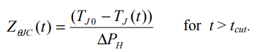
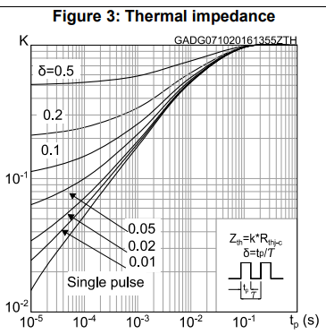

# 《MOSFET热失效重案组》| 案卷04：绘制嫌犯路径图 —— 从波形到Zth时空轨迹的转换

原创 傅存敬 电磁散人 2025-12-11 07:06 广东

> 原文地址: [https://mp.weixin.qq.com/s/1kQeUeOb5s0Tc5Yq1afk3g](https://mp.weixin.qq.com/s/1kQeUeOb5s0Tc5Yq1afk3g)

在前一案中，我们已经成功解决了“消失的零点”谜案，获取了现场最原始、最关键的证据：一份完整的、经过校准的**冷却温度曲线 TJ(t)**，以及爆炸的初始温度**TJ0**和能量等级**ΔPH**。

这些证据目前还是一堆散乱的数字和波形，就像一堆杂乱无章的现场照片。现在，我们的任务，是要运用标准的“绘图”技术，将这些零散的线索，整合成一张清晰、直观、信息量巨大的“时空轨迹图”。这张图，将完美地描绘出“热杀手”在受害者体内潜伏、移动、直至最终现形的完整路径。

同仁们，我们手里的冷却曲线TJ(t)，就像是一系列按时间顺序排列的现场快照。它告诉我们，在0.1us时现场温度是多少，1us时是多少，1ms时又是多少……

信息是有了，但不够直观。**我们真正关心的，不是某一时刻的绝对温度，而是从爆炸开始到这一时刻，温度到底下降了多少，以及这个温度降幅，与我们施加的能量之间，是一种什么样的关系。**

想象一下，我们上周六举的那个管理员[同时打开泳池的进水阀和排水阀的例子](https://mp.weixin.qq.com/s?__biz=MzE5MTYzNjgzOA==&mid=2247484860&idx=1&sn=30f7a1491ca619979e182bc52929248f&scene=21#wechat_redirect)。我们记录了从关闸（t=0）开始，泳池的水位随时间下降的曲线。

-   `冷却曲线` TJ(t) 就相当于 **“不同时刻的水位记录表”**。
    
-   `初始温度` TJ0就相当于 **“关闸前的满水位”**。
    

如果我们想评估这个泳池有多“漏”，光看水位表是不够的。我们需要计算的是：

1.  **每个时刻，水位到底下降了多少？** ( TJ0 - TJ(t) )
    
2.  **这个下降量，和总的放水量（ΔPH）之间，是什么比例关系？**
    

这个“比例关系”，就是我们今天要绘制的“嫌犯路径图”——ZθJC (t)，**瞬态热阻抗曲线。**

**第一项技术：标准化证据——ZθJC(t)的计算公式**

JESD51-14标准的4.1.4节，给出了将原始证据标准化的官方公式。对于冷却曲线，公式如下：

让我们把这个公式翻译成大白话：

-   **分子 ( TJ0 − TJ(t) )：**在 t 时刻，结温从最高点下降了多少度。这就是我们说的“水位变化量”。
    
-   **分母ΔPH：**导致这次温度变化的总功率阶跃是多少瓦。这就是“总放水量”。
    
-   **ZθJC(t) ：**在t时刻，**每1瓦的功率**，能引起多大的温差。它的单位是 **°C/W** 或 **K/W**。
    

**第二项技术：绘图规范——半对数坐标的奥秘**

当我们把每个时间点 t 和算出来的 ZθJC(t) 值都对应起来后，就要把它们画成图。 该标准文件（及所有Datasheet）都采用一种特殊的坐标系来绘制这张图：**半对数坐标（Semi-Log Plot）。**

-   **纵轴 (Y轴)：** ZθJC(t) 值，用**线性刻度**。
    
-   **横轴 (X轴)：** 时间 t，用**对数刻度**。
    

**为什么要用对数时间轴？**

1.  **信息量巨大：** 我们的时间跨度非常大，从微秒(10⁻⁶s)到秒(10⁰s)，甚至几十上百秒。如果用线性时间轴，1秒之后的所有细节都会被挤在坐标轴的最右边，而前面微秒、毫秒级的快速变化则糊成一团，根本看不清。
    
2.  **符合物理过程：** 热量的扩散本身就是一个在对数时间尺度上呈现规律性变化的现象。用对数轴，不同物理过程（如芯片内扩散、焊料层扩散、铜基板扩散）对应的曲线“拐点”会更清晰地展现出来。
    

假设我们有一组如下的**虚拟数据：**

时间 t(s)

TJ(t) (°C)

TJ0\-TJ(t) (°C)

Zθ(t) = (TJ0\-TJ)/ΔPH (K/W)

**0**

**125 (TJ0)**

0

0

1.0E-05

124.2

0.8

0.016 (假设ΔPH=50W)

1.0E-04

121.5

3.5

0.07

1.0E-03

114.0

11.0

0.22

1.0E-02

99.0

26.0

0.52

1.0E-01

82.5

42.5

0.85

1.0E+00

72.5

52.5

1.05

1.0E+01

70.0

55.0

1.10

将最后一列数据绘制在半对数坐标纸上，我们就得到了一条从左下角向右上角延伸，并最终趋于平缓的曲线。**这，就是一张标准的ZθJC(t)曲线！**这就是那颗STL115N10F7AG数据手册里Figure 3的“同款”地图。

**第三项技术：确保证据质量——测量的关键细节**

要绘制出一张高质量、可信的“路径图”，JESD51-14标准（第4.1.2, 4.1.5节）像个老辣的法医，叮嘱了我们几个关键的“取证细节”：

**1\. 采样密度要足够（4.1.2）：**`至少每十倍时间（per decade）采样50个点`。

**通俗地讲：** 在1μs到10μs之间，至少采50个点；在10ms到100ms之间，也至少采50个点。这样才能保证曲线的光滑度和细节不丢失。

**2\. 信噪比要高（4.1.2）：**`ΔPH越大，信噪比（SNR）越高`。

**通俗地讲：** 爆炸的能量越大，现场留下的痕迹（温差）就越明显，我们的测量就越不容易被环境噪声干扰。但是，能量也不能大到把“犯罪现场”本身给炸毁了（MOSFET过热损坏），需要权衡。

**3\. 坦白交代所用方法（4.1.5）：**`如果你用了加热曲线，必须明确报告`。

**通俗地讲：** 标准首选“冷却法”，因为它证据纯净。如果你因为某些限制（比如有热测试芯片，可以边加热边测温）用了“加热法”，就像用了某种“非主流”的侦查手段，必须在案卷中明确注明，因为这可能会引入一些细微的误差（材料参数随温度变化）。

**本案小结与下一步行动**

同仁们，今天我们完成了从“原始波形”到“标准化证据”的关键一步。我们学会了：

1.  **ZθJC(t)的计算方法：** 它是标准化的、表示“单位功率温差”的黄金指标。
    
2.  **半对数坐标的必要性：** 它是阅读和绘制Zth曲线的唯一正确“语言”。
    
3.  **确保测量质量的关键点：** 采样密度、信噪比和方法说明。
    

现在，我们已经具备了独立制作一张ZθJC(t)曲线图的能力。我们可以去测量任何一颗我们感兴趣的MOSFET，绘制出它的“热量路径图”。

但是，一张图，只能分析一个案子。我们现在的目标，是要破解一个“连环杀人案”。凶手用了同一种手法，在不同的“现场”（有导热硅脂 vs. 无导热硅脂）留下了痕迹。

**我们的下一个挑战是：如何通过对比两个不同现场留下的“路径图”，精确地锁定凶手是从哪里“破墙而出”的？也就是，如何找到封装的物理边界，从而测定那个最关键的参数——θJC？**

这将是我们整个系列探案的第一个高潮！我们将要学习JESD51-14标准里最核心的创新点——**瞬态双界面测试法（TDI）。**

请各位同仁做好准备，下一讲，我们将迎来本案的重大突破！

  

参考文献：

JEDEC JESD51-14: Transient Dual Interface Test Method for the Measurement of the Thermal Resistance Junction-to-Case of Semiconductor Devices with Heat Flow Through a Single Path

文档链接：https://pan.baidu.com/s/1wLekhAIJD64D0Z4WQMNfrQ?pwd=by6s 提取码: by6s