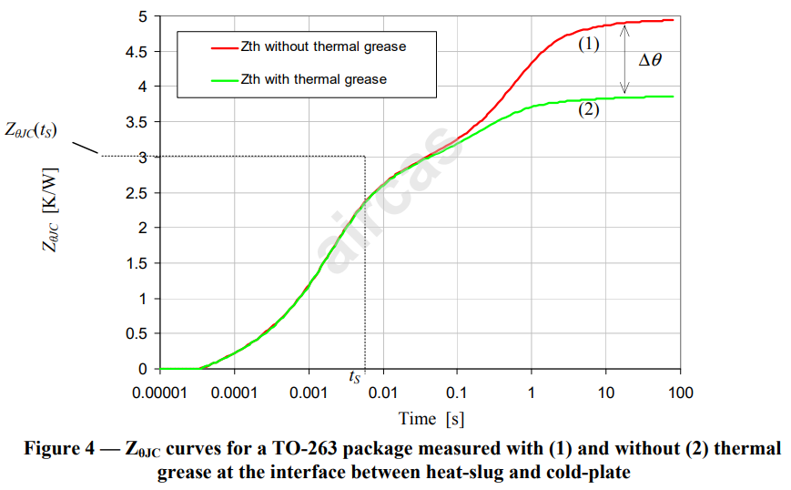
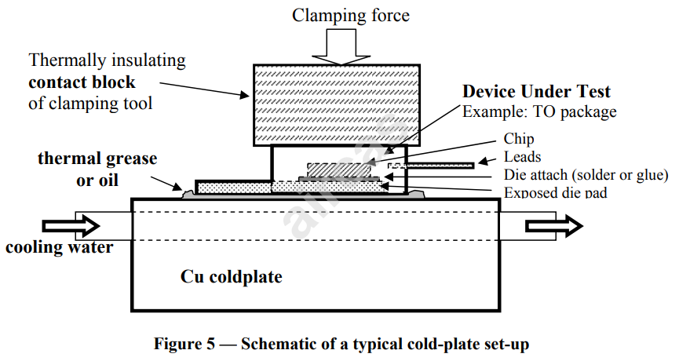

# 《MOSFET热失效重案组》| 案卷05：两条不重合的脚印 —— TDI双重测试锁定封装边界

原创 傅存敬 电磁散人 2025-12-12 07:06 广东

> 原文地址: [https://mp.weixin.qq.com/s/BNoQi03-V6B1n7qiwyZN-Q](https://mp.weixin.qq.com/s/BNoQi03-V6B1n7qiwyZN-Q)

重案组的各位精英，请立刻到作战室集合！案情出现了重大转机！

我们之前的调查，一直停留在分析单一案发现场。我们学会了如何从现场的冷却痕迹，绘制出一张标准的“[嫌犯路径图](https://mp.weixin.qq.com/s?__biz=MzE5MTYzNjgzOA==&mid=2247484894&idx=1&sn=2df9cde076f405fd89a5fcb421ee6d9d&scene=21#wechat_redirect)”——ZθJC(t)曲线。

但是，今天，我们收到了一个新的情报：“**热杀手”在两个极其相似、但只有一个细微差别的现场，留下了两组不同的作案痕迹！**

这简直是天赐良机！在刑侦学上，这叫“**对比侦查**”。通过对比这两组痕迹的异同，我们极有可能精确地定位出凶手逃离建筑物的那个“破口”，也就是MOSFET封装的物理“外壳”！

这正是JESD51-14标准的核心精髓——**瞬态双界面测试法（Transient Dual Interface - TDI）**。

请大家打起十二分精神，今天的案卷，将直接带领我们找到本案的第一个“圣杯”——**θJC（结到壳热阻）！**

**两起离奇的相似案件**

同仁们，案情是这样的：我们在一个高度受控的实验室（温控冷板）里，对同一个“受害者”（MOSFET），进行了两次“谋杀”重演。

这两个案发现场，**几乎一模一样：**同样的受害者、同样的作案工具（加热功率）、同样的环境温度。

**唯一的区别在于：**

-   **现场A：** 受害者是“光脚”站在冰冷的地板上（MOSFET直接压在冷板上，**不涂导热硅脂**）。我们称之为**“干接触”**。
    
-   **现场B：** 受害者是“穿着一双湿袜子”站在同样的地板上（MOSFET与冷板之间，涂了一层薄薄的**导热硅脂**）。我们称之为**“湿接触”**。
    

案发后，我们分别对两个现场进行了勘查，绘制出了两条“嫌犯路径图”：**ZθJC1(t)（干接触）**和**ZθJC2(t)（湿接触）。**

当我们把这两张图叠在一起时，一个惊人的现象出现了——它们在开始时完全重合，走到一半时却神秘地“分岔”了！留下了**两条不重合的脚印**。

**我们今天的核心任务，就是解读这个“分岔点”的含义！**

**第一部分：作案现场的搭建——TDI测试环境要求**

要进行如此精密的对比侦查，我们对现场环境有极高的要求。JESD51-14标准第4.2节，对这个“实验室”（温控冷板）提出了严格的规范：

1.  **地板必须绝对“冷”（4.2.2）：**
    

-   必须是**铜块+水冷**。铜的导热性极好，水冷能持续带走热量，保证地板温度恒定。
    
-   **打比方：**这就像要求案发现场的地板是一块巨大的、永远不会融化的冰块，这样才能清晰地留下脚印。各位同仁实验室的风冷板，可以作为“简化版”练习，但要得到最精确的结果，水冷是王道。
    

3.  **不能有“暗道”（4.2.2）：**
    

-   固定受害者的“压杆”，要用低导热的塑料。
    
-   **解读：**这是为了防止“热杀手”从头顶（封装顶部）开辟第二条逃跑路线。我们必须确保它只能从脚底（封装底部）这条主路逃跑，这样我们的追踪才不会被误导。
    

5.  **压力要适中（4.2.2）：**
    

-   压得太轻，脚印模糊；压得太重，可能会把地板压出坑（改变封装内部结构），或者把“干接触”和“湿接触”的差别给抹平了。
    
-   标准给了一个建议值：**约10N/cm²**。不大，刚刚好能固定住就行。
    

**第二部分：作案过程的重演——TDI测试流程**

标准的4.2.3和4.2.4节，给出了详细的“作案”步骤：

**第一次取证（“干”脚印）：**

1.  **清理现场（4.2.3 Step 1）：** 用酒精等溶剂，把MOSFET底部和冷板表面擦得一尘不染。不能有任何残留物。
    
2.  **布置现场（4.2.3 Step 2）：** 将干净的MOSFET直接安装在冷板上，施加适当压力。
    
3.  **记录痕迹（4.2.3 Step 3）：** 按照我们[上一案学到的方法](https://mp.weixin.qq.com/s?__biz=MzE5MTYzNjgzOA==&mid=2247484894&idx=1&sn=2df9cde076f405fd89a5fcb421ee6d9d&scene=21#wechat_redirect)，走一遍“加热→关断→记录冷却曲线”的流程，最终计算并绘制出 **ZθJC1(t)**。
    

**第二次取证（“湿”脚印）：**

1.  **再次清理现场（4.2.4）。**
    
2.  **留下关键变量（4.2.4 Step 2）：** 在MOSFET底部或冷板上，涂一层薄而均匀的导热硅脂或导热油。
    
3.  **记录痕迹（4.2.4 Step 3）：** 完全重复第一次的所有操作，计算并绘制出 **ZθJC2(t)**。
    

**第三部分：解读“分岔点”——两条脚印的物理意义**

现在，我们把两张图（ZθJC1 和 ZθJC2）叠在一起（参考标准Figure 4）进行关键解读。

-   **初始阶段（t < 15ms）：** 两条曲线**完美重合**。
    

-   **推理：**在这个阶段，“热杀手”还在受害者“体内”移动。它从心脏（结）出发，穿过肌肉、骨骼（芯片、焊料、铜基板）。因为是在身体内部，所以无论受害者是光脚还是穿袜子，体内的路径都是完全一样的。因此，留下的痕迹（Zθ曲线）也完全一样。
    

-   **分岔阶段（t > 15ms）：** ZθJC1（干）的曲线开始比 ZθJC2（湿）的曲线上升得更快，两者分道扬镳。
    

-   **推理：分岔，就意味着“热杀手”已经走到了身体的尽头——脚底板（封装Case表面）！** 从这一刻起，它开始要踏上外部的“地板”（冷板）了。
    
-   因为现场A的地板接触是“干”的（空气间隙多，热阻大），所以逃跑难度大，导致体温下降慢，表现为ZθJC1值更高。
    
-   而现场B的地板接触是“湿”的（导热硅脂填充了间隙，热阻小），逃跑更容易，体温下降快，表现为ZθJC2值更低。
    
-   **所以，这个“分岔点”，在物理上，就精确地对应了MOSFET封装的“结”到“壳”这条路径的终点！**
    

-   **稳态阶段（t -> ∞）：** 两条曲线最终都达到平稳，它们之间的**差值 Δθ = ZθJC1(∞) - ZθJC2(∞)**，就纯粹是那层“干袜子”和“湿袜子”本身的热阻差异。
    

-   **标准要求（4.2.5）：** 这个差值**Δθ必须大于0.5 K/W**。如果差太小，两条脚印几乎贴在一起，我们就很难判断它们是从哪里开始分开的，证据就无效了。
    

**本案小结与下一步行动**

同仁们，今天我们取得了历史性的突破！通过JESD51-14标准的TDI对比侦查法，我们成功地：

1.  **设计并执行了一个精密的对比实验**，获得了两条关键的Zθ曲线。
    
2.  **理解了“分岔点”的物理含义：** 它就是热流从封装内部走到封装外壳的“边界点”。
    
3.  **找到了测量θJC的理论依据：** 分岔点那一刻对应的Zθ值，就是我们梦寐以求的**结到壳热阻θJC！**
    

**我们已经站在了真相的门口**！

但是，一个新的、更精密的问题摆在了我们面前：

-   “分岔”不是一个点，而是一个逐渐分开的过程。我们到底应该取这个过程的起点、中点还是终点，作为最终的θJC值？
    
-   肉眼观察太不靠谱，有没有一种**客观、量化、可重复**的数学方法，来精确地定义这个“分岔点”？
    

是的，有！而且JESD51-14标准为我们准备了两种不同的“精密仪器”，分别用于应对不同类型的“案发现场”（焊料封装 vs. 胶粘封装）。

**我宣布，案件正式进入“法证科学分析”阶段！**

下一讲，我们将学习第一种、也是针对咱们这颗STL115N10F7AG最适用的一种高精度分析方法。

  

参考文献：

\[1\]JEDEC JESD51-14: Transient Dual Interface Test Method for the Measurement of the Thermal Resistance Junction-to-Case of Semiconductor Devices with Heat Flow Through a Single Path

文档链接：https://pan.baidu.com/s/1wLekhAIJD64D0Z4WQMNfrQ?pwd=by6s 提取码: by6s