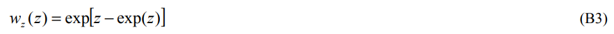
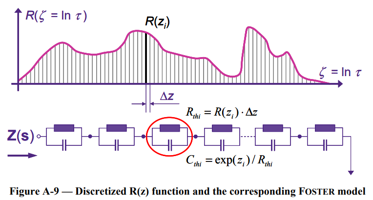
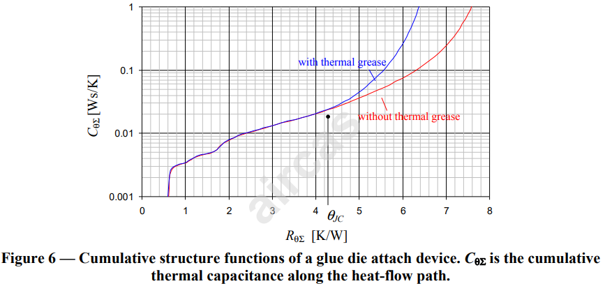
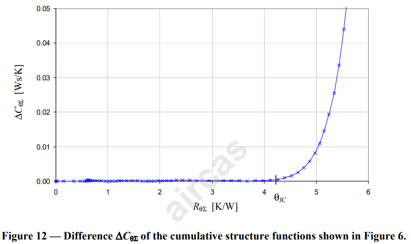

# 《MOSFET热失效重案组》| 案卷07-下：基因重组 —— 从Zth曲线到结构函数的逆向工程

原创 傅存敬 电磁散人 2025-12-17 07:06 广东

> 原文地址: [https://mp.weixin.qq.com/s/8lLFuEKx2K\_LUPaR9d\_3Tg](https://mp.weixin.qq.com/s/8lLFuEKx2K_LUPaR9d_3Tg)

重案组全体同仁请迅速归位！

在上一案的案卷中，我们已经成功掌握了“读片”的技能。我们知道了什么是“真实骨架”Cauer网络，也学会了如何解读那张能透视MOSFET内部物理结构的“热CT图”——结构函数。可以说，我们已经知道了“真相”应该长什么样子。

现在，我们将进入本次调查中技术含量最高、也是最激动人心的环节。我们将要打开那台神秘的“CT机”的黑箱，亲自探究它是如何工作的。我们将要复盘的，是一套完整的“逆向工程”技术，一套能从飘忽不定的“外在行为”（Zth曲线），反推出坚实可靠的“内在骨架”（Cauer网络）的惊天魔法。

请大家系好安全带，这次的“思维过山车”即将发车。

**回顾“卡住的案情”：**

同仁们，我们先快速回顾一下案情进展。我们目前的状态是：

-   **手中唯一的线索：** 一条从实验中测得的Zth(t)曲线（“行为分析报告”）。
    
-   **我们想要得到的结果：** 一条代表物理结构的结构函数 CθΣ(RθΣ) 曲线（“CT扫描图”）。
    

两者之间，隔着一道巨大的鸿沟。要跨越这道鸿沟，我们需要完成一系列精密的“基因工程”操作。今天的任务，就是解密这整个操作流程。

**第一步：基因片段提取——“反卷积”与时间常数谱**

要分析一个复杂的混合物，我们首先要把它的基本成分给分离出来。

想象一下，你喝了一口混合果汁（Zth曲线），口感非常复杂，有甜、有酸、有涩。现在，你要分析出这杯果汁里，苹果汁、柠檬汁、葡萄汁各占多少比例。这个分析过程，在数学上就叫“反卷积”（Deconvolution）。

在我们的案子中：

-   **Zth曲线：** 就是那杯混合果汁的“综合口感”。
    
-   **时间常数谱 R(τ)：** 就是分析出来的“配方表”，它告诉你，具有不同“衰减时间”（时间常数τ）的热响应分量，在整个Zth曲线中各自占了多大的“权重”（热阻R）。
    

-   小的τ值，代表热量在小尺寸结构里快速响应的部分（比如芯片本身）。
    
-   大的τ值，代表热量在大尺寸结构里缓慢响应的部分（比如整个散热器）。
    

-   **操作流程（逻辑上）：**
    

1.  我们先对Zth曲线求对数时间导数`da/dz`，得到温度变化的“加速度”信息。
    
2.  然后，将这个`da/dz`曲线，与一个固定的、长得像“彗星”的函数`w(z)`（标准附录B，公式B3）进行“反卷积”运算。
    
    
    
3.  运算的结果，就是我们想要的**时间常数谱 R(z)**（这里z=ln(τ)）。
    

-   **【法证提示】** 同仁们请注意，反卷积是整个流程中最棘手、最关键的一步。它对我们原始测量数据（Zth曲线）的“纯净度”要求极高。如果数据噪声很大，就像果汁里撒了胡椒粉，分析出来的配方表就会完全失真。这就是为什么我们在《[案卷03](https://mp.weixin.qq.com/s?__biz=MzE5MTYzNjgzOA==&mid=2247484887&idx=1&sn=5f44ba5752f087fb112c926b98d3bf08&scene=21#wechat_redirect)》和《[案卷04](https://mp.weixin.qq.com/s?__biz=MzE5MTYzNjgzOA==&mid=2247484894&idx=1&sn=2df9cde076f405fd89a5fcb421ee6d9d&scene=21#wechat_redirect)》中，反复强调要获取高质量、高信噪比的冷却曲线的原因。
    

**第二步：从“基因片段”到“幽灵骨架”——时间常数谱与Foster网络**

好消息是，一旦我们成功提取了“基因片段”（时间常数谱），将其拼装成一个“幽灵骨架”（Foster网络）就非常简单了。

**拼装逻辑：**时间常数谱这张“配方表”，和Foster网络的结构是一一对应的。

-   我们可以把连续的时间常数谱曲线，切成一小段一小段的“矩形条”。
    
-   **每一个矩形条，就直接对应Foster网络里的一个RC并联支路！**
    

-   矩形条的“高度”（R值）就是支路的电阻。
    
-   矩形条的“位置”（τ值）和高度，共同决定了支路的电容 (C = τ/R)。
    
-   这一步，就像我们拿到了果汁配方表，然后去储藏室里，按配方取出相应分量的“苹果浓缩汁”、“柠檬浓缩汁”... 把它们简单地并排放在桌子上。桌子上这一排瓶瓶罐罐，就是我们的Foster网络。它在“口感”上已经和原始果汁一模一样了，但它还只是一堆原材料，不是一个有结构的产品。
    

**第三步：本案最关键的魔法——“基因重组”（Foster-to-Cauer变换）**

现在，到了最神奇的时刻。我们要施展一个数学魔法，把桌上那一堆并排的“瓶瓶罐罐”（Foster网络），变成一个层层堆叠的“千层蛋糕”（Cauer网络）。

这个魔法的名字，叫**“连分式展开”（Continued Fraction Expansion）**，在标准附录C中有其数学原理（本文暂不解释，如有兴趣，后续连载文章再详述）。

我们不深入推导繁琐的公式，但我们要用一个直观的比喻，来理解这个“基因重组”的过程。

**“俄罗斯套娃”般的连分式展开**

1.  想象一下，我们的Foster网络是一个巨大的、内部结构不明的俄罗斯套娃。我们从外面看，只能知道它的总重量和尺寸（Zth特性）。
    
2.  **第一步操作：** 我们用一个特殊的“工具”（数学算法），从这个大套娃的**最外层**，“剥”下了一小片结构。神奇的是，剥下来的，刚好是一个**对地的电容C1**。
    
3.  剥完之后，手里还剩下一个小一号的、但依然很复杂的套娃。
    
4.  **第二步操作：** 我们换一个“工具”，从这个小套娃的**最外层**，“剥”下了另一片结构。这次剥下来的，刚好是一个**串联的电阻R1**。
    
5.  ……
    
6.  我们就这样，交替使用两种“工具”，一层一层地往里剥。每次剥离，都会得到一个纯粹的C或纯粹的R。
    
7.  当整个套娃被完全“剥光”时，我们把所有剥下来的C和R，按剥离的顺序排好队……**一个完美的、具有物理意义的Cauer梯形网络，就诞生了！**
    

**结论：**Foster-to-Cauer变换，就是这样一个精妙的、程序化的“剥洋葱”过程。它以一种无损的方式，将一个纯数学的、并联的Foster网络，重构成了一个与它电学特性完全等效的、但物理上可解释的、串联的Cauer网络。**这就是连接“数学模型”和“物理世界”的关键桥梁！**

**最终破案：利用“双基因图谱”锁定θJC**

现在，我们已经掌握了从单条Zth曲线得到单条结构函数（Cauer网络的图形化）的完整流程。

我们回到TDI双界面测试。我们对“干接触”的ZθJC1和“湿接触”的ZθJC2，分别完整地走一遍今天的“逆向工程”流程，就得到了两条“热CT图”——**两条结构函数。**

**图形分析与裁定：**

1.  **重合区：** 在图的左半部分，两条线完美重合。
    
2.  **法证分析：** 这是MOSFET的内部结构区，从芯片到封装外壳。因为是同一个器件，所以它们的“基因图谱”完全一致。
    
3.  **分离点：** 在图的右侧，两条线开始分道扬镳。**法证分析：** 分离点，就是物理结构的终点——**封装外壳（Case）**。从这里开始，热流进入了不同的外部环境（干/湿界面），它们的“基因”开始出现差异。
    
4.  **精确裁定：**
    

-   **方法A（目测）：** 分离点对应的**横坐标 RθΣ**，就是我们用方法2得到的θJC。
    
-   **方法B（更精确）：** 计算两条曲线的**差值** `**ΔCθΣ = CθΣ2 - CθΣ1**`。画出`ΔCθΣ`对`RθΣ`的图。**当**`**ΔCθΣ**`**开始显著、持续地上升时**，那个拐点对应的横坐标`RθΣ`，就是最精确的θJC！
    

**本案总结与特别提醒**

同仁们，至此，案卷07全部完成。我们完成了一次从“行为”到“本质”的伟大溯源。我们梳理了整个“逆向工程”的链条：

**Zth → (反卷积) → 时间常数谱 → (拼装) → Foster网络 → (基因重组) → Cauer网络 → (累加绘图) → 结构函数**

我们还学会了如何利用两份“DNA报告”进行对比，从而锁定最真实的θJC。

**最后的重要提醒**

正如我们在《[案卷06](https://mp.weixin.qq.com/s?__biz=MzE5MTYzNjgzOA==&mid=2247484925&idx=1&sn=75f0272348879dbd9d290037777dd0da&scene=21#wechat_redirect)》的结尾提到的，JESD51-14标准也明确指出，对于像STL115N10F7AG这样θJC很小（< 1K/W）的器件，方法2（结构函数法）这台“CT机”的分辨率可能不够，图像可能会模糊。在这种情况下，**方法1（导数法）**仍然是更可靠、更推荐的“首选侦破手段”。

我们学习方法2的意义，是为了建立一个完整的知识体系，为了让我们拥有应对未来更复杂器件（如高热阻IGBT模块）的终极武器。

同仁们，我们已经掌握了JEDEC标准里所有的核心侦查工具。理论学习已经到达顶峰。接下来，我们要做的，就是把这些强大的工具，应用到我们的实际工作中去！

下一讲，我们将讨论如何用我们学到的方法，去“审判”数据手册上的模型，并最终校准出我们自己的、更可靠的热模型！

今天的思维风暴到此结束。请大家务必花时间回顾整个“逆向工程”的逻辑链，这对我们建立完整的热模型世界观至关重要。

  

参考文献：

\[1\]JEDEC JESD51-14: Transient Dual Interface Test Method for the Measurement of the Thermal Resistance Junction-to-Case of Semiconductor Devices with Heat Flow Through a Single Path

文档链接：https://pan.baidu.com/s/1wLekhAIJD64D0Z4WQMNfrQ?pwd=by6s 提取码: by6s