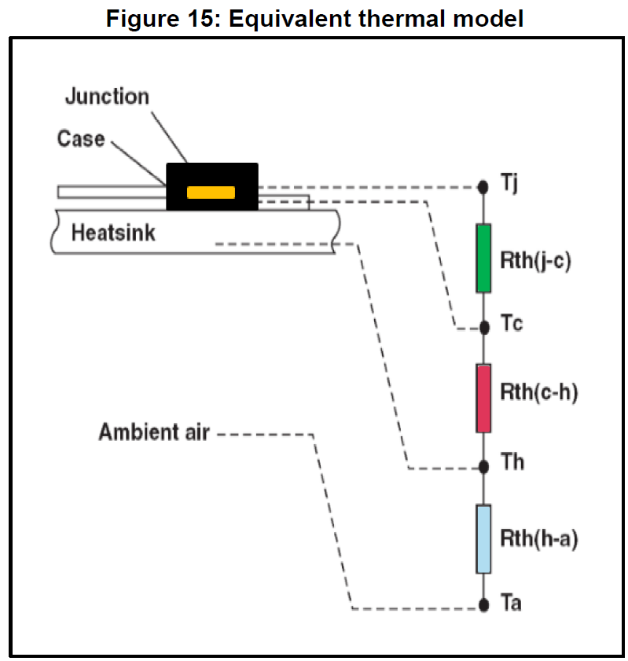
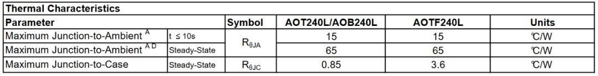

# 一招鲜吃遍天？揭秘MOSFET直流稳态下的“热阻”大法

原创 傅存敬 电磁散人 2025-11-29 07:06 广东

> 原文地址: [https://mp.weixin.qq.com/s/9MNbMd7mIxRp6wSRhexJgA](https://mp.weixin.qq.com/s/9MNbMd7mIxRp6wSRhexJgA)

上一篇文章，我们像神探一样，成功揪出了MOSFET发热案的三大元凶：**导通损耗、开关损耗和那个看不见的“第三者”——体二极管损耗**。我们现在已经有能力计算出，在任何一个时刻，MOSFET内部会产生多少“热量”，也就是总损耗功率`Ptotal`。

但是，知道了“发热量”，和知道最终的“发烧温度”，这中间还隔着十万八千里！50W的功率，可以让一个散热良好的MOSFET仅仅温升30度，也足以让一个散热糟糕的MOSFET直接“火化升天”。

那么，是什么决定了从“功率”到“温度”的转换系数呢？今天，我们就来学习一套简单、强大，在工程界流传已久的“降魔大法”——**热阻大法**。这套方法，就是我们连接功率和温度的桥梁。

#### **1\. 热量传递的“欧姆定律”**

相信进来的各位同仁，多数都是电机控制方向的工程师，欧姆定律`V = I * R`肯定都刻在DNA里了。电压差（V）驱动电流（I）流过电阻（R）。

现在，请大家把大脑切换一下频道，我们来玩一个类比游戏：

-   把**温差 (ΔT)**，想象成**电压差 (ΔV)**。它是驱动热量流动的“势”。
    
-   把**热流，也就是我们的功率损耗 (P)**，想象成**电流 (I)**。它是热量的“流”。
    
-   那么，阻碍热量流动的那个东西，我们叫它**热阻 (Thermal Resistance, Rth)**，它就对应着**电阻 (R)**。
    

于是，一个和欧姆定律长得一模一样的，热力学领域的“欧姆定律”就诞生了！

ΔT = P \* Rth\[1\]

这个公式告诉我们一个朴素的真理：**在一定的功率损耗下，热阻越大，温差就越大**。简单、直观、威力无穷！热阻的单位是**°C/W**或者**K/W**，意思是“每产生1瓦的热量，会引起多少度的温升”。我们的整个散热设计，说白了，就是想尽一切办法，把这个`Rth`降到最低！

#### **2\. 热阻链路的拆解：从芯片到空气的“万里长征”**

热量从滚烫的芯片结(Junction)出发，想到达清凉的外部空气(Ambient)，可不是一步就能完成的。它需要经过一场“长征”，翻过好几座“大山”。每一座山，都有它的“阻力”，也就是一段热阻。

我们可以把整个散热路径，看成一个**串联的热阻网络**，就像电路里串联的几个电阻一样。

这场“长征”主要分为三段：

**第一段：**`**Rth_jc**`**(结到壳)**

-   **含义**: Junction-to-Case。这是从MOSFET内部的硅芯片，到它塑料/陶瓷封装外壳之间的热阻。
    
-   **谁决定**: **半导体制造商**。这是由芯片的尺寸、封装的材料和工艺决定的。作为用户，我们**无法改变**它。这是我们的“先天条件”。
    

**第二段：**`**Rth_ch**`**(壳到散热器)**

-   **含义**: Case-to-Heatsink。这是MOSFET的外壳，和它紧贴着的散热器之间的热阻。
    
-   **谁决定**: **硬件工程师！** 这段热阻主要来自于两者接触面之间微小的空气间隙。空气是热的不良导体，热阻极大！为了干掉它，我们必须使用**导热界面材料 (TIM)**，比如导热硅脂、导热垫片。涂硅脂的均匀度、锁螺丝的扭力，都直接影响着 `Rth_ch` 的大小。这是最考验硬件工程师“手艺”的地方！
    

**第三段：**`**Rth_ha**`**(散热器到空气)**

-   **含义**: Heatsink-to-Ambient. 这是从散热器表面，到周围环境空气之间的热阻。
    
-   **谁决定**: **硬件/结构工程师！** 散热器的材料、大小、鳍片形状、表面处理方式，以及是否有风扇强制风冷，都决定了这段热阻的大小。散热器越大、风扇越猛，`Rth_ha` 就越小。
    

#### **3\. “路书”在手，天下我有：如何查找热阻值**

理论我们懂了，那这些`Rth`值从哪里找呢？答案是——**数据手册 (Datasheet)**，这就是我们工程师的“路书”和“藏宝图”。

-   **查找**`**Rth_jc**`**:** 我们打开一份MOSFET的数据手册，比如AOT240L这个型号的NMOS，找到里面的“Thermal Characteristics”表格。
    

看到了吗？`RθJC`的最大值是**0.85 °C/W**。这意味着，在这颗MOSFET内部，每产生1W的热量，芯片的核心温度(Tj)就会比外壳温度(Tc)高出0.85°C。

-   `**Rth_ch**`**和**`**Rth_ha**`**去哪里找呢？**
    

注意！这两个值绝对不会出现在MOSFET的数据手册里！因为它们不取决于MOSFET本身，而取决于你的设计。

-   `Rth_ch` 的值需要查你选用的**导热硅脂/垫片**的数据手册。通常在 `0.1 ~ 0.5 °C/W` 之间。
    
-   `Rth_ha` 的值需要查你选用的**散热器**的数据手册，或者通过热仿真软件来计算。这个值通常是最大的，从十几(自然冷却)到零点几(强力水冷)不等。
    

#### **4\. 一个简单的稳态估算模型：从功率到结温**

好了，龙珠集齐了！现在我们可以召唤神龙了。

既然这些热阻是串联的，那么总热阻就是它们的简单相加：

Rth\_ja\_total = Rth\_jc + Rth\_ch + Rth\_ha

利用我们的“热学欧姆定律”，就可以直接计算出稳态下的结温：

Tj = Ta + Ptotal \* (Rth\_jc + Rth\_ch + Rth\_ha)

这个公式就是我们这篇文章的“大招”！

**我们实战演练一下：**

假设电机在某个稳定工况下的总损耗 `Ptotal = 50 W`。

-   环境温度 `Ta = 40 °C` (机壳内部温度，不能用室温25°C算！)。
    
-   我们用了上面那颗AOT240L，查得 `Rth_jc = 0.85 °C/W`。
    
-   我们选用了不错的导热硅脂和安装工艺，`Rth_ch = 0.2 °C/W`。
    
-   我们选配了一个中等大小的带风扇的散热器，`Rth_ha = 1.5 °C/W`。
    

那么，我们可以预测该工况下的结温为：

`Tj = 40°C + 50W * (0.85 + 0.2 + 1.5) °C/W`

    `= 40°C + 50W * (2.55) °C/W`

    `= 40°C + 127.5°CTj = 167.5°C`

**危险！**

算出来的结果是**167.5°C**！而绝大多数MOSFET的极限结温是150°C或175°C。这个结果意味着，在这个工况下长时间运行，我们的MOSFET必死无疑！你必须得换一个`Rds(on)`更低的MOSFET（降低Ptotal），或者换一个更牛的散热器（降低Rth\_ha）！

**小结:**

今天，我们掌握了稳态热分析的核心武器——**热阻模型**。我们知道了如何像分析串联电路一样，分析热量传递的路径，并且学会了如何使用这个模型来“预判”MOSFET的生死。

但是，这套“一招鲜”的“热阻大法”真的能“吃遍天”吗？

我问各位同仁一个问题：电机从静止到满速，相电流可能是瞬间从0飙到100A，这个过程可能只有100毫秒。在这100毫秒内，结温是如何变化的？用我们今天的模型能算吗？

答案是：**完全不能！**

因为我们的模型里，缺了一样东西——**时间**。我们目前的模型仅是一个**静态模型**，只能告诉你“很久很久以后，温度最终会稳定在多少度”，但它无法告诉你温度变化的“过程”。我们今天的模型里，只有“热阻”，却没有考虑物体存储热量的能力——**热容。**

所以，要想给MOSFET做一份精准的、动态的“心电图”，光有“热阻”是不够的。下一篇文章，我们将引入“热容”这个新伙伴，把我们的静态模型升级为能反应瞬态变化的**动态RC热网络模型！**

  

参考文献：

\[1\] AN4783: Thermal effects and junction temperature evaluation of Power MOSFETs

文档链接：

\[1\] https://pan.baidu.com/s/1-KVcICpKdTrwGp9\_tjvEPg?pwd=xkba 提取码: xkba